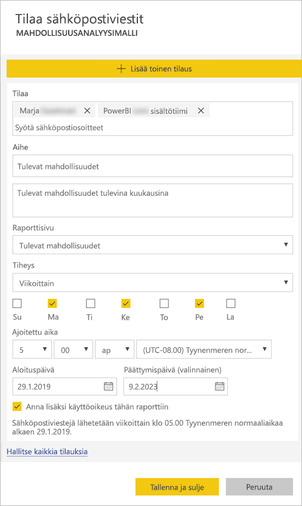

# Power BI -palvelun raporttien tai koontinäyttöjen tilaaminen itsellesi ja muille

Voit tilata itsellesi ja kollegoillesi tärkeimmät raporttisivut ja koontinäytöt. Tällä tavalla Power BI lähettää sinulle sähköpostitse niistä tilannevedoksen. Voit määrittää, miten usein haluat Power BI:n lähettävän sähköpostia: päivittäin, viikoittain tai tietojen päivittyessä (päivän ensimmäinen päivitys).  Jos tilaat päivittäin tai viikoittain, voit valita kellonajat, jolloin sähköpostit lähetetään.  Voit määrittää jopa 24 eri tilausta per päivä kullekin raporttisivulle ja koontinäytölle.

 

Voit luoda tilauksia vain Power BI -palvelussa. Saat sähköpostin, joka sisältää raporttisivun tai koontinäytön tilannevedoksen sekä linkin raportin tai koontinäytön avaamiseksi. Mobiililaitteissa, joihin on asennettu Power BI -sovelluksia, linkin valitseminen käynnistää Power BI -sovelluksen (tämä ei siis avaa raporttia tai koontinäyttöä Power BI -sivustossa).

## Vaatimukset
- Tilauksen **luominen** on Power BI Pro -ominaisuus.
- Jos haluat luoda tilauksen itsellesi, et tarvitse muokkausoikeuksia sisältöön (koontinäyttö tai raportti), mutta jos haluat luoda tilauksen jollekin muulle, tarvitset muokkausoikeudet. 
- Tammikuusta 2019 alkaen tietojoukon päivityksen ei enää tarvitse olla määritettynä tilausten käyttämiseksi.  Tilaus toteutetaan riippumatta määrittämistäsi ajoitetuista päivityksistä.  

## Koontinäytön tai raporttisivun tilaaminen
Koontinäytön ja raportin tilausprosessit ovat samankaltaiset. Samaa painiketta painamalla voit tilata Power BI -palvelun koontinäyttöjä ja raportteja.
 
.

1. Avaa koontinäyttö tai raportti.
2. Valitse yläreunan valikkoriviltä **Tilaa** tai valitse kirjekuvake .
   
   

3. Voit ottaa tilauksen käyttöön tai poistaa sen käytöstä keltaisella liukusäätimellä.  Liukusäätimen asettaminen **Poissa käytöstä** -asentoon ei poista itse tilausta. Jos haluat poistaa tilauksen, valitse roskakorikuvake.

4. Sähköpostiosoitteesi on jo **Tilaa**-ruudussa. Voit lisätä tilaukseen myös muita sähköpostiosoitteita, mutta niiden toimialueen täytyy olla sama. Jos raporttia tai koontinäyttöä isännöidään [Premium-kapasiteetissa](service-premium.md), voit lisätä tilaukseen muita yksittäisiä sähköpostiosoitteita ja ryhmäaliaksia. Jos raporttia tai koontinäyttöä ei isännöidä Premium-kapasiteetissa, voit lisätä tilaukseen muita yksittäisiä käyttäjiä, mutta heillä täytyy olla Power BI Pro -käyttöoikeus. Saat lisätietoja alla olevasta [Huomioon otettavat seikat ja vianmääritys](#considerations-and-troubleshooting) -kohdasta. 

5. Anna sähköpostille **aihe** ja kirjoita sen **viesti**. 

5. Valitse tilauksesi **tiheys**: voit valita **Päivittäin**, **Viikoittain** tai **Tietojen päivittämisen jälkeen (päivittäin)**.  Jos haluat saada tilauksen sähköpostit vain tiettyinä päivinä, valitse **Viikoittain** ja valitse sitten, minä päivinä haluat saada sähköposteja.  Jos haluat saada tilauksen sähköpostit esimerkiksi vain arkipäivinä, valitse tiheydeksi **Viikoittain** ja poista sitten **lauantain** ja **sunnuntain** valintaruutujen valinnat.  

6. Voit valita sähköpostien lähetyskellonajan valitsemalla tiheydeksi **Päivittäin** tai **Viikoittain** ja määrittämällä sitten tilaukselle **ajoitetun ajan**.  Viestit voidaan lähettää tasatunnein tai 15, 30 tai 45 minuuttia yli tasatunnin.  Valitse AM tai PM (12 tunnin kellon mukaisesti). Voit määrittää myös aikavyöhykkeen.

7. Oletusarvoisesti tilauksesi alkamispäivämäärä on sen luontipäivämäärä. Voit halutessasi valita myös päättymispäivämäärän. Jos et määritä päättymispäivämäärää, se on oletusarvoisesti vuoden päässä alkamispäivämäärästä. Voit vaihtaa päivämääräksi minkä tahansa tulevaisuudessa olevan päivämäärän (aina vuoteen 9999 saakka) milloin tahansa ennen tilauksen päättymistä. Tilaus lopetetaan päättymispäivänä, jos et ota sitä uudelleen käyttöön. Saat ennen tilauksen päättymistä ilmoituksia, jossa kysytään, haluatko jatkaa tilausta.    

    Huomaa alla olevissa näyttökuvissa, että kun tilaat raportin, tilaat itse asiassa raportin *sivun*.  Voit tilata useamman kuin yhden raportin sivun valitsemalla **Lisää toinen tilaus** ja valitsemalla toisen sivun. 
      
     

7. Valitse **Tallenna ja sulje**. Tilauksen vastaanottajat saavat sähköpostin ja tilannevedoksen koontinäytöstä tai raporttisivusta määrittämäsi aikataulun mukaisesti. Voit luoda jopa 24 tilausta per raportti ja koontinäyttö. Voit määrittää kullekin tilaukselle omat vastaanottajat, kellonajat ja lähetystiheydet.  Kaikissa tilauksissa, joiden tiheydeksi määritetään **Tietojen päivittämisen jälkeen**, lähetetään sähköpostia vain raportin tai koontinäytön kyseisen päivän ensimmäisen ajoitetun päivityksen jälkeen.   
      
   > [!TIP]
   > Haluatko lähettää sähköpostiviestin tilauksesta heti vai pyydettäessä milloin tahansa? Valitse **Suorita nyt** niille koontinäytön tai raportin tilauksille, jotka haluat lähettää. Näkyviin tulee ilmoitus, että sähköpostiviesti on matkalla kaikille kyseisen tilauksen käyttäjille.  Voit tehdä tämän niin usein kuin haluat. Toiminto ei vaikuta päivittäiseen 24 ajoitetun tilauksen rajoitukseen raporttia tai koontinäyttöä kohti. Huomaa, että tämä EI aloita pohjana olevan tietojoukon tietojen päivittämistä. 
   > 
   > 
   
## Sähköpostin kielet

Sähköpostissa ja tilannevedoksessa käytetään samaa kieliasetusta kuin Power BI:ssä (katso [Power BI:ssä tuetut kielet ja maat/alueet](supported-languages-countries-regions.md)). Jos mitään kieltä ei ole määritetty, Power BI käyttää senhetkisen selaimesi paikka-asetuksen mukaista kieltä. Jos haluat nähdä kieliasetuksesi tai muuttaa sitä, valitse hammasrataskuvake  > **Asetukset > Yleiset > Kieli**. 

## Tilausten hallinta
Vain tilauksen luonut henkilö voi hallita sitä.  Tilausten hallintanäkymään pääsee kahta reittiä.  Ensimmäinen reitti: Valitse **Kaikkien tilausten hallinta** -vaihtoehto **Tilaa sähköpostiviestit** -valintaikkunasta (katso vaiheen 4 näyttökuvat edellä). Toinen reitti: Valitse yläreunan valikkoriviltä Power BI:n hammasrataskuvake  ja valitse sitten **Asetukset**.

Näytettävät tilaukset riippuvat siitä, mikä työtila on sillä hetkellä aktiivisena.  Jos haluat nähdä kaikkien työtilojen kaikki tilaukset kerralla, varmista, että aktiivisena on **Oma työtila**. Työtilojen toiminnasta saat lisätietoa artikkelista [Työtilat Power BI:ssä](service-create-workspaces.md).

Tilaus päättyy, jos Pro-käyttöoikeus umpeutuu, omistaja poistaa koontinäytön tai raportin tai tilauksen luomiseen käytetty käyttäjätili poistetaan.

## Huomioon otettavat seikat ja vianmääritys
* Jos koontinäytössä on yli 25 kiinnitettyä ruutua tai 4 kiinnitettyä reaaliaikaisista raporttisivua, koontinäyttö ei ehkä hahmonnu täysin käyttäjille lähetetyissä tilauksen sähköpostiviesteissä.  Tilauksia koontinäyttöihin, joissa on tätä enemmän ruutuja, ei estetä. Niitä ei kuitenkaan katsota tuetuiksi, jos niiden yhteydessä ilmenee ongelmia, joten niitä tulee muokata niin, että ne vastaavat tuettua aluetta.
* Muista sähköpostitilauksia määrittäessäsi, että tilaustyön alkamisen ja sähköpostiviestin tarkan lähetysajan välillä on viive.  Voit minimoida työn alkamisen ja sähköpostiviestin lähettämisen välillä olevan viiveen määrittämällä ajoitetun tietojen päivityksen ja sähköpostitilauksen suoritettaviksi eri aikoina.
* Jos koontinäytön sähköpostitilausten joillakin ruuduilla on käytössä rivitason suojaus (RLS), näitä ruutuja ei näytetä.  Jos raportin sähköpostitilausten tietojoukko käyttää rivitason suojausta (RSL), et voi luoda tilausta.
* Raporttisivujen tilaukset on sidottu raporttisivun nimeen. Jos tilaat raporttisivun ja nimeät sen uudelleen, sinun on luotava myös tilaus uudelleen.
* Tietyt organisaatiosi Azure Active Directoryyn määrittämät asetukset voivat rajoittaa sähköpostitilausten käyttämistä Power BI:ssä.  Tällaisia rajoituksia voivat olla esimerkiksi monimenetelmäinen todentaminen tai IP-aluerajoitukset resursseja käytettäessä.
* Tällä hetkellä reaaliaikaisen yhteyden tietojoukkoja käyttävien raporttien/raporttinäkymien sähköpostitilauksia ei tueta, kun tilauksia tehdään muille käyttäjille kuin itsellesi.
* Sähköpostitilaukset eivät tue suurinta osaa [mukautetuista visualisoinneista](power-bi-custom-visuals.md).  Poikkeuksena ovat mukautetut visualisoinnit, jotka on [sertifioitu](power-bi-custom-visuals-certified.md).  
* Sähköpostitilaukset eivät tällä hetkellä tue R:ää hyödyntäviä mukautettuja visualisointeja.  
* Jos koontinäytön joillakin ruuduilla on käytössä rivitason suojaus (RLS), näitä ruutuja ei näytetä.
* Et voit tilata muille käyttäjille raporttia, jossa on käytössä rivitason suojaus (RLS).
* Sähköpostitilaukset lähetetään käyttäen raportin oletusarvoista suodatin- ja osittajatilaa. Oletusarvoihin tilauksen jälkeen tehdyt muutokset eivät näy sähköpostiviestissä.    
* Erityisesti koontinäyttötilausten osalta tiettyjä ruututyyppejä ei vielä tueta.  Sellaisia ovat esimerkiksi suoratoisto-, video- ja mukautetut verkkosisältöruudut.     
* Jos jaat koontinäytön työtoverille vuokraajasi ulkopuolella, et voi luoda myös tilausta kyseiselle työtoverille. Jos olet aaron@xyz.com, voit jakaa kohteen anyone@ABC.com kanssa, mutta et voi vielä tilata kohdetta anyone@ABC.com eivätkä he voi tilata jaettua sisältöä.      
* Power BI keskeyttää automaattisesti sellaisten tietojoukkojen päivittämisen, joihin liittyvissä koontinäytöissä tai raporteissa ei ole käyty yli kahteen kuukauteen.  Jos lisäät koontinäytön tai raportin tilauksen, päivitystä kuitenkaan ei lopeteta, vaikka kohteessa ei käytäisikään.    
* Jos et saa tilaamiasi sähköpostiviestejä, varmista, että täydellinen käyttäjätunnuksesi (UPN) kykenee vastaanottamaan sähköposteja. [Power BI ‑tiimi yrittää parhaillaan höllentää vaatimusta](https://community.powerbi.com/t5/Issues/No-Mail-from-Cloud-Service/idc-p/205918#M10163), joten pysy kuulolla. 
* Jos raporttinäkymäsi tai raporttisi on Premium-kapasiteetissa, voit käyttää ryhmän sähköpostialiaksia tilauksiin sen sijaan, että tilaisit työtoverien sähköpostiosoitteet yksitellen. Aliakset perustuvat nykyiseen Active Directoryyn. 

## Seuraavat vaiheet
* Onko sinulla kysyttävää? [Voit esittää kysymyksiä Power BI -yhteisössä](http://community.powerbi.com/)    
* [Lue blogimerkintä](https://powerbi.microsoft.com/blog/introducing-dashboard-email-subscriptions-a-360-degree-view-of-your-business-in-your-inbox-every-day/)

