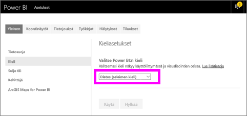
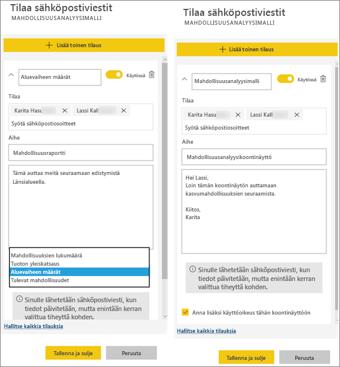
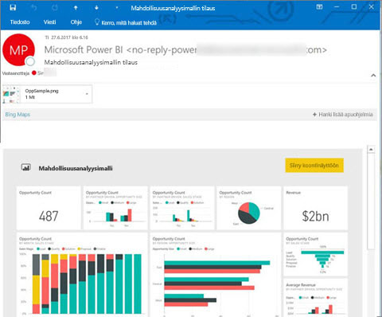
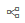
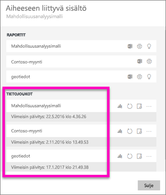
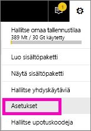
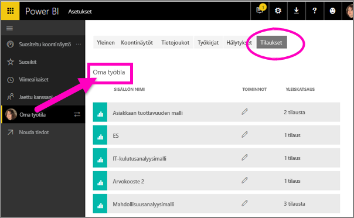

# Raportin tai koontinäytön tilaaminen Power BI -palvelussa
Ei ole koskaan ollut näin helppoa pysyä ajan tasalla tärkeimmistä koontinäytöistä ja raporteista. Kun tilaat itsellesi ja kollegoillesi tärkeimmät raporttisivut ja koontinäytöt, Power BI lähettää sinulle sähköpostitse niistä tilannevedoksen. Voit määrittää, miten usein haluat Power BI:n lähettävän viestejä – vaihtoehtoja on päivittäisestä viikoittaiseen. 

Sähköpostissa ja tilannevedoksessa käytetään samaa kieliasetusta kuin Power BI:ssä (katso [Power BI:ssä tuetut kielet ja maat/alueet](supported-languages-countries-regions.md)). Jos mitään kieltä ei ole määritetty, Power BI käyttää senhetkisen selaimesi paikka-asetuksen mukaista kieltä. Jos haluat nähdä kieliasetuksesi tai muuttaa sitä, valitse hammasrataskuvake  > **Asetukset > Yleiset > Kieli**. 

Tilauksia voi luoda vain Power BI -palvelussa. Kun saat sähköpostiviestin, siinä on mukana linkki, jonka kautta voi siirtyä raporttiin tai koontinäyttöön. Mobiililaitteissa, joihin on asennettu Power BI ‑sovelluksia, linkin valitseminen käynnistää sovelluksen (eikä oletusarvoista raportin tai koontinäytön avaamista Power BI ‑sivustolla).

## Vaatimukset
- Tilauksen **luominen** on Power BI Pro -ominaisuus, joten sinulla on oltava sisällön (koontinäytön tai raportin) muokkausoikeudet tilauksen luomiseksi. 
- Koska tilauksen sähköpostiviestejä lähetetään vain, kun pohjana oleva tietojoukko on päivitetty, tilaukset eivät toimi tietojoukoissa, joita ei päivitetä.

## Koontinäytön tai raporttisivun tilaaminen
Koontinäytön ja raportin tilausprosessit ovat lähes samanlaiset. Samaa painiketta painamalla voit tilata itsellesi (ja muille) Power BI -palvelun koontinäyttöjä ja raportteja.
 
.

1. Avaa koontinäyttö tai raportti.
2. Valitse yläreunan valikkoriviltä **Tilaa** tai valitse kirjekuvake .
   
   

3. Voit ottaa tilauksen käyttöön tai poistaa sen käytöstä keltaisella liukusäätimellä.  Liukusäätimen asettaminen Pois-vaihtoehtoon ei poista itse tilausta. Jos haluat poistaa tilauksen, valitse roskakorikuvake.

4. Täytä sähköpostiviestin tiedot. Sähköpostiosoitteesi on täytetty valmiiksi, mutta voit lisätä tilaukseen myös muita. Vain samalla toimialueella olevia sähköpostiosoitteita voidaan lisätä (katso lisätietoja kohdasta **Huomioon otettavat seikat ja vianmääritys**). Jos raporttia tai koontinäyttöä isännöidään [Premium-kapasiteetissa](service-premium.md), voit lisätä tilaukseen muita yksittäisiä sähköpostiosoitteita ja ryhmäaliaksia. Jos raporttia tai koontinäyttöä ei isännöidä Premium-kapasiteetissa, voit silti lisätä tilaukseen muita yksittäisiä sähköpostiosoitteita, mutta heillä on oltava Power BI Pro -käyttöoikeus.

    Huomaa alla olevissa näyttökuvissa, että kun tilaat raportin, tilaat itse asiassa raportin *sivun*.  Voit tilata useamman kuin yhden raportin sivun valitsemalla **Lisää toinen tilaus** ja valitsemalla toisen sivun. 
      
     

5. Tallenna tilaus valitsemalla **Tallenna ja sulje**. Tilaajat saavat koontinäytöstä tai raporttisivusta tilannevedoksen sähköpostitse aina, kun jokin sen pohjana olevista tietojoukoista muuttuu. Jos koontinäyttö tai raportti päivittyy useammin kuin kerran päivässä, saat sähköpostitse tilannevedoksen vain ensimmäisestä päivityksestä.  
   
    
   
   > [!TIP]
   > Haluatko nähdä sähköpostin saman tien? Käynnistä sähköpostiviestin lähettäminen päivittämällä jokin koontinäyttöön liittyvistä tietojoukoista tai raporttiin liittyvä tietojoukko. (Jos sinulla ei ole tietojoukkoon muokkausoikeuksia, sinun on pyydettävä muokkausoikeudet omaavaa henkilöä tekemään sen puolestasi.) Voit, mitä tietojoukkoja on käytetty, valitsemalla **Näytä aiheeseen liittyvät** -kuvakkeen . Näytölle avautuu **Liittyvä sisältö** -ikkuna, josta voit sitten valita päivityskuvakkeen . 
   > 
   > 
   
   

## Miten sähköpostittamisen aikataulu määräytyy?
Seuraava taulukko esittää, miten usein sähköpostiviesti lähetetään. Kaikki riippuu tietojoukon yhteystavasta, jolle koontinäyttö tai raportti perustuu (DirectQuery, reaaliaikainen yhteys, tuonti Power BI:hin tai Excel-tiedosto OneDrivessa tai SharePoint Onlinessa) sekä käytettävissä ja valittuna olevista tilausasetuksista (päivittäin, viikoittain tai ei mitään).

|  | **DirectQuery** | **Reaaliaikainen yhteys** | **Ajoitettu päivitys (tuonti)** | **Excel-tiedosto OneDrivessa tai SharePoint Onlinessa** |
| --- | --- | --- | --- | --- |
| **Miten usein raportti/koontinäyttö päivittyy?** |15 min välein |Power BI tarkistaa 15 minuutin välein, onko tietojoukko muuttunut ja jos on, päivittää raportin. |Käyttäjä valitsee joko ei mitään, päivittäin tai viikoittain. Päivittäin voi olla enintään 8 kertaa päivässä. Viikoittain tarkoittaa viikoittaista aikataulua, jonka käyttäjä luo ja määrittää mielensä mukaan päivittämään raportin vähintään kerran viikossa ja enintään kerran päivässä. |Tunnin välein |
| **Miten paljon käyttäjä voi vaikuttaa tilatun sähköpostiviestin aikatauluun?** |Asetusvaihtoehdot: päivittäin tai viikoittain |Ei asetusvaihtoehtoja: käyttäjälle lähetetään sähköpostiviesti, jos raportti päivittyy, mutta tiheimmillään kerran päivässä. |Jos päivittämisen asetukseksi on valittu päivittäin, vaihtoehdot ovat päivittäin ja viikoittain.  Jos päivittämisen asetukseksi on valittu viikoittain, ainoa vaihtoehto on viikoittain. |Ei asetusvaihtoehtoja: käyttäjälle lähetetään sähköpostiviesti aina, kun tietojoukko päivittyy, mutta tiheimmillään kerran päivässä. |

## Tilausten hallinta
Vain tilauksen luonut henkilö voi hallita sitä.  Tilausten hallintanäkymään pääsee kahta reittiä.  Ensimmäinen reitti: Valitse **Kaikkien tilausten hallinta** -vaihtoehto **Tilaa sähköpostiviestit** -valintaikkunasta (katso vaiheen 4 näyttökuvat edellä). Toinen reitti: Valitse yläreunan valikkoriviltä Power BI:n hammasrataskuvake  ja valitse sitten **Asetukset**.

Näytettävät tilaukset riippuvat siitä, mikä työtila on sillä hetkellä aktiivisena.  Jos haluat nähdä kaikkien työtilojen kaikki tilaukset kerralla, varmista, että aktiivisena on **Oma työtila**. Työtilojen toiminnasta saat lisätietoa artikkelista [Työtilat Power BI:ssä](service-create-distribute-apps.md).

Tilaus päättyy, jos Pro-käyttöoikeus umpeutuu, omistaja poistaa koontinäytön tai tilauksen luomiseen käytetty käyttäjätili poistetaan.

## Huomioon otettavat seikat ja vianmääritys
* Jos koontinäytön sähköpostitilausten joillakin ruuduilla on käytössä rivitason suojaus (RLS), näitä ruutuja ei näytetä.  Jos raportin sähköpostitilausten tietojoukko käyttää rivitason suojausta (RSL), et pysty luomaan tilausta.
* Raporttisivujen tilaukset on sidottu raporttisivun nimeen. Jos tilaat raporttisivun ja nimeät sen uudelleen, sinun on luotava myös tilaus uudelleen.
* Tietyt organisaatiosi Azure Active Directoryyn määrittämät asetukset voivat rajoittaa sähköpostitilausten käyttämistä Power BI:ssä.  Tällaisia voivat olla esimerkiksi monimenetelmäinen todentaminen tai IP-aluerajoitukset resursseja käytettäessä.
* Tällä hetkellä reaaliaikaisen yhteyden tietojoukkoja käyttävien raporttien/raporttinäkymien sähköpostitilauksia ei tueta, kun tilauksia tehdään muille käyttäjille kuin itsellesi.
* Jos teet sähköpostitilauksen tietojoukkoihin, jotka käyttävät reaaliaikaista yhteyttä, saat sähköpostiviestejä vain tietojen muuttuessa. Eli jos tiedot päivittyvät, mutta niihin ei tule muutoksia, Power BI ei lähetä sinulle sähköpostiviestiä.
* Sähköpostitilaukset eivät tue suurinta osaa [mukautetuista visualisoinneista](power-bi-custom-visuals.md).  Poikkeuksena ovat mukautetut visualisoinnit, jotka on [sertifioitu](power-bi-custom-visuals-certified.md).  
* Sähköpostitilaukset eivät tue R:ää hyödyntäviä mukautettuja visualisointeja tällä hetkellä.  
* Jos koontinäytön joillakin ruuduilla on käytössä rivitason suojaus (RLS), näitä ruutuja ei näytetä.
* Et voit tilata muille käyttäjille raporttia, jossa on käytössä rivitason suojaus (RLS).
* Sähköpostitilaukset lähetetään käyttäen raportin oletusarvoista suodatin- ja osittajatilaa. Oletusarvoihin tilauksen jälkeen tehdyt muutokset eivät näy sähköpostiviestissä.    
* Sähköpostitilauksia ei vielä tueta raporttisivuilla, jotka on luotu Power BI Desktopin reaaliaikaisella palveluyhteystoiminnolla.    
* Erityisesti koontinäyttötilausten osalta tiettyjä ruututyyppejä ei vielä tueta.  Sellaisia ovat esimerkiksi suoratoisto-, video- ja mukautetut verkkosisältöruudut.     
* Jos jaat koontinäytön työtoverille vuokraajasi ulkopuolella, et voi luoda myös tilausta kyseiselle työtoverille. Jos olet aaron@xyz.com, voit jakaa kohteen anyone@ABC.com kanssa, mutta et voi vielä tilata kohdetta anyone@ABC.com eivätkä he voi tilata jaettua sisältöä.      
* Tilaukset voi epäonnistua sähköpostiviestien kokorajoitusten vuoksi, jos koontinäytöissä tai raporteissa on erittäin suuria kuvia.    
* Power BI keskeyttää automaattisesti sellaisten tietojoukkojen päivittämisen, joihin liittyvissä koontinäytöissä tai raporteissa ei ole vierailtu yli kahteen kuukauteen.  Kuitenkin jos lisäät koontinäytön tai raportin tilauksen, päivitystä ei lopeteta, vaikka kohteessa ei vierailtaisikaan.    
* Jos et saa tilaamiasi sähköpostiviestejä, varmista, että täydellinen käyttäjätunnuksesi (UPN) pystyy vastaanottamaan sähköpostia. [Power BI ‑tiimi yrittää parhaillaan höllentää vaatimusta](https://community.powerbi.com/t5/Issues/No-Mail-from-Cloud-Service/idc-p/205918#M10163), joten pysy kuulolla. 
* Jos raporttinäkymäsi tai raporttisi on Premium-kapasiteetissa, voit käyttää ryhmän sähköpostialiaksia tilauksiin sen sijaan, että tilaisit työtoverien sähköpostiosoitteet yksitellen. Aliakset perustuvat nykyiseen Active Directoryyn. 

## Seuraavat vaiheet
* Onko sinulla kysyttävää? [Voit esittää kysymyksiä Power BI -yhteisössä](http://community.powerbi.com/)    
* [Lue blogimerkintä](https://powerbi.microsoft.com/blog/introducing-dashboard-email-subscriptions-a-360-degree-view-of-your-business-in-your-inbox-every-day/)

