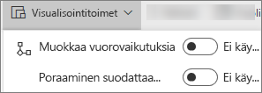
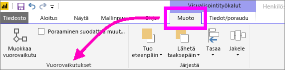
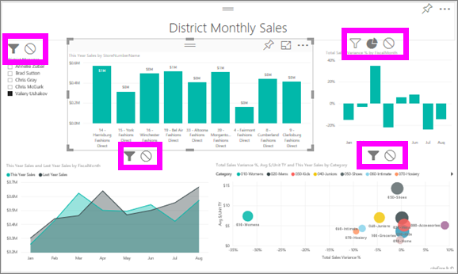

# Visualisointien vuorovaikutuksen muuttaminen Power BI -raportissa
Jos sinulla on raportin muokkausoikeudet, voit käyttää **visualisointitoimia** ja muuttaa sitä, miten raporttisivun visualisoinnit vaikuttavat toisiinsa. 

Raporttisivun visualisoinneilla voi oletusarvoisesti ristiinsuodattaa ja ristiinkorostaa sivun muita visualisointeja.
Esimerkiksi osavaltion valitseminen karttavisualisoinnissa korostaa sarakekaavion ja suodattaa viivakaavion näyttämään vain yhtä osavaltiota koskevat tiedot.
Katso [Tietoja suodattamisesta ja korostamisesta](power-bi-reports-filters-and-highlighting.md). Jos sinulla on visualisointi, joka tukee [porautumista](consumer/end-user-drill.md), yhteen visualisointiin porautuminen ei oletusarvoisesti vaikuta muihin raporttisivun visualisointeihin. Nämä molemmat oletustoimintatavat voidaan ohittaa ja vuorovaikutus voidaan määrittää visualisointikohtaisesti.

Tässä artikkelissa kerrotaan, miten voit käyttää **visualisointitoimia** Power BI -palvelun [muokkausnäkymässä](service-interact-with-a-report-in-editing-view.md) ja Power BI Desktopissa. Jos raportti on jaettu kanssasi, et voi muuttaa visualisointitoimien asetuksia.

> [!NOTE]
> Termejä *ristiinsuodatus* ja *ristiinkorostus* käytetään tässä kuvatun toiminnan erottamiseksi siitä, mitä tapahtuu, kun käytät visualisointien suodattamiseen ja korostamiseen **Suodattimet**-ruutua.  
> 
> 

<iframe width="560" height="315" src="https://www.youtube.com/embed/N_xYsCbyHPw?list=PL1N57mwBHtN0JFoKSR0n-tBkUJHeMP2cP" frameborder="0" allowfullscreen></iframe>

1. Valitse visualisointi, jotta siitä tulee aktiivinen.  
2. Näytä **Visualisointitoimet**-asetukset.
    - Valitse Power BI -palvelussa avattava valikko raportin valikkoriviltä.

       

    - Valitse Desktopissa **Muotoile > Toimet**.

        

3. Voit ottaa visualisointitoimien ohjausobjektit käyttöön valitsemalla **Muokkaa vuorovaikutuksia**. Power BI lisää ristiinsuodatuksen ja ristiinkorostuksen kuvakkeet kaikkiin muihin raporttisivun visualisointeihin.
   
    
3. Määritä, miten valitun visualisoinnin pitäisi vaikuttaa muihin.  Toista vaiheet tarvittaessa muille raporttisivun visualisoinneille.
   
   * Jos sen tulee ristiinsuodattaa visualisointi, valitse **suodattimen** kuvake .
   * Jos sen tulee ristiinkorostaa visualisointi, valitse **korostuksen** kuvake .
   * Jos sillä ei pidä olla vaikutusta, valitse **Ei vaikutusta** -kuvake .

4. Voit ottaa porautumisen ohjausobjektit käyttöön valitsemalla **Poraaminen suodattaa muut visualisoinnit**.  Nyt kun visualisoinnissa poraudutaan alaspäin (ja ylöspäin), muut raporttisivun visualisoinnit muuttuvat nykyisen porautumisvalinnan mukaisesti. 

   

