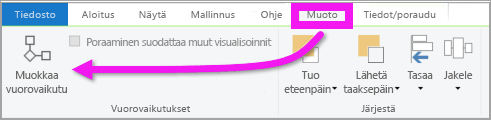
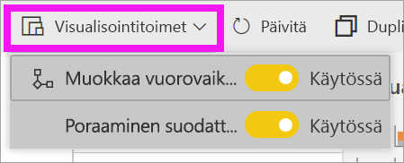
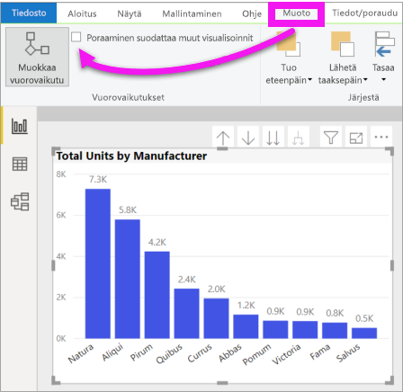

# Visualisointien vuorovaikutuksen muuttaminen Power BI -raportissa
Jos sinulla on raportin muokkausoikeudet, voit käyttää **visualisointitoimia** ja muuttaa sitä, miten raporttisivun visualisoinnit vaikuttavat toisiinsa. 

## Visualisointitoimien johdanto
Raporttisivun visualisoinneilla voi oletusarvoisesti ristiinsuodattaa ja ristiinkorostaa sivun muita visualisointeja.
Esimerkiksi osavaltion valitseminen karttavisualisoinnissa korostaa sarakekaavion ja suodattaa viivakaavion näyttämään vain yhtä osavaltiota koskevat tiedot.
Katso [Tietoja suodattamisesta ja korostamisesta](power-bi-reports-filters-and-highlighting.md). Jos sinulla on visualisointi, joka tukee [porautumista](consumer/end-user-drill.md), yhteen visualisointiin porautuminen ei oletusarvoisesti vaikuta muihin raporttisivun visualisointeihin. Nämä molemmat oletustoimintatavat voidaan ohittaa ja vuorovaikutus voidaan määrittää visualisointikohtaisesti.

Tässä artikkelissa kerrotaan, miten voit käyttää **visualisointitoimia** Power BI Desktopissa. Prosessi vastaa Power BI -palvelun [muokkausnäkymää](service-interact-with-a-report-in-editing-view.md). Jos sinulla on vain lukunäkymän käyttöoikeus tai jos raportti on jaettu kanssasi, et voi muuttaa visualisointitoimien asetuksia.

Termejä *ristiinsuodatus* ja *ristiinkorostus* käytetään tässä kuvatun toiminnan erottamiseksi siitä, mitä tapahtuu, kun käytät visualisointien *suodattamiseen* ja *korostamiseen***Suodattimet**-ruutua.  

> [!NOTE]
> Tässä videossa käytetään Power BI Desktopin ja Power BI -palvelun vanhempia versioita. 
>
>

<iframe width="560" height="315" src="https://www.youtube.com/embed/N_xYsCbyHPw?list=PL1N57mwBHtN0JFoKSR0n-tBkUJHeMP2cP" frameborder="0" allowfullscreen></iframe>

## Visualisointitoimien ohjausobjektien ottaminen käyttöön
Jos sinulla on raportin muokkausoikeudet, voit ottaa käyttöön visualisointitoimien ohjausobjektit ja mukauttaa sitten sitä, miten raporttisivusi visualisoinnit suodattuvat ja korostavat toisiaan. 

1. Valitse visualisointi, jotta siitä tulee aktiivinen.  
2. Näytä **Visualisointitoimet**-asetukset.
    

    - Valitse Desktopissa **Muotoile > Toimet**.

        

    - Avaa raportti Power BI -palvelun muokkausnäkymässä ja valitse avattava valikko raportin valikkoriviltä.

        

3. Voit tuoda visualisointitoimien ohjausobjektit näkyviin valitsemalla **Muokkaa vuorovaikutuksia**. Power BI lisää suodatuksen ja korostuksen kuvakkeet kaikkiin muihin raporttisivun visualisointeihin. Näemme, että puukartassa ristiinsuodatetaan viivakaaviota ja karttaa sekä ristiinkorostetaan pylväskaaviota. Nyt voit muuttaa sitä, kuinka valittu visualisointi vaikuttaa muihin raporttisivun visualisointeihin.
   
    

## Vaikutustavan vaihtaminen
Tutustu siihen, miten visualisoinnit vaikuttavat toisiinsa, valitsemalla kukin raporttisivullasi oleva visualisointi (yksi kerrallaan).  Valitse arvopiste, palkki tai muoto ja katso sen vaikutusta muihin visualisointeihin. Jos näkemäsi toiminta ei vastaa haluamaasi, voit muuttaa vaikutustapaa. Muutokset tallentuvat raportin yhteydessä, joten raporttisi käyttäjät saavat saman visuaalisen kokemuksen kuin itsekin sait.

Aloita valitsemalla visualisointi, jotta siitä tulee aktiivinen.  Huomaa, että sivun kaikki muut visualisoinnit näyttävät nyt vuorovaikutuskuvakkeet. Tummennettu kuvake on se, jota käytetään. Määritä seuraavaksi, miten haluat **valitun visualisoinnin** vaikuttavan muihin.  Toista vaiheet tarvittaessa muille raporttisivun visualisoinneille.

Jos haluat, että valittu visualisointi
   
   * ristiinsuodattaa jokin sivun muista visualisoinneista, valitse **suodatinkuvake** visualisoinnin oikeasta yläkulmasta .
   * ristiinkorostaa jokin sivun muista visualisoinneista, valitse **korostuskuvake** .
   * ei vaikuta johonkin sivun muuhun visualisointiin, valitse **ei vaikutusta** -kuvake .

## Muuta porattavissa olevien visualisointien vaikutustapoja
[Tiettyjä Power BI -visualisointeja voidaan porata](consumer/end-user-drill.md). Oletusarvon mukaan jos visualisointia porataan, se ei vaikuta raporttisivun muihin visualisointeihin. Tätä toimintaa voidaan kuitenkin muuttaa. 

> [!TIP]
> Testaa tätä itse käyttämällä [Henkilöstöhallintomallin PBIX-tiedostoa](https://download.microsoft.com/download/6/9/5/69503155-05A5-483E-829A-F7B5F3DD5D27/Human%20Resources%20Sample%20PBIX.pbix). Tiedostossa on pylväskaavio, joka porautuu alaspäin **Uudet palkkaukset** -välilehdellä.
>

1. Valitse porattavissa oleva visualisointi, jotta se on aktiivinen. 

2. Ota porautuminen alaspäin käyttöön valitsemalla porautuminen alaspäin -kuvake.

    

2. Valitse valikkopalkista **Muotoile** > **Poraaminen suodattaa muut visualisoinnit**.  Nyt kun visualisoinnissa poraudutaan alaspäin (ja ylöspäin), muut raporttisivun visualisoinnit muuttuvat nykyisen porautumisvalinnan mukaisesti. 

    

3. Jos näkemäsi toiminta ei vastaa haluamaasi, voit muuttaa vaikutustapaa [edellä kuvatulla tavalla](#change-the-interaction-behavior).
    
## Seuraavat vaiheet
[Suodattaminen ja korostaminen Power BI -raporteissa](power-bi-reports-filters-and-highlighting.md)