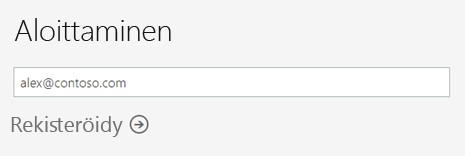
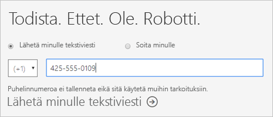
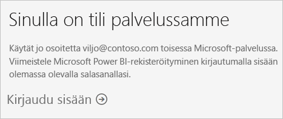
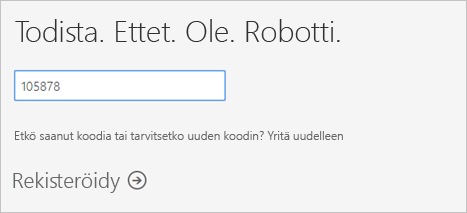
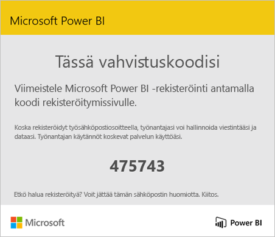
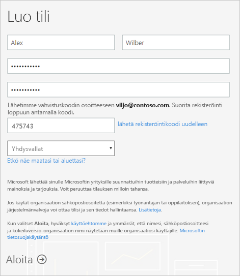
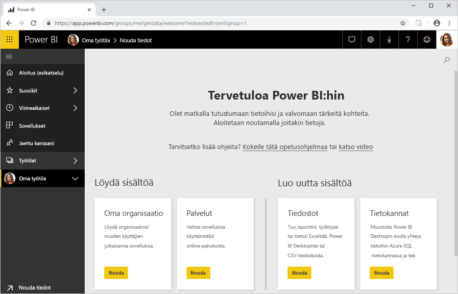

# Rekisteröityminen Power BI:hin yksityishenkilönä

Power BI toimii yhtä sujuvasti henkilökohtaisena raportointi- ja visualisointityökaluna kuin analytiikka- ja päätöksentekovälineenä ryhmäprojekteille, yksiköille ja kokonaisille organisaatioille. Tässä artikkelissa kerrotaan, miten sen yksityishenkilönä Power BI Pro-kokeiluversion käyttäjäksi. Jos olet Power BI-järjestelmänvalvoja, katso [Power BI-käyttöoikeuksien organisaatiosi](service-admin-licensing-organization.md).

## Tuetut sähköpostiosoitteet

Ennen kuin aloitat rekisteröitymisen, on tärkeää Lue minkä tyyppisiä sähköpostiosoitteet, jota voit käyttää Power BI:

* Power BI edellyttää, että käytät rekisteröintiin työpaikan tai oppilaitoksen sähköpostiosoitetta. Et voi rekisteröityä sähköpostin kuluttajapalvelujen tai tietoliikenteen palveluntarjoajien sähköpostiosoitteita. Tämä sisältää outlook.com, hotmail.com, gmail.com ja muiden.

* Kun olet rekisteröitynyt, voit [kutsua vieraskäyttäjiä](https://docs.microsoft.com/azure/active-directory/active-directory-b2b-what-is-azure-ad-b2b) tutustumaan Power BI -sisältöösi millä tahansa sähköpostiosoitteella, henkilökohtaiset tilit mukaan lukien.

* Voit rekisteröityä Power BI:hin .gov- tai .mil-osoitteella, mutta prosessi on tällöin erilainen. Katso lisätietoja, [Rekisteröi Yhdysvaltain valtionhallinnon organisaatio Power BI-palvelussa](service-govus-signup.md).

## Kokeiluversioon rekisteröityminen

Rekisteröidy Power BI Pro -kokeiluversion käyttäjäksi näiden ohjeiden avulla. Lisätietoja on kohdassa [kokeiluversion vanhentuminen](#trial-expiration), jos haluat lisätietoja asetuksia, kun tämä kokeilu päättyy.

1. Siirry Power BI:n [rekisteröitymissivulle](https://signup.microsoft.com/signup?sku=a403ebcc-fae0-4ca2-8c8c-7a907fd6c235).

1. Anna sähköpostiosoitteesi ja valitse sitten **Rekisteröidy**.

    

1. Jos näyttöön tulee sanoma, katsomalla, valitse vaihtoehto vahvistuskoodin vastaanottamiseen, ja jatka sitten tämän toimintosarjan seuraavaan vaiheeseen.

    

    Jos näyttöön tulee sanoma, katsomalla, viimeistele vaiheita ja kirjaudu sisään Power BI.

    

1. Anna saamasi koodi ja valitse sitten **Rekisteröidy**.

    

1. Tarkista sähköpostistasi tällainen viesti.

    

1. Anna seuraavassa kohdassa tietosi ja sähköpostiin saamasi vahvistuskoodi. Valitse alue, tutustu näyttöön linkitettyihin käytäntöihin ja valitse sitten **Aloita**.

    

1. Olet sitten sinut [Power BI-kirjautumissivu](https://powerbi.microsoft.com/landing/signin/), ja voit aloittaa Power BI.

    

## Kokeiluversion vanhentuminen

Kun Power BI Pro kokeilujakso loppuu, Power BI (ilmainen) käyttöoikeuden käyttöoikeus tekemäsi muutokset. Kun näin tapahtuu, sinulla ei ole enää käyttää ominaisuuksia, jotka edellyttävät Power BI Pro-käyttöoikeus. Jos haluat lisätietoja, katso kohta [Ominaisuudet käyttöoikeustyypin mukaan](service-features-license-type.md).

Jos (ilmainen) Power BI-käyttöoikeus riittää, sinun ei tarvitse tehdä mitään muuta. Voit hyödyntää Power BI Pro, pyydä lisätietoja IT-tietoja Power BI Pro-käyttöoikeuden ostamisesta.

## Rekisteröitymisen vianmääritys

Useimmissa tapauksissa voit rekisteröityä Power BI-kuvattu prosessin mukaisesti. Osa ongelmista, jotka saattavat estää rekisteröityminen on kuvattu seuraavassa taulukossa mahdollisista kanssa.

| Oire / virhesanoma | Syy ja vaihtoehtoinen menetelmä |
| ----------------------- | -------------------- |
| <strong>Henkilökohtaiset sähköpostiosoitteet (esimerkiksi nancy@gmail.com)</strong> näyttöön tulee viesti, joka näyttää suunnilleen tältä kirjautumisen aikana seuraavankaltainen ilmoitus:    *Annoit henkilökohtaisen sähköpostiosoitteen: Anna työsähköpostiosoitteesi, jotta voimme turvallisesti tallentaa yrityksesi tiedot.*    tai    *Tämä vaikuttaa henkilökohtaiselta sähköpostiosoitteelta. Anna työosoitteesi, jotta voimme muodostaa yhteyden sinun ja muiden samassa yrityksessä työskentelevien välille. Sinun ei tarvitse huolehtia. Emme jaa osoitettasi kenellekään.* | Power BI ei tue kuluttajapalvelujen palveluntarjoajien sähköpostin kaupallisten sähköpostipalvelujen tai teleyritysten sähköpostiosoitteita.    Viimeistele rekisteröinti, yritä uudelleen käyttämällä työpaikkasi tai oppilaitoksesi antamaa sähköpostiosoitetta.    Jos rekisteröityminen ei edelleenkään onnistu ja haluat suorittaa edistyksellisemmän asennuksen, voit [rekisteröityä uuteen Office 365 -kokeiluversioon ja käyttää rekisteröitymiseen kyseistä sähköpostiosoitetta](service-admin-signing-up-for-power-bi-with-a-new-office-365-trial.md).    Voit myös pyytää aiemmin luotua käyttäjää [kutsumaan sinut vieraskäyttäjänä](service-admin-azure-ad-b2b.md). |
| **Omatoiminen rekisteröinti on poistettu käytöstä**: Näyttöön tulee sanoma, kuten tällä tietojoukolla kirjautumisen aikana seuraavankaltainen ilmoitus:    *Emme voi viimeistellä rekisteröitymistäsi. IT-osastosi on poistanut käytöstä rekisteröitymisen Microsoft Power BI:hin. Ota osastoon yhteyttä rekisteröinnin suorittamiseksi loppuun.*    tai    *Tämä vaikuttaa henkilökohtaiselta sähköpostiosoitteelta. Anna työosoitteesi, jotta voimme muodostaa yhteyden sinun ja muiden samassa yrityksessä työskentelevien välille. Sinun ei tarvitse huolehtia. Emme jaa osoitettasi kenellekään.* | Organisaatiosi IT-järjestelmänvalvojasi on poistanut käytöstä omatoimisen rekisteröitymisen Power BI.    Viimeistele rekisteröinti, ota yhteyttä IT-järjestelmänvalvojaasi ja pyydä häntä [ohjeiden käyttöön Rekisteröidy](service-admin-licensing-organization.md#enable-or-disable-individual-user-sign-up-in-azure-active-directory).    Tämä ongelma saattaa ilmetä myös, jos olet [rekisteröitynyt Office 365:een kumppanin kautta](service-admin-syndication-partner.md). |
| **Sähköpostiosoite ei ole Office 365-tunnus** näyttöön tulee sanoma, kuten tällä tietojoukolla kirjautumisen aikana seuraavankaltainen ilmoitus:    *Emme löydä sinua osoitteesta contoso.com.  Käytätkö eri tunnusta työpaikalla tai oppilaitoksessa?    Yritä kirjautua sisään sillä, ja jos se ei toimi, ota yhteyttä IT-osastoon.* | Organisaatiosi käyttää Office 365:een ja muihin Microsoft-palveluihin kirjautumiseen tunnuksia, jotka ovat muita kuin sähköpostiosoitteesi.  Sähköpostiosoitteesi saattaa esimerkiksi olla Nancy.Smith@contoso.com, mutta tunnuksesi on nancys@contoso.com.    Viimeistele rekisteröinti käyttämällä tunnusta, jonka organisaatiosi on määrittänyt sinulle Office 365: een tai muihin Microsoft-palveluihin kirjautumista varten.  Jos et tiedä, mistä tässä on, ota yhteyttä IT-järjestelmänvalvojaasi.    Jos rekisteröityminen ei edelleenkään onnistu ja haluat suorittaa edistyksellisemmän asennuksen, voit [rekisteröityä uuteen Office 365 -kokeiluversioon ja käyttää rekisteröitymiseen kyseistä sähköpostiosoitetta](service-admin-signing-up-for-power-bi-with-a-new-office-365-trial.md). |

## Seuraavat vaiheet

[Power BI Pron ostaminen](service-admin-purchasing-power-bi-pro.md)  
[Yksittäisten käyttäjien Power BI -palvelusopimus](https://powerbi.microsoft.com/terms-of-service/)  

Onko sinulla kysyttävää? [Voit esittää kysymyksiä Power BI -yhteisössä](http://community.powerbi.com/)