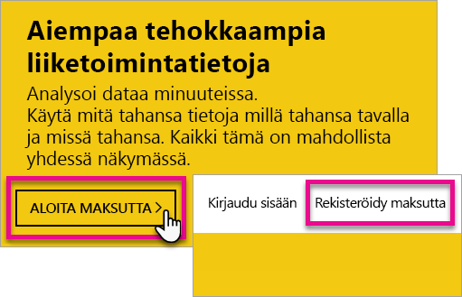
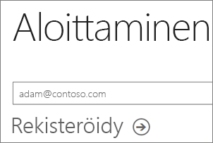
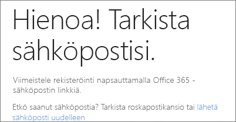
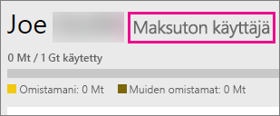
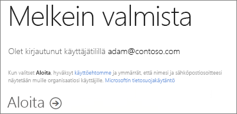
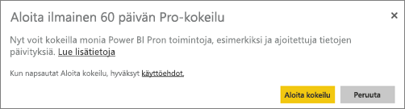
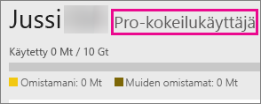

# Rekisteröityminen Power BI:hin yksityishenkilönä
Ota selvää, miten voit rekisteröityä Power BI:n käyttäjäksi ja aloittaa sen käytön henkilökohtaisiin raportti- ja visualisointitarpeisiisi.

Power BI toimii yhtä sujuvasti henkilökohtaisena raportointi- ja visualisointityökaluna kuin analytiikka- ja päätöksentekovälineenä ryhmäprojekteille, yksiköille ja kokonaisille organisaatioille.

Tässä artikkelissa käydään läpi, miten voit rekisteröityä Power BI -palveluun ja aloittaa sen käytön. Tietoa Power BI:n maksuttoman version ja Pro-version eroista on artikkelissa [Power BI:n maksuttoman version ja Pro-version vertailu](service-free-vs-pro.md).

## Erilaisia vaihtoehtoja
Yksityishenkilönä sinulla on useita vaihtoehtoja Power BI:hin rekisteröitymiseen ja sen käytön aloittamiseen. Voit valita maksuttoman rekisteröitymisen tai voit ostaa Power BI Pro -tilauksen. Jos rekisteröidyt ilmaiselle tilille, voit palveluun kirjauduttuasi valita 60 päivän maksuttoman Power BI Pro -kokeiluversion.

Jos olet osa olemassa olevaa organisaatiota, joka käyttää Office 365:ä, voit silti rekisteröityä ilmaiselle tilille. IT-järjestelmänvalvojallasi on myös joitakin vaihtoehtoja ostaa Power BI Pro -versio ja myöntää käyttöoikeuksia. Lisätietoja IT-järjestelmänvalvojille saatavilla olevista vaihtoehdoista on artikkelissa [Power BI Pron ostaminen](service-admin-purchasing-power-bi-pro.md).

> [!NOTE]
> Jos edustat organisaatiota, yksityinen rekisteröinti saattaa olla poistettu käytöstä. Jos saat virheilmoituksen, joka ilmoittaa sen olevan poistettu käytöstä, katso lisätietoja kohdasta [Yksityinen rekisteröinti on poistettu käytöstä](#individual-sign-up-has-been-turned-off).
>

## Mitä rekisteröinti edellyttää?

Jotta voit rekisteröityä Power BI:hin, sinulla on oltava toimiva sähköpostiosoite. Henkilökohtainen sähköpostiosoite ei toimi, kun yrität rekisteröityä Power BI:hin.

### Mitä sähköpostiosoitteita Power BI:n kanssa voi käyttää?
Power BI edellyttää, että käytät rekisteröintiin työpaikan tai oppilaitoksen sähköpostiosoitetta. Et voi rekisteröityä Power BI:hin käyttämällä sähköpostin kuluttajapalvelujen tai tietoliikenteen palveluntarjoajien sähköpostiosoitteita. Tämä sisältää outlook.com-, hotmail.com- ja gmail.com-osoitteet ja muut vastaavat.

Jos yrität rekisteröityä henkilökohtaisella sähköpostiosoitteella, näyttöön tulee viesti, jossa ilmoitetaan, että sinun tulee käyttää työpaikan tai koulun sähköpostiosoitetta.

> [!NOTE]
> Voit rekisteröityä Power BI:hin .gov- tai .mil-osoitteilla. Lisätietoa saat artikkelista [Rekisteröi Yhdysvaltain valtionhallinnon organisaatio Power BI -palveluun](https://docs.microsoft.com/en-us/power-bi/service-govus-signup).
>

> [!NOTE]
> Kun olet rekisteröitynyt, voit [kutsua vieraskäyttäjiä](https://docs.microsoft.com/en-us/azure/active-directory/active-directory-b2b-what-is-azure-ad-b2b) nähdäksesi Power BI -vuokraajan sisältöä millä tahansa sähköpostiosoitteella, henkilökohtaiset tilit mukaan lukien.
>

## Kumpaa tarvitset?
Voit selvittää, kumman version tarvitset, tarkastelemalla mitä kummankin käyttöoikeuteen sisältyy. Maksuttoman version käyttäjillä on käytettävissään suurin osa palvelujen toiminnoista jakamis- ja yhteistyöominaisuuksia lukuun ottamatta. Power BI Pro -käyttäjät voivat hyödyntää palvelun kaikkia ominaisuuksia, mutta versio ei ole ilmainen. Jos sinulla ei tarvetta sisältöjen jakamiselle, maksuton versio saattaa olla sinulle oikea vaihtoehto. Lisätietoja saat [Power BI -hinnoittelusivulta](https://powerbi.microsoft.com//pricing/).

Artikkelin loppuosassa tarkastellaan, kuinka näihin kumpaankin versioon rekisteröidytään.

## Rekisteröityminen Power BI:hin (ilmainen) yksityishenkilönä
Nopein tapa rekisteröityä Power BI:hin on rekisteröityä maksuttomaan Power BI:n tiliin. Tämä tili ei maksa mitään, ja se tarjoaa käyttöösi useita palvelussa käytettävissä olevia ominaisuuksia.

> [!NOTE]
> Jos näyttöön tulee sanoma, että tunnemme sinut jo entuudestaan, siirry osoitteeseen https://app.powerbi.com ja kokeile kirjautua sisään.
> 
> 

Voit rekisteröityä Power BI:hin seuraavasti.

1. Selaa osoitteeseen [powerbi.com](https://powerbi.microsoft.com).
2. Valitse **Aloita maksutta**- tai **Rekisteröidy maksutta** -vaihtoehto.
   
    
3. Valitse aloitussivulta Power BI:n kohdasta **Kokeile maksutta >**.
   
    
4. Anna rekisteröitymiseen käyttämäsi sähköpostiosoite ja valitse sitten **Rekisteröidy**. Muista, että sähköpostiosoitteen tulee olla sallittu rekisteröintiä varten. Lisätietoja sallituista sähköpostiosoitteista on artikkelissa [Power BI:n kanssa käytettävät sähköpostiosoitteet](#what-email-address-can-be-used-with-power-bi).
   
    
5. Näkyviin tulee sanoma, jossa sähköposti pyydetään tarkistamaan.
   
    
6. Vahvista sähköpostiosoite valitsemalla sähköpostin linkki. Tämä vie sinut takaisin rekisteröintityönkulkuun. Sinun on ehkä annettava joitakin lisätietoja itsestäsi.
7. Tämän jälkeen sinut ohjataan osoitteeseen https://app.powerbi.com ja voit aloittaa Power BI:n käytön maksuttomana käyttäjänä.

### Miltä tämä näyttää palvelun sisällä
Kun olet sisällä palvelussa, voit tarkistaa, että sinulla on ilmainen tili napsauttamalla **rataskuvaketta** ja valitsemalla **Hallinnoi henkilökohtaista tallennustilaa**.

### Mitä, jos olet jo olemassa olevan organisaation osa?
Jos tilisi on osa olemassa olevaa organisaatiota, näkyviin tulee viesti, jossa sinua pyydetään kirjautumaan käyttäen tätä tiliä. Valitse **Jatka** ja kirjaudu sisään Office 365 -kirjautumistunnuksillasi.

Näyttöön avautuu viesti, jossa pyydetään valitsemaan **Aloita**.

## Palvelun sisäinen 60 päivän Power BI Pro -kokeiluversio
Kun olet rekisteröinyt ilmaisen tilisi, voit halutessasi valita Pron kokeiltavaksi 60 päivän ajaksi maksuttomasti. Pystyt käyttämään kaikkia Pro-ominaisuuksia kokeiluversion ajan. Power BI Pro sisältää kaikki samat ominaisuudet kuin Power BI:n ilmainen versio sekä jakamiseen ja yhteiskäyttöön liittyviä lisäominaisuuksia. Jos haluat lisätietoja, katso [Power BI:n hinnoittelu](https://powerbi.microsoft.com/pricing). Kokeile Power BI Pron 60 päivän maksutonta kokeilujaksoa kirjautumalla Power BI:hin. Saat käyttöösi muun muassa nämä Power BI Pro -ominaisuudet:

* [Sovelluksen työtilan luominen](service-create-distribute-apps.md)
* [Koontinäytön jakaminen](service-share-dashboards.md)

Kun kokeilet mitä tahansa näistä ominaisuuksista, sinua pyydetään aloittamaan ilmainen kokeilujaksosi. Voit myös halutessasi käyttää sitä napsauttamalla rataskuvaketta ja valitsemalla **Hallitse henkilökohtaista tallennustilaa**. Valitse sitten oikealta **Kokeile Prota ilmaiseksi**.

Sitten voit valita **Aloita kokeilu**.

>[!NOTE]
>Käyttäjät, jotka hyödyntävät tätä tuotekohtaista Power BI Pro -kokeiluversiota, eivät näy Office 365:n järjestelmävalvojien portaalissa Power BI Pro Trial -käyttäjinä (he näkyvät Power BI:n ilmaiskäyttäjinä). He näkyvät kuitenkin Power BI Pro -kokeiluversion käyttäjinä Power BI:n **tallennussivun hallinnassa**.

>[!NOTE]
>Jos olet järjestelmänvalvoja ja haluat hankkia ja ottaa käyttöön Power BI -kokeilujakson käyttöoikeudet useille organisaation käyttäjille siten, ettei yksittäisiltä käyttäjiltä edellytetä käyttöehtojen hyväksymistä, voit rekisteröityä [Power BI Pro -kokeiluversion](https://portal.office.com/Signup/MainSignup15.aspx?OfferId=d59682f3-3e3b-4686-9c00-7c7c1c736085&dl=POWER_BI_PRO) käyttäjäksi. Järjestelmänvalvojan kokeiluversion rekisteröimistä varten sinun on oltava Office 365:n yleinen tai laskutuksen järjestelmänvalvoja tai luotava uusi vuokraaja. Saat lisätietoja artikkelista [Power BI Pron ostaminen](service-admin-purchasing-power-bi-pro.md).
> 
> [!NOTE]
> Power BI Premiumin tultua saataville ja Power BI:n maksutonta versiota koskevien 1. kesäkuuta 2017 tehtyjen muutosten jälkeen, saatat olla oikeutettu pidennettyyn Pro-kokeiluversioon. Lisätietoja on artikkelissa [Laajennetun Pro-kokeiluversion aktivointi](service-extended-pro-trial.md).
> 
> 

### Miltä tämä näyttää palvelun sisällä
Kun olet sisällä palvelussa, voit tarkistaa, että sinulla on Pro-kokeilutili napsauttamalla **rataskuvaketta* ja valitsemalla **Hallinnoi henkilökohtaista tallennustilaa**.

## Entä jos haluat täyden Power BI Pro -version?
Yksityishenkilö ei voi saada Power BI Pro -version käyttöoikeutta. Sinun tukee neuvotella IT-järjestelmänvalvojasi kanssa käyttöoikeuden ostamisesta ja myöntämisestä tilillesi. Saat lisätietoja artikkelista [Power BI Pron ostaminen](service-admin-purchasing-power-bi-pro.md).

## Vianmääritys
Monissa tapauksissa Power BI:hin rekisteröityminen tapahtuu noudattamalla yksinkertaista omatoimista rekisteröintiprosessia, joka on kuvattu edellä. On kuitenkin useita syitä, miksi et ehkä pysty suorittamaan omatoimista rekisteröintiä loppuun.  Seuraavassa taulukossa esitellään joitakin yleisimpiä syitä sille, miksi rekisteröinti ei ehkä onnistu, ja vaihtoehtoisia menetelmiä ongelmien ratkaisemiseksi.

| **Oire/virhesanoma** | **Syy ja vaihtoehtoinen menetelmä** |
| --- | --- |
| **Henkilökohtaiset sähköpostiosoitteet (esim. nancy@gmail.com)** Näyttöön tulee kirjautumisen aikana seuraavankaltainen ilmoitus:    *Annoit henkilökohtaisen sähköpostiosoitteen: Anna työsähköpostiosoitteesi, jotta voimme turvallisesti tallentaa yrityksesi tiedot.*    tai    *Tämä vaikuttaa henkilökohtaiselta sähköpostiosoitteelta. Anna työosoitteesi, jotta voimme muodostaa yhteyden sinun ja muiden samassa yrityksessä työskentelevien välille. Sinun ei tarvitse huolehtia. Emme jaa osoitettasi kenellekään.* |Power BI ei tue sähköpostin kuluttajapalvelujen tai tietoliikenteen palveluntarjoajien sähköpostiosoitteita.    Viimeistele rekisteröinti yrittämällä uudelleen käyttämällä työpaikkasi tai oppilaitoksesi antamaa sähköpostiosoitetta.    Jos rekisteröityminen ei edelleenkään onnistu ja haluat suorittaa edistyksellisemmän asennuksen, voit [rekisteröityä uuteen Office 365 -kokeiluversioon ja käyttää rekisteröitymiseen kyseistä sähköpostiosoitetta](service-admin-signing-up-for-power-bi-with-a-new-office-365-trial.md).    Kutsu käyttäjätili [Azure B2B -vieraana](https://docs.microsoft.com/en-us/azure/active-directory/active-directory-b2b-what-is-azure-ad-b2b). |
| **Omatoiminen rekisteröinti on poistettu käytöstä** Näyttöön tulee kirjautumisen aikana seuraavankaltainen ilmoitus:    *Emme voi viimeistellä rekisteröitymistäsi. IT-osastosi on poistanut käytöstä rekisteröitymisen Microsoft Power BI:hin. Ota osastoon yhteyttä rekisteröinnin suorittamiseksi loppuun.*    tai    *Tämä vaikuttaa henkilökohtaiselta sähköpostiosoitteelta. Anna työosoitteesi, jotta voimme muodostaa yhteyden sinun ja muiden samassa yrityksessä työskentelevien välille. Sinun ei tarvitse huolehtia. Emme jaa osoitettasi kenellekään.* |Organisaatiosi IT-järjestelmänvalvoja on poistanut käytöstä omatoimisen rekisteröitymisen Power BI:hin.    Viimeistele rekisteröinti ottamalla yhteyttä IT-järjestelmänvalvojaan ja pyytämällä häntä noudattamaan alla olevalla sivulla annettuja ohjeita ja sallimaan käyttäjien rekisteröityminen Power BI:n käyttäjiksi ja sallimaan uusien käyttäjien liittyminen aiemmin luotuun vuokraajaan.    Tämä ongelma saattaa ilmetä myös, jos olet rekisteröitynyt Office 365:een kumppanin kautta. [Lue lisää](service-admin-syndication-partner.md)    [Power BI organisaatiossasi](https://support.office.com/en-ca/article/Power-BI-in-your-Organization-d7941332-8aec-4e5e-87e8-92073ce73dc5#BKMK_HowCanIAllowO365Tenant) |
| **Sähköpostiosoite ei ole Office 365 -tunnus** Näyttöön tulee kirjautumisen aikana seuraavankaltainen ilmoitus:    *Emme löydä sinua osoitteesta contoso.com.  Käytätkö eri tunnusta työpaikalla tai oppilaitoksessa?    Yritä kirjautua sisään sillä, ja jos se ei toimi, ota yhteyttä IT-osastoon.* |Organisaatiosi käyttää Office 365:een ja muihin Microsoft-palveluihin kirjautumiseen tunnuksia, jotka ovat muita kuin sähköpostiosoitteesi.  Sähköpostiosoitteesi saattaa esimerkiksi olla Nancy.Smith@contoso.com, mutta tunnuksesi on nancys@contoso.com.    Viimeistele rekisteröinti käyttämällä tunnusta, jonka organisaatiosi on myöntänyt sinulle Office 365:een tai muihin Microsoft-palveluihin kirjautumista varten.  Jos et tiedä, mistä tässä on kysymys, ota yhteyttä IT-järjestelmänvalvojaan.    Jos rekisteröityminen ei edelleenkään onnistu ja voit suorittaa edistyksellisemmän asennuksen, voit [rekisteröityä uuteen Office 365 -kokeiluversioon ja käyttää rekisteröitymiseen kyseistä sähköpostiosoitetta](service-admin-signing-up-for-power-bi-with-a-new-office-365-trial.md). |

## Seuraavat vaiheet
[Power BI (ilmainen) organisaatiossasi](service-admin-service-free-in-your-organization.md)  
[Power BI Pron ostaminen](service-admin-purchasing-power-bi-pro.md)  
[Yksittäisten käyttäjien Power BI -palvelusopimus](https://powerbi.microsoft.com/terms-of-service/)  
[Power BI Premium – mikä se on?](service-premium.md)  
[Power BI Premiumin tekninen raportti](https://aka.ms/pbipremiumwhitepaper)  

Onko sinulla muuta kysyttävää? [Voit esittää kysymyksiä Power BI -yhteisössä](http://community.powerbi.com/)

