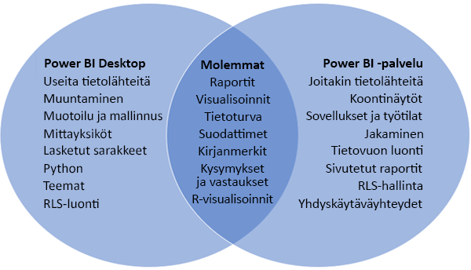

# Power BI Desktopin ja Power BI -palvelun vertailu

Power BI Desktopin ja Power BI -palvelun Venn-vertailukaaviossa keskellä oleva alue näyttää, miten nämä kaksi palvelua limittyvät. Voit tehdä joitakin tehtäviä joko Power BI Desktopissa tai palvelussa. Venn-kaavion kummallakin puolella olevalla sovelluksella ja palvelulla on kuitenkin omat ainutlaatuiset ominaisuutensa.  

**Power BI Desktop** on kattava tietoanalyysien ja raporttien luontityökalu. Kun asennat ilmaisen sovelluksen paikalliseen tietokoneeseen, voit muodostaa yhteyden moniin eri tietolähteisiin ja yhdistää ne (kutsutaan usein mallintamiseksi) tietomalliin. [Power BI Desktopin aloitusopas](desktop-getting-started.md) ohjaa sinut prosessin läpi.

**Power BI -palvelu** on pilvipohjainen verkkopalvelu kevyeen raportin muokkaukseen ja yhteistyöhön työryhmille ja yrityksille. Voit muodostaa yhteyden tietolähteisiin myös Power BI -palvelussa, mutta mallintamista on rajoitettu. 

Useimmat raportin suunnittelijat, jotka työskentelevät yritystietoprojekteissa, käyttävät **Power BI Desktopia** raporttien luomiseen ja sitten **Power BI -palvelua** raporttien jakamiseen muiden kanssa.

## Raportin muokkaaminen

Voit sekä sovelluksessa että palvelussa luoda ja muokata *raportteja*. Raportissa voi olla yksi sivu tai useita sivuja, joissa on visualisointeja ja visualisointikokoelmia. Voit lisätä kirjanmerkkejä, painikkeita, suodattimia ja porautumista siirtymisen helpottamiseksi raporteissa.

Power BI Desktopin ja palvelun raporttieditorit ovat samankaltaisia. Ne koostuvat kolmesta osasta:  

1. Yläosan siirtymispalkit ovat erilaiset Power BI Desktopissa ja palvelussa    
2. Raportin piirtoalusta     
3. **Kentät**-, **Visualisoinnit**- ja **Suodattimet**-ruudut

Tässä videossa näytetään Power BI Desktopin raporttieditori. 

<iframe width="560" height="315" src="https://www.youtube.com/embed/IkJda4O7oGs" frameborder="0" allowfullscreen></iframe>

## Yhteistyö Power BI -palvelussa

Kun olet luonut raportit, voit tallentaa ne *työtilaan*  **Power BI -palvelussa**, jossa sinä ja työtoverisi teette yhteistyötä. Voit luoda *koontinäyttöjä* näiden raporttien päälle. Voit sitten jakaa kyseiset koontinäytöt ja raportit raporttien käyttäjille organisaation sisä- ja ulkopuolella. Raportin käyttäjät voivat tarkastella niitä Power BI -palvelun [lukunäkymässä](consumer/end-user-reading-view.md), ei muokkausnäkymässä. He eivät voi käyttää kaikkia ominaisuuksia, jotka ovat saatavilla raportin luojille. 

## Seuraavat vaiheet

[Mikä on Power BI Desktop?](desktop-what-is-desktop.md)

[Raportin luominen](service-report-create-new.md) Power BI -palvelussa

[Peruskäsitteet raportin suunnittelijoille](service-basic-concepts.md)

Onko sinulla kysyttävää? [Kokeile Power BI -yhteisöä](http://community.powerbi.com/)

