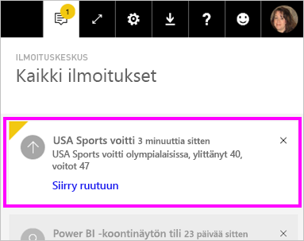

# Tietoilmoitukset Power BI -palvelussa

Aseta ilmoituksia ilmoittamaan sinulle, kun koontinäyttösi tiedot muuttuvat asettamiesi rajojen ulkopuolelle.

Voit asettaa hälytyksiä ruutuihin omassa työtilassasi. Voit myös määrittää ilmoituksia, jos joku jakaa koontinäytön, joka on [Premium-kapasiteetissa](service-premium-what-is.md). Jos sinulla on Power BI:n Pro-käyttöoikeus, voit määrittää ilmoituksia ruuduille myös missä tahansa muussa työtilassa. Ilmoitukset voidaan määrittää vain ruuduille, jotka on kiinnitetty raportin visualisoinneista, ja vain mittareissa, suorituskykyilmaisimissa ja korteissa. Ilmoituksia voidaan määrittää visualisoinneille, jotka on tehty virtautettavista tietojoukoista, jotka kiinnitetään raportista koontinäyttöön. Ilmoituksia ei voi määrittää virtautettaville ruuduille, jotka on tehty suoraan koontinäytössä valitsemalla **Lisää-ruutu** > **Mukautetut virtautettavat tiedot**.

Vain sinä näet asettamasi hälytykset, vaikka jakaisit koontinäyttösi. Edes koontinäytön omistaja ei näe ilmoituksia, jotka määritit koontinäytön näkymälle. Tietoilmoitukset synkronoidaan täysin kaikissa ympäristöissä. Määritä ja tarkastele tietoilmoituksia [Power BI -mobiilisovelluksissa](consumer/mobile/mobile-set-data-alerts-in-the-mobile-apps.md) ja Power BI -palvelussa. Ne eivät ole käytettävissä Power BI Desktopissa. Voit myös automatisoida ja integroida ilmoituksia Power Automatella. Voit kokeilla tätä itse tässä [Power Automate ja Power BI](service-flow-integration.md) -artikkelissa.

> [!WARNING]
> Aineistoperäiset ilmoitukset antavat tietoja lähdetiedoistasi. Jos tarkastelet Power BI -tietojasi mobiililaitteella ja laite katoaa tai varastetaan, suosittelemme kaikkien tietopohjaisten ilmoitusten poistamista käytöstä Power BI -palvelulla.

## Power BI -palvelun tietoilmoitusten määrittäminen

Katsele, kuinka Amanda lisää joitakin ilmoituksia koontinäytön ruutuihin. Kokeile sitten itse noudattamalla videon alapuolella olevia vaiheittaisia ohjeita.

<iframe width="560" height="315" src="https://www.youtube.com/embed/JbL2-HJ8clE" frameborder="0" allowfullscreen></iframe>

Tässä esimerkissä käytetään jälleenmyyntianalyysimallin koontinäytön korttiruutua. [Hanki jälleenmyyntianalyysimallin raportti](sample-retail-analysis.md#get-the-content-pack-for-this-sample), jos haluat seurata mukana.

1. Aloita koontinäytöstä. Valitse kolme pistettä **Myymälöitä yhteensä** -ruudussa.

   

1. Lisää ainakin yksi ilmoitus **Myymälöitä yhteensä** -ruudulle valitsemalla kellokuvake .

1. Aloita valitsemalla **+ Lisää ilmoitussääntö**, varmista, että **Aktiivinen**-liukusäädin on asennossa **Käytössä**, ja anna ilmoitukselle nimi. Nimet helpottavat ilmoitusten tunnistamista.

   

1. Vieritä alas ja anna hälytyksen tiedot.  Tässä esimerkissä luodaan ilmoitus, joka ilmoittaa kerran päivässä, jos kauppojen kokonaismäärä ylittää sadan.

   

    Ilmoitukset näkyvät **ilmoituskeskuksessa**. Power BI lähettää myös sähköpostiviestin ilmoituksesta, jos valitset kyseisen valintaruudun.

1. Valitse **Tallenna ja sulje**.

## Ilmoitusten vastaanottaminen

Kun seuratut tiedot saavuttavat jonkin määrittämistäsi raja-arvoista, tapahtuu useita asioita. Power BI tarkistaa ensin, onko edellisen ilmoituksen lähettämisestä yli tunti tai yli 24 tuntia (valitsemasi vaihtoehdon mukaan). Jos tiedot ylittävät raja-arvon, saat ilmoituksen.

Power BI lähettää seuraavaksi ilmoituksen **ilmoituskeskukseen** ja valinnaisesti myös sähköpostiin. Kussakin ilmoituksessa on suora linkki tietoihin. Avaa asiaankuuluva ruutu, jossa voit tutkia, jakaa ja hankkia lisätietoja, valitsemalla linkki.  

* Jos olet määrittänyt ilmoitukset lähettämään sinulle sähköpostia, Saapuneet-kansiossasi näkyy jotain seuraavanlaista.

   

* Power BI lisää viestin **ilmoituskeskukseesi** ja lisää uuden ilmoituksen kuvakkeen kyseiseen ruutuun.

   

* Ilmoituksen tiedot näkyvät **ilmoituskeskuksessa**.

    

   > [!NOTE]
   > Ilmoitukset toimivat vain päivitetyssä tiedoissa. Kun tiedot päivitetään, Power BI tarkistaa, onko tiedoille määritetty ilmoitus. Jos tiedot saavuttavat ilmoituksen raja-arvon, Power BI käynnistää ilmoituksen.

## Ilmoitusten hallinta

Voit hallita ilmoituksia usealla tavalla:

* Koontinäytön ruudusta.

* Power BI:n Asetukset-valikosta.

* Ruudusta [Power BI -mobiilisovelluksissa](consumer/mobile/mobile-set-data-alerts-in-the-mobile-apps.md).

### Koontinäytön ruudusta

1. Jos haluat muuttaa tai poistaa ruudun ilmoituksen, avaa **Hallitse ilmoituksia** -ikkuna uudelleen valitsemalla kellokuvakkeen .

    Power BI näyttää kaikki kyseiselle ruudulle määrittämäsi ilmoitukset.

    

1. Jos haluat muuttaa ilmoitusta, valitse haluamasi ilmoituksen nimen vasemmalla puolella oleva nuoli.

    

1. Poista ilmoitus valitsemalla ilmoituksen nimen oikealla puolella oleva roskakori.

      

### Power BI:n Asetukset-valikosta

1. Valitse Power BI -valikkopalkin rataskuvake ja valitse sitten **Asetukset**.

    .

1. Valitse kohdasta **Asetukset** komento **Ilmoitukset**.

    

1. Täällä voit ottaa hälytyksiä käyttöön ja poistaa niitä käytöstä, avata **Ilmoitusten hallinta** -ikkunan, jos haluat muuttaa tai poistaa hälytyksen.

## Huomioon otettavat seikat ja vianmääritys

* Ilmoituksia ei tueta korttiruuduissa, joissa on päivämäärä/aika-mittareita.
* Hälytykset toimivat vain numeerisissa tietotyypeissä.
* Ilmoitukset toimivat vain päivitetyssä tiedoissa. Ne eivät toimi staattisissa tiedoissa.
* Ilmoitukset toimivat virtautettavissa tietojoukoissa vain, jos luot suorituskykyilmaisimen, kortin tai mittarin raportin visualisoinnin ja kiinnität kyseisen visualisoinnin koontinäyttöön.

## Seuraavat vaiheet

* [Luo Power Automate, joka sisältää tietoilmoituksen](service-flow-integration.md).

* [Määritä tietoilmoitukset mobiililaitteellasi](consumer/mobile/mobile-set-data-alerts-in-the-mobile-apps.md).

* [Mikä on Power BI?](fundamentals/power-bi-overview.md)

Onko sinulla kysyttävää? [Voit esittää kysymyksiä Power BI -yhteisössä](https://community.powerbi.com/)
