# Power BI -koontinäyttöjen ja -raporttien jakaminen työtovereiden ja muiden kanssa
*Jakaminen* on kätevä keino myöntää parille henkilölle käyttöoikeus luomiisi koontinäyttöihin ja raportteihin. Power BI tarjoaa myös [useita muita tapoja tehdä yhteistyötä ja jakaa koontinäyttöjä ja raportteja](service-how-to-collaborate-distribute-dashboards-reports.md).

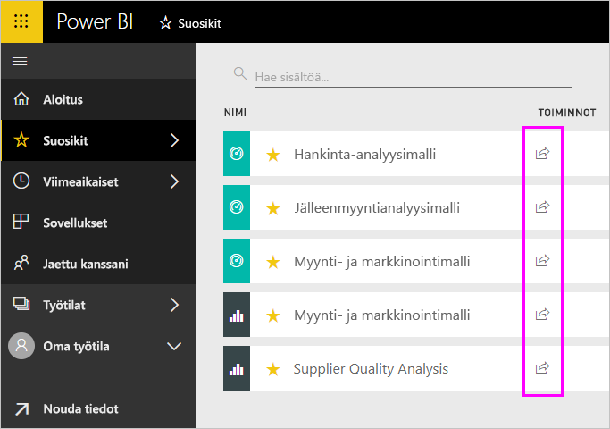

Kun jaat sisältöä organisaatiosi sisä- tai ulkopuolella, tarvitset jakamiseen [Power BI Pro -käyttöoikeuden](service-features-license-type.md). Vastaanottajasi tarvitsevat myös Power BI Pro -käyttöoikeudet tai sisällön on oltava [Premium-tasoista](service-premium.md). 

Voit jakaa koontinäyttöjä ja raportteja Power BI -palvelun useimmista paikoista: Suosikit, Viimeisimmät, Jaettu kanssani (jos omistaja sallii sen), Oma työtila tai muut työtilat. Kun jaat koontinäytön tai raportin, niiden vastaanottajat voivat tarkastella ja käsitellä niitä, mutta eivät voi muokata niitä. He näkevät samat tiedot kuin sinä koontinäytössä tai raportissa, ellei sovelleta [rivitason suojausta (RLS)](service-admin-rls.md). Työtoverit, joille tiedot jaat, voivat myös jakaa niitä omien työtovereidensa kanssa, jos sallit sen. Organisaatiosi ulkopuoliset henkilöt voivat myös tarkastella ja käsitellä koontinäyttöä tai raporttia, mutta eivät voi jakaa sitä. 

Voit myös [jakaa koontinäytön mistä tahansa Power BI -mobiilisovelluksesta](consumer/mobile/mobile-share-dashboard-from-the-mobile-apps.md). Voit jakaa koontinäyttöjä Power BI -palvelusta ja Power BI -mobiilisovelluksista, mutta et voi jakaa niitä Power BI Desktopista.

## Video: Jaa koontinäyttö
Katso, miten Amanda jakaa koontinäyttönsä työtovereiden kanssa yrityksensä sisä- ja ulkopuolella. Kokeile sitä itse noudattamalla videon alapuolella olevia vaiheittaisia ohjeita.

<iframe width="560" height="315" src="https://www.youtube.com/embed/0tUwn8DHo3s?list=PL1N57mwBHtN0JFoKSR0n-tBkUJHeMP2cP" frameborder="0" allowfullscreen></iframe>

## Koontinäytön tai raportin jakaminen

1. Valitse koontinäyttöjen tai raporttien luettelossa tai avatussa koontinäytössä tai raportissa **Jaa** .

1. Kirjoita yläreunan ruutuun henkilöiden, jakeluryhmien tai käyttöoikeusryhmien koko sähköpostiosoitteet. Et voi jakaa sisältöä dynaamisten jakeluluetteloiden kanssa. 
   
   Voit jakaa sisältöä organisaatiosi ulkopuolisten henkilöiden kanssa, mutta näyttöön tulee varoitus.
   
   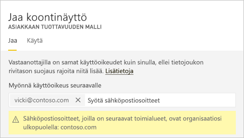 
 
3. Voit lisätä halutessasi viestin, mutta se on valinnaista.
4. Jotta työtoverisi voivat jakaa sisältöäsi muiden kanssa, valitse **Salli vastaanottajien jakaa koontinäyttösi/raporttisi**.
   
   Kun sallit muiden jakaa sisältöäsi, tätä kutsutaan *uudelleenjakamiseksi*. Jos sallit sen, he voivat jakaa sisältöäsi uudelleen Power BI -palvelusta ja -mobiilisovelluksista tai välittää sähköpostikutsun organisaation muille käyttäjille. Kutsu vanhenee kuukauden kuluttua. Organisaatiosi ulkopuoliset henkilöt eivät voi jakaa sisältöä uudelleen. Voit sisällön omistajana poistaa uudelleenjakamisen käytöstä tai palauttaa uudelleenjakamisen yksilökohtaisesti. Katso alla olevaa artikkelia [Jakamisen lopettaminen tai muiden jakamisen estäminen](service-share-dashboards.md#stop-sharing-or-stop-others-from-sharing).

5. Valitse **Jaa**.
   
   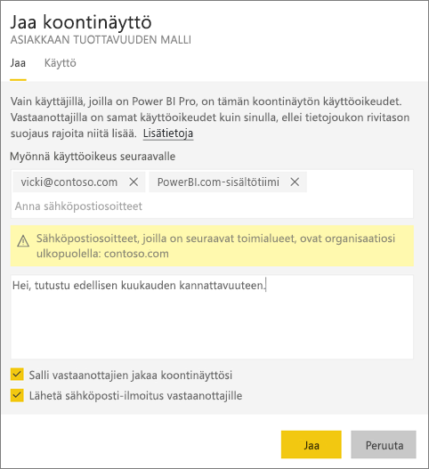  
   
   Power BI lähettää sähköpostikutsun henkilöille, mutta ei ryhmien, yhdessä linkin kanssa jaettuun sisältöön. Näet **Onnistui**-ilmoituksen. 
   
   Kun organisaatiossasi olevat vastaanottajat napsauttavat linkkiä, Power BI lisää koontinäytön tai raportin vastaanottajien **Jaettu kanssani** -luettelosivulle. He voivat valita nimesi, jotta he näkevät kaiken sisällön, jonka olet jakanut heidän kanssaan. 
   
   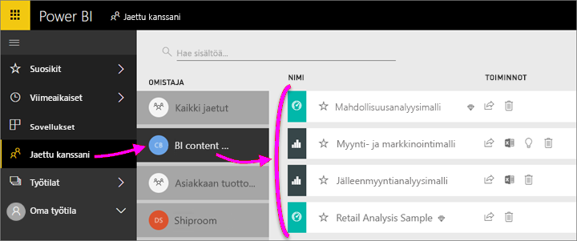
   
   Kun organisaatiosi ulkopuoliset vastaanottajat napsauttavat linkkiä, he näkevät koontinäytön tai raportin, mutta eivät tavallista Power BI -portaalia. Katso lisätietoja alla olevasta artikkelista [Jakaminen organisaatiosi ulkopuolisten henkilöiden kanssa](service-share-dashboards.md#share-a-dashboard-with-people-outside-your-organization).

## Kenellä on oikeus käyttää jakamaasi koontinäyttöä tai raporttia?
Toisinaan sinun on nähtävä henkilöt, joiden kanssa olet jakanut sisältöä, sekä se, kenen kanssa he ovat jakaneet sisältöä.

1. Valitse koontinäyttöjen ja raporttien luettelosta tai itse koontinäytöstä tai raportista **Jaa** . 
2. Valitse **Jaa koontinäyttö/raportti** -valintaikkunasta **Käytä**.
   
    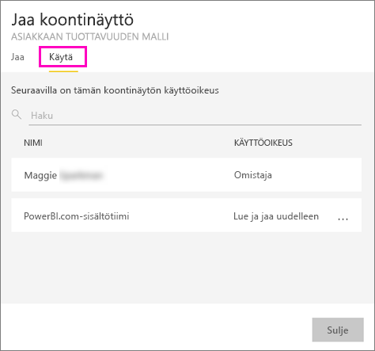
   
    Organisaatiosi ulkopuoliset henkilöt on lueteltu **vieraana**.

## Jakamisen lopettaminen tai muiden jakamisen estäminen
Vain koontinäytön tai raportin omistaja voi ottaa uudelleenjakamisen käyttöön ja poistaa sen käytöstä.

### Jos et ole lähettänyt vielä jakamiskutsua
* Tyhjennä **Salli vastaanottajien jakaa koontinäyttösi/raporttisi** -valintaruutu kutsun alareunasta ennen sen lähettämistä.

### Jos olet jo jakanut koontinäytön tai raportin
1. Valitse koontinäyttöjen ja raporttien luettelosta tai itse koontinäytöstä tai raportista **Jaa** . 
2. Valitse **Jaa koontinäyttö/raportti** -valintaikkunasta **Käytä**.
   
    
3. Valitse kolme pistettä (**...** ) kohdan **Lue ja jaa uudelleen** vierestä ja valitse:
   
   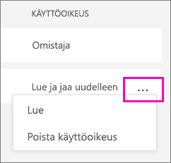
   
   * **Lue**, jotta tämä henkilö ei voi jakaa sisältöä kenenkään muun kanssa.
   * **Poista käyttöoikeus** estää tätä henkilöä näkemästä jaettua sisältöä ollenkaan.

4. Voit **Poista käyttöoikeus** -valintaikkunassa päättää, haluatko poistaa käyttöoikeuden myös liittyvään sisältöön, kuten raportteihin ja tietojoukkoihin. Jos poistat kohteet, joissa on , sinun kannattaa poistaa liittyvä sisältö, koska se ei näy oikein.

    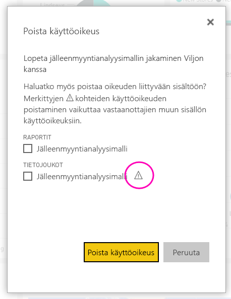

## Koontinäytön tai raportin jakaminen organisaatiosi ulkopuolisten henkilöiden kanssa
Kun jaat sisältöä organisaatiosi ulkopuolisten henkilöiden kanssa, he saavat sähköpostiviestin ja linkin jaettuun koontinäyttöön tai raporttiin. Jos he haluavat tarkastella tätä sisältöä, heidän on kirjauduttava sisään Power BI -palveluun. Jos heillä ei ole Power BI Pro -käyttöoikeutta, he voivat rekisteröityä käyttöoikeuden saamiseksi napsautettuaan linkkiä.

Kun he ovat kirjautuneet sisään, he näkevät jaetun koontinäytön tai raportin sen omassa selainikkunassa ilman vasenta siirtymisruutua, eivät tavanomaisessa Power BI -portaalissaan. Heidän on luotava kirjainmerkki linkille, jotta he voivat käyttää tätä raporttinäkymää tai raporttia vastaisuudessa.

He eivät voi muokata mitään tämän koontinäytön tai raportin sisältöä. He voivat käsitellä kaavioita ja muuttaa suodattimia tai osittajia raportissa, mutta he eivät voi tallentaa tekemiään muutoksia.

Vain suorat vastaanottajasi voivat nähdä jaetun koontinäytön tai raportin. Jos lähetit esimerkiksi sähköpostiviestin Vicki@contoso.comlle, vain Vicki voi nähdä koontinäytön. Kukaan muu ei voi nähdä tätä koontinäyttöä, vaikka heillä olisi linkki. Vickin on myös käytettävä samaa sähköpostiosoitetta, jotta hän voi käyttää tätä koontinäyttöä. Jos hän rekisteröityy jollakin muulla sähköpostiosoitteella, hän ei voi myöskään käyttää tätä koontinäyttöä.

Organisaatiosi ulkopuoliset henkilöt eivät näe mitään tietoja, jos rooli - tai rivitason suojausta sovelletaan paikallisiin Analysis Services -taulukkomalleihin.

Jos lähetit linkin Power BI -mobiilisovelluksesta organisaatiosi ulkopuolisille henkilöille, kun he napsauttavat linkkiä, koontinäyttö avautuu selaimessa eikä Power BI -mobiilisovelluksessa.

## Rajoitukset ja huomioon otettavat seikat
Kun jaat koontinäyttöjä ja raportteja, ota huomioon seuraavat seikat:

* Työtoverisi näkevät yleensä samat tiedot kuin sinä koontinäytössä ja raportissa. Näin ollen jos sinulla on käyttöoikeus nähdä enemmän tietoja kuin työtoverisi, he näkevät kaikki tietosi koontinäytössä tai raportissa. Kuitenkin jos [rivitason suojausta (RLS)](service-admin-rls.md) sovelletaan koontinäytön tai raportin pohjana olevaan tietojoukkoon, jokaisen henkilön tunnistetietoja käytetään sen määrittämiseen, mitä tietoja he voivat käyttää.
* Kaikki, joiden kanssa jaat koontinäyttösi, voivat tarkastella sitä ja käsitellä siihen liittyviä raportteja [lukunäkymässä](consumer/end-user-reading-view.md). He eivät voi luoda raportteja tai tallentaa muutoksia aiemmin luotuihin raportteihin.
* Kukaan ei voi tarkastella tai ladata tietojoukkoa, mutta he voivat käyttää tietojoukkoa suoraan Analysoi Excelissä -ominaisuuden avulla. Järjestelmänvalvoja voi rajoittaa käyttäjien kykyä käyttää Analysoi Excelissä -ominaisuutta rajoittamalla kykyä ryhmän kaikkien jäsenten osalta. Rajoitus koskee kuitenkin kaikkia kyseisessä ryhmässä jokaisessa työtilassa, johon ryhmä kuuluu.
* Kaikki voivat manuaalisesti [päivittää tietoja](refresh-data.md).
* Jos käytät Office 365:n sähköpostia, voit jakaa tietoja jakeluryhmän jäsenten kanssa antamalla jakeluryhmään liittyvän sähköpostiosoitteen.
* Työtoverit, joilla on sama sähköpostin toimialue kuin sinulla, ja työtoverit, joiden toimialue on erilainen, mutta joka on rekisteröity samassa vuokraajassa, voivat jakaa koontinäytön muiden kanssa. Oletetaan esimerkiksi, että toimialueet contoso.com ja contoso2.com on rekisteröity samassa vuokraajassa. Jos sähköpostiosoitteesi on konrads@contoso.com, sekä ravali@contoso.com että gustav@contoso2.com voivat jakaa, jos olet antanut heille oikeuden jakamiseen.
* Jos työtovereillasi on jo käyttöoikeus tiettyyn koontinäyttöön tai raporttiin, voit lähettää suoran linkin kopioimalla URL-osoitteen, kun olet koontinäytössä tai raportissa. Esimerkiksi: `https://powerbi.com/dashboards/g12466b5-a452-4e55-8634-xxxxxxxxxxxx`
* Samoin jos työtovereillasi on jo käyttöoikeus tiettyyn koontinäyttöön, voit [lähettää suoran linkin pohjana olevaan raporttiin](service-share-reports.md). 

## Jakamisen vianmääritys

### Koontinäyttöni vastaanottajat näkevät lukkokuvakkeen ruudussa tai ”Käyttöoikeus pakollinen” -viestin

Henkilöt, joiden kanssa jaat tietoja, saattavat nähdä lukitun ruudun koontinäytössä tai ”Käyttöoikeus pakollinen” -viestin, kun he yrittävät tarkastella raporttia.

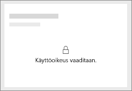

Jos ruutu on lukittu, sinun on myönnettävä käyttöoikeus pohjana olevaan tietojoukkoon. Toimi seuraavasti:

1. Siirry sisältöluettelossa **Tietojoukot**-välilehteen.

1. Valitse kolme pistettä (**...** ) tietojoukon vieressä > **Käyttöoikeuksien hallinta**.

    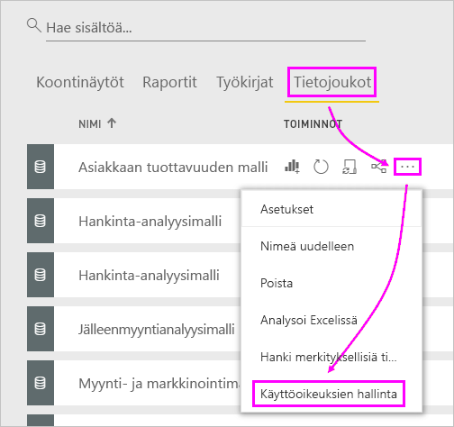

3. Valitse **Lisää käyttäjä**.

    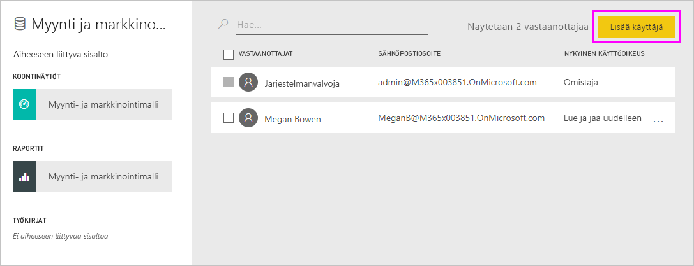

1. Kirjoita henkilöiden, jakeluryhmien tai käyttöoikeusryhmien koko sähköpostiosoitteet. Et voi jakaa sisältöä dynaamisten jakeluluetteloiden kanssa.

    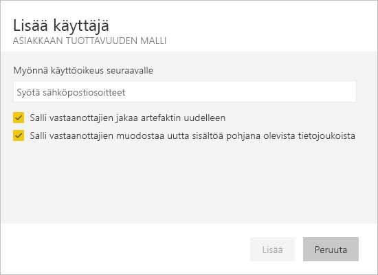

5. Valitse **Lisää**.

### En voi jakaa koontinäyttöä tai raporttia

Jotta voit jakaa koontinäytön tai raportin, tarvitset käyttöoikeuden jakaa uudelleen pohjana olevaa sisältöä eli kaikkia siihen liittyviä raportteja ja tietojoukkoja. Jos näyttöön tulee viesti, jonka mukaan et voi jakaa tietoja, pyydä raportin laatijaa myöntämään sinulle käyttöoikeus näihin raportteihin ja tietojoukkoihin.

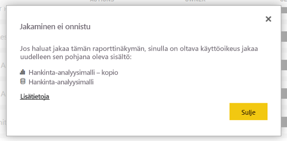

## Seuraavat vaiheet
* Haluatko antaa palautetta? Anna ehdotuksia siirtymällä [Power BI -yhteisön sivustolle](https://community.powerbi.com/).
* [Miten voin työstää koontinäyttöjä ja raportteja yhdessä muiden kanssa sekä jakaa niitä?](service-how-to-collaborate-distribute-dashboards-reports.md)
* [Suodatetun Power BI -raportin jakaminen](service-share-reports.md)
* Onko sinulla kysymyksiä? [Kokeile Power BI -yhteisöä](http://community.powerbi.com/).

