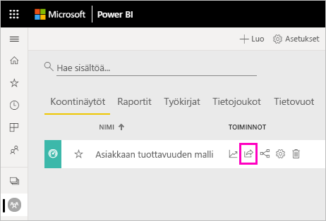
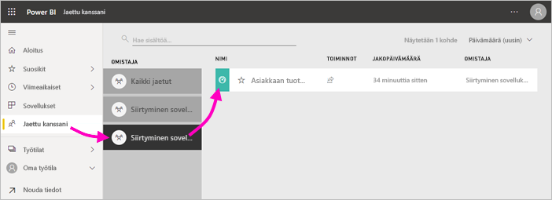

# Power BI -koontinäyttöjen ja -raporttien jakaminen työtovereiden ja muiden kanssa
*Jakaminen* on kätevä keino myöntää parille henkilölle käyttöoikeus luomiisi koontinäyttöihin ja raportteihin. Power BI tarjoaa myös [useita muita tapoja tehdä yhteistyötä ja jakaa koontinäyttöjä ja raportteja](service-how-to-collaborate-distribute-dashboards-reports.md).

Kun jaat sisältöä organisaatiosi sisä- tai ulkopuolella, tarvitset jakamiseen [Power BI Pro -käyttöoikeuden](service-features-license-type.md). Vastaanottajasi tarvitsevat myös Power BI Pro -käyttöoikeudet, ellei sisältö ole [Premium-tasoista](service-premium-what-is.md). 

Voit jakaa koontinäyttöjä ja raportteja useimmista paikoista Power BI -palvelussa: Suosikit, Viimeaikaiset, Oma työtila ja Jaettu kanssani, jos omistaja sallii sen. Voit myös kertoa muista työtiloista, jos sinulla on työtilassa [Järjestelmänvalvoja-, Jäsen- tai Osallistuja-rooli](service-new-workspaces.md#roles-in-the-new-workspaces). 

Kun jaat koontinäytön tai raportin, vastaanottajat voivat tarkastella ja käsitellä sitä, mutta eivät voi muokata sitä. He näkevät samat tiedot kuin sinä koontinäytössä tai raportissa, ellei sovelleta [rivitason suojausta (RLS)](service-admin-rls.md). Työtoverit, joille tiedot jaat, voivat myös jakaa niitä omien työtovereidensa kanssa, jos sallit sen. Organisaatiosi ulkopuoliset henkilöt voivat tarkastella ja käsitellä koontinäyttöä tai raporttia, mutta he eivät voi jakaa sitä. 

Koontinäyttöjä ei voi *jakaa* suoraan Power BI Desktopista. Voit [julkaista raportteja Power BI Desktopista](desktop-upload-desktop-files.md) Power BI -palveluun. Voit kuitenkin [jakaa koontinäytön Power BI -mobiilisovelluksista](consumer/mobile/mobile-share-dashboard-from-the-mobile-apps.md).  

## Video: Jaa koontinäyttö
Katso, miten Amanda jakaa koontinäyttönsä työtovereiden kanssa yrityksensä sisä- ja ulkopuolella. Kokeile sitten itse noudattamalla videon alapuolella olevia vaiheittaisia ohjeita.

<iframe width="560" height="315" src="https://www.youtube.com/embed/0tUwn8DHo3s?list=PL1N57mwBHtN0JFoKSR0n-tBkUJHeMP2cP" frameborder="0" allowfullscreen></iframe>

## Koontinäytön tai raportin jakaminen

1. Valitse koontinäyttöjen tai raporttien luettelossa tai avatussa koontinäytössä tai raportissa **Jaa** .

2. Kirjoita yläreunan ruutuun henkilöiden, jakeluryhmien tai käyttöoikeusryhmien koko sähköpostiosoitteet. Et voi jakaa sisältöä dynaamisten jakeluluetteloiden kanssa. 
   
   Voit jakaa sisältöä organisaatiosi ulkopuolisten henkilöiden kanssa, mutta näyttöön tulee varoitus. Lue lisätietoja [sisällön jakamisesta organisaatiosi ulkopuolelle](#share-a-dashboard-or-report-outside-your-organization).
   
    
 
   >[!NOTE]
   >Syöteruutu tukee enintään 100:aa erillistä käyttäjää tai ryhmää. Tämän artikkelin kohdassa [Jakaminen yli 100 käyttäjän kanssa](#share-with-more-than-100-separate-users) on lisätietoja siitä, miten voit jakaa useammille käyttäjille.

3. Voit lisätä halutessasi viestin, mutta se on valinnaista.
4. Jotta työtoverisi voivat jakaa sisältöäsi muiden kanssa, valitse **Salli vastaanottajien jakaa koontinäyttösi (tai raporttisi)** .
   
   Kun sallit muiden jakaa sisältöäsi, tätä kutsutaan *uudelleenjakamiseksi*. Jos sallit sen, he voivat jakaa sisältöäsi uudelleen Power BI -palvelusta ja -mobiilisovelluksista tai välittää sähköpostikutsun organisaation muille käyttäjille. Kutsu vanhenee kuukauden kuluttua. Organisaatiosi ulkopuoliset henkilöt eivät voi jakaa sisältöä uudelleen. Voit sisällön omistajana poistaa uudelleenjakamisen käytöstä tai palauttaa uudelleenjakamisen yksilökohtaisesti. Katso tämän artikkelin kohtaa [Jakamisen lopettaminen tai muuttaminen](#stop-or-change-sharing).

5. Jos valitset **Salli käyttäjien muodostaa uutta sisältöä käyttäen pohjana olevia tietojoukkoja** -vaihtoehdon, käyttäjät voivat luoda omia raporttejaan muissa työtiloissa tämän koontinäytön tietojoukon pohjalta. Lue lisätietoja [eri työtilojen tietojoukkoihin perustuvien raporttien luomisesta](service-datasets-discover-across-workspaces.md).

1. Valitse **Jaa**.
   
     
   
   Power BI lähettää sähköpostikutsun henkilöille, mutta ei ryhmien, yhdessä linkin kanssa jaettuun sisältöön. Näet **Onnistui**-ilmoituksen. 
   
   Kun organisaatiossasi olevat vastaanottajat napsauttavat linkkiä, Power BI lisää koontinäytön tai raportin vastaanottajien **Jaettu kanssani** -luettelosivulle. He voivat valita nimesi, jotta he näkevät kaiken sisällön, jonka olet jakanut heidän kanssaan. 
   
   
   
   Kun organisaatiosi ulkopuoliset vastaanottajat napsauttavat linkkiä, he näkevät koontinäytön tai raportin, mutta eivät tavallista Power BI -portaalia. Lue lisätietoja [sisällön jakamisesta organisaatiosi ulkopuolisille käyttäjille](#share-a-dashboard-or-report-outside-your-organization).

## Katso, kenellä on oikeus käyttää koontinäyttöä tai raporttia
Toisinaan sinun on nähtävä henkilöt, joiden kanssa olet jakanut sisältöä, sekä se, kenen kanssa he ovat jakaneet sisältöä.

1. Valitse koontinäyttöjen ja raporttien luettelosta tai itse koontinäytöstä tai raportista **Jaa** . 
2. Valitse **Jaa koontinäyttö** tai **Jaa raportti** -valintaikkunassa **Käytä**.
   
    

    Organisaatiosi ulkopuoliset henkilöt on lueteltu **vieraana**.

    Tässä näkymässä voit [lopettaa jakamisen tai muuttaa jakamisoikeuksia](#stop-or-change-sharing) tässä artikkelissa. 

## Koontinäytön tai raportin jakaminen organisaatiosi ulkopuolisten henkilöiden kanssa
Kun jaat sisältöä organisaatiosi ulkopuolisten henkilöiden kanssa, he saavat sähköpostiviestin ja linkin jaettuun koontinäyttöön tai raporttiin. Jos he haluavat tarkastella jakamaasi sisältöä, heidän on kirjauduttava sisään Power BI -palveluun. Jos heillä ei ole Power BI Pro -käyttöoikeutta, he voivat napsauttaa linkkiä ja rekisteröityä käyttöoikeuden saamiseksi.

Kun he ovat kirjautuneet sisään, he näkevät jaetun koontinäytön tai raportin sen omassa selainikkunassa, eivät tavanomaisessa Power BI -portaalissa. Jos he haluavat käyttää tätä koontinäyttöä tai raporttia, heidän on lisättävä linkki kirjanmerkkeihin.

He eivät voi muokata mitään tämän koontinäytön tai raportin sisältöä. He voivat käsitellä kaavioita ja muuttaa suodattimia tai osittajia, mutta he eivät voi tallentaa tekemiään muutoksia. 

Vain suorat vastaanottajasi näkevät jaetun koontinäytön tai raportin. Jos lähetit esimerkiksi sähköpostiviestin Vicki@contoso.comlle, vain Vicki näkee koontinäytön. Kukaan muu ei voi tarkastella koontinäyttöä, vaikka Vicki välittäisi linkin jollekulle. Vickin on käytettävä sitä samalla sähköpostiosoitteella. Jos Vicki rekisteröityy käyttäen jotakin toista sähköpostiosoitetta, hänellä ei ole käyttöoikeutta koontinäyttöön.

Organisaatiosi ulkopuoliset henkilöt eivät näe mitään tietoja, jos rooli- tai rivitason suojausta sovelletaan paikallisiin Analysis Services -taulukkomalleihin.

Jos lähetit linkin Power BI -mobiilisovelluksesta organisaatiosi ulkopuolisille henkilöille, linkkiä napsauttamalla koontinäyttö avautuu selaimessa eikä Power BI -mobiilisovelluksessa.

### Sisällön muokkauksen salliminen ulkoisille käyttäjille

Power BI -järjestelmänvalvoja voi sallia, että ulkoiset vieraskäyttäjät voivat muokata ja hallita sisältöä organisaatiossa. Tällöin ulkoisilla käyttäjillä ei ole yllä kuvattua kokemusta, jossa he voivat vain kuluttaa. He voivat muokata ja hallita sisältöä organisaatiossasi. Lue lisätietoja [Power BI -sisällön jakamisesta ulkoisille vieraskäyttäjille Azure AD B2B:n avulla](service-admin-azure-ad-b2b.md).

## Jakamisen lopettaminen tai muuttaminen
Vain koontinäytön tai raportin omistaja voi ottaa uudelleenjakamisen käyttöön ja poistaa sen käytöstä.

### Jos et ole lähettänyt vielä jakamiskutsua
* Tyhjennä **Salli vastaanottajien jakaa koontinäyttösi (tai raporttisi)** -valintaruutu kutsun alareunasta ennen sen lähettämistä.

### Jos olet jo jakanut koontinäytön tai raportin
1. Valitse koontinäyttöjen ja raporttien luettelosta tai itse koontinäytöstä tai raportista **Jaa** . 
2. Valitse **Jaa koontinäyttö** tai **Jaa raportti** -valintaikkunassa **Käytä**.
   
    
3. Valitse kolme pistettä ( **...** ) kohdan **Lue ja jaa uudelleen** vierestä ja valitse:
   
   
   
   * **Lue**, jotta tämä henkilö ei voi jakaa sisältöä kenenkään muun kanssa.
   * **Poista käyttöoikeus** estää tätä henkilöä näkemästä jaettua sisältöä ollenkaan.

4. Voit **Poista käyttöoikeus** -valintaikkunassa päättää, haluatko poistaa käyttöoikeuden myös liittyvään sisältöön, kuten raportteihin ja tietojoukkoihin. Jos poistat kohteet, joissa on , sinun kannattaa poistaa myös liittyvä sisältö. Muussa tapauksessa se ei näy oikein.

    

## Rajoitukset ja huomioitavat asiat
Kun jaat koontinäyttöjä ja raportteja, ota huomioon seuraavat seikat:

* Työtoverisi näkevät yleensä samat tiedot kuin sinä koontinäytössä ja raportissa. Näin ollen jos sinulla on käyttöoikeus nähdä enemmän tietoja kuin työtoverisi, he näkevät kaikki tietosi koontinäytössä tai raportissa. Jos [rivitason suojausta (RLS)](service-admin-rls.md) kuitenkin sovelletaan koontinäytön tai raportin pohjana olevaan tietojoukkoon, kunkin henkilön tunnistetietojen perusteella määritetään, mitä tietoja kukin voi käyttää.
* Kaikki, joiden kanssa jaat koontinäyttösi, voivat tarkastella sitä ja käsitellä siihen liittyviä raportteja [lukunäkymässä](consumer/end-user-reading-view.md#reading-view). Yleensä he eivät voi luoda raportteja tai tallentaa muutoksia aiemmin luotuihin raportteihin. Jos kuitenkin valitset **Salli käyttäjien muodostaa uutta sisältöä käyttäen pohjana olevia tietojoukkoja** -vaihtoehdon, käyttäjät voivat luoda omia raporttejaan muissa työtiloissa tämän koontinäytön tietojoukon tai raportin pohjalta.
* Vaikka kukaan ei voi tarkastella tai ladata tietojoukkoa, he voivat käyttää tietojoukkoa suoraan Analysoi Excelissä -ominaisuuden avulla. Järjestelmänvalvoja voi rajoittaa käyttäjien kykyä käyttää Analysoi Excelissä -ominaisuutta ryhmän kaikkien jäsenten osalta. Rajoitus koskee kuitenkin kaikkia kyseisessä ryhmässä ja jokaisessa työtilassa, johon ryhmä kuuluu.
* Kaikki voivat manuaalisesti [päivittää tietoja](refresh-data.md).
* Jos käytät Office 365:n sähköpostia, voit jakaa tietoja jakeluryhmän jäsenten kanssa antamalla jakeluryhmään liittyvän sähköpostiosoitteen.
* Työtoverit, joilla on sama sähköpostin toimialue kuin sinulla, ja työtoverit, joiden toimialue on erilainen, mutta joka on rekisteröity samassa vuokraajassa, voivat jakaa koontinäytön muiden kanssa. Oletetaan esimerkiksi, että toimialueet contoso.com ja contoso2.com on rekisteröity samassa vuokraajassa ja sähköpostiosoitteesi on konrads@contoso.com. Sekä ravali@contoso.com että gustav@contoso2.com voivat jakaa koontinäyttösi, kunhan annat heille jakamisoikeuden.
* Jos työtovereillasi on jo käyttöoikeus tiettyyn koontinäyttöön tai raporttiin, voit lähettää suoran linkin kopioimalla URL-osoitteen, kun olet koontinäytössä tai raportissa. Esimerkki: `https://powerbi.com/dashboards/g12466b5-a452-4e55-8634-xxxxxxxxxxxx`.
* Samoin jos työtovereillasi on jo käyttöoikeus tiettyyn koontinäyttöön, voit [lähettää suoran linkin pohjana olevaan raporttiin](service-share-reports.md). 

### Jakaminen yli 100 erillisen käyttäjän kanssa

Yhdellä jakamistoiminnolla voit jakaa enintään 100 käyttäjälle tai ryhmälle. Voit kuitenkin antaa yli 500 käyttäjälle kohteen käyttöoikeuden. Tässä on joitain ehdotuksia:

- Jaa useita kertoja määrittämällä käyttäjät yksitellen.
- Jaa käyttäjäryhmälle, joka sisältää kaikki käyttäjät. 
- Luo raportti tai koontinäyttö työtilassa ja luo sitten sovellus työtilassa. Voit jakaa sovelluksen paljon useammalle käyttäjälle. Lue lisää [sovellusten julkaisemisesta Power BI:ssä](service-create-distribute-apps.md).

## Jakamisen vianmääritys

### Koontinäyttöni vastaanottajat näkevät lukkokuvakkeen ruudussa tai ”Käyttöoikeus pakollinen” -viestin

Henkilöt, joiden kanssa jaat tietoja, saattavat nähdä lukitun ruudun koontinäytössä tai ”Käyttöoikeus pakollinen” -viestin, kun he yrittävät tarkastella raporttia.

Jos ruutu on lukittu, sinun on myönnettävä käyttöoikeus pohjana olevaan tietojoukkoon.

1. Siirry sisältöluettelossa **Tietojoukot**-välilehteen.

1. Valitse kolme pistettä ( **...** ) tietojoukon vieressä ja valitse sitten **Käyttöoikeuksien hallinta**.

    

1. Valitse **Lisää käyttäjä**.

    

1. Kirjoita henkilöiden, jakeluryhmien tai käyttöoikeusryhmien koko sähköpostiosoitteet. Et voi jakaa sisältöä dynaamisten jakeluluetteloiden kanssa.

    

1. Valitse **Lisää**.

### En voi jakaa koontinäyttöä tai raporttia

Jotta voit jakaa koontinäytön tai raportin, tarvitset käyttöoikeuden jakaa uudelleen pohjana olevaa sisältöä eli kaikkia siihen liittyviä raportteja ja tietojoukkoja. Jos näyttöön tulee viesti, jonka mukaan et voi jakaa tietoja, pyydä raportin laatijaa myöntämään sinulle käyttöoikeus näihin raportteihin ja tietojoukkoihin.

## Seuraavat vaiheet

* [Miten voin työstää koontinäyttöjä ja raportteja yhdessä muiden kanssa sekä jakaa niitä?](service-how-to-collaborate-distribute-dashboards-reports.md)
* [Suodatetun Power BI -raportin jakaminen](service-share-reports.md)
* Onko sinulla kysyttävää? [Kokeile Power BI -yhteisöä](https://community.powerbi.com/)

