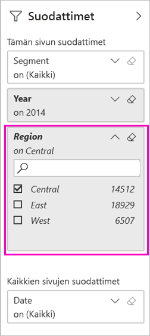

# Power BI -raportin suodattaminen ja jakaminen
*Jakaminen* on kätevä keino myöntää parille henkilölle käyttöoikeus luomiisi koontinäyttöihin ja raportteihin. Mitä tapahtuu, jos haluat jakaa raportista suodatetun version? Haluat kenties, että raportti näyttää vain tietyn kaupungin, myyjän tai vuoden tiedot. Tässä artikkelissa kerrotaan, miten raportti suodatetaan ja miten sen suodatettu versio jaetaan. Toinen tapa jakaa suodatettu raportti on [lisätä kyselyparametreja raportin URL-osoitteeseen](service-url-filters.md). Molemmissa tapauksissa raportti suodatetaan, kun vastaanottajat avaavat sen ensimmäisen kerran. He voivat poistaa suodatinvalinnat raportissa.

Power BI sisältää myös [muita tapoja tehdä yhteistyötä ja jakaa raportteja](service-how-to-collaborate-distribute-dashboards-reports.md). Jakamisessa sinulla ja vastaanottajillasi on oltava myös [Power BI Pro -käyttöoikeudet](service-features-license-type.md) tai sisällön on oltava [Premium-kapasiteetissa](service-premium-what-is.md). 

## Kokeile mallitietojen avulla

Tässä artikkelissa käytetään Markkinointi ja myynti -mallisovellusta. Haluatko kokeilla sitä? 

1. Asenna [Markkinointi ja myynti ‑mallisovellus](https://appsource.microsoft.com/product/power-bi/microsoft-retail-analysis-sample.salesandmarketingsample?tab=Overview).
2. Valitse sovellus ja sitten **Tutustu sovellukseen**.

   

3. Avaa sovelluksen mukana asennettu työtila valitsemalla kynäkuvake.

    

4. Valitse työtilan sisältöluettelosta **Raportit** ja sitten raportin **Myynti- ja markkinointimalli PBIX**.

    

    Nyt olet valmis kokeilemaan.

## Suodattimen asettaminen raportissa

Voit käyttää suodatinta avaamalla raportin [Muokkausnäkymässä](consumer/end-user-reading-view.md).

Tässä esimerkissä suodatamme Markkinointi ja myynti ‑mallisovelluksen vuodenalusta-luokkasivun niin, että siinä näytetään vain ne arvot, joissa **Alue** on **Keski**. 
 

Tallenna raportti.

## Suodatetun raportin jakaminen

1. Valitse **Jaa**.

   

2. Tyhjennä **Lähetä sähköposti-ilmoitus vastaanottajille** -kohta, jotta voit lähettää suodatetun linkin sen sijaan. Valitse **Jaa raportti käyttäen nykyisiä suodattimia ja osittajia** ja sitten **Jaa**.

    

4. Valitse **Jaa** uudelleen.

   

5. Valitse **Käyttö**-välilehti ja sitten **Jaettujen raporttinäkymien hallinta**.

    

6. Napsauta haluamaasi URL-osoitetta hiiren kakkospainikkeella ja valitse **Kopioi linkki**.

    

7. Kun jaat tämän linkin, vastaanottajat näkevät suodatetun raporttisi. 

## Seuraavat vaiheet
* [Töiden jakamistavat Power BI:ssä](service-how-to-collaborate-distribute-dashboards-reports.md)
* [Koontinäytön jakaminen](service-share-dashboards.md)
* Onko sinulla kysyttävää? [Kokeile Power BI -yhteisöä](https://community.powerbi.com/).
* Haluatko antaa palautetta? Anna ehdotuksia siirtymällä [Power BI -yhteisön sivustolle](https://community.powerbi.com/).

