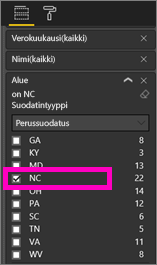
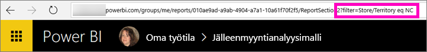
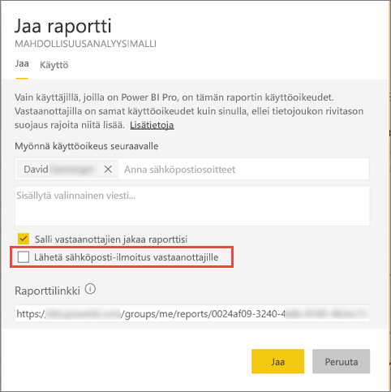

# Power BI-raportin suodattaminen ja jakaminen työtovereiden kanssa
*Jakaminen* on kätevä keino myöntää parille henkilölle käyttöoikeus luomiisi koontinäyttöihin ja raportteihin. Mitä tapahtuu, jos haluat jakaa raportista suodatetun version? Haluat kenties jakaa raportin, joka näyttää vain tietyn kaupungin, myyjän tai vuoden tiedot. Yritä raportin suodattaminen ja jakaminen tai luomalla mukautetun URL-Osoitteen. Raportti suodatetaan, kun vastaanottajat avaavat sen ensimmäisen kerran. He voivat poistaa suodattimen muokkaamalla URL-osoitetta. 

Power BI tarjoaa myös [useita muita tapoja tehdä yhteistyötä ja jakaa raportteja](service-how-to-collaborate-distribute-dashboards-reports.md). Jakamisessa sinulla ja vastaanottajillasi on oltava myös [Power BI Pro -käyttöoikeudet](service-features-license-type.md) tai sisällön on oltava [Premium-kapasiteetissa](service-premium-what-is.md). 

## Voit suodattaa raportin kahdella tavalla

### Määritä suodatin

Avaa raportti [muokkausnäkymässä](consumer/end-user-reading-view.md), käytä suodatinta ja tallenna raportti.
   
Tässä esimerkissä suodatamme [Jälleenmyyntianalyysimallin](sample-tutorial-connect-to-the-samples.md), jotta siinä näkyvät vain arvot, joissa **Alue** on yhtä kuin **NC**.
   

### Luo suodatin URL-osoite

Lisää seuraava teksti raporttisivun URL-osoitteen loppuun:
   
?filter=*tablename*/*fieldname* eq *arvo*
   
Kentän on oltava tyyppi, datetime tai merkkijono. *Tablename*- tai *Fieldname*-arvot eivät voi sisältää välilyöntejä.
   
Tässä esimerkissä taulukon nimi on **Kauppa**, kentän nimi on **Alue** ja suodatettava arvo on **NC**:
   
?filter=Store/Territory eq 'NC'
   

   
Selain lisää erikoismerkit, jotka vastaavat kauttaviivoja, välilyöntejä ja heittomerkkejä, joten tulos on seuraava:
   
app.powerbi.com/groups/me/reports/010ae9ad-a9ab-4904-a7a1-xxxxxxxxxxxx/ReportSection2?filter=Store%252FTerritory%20eq%20%27NC%27

Artikkelissa [suodattaa raportin URL-osoitteen kyselymerkkijonoparametrien avulla](service-url-filters.md) paljon lisätietoja.

## Suodatetun raportin jakaminen

1. Kun olet [jakaa raportin](service-share-dashboards.md)Poista **Lähetä sähköposti-ilmoitus vastaanottajille** valintaruutu.

    

4. Lähetä aiemmin luomasi suodattimen sisältävä linkki.

## Seuraavat vaiheet
* Haluatko antaa palautetta? Anna ehdotuksia siirtymällä [Power BI -yhteisön sivustolle](https://community.powerbi.com/).
* [Miten voin työstää koontinäyttöjä ja raportteja yhdessä muiden kanssa sekä jakaa niitä?](service-how-to-collaborate-distribute-dashboards-reports.md)
* [Jaa koontinäyttö](service-share-dashboards.md)
* Onko sinulla muuta kysyttävää? [Kokeile Power BI -yhteisöä](http://community.powerbi.com/).

