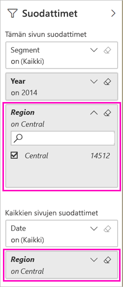

# Kaksi tapaa jakaa suodatettu Power BI -raportti
*Jakaminen* on kätevä keino myöntää parille henkilölle käyttöoikeus luomiisi koontinäyttöihin ja raportteihin. Mitä tapahtuu, jos haluat jakaa raportista suodatetun version? Haluat kenties jakaa raportin, joka näyttää vain tietyn kaupungin, myyjän tai vuoden tiedot. Kokeile raportin suodattamista ja jakamista tai mukautetun URL-osoitteen luomista. Raportti suodatetaan, kun vastaanottajat avaavat sen ensimmäisen kerran. He voivat poistaa suodattimen muokkaamalla URL-osoitetta. 

Power BI sisältää myös [muita tapoja tehdä yhteistyötä ja jakaa raportteja](service-how-to-collaborate-distribute-dashboards-reports.md). Jakamisessa sinulla ja vastaanottajillasi on oltava myös [Power BI Pro -käyttöoikeudet](service-features-license-type.md) tai sisällön on oltava [Premium-kapasiteetissa](service-premium-what-is.md). 

## Kaksi tapaa suodattaa raportti

Molemmissa suodatustavoissa käytetään Markkinointi ja myynti ‑mallisovellusta. Haluatko kokeilla sitä? Voit myös asentaa [Markkinointi ja myynti ‑mallisovelluksen](https://appsource.microsoft.com/product/power-bi/microsoft-retail-analysis-sample.salesandmarketingsample?tab=Overview).

### Suodattimen asettaminen

Voit käyttää suodatinta avaamalla raportin [Muokkausnäkymässä](consumer/end-user-reading-view.md).

Tässä esimerkissä suodatamme Markkinointi ja myynti ‑mallisovelluksen vuodenalusta-luokkasivun niin, että siinä näytetään vain ne arvot, joissa **Alue** on **Keski**. 
 

Tallenna raportti.

### Suodattimen luominen URL-osoitteessa

Kun lisäät suodattimen raporttisivun URL-osoitteen loppuun, raportti toimii hieman eri tavalla. Suodatettu sivu näyttää samalta. Power BI kuitenkin lisää suodattimen koko raporttiin ja poistaa muut arvot suodatinruudusta.  

Lisää seuraava teksti raporttisivun URL-osoitteen loppuun:
   
    ?filter=*tablename*/*fieldname* eq *value*
   
Kentän tyypin on oltava numero, päivämäärä ja aika tai merkkijono. *Tablename*- tai *Fieldname*-arvot eivät voi sisältää välilyöntejä.
   
Tässä esimerkissä taulukon nimi on **Alue**, kentän nimi on **Alue** ja suodatettava arvo on **Keski**:
   
    ?filter=Geo/Region eq 'Central'

Selain lisää erikoismerkit, jotka vastaavat kauttaviivoja, välilyöntejä ja heittomerkkejä, joten tulos on seuraavankaltainen:
   
    app.powerbi.com/groups/xxxx/reports/xxxx/ReportSection4d00c3887644123e310e?filter=Geo~2FRegion%20eq%20'Central'

Tallenna raportti.

Katso lisätiedot artikkelista [Raportin suodattaminen URL-osoitteen kyselymerkkijonoparametrien avulla](service-url-filters.md).

## Suodatetun raportin jakaminen

1. Kun [jaat raportin](service-share-dashboards.md), tyhjennä **Lähetä sähköposti-ilmoitus vastaanottajille** ‑valintaruutu.

    

4. Lähetä aiemmin luomasi suodattimen sisältävä linkki.

## Seuraavat vaiheet
* [Töiden jakamistavat Power BI:ssä](service-how-to-collaborate-distribute-dashboards-reports.md)
* [Koontinäytön jakaminen](service-share-dashboards.md)
* Onko sinulla muuta kysyttävää? [Kokeile Power BI -yhteisöä](http://community.powerbi.com/).
* Haluatko antaa palautetta? Anna ehdotuksia siirtymällä [Power BI -yhteisön sivustolle](https://community.powerbi.com/).

