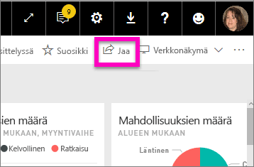
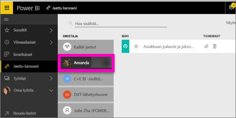

# Minulle jaettujen Power BI ‑koontinäyttöjen tarkastelu
## Jaettu kanssani

Kun työtoverisi jakaa sinulle koontinäytön, sen otsikko lisätään **Jaettu kanssani** ‑luetteloosi. Koontinäyttö on käytettävissä vain **Jaettu kanssani** ‑luettelosta, eikä se ole käytettävissä työtilan tai **Sovellukset**-näkymän kautta.

Katso videolta, kun Amanda kertoo lisää **Jaettu kanssani** ‑sisältöluettelosta ja näyttää, miten luettelosta siirrytään sisältöihin toiseen ja miten luetteloa voi suodattaa. Kokeile sitten itse noudattamalla videon alapuolella olevia vaiheittaisia ohjeita. Tarvitset Power BI Pro ‑käyttöoikeuden voidaksesi tarkastella sinulle jaettuja koontinäyttöjä. Lisätietoja on artikkelissa [Mikä on Power BI Premium?](service-premium.md)

<iframe width="560" height="315" src="https://www.youtube.com/embed/G26dr2PsEpk" frameborder="0" allowfullscreen></iframe>

Koontinäyttöjen ja niiden perustana toimivien raporttien kanssa voi toimia useilla eri tavoilla sen mukaan, millaiset käyttöoikeudet niiden omistaja on myöntänyt sinulle. Tällaisia toimintoja ovat esimerkiksi kopioiden tekeminen koontinäytöstä, raportin avaaminen [lukunäkymässä](service-reading-view-and-editing-view.md) ja sisältöjen jakaminen edelleen muille työtovereille.

## **Jaettu kanssani** ‑näkymän käytettävissä olevat toiminnot
* Voit [merkitä koontinäytön suosikiksi](service-dashboard-favorite.md) tähtikuvakkeella.
* Voit [poistaa koontinäytön roskakorikuvakkeella](service-delete.md)  
* Voit jakaa joitakin koontinäyttöjä edelleen muille  
* Lisäksi, jos koontinäyttöjen luettelosta tulee pitkä, voit [etsiä tarvitsemasi käyttämällä hakukenttää ja lajittelua](service-navigation-search-filter-sort.md).
  
  > [!NOTE]
  > Jos haluat tietoa EGRC-luokituksista, valitse luokituspainike tai katso artikkeli [Koontinäytön tietojen luokittelu](service-data-classification.md).
  > 
  > 
* Voit avata koontinäytön ja tutkia sitä valitsemalla koontinäytön nimen. Kun olet avannut jaetun koontinäytön, voit esittää Q&A-toiminnon avulla kysymyksiä koontinäytön perustana olevista tiedoista, tai jos haluat avata raportin ja tehdä sille toimintoja lukunäkymässä, valitse haluamasi ruutu.

## Jaettujen koontinäyttöjen suodattaminen omistajan mukaan
**Jaettu kanssani** ‑näkymän sisällön voi suodattaa sisällön omistajan mukaan. Jos valitsen esimerkiksi omistajaksi **Amandan**, näkyville jää vain koontinäyttö, jonka Amanda on jakanut minulle.

## Seuraavat vaiheet
[Power BI:n peruskäsitteet](service-basic-concepts.md)  
[Power BI Premium – mikä se on?](service-premium.md)  

Ilmenikö muuta kysyttävää? [Voit esittää kysymyksiä Power BI -yhteisössä](http://community.powerbi.com/)

