# Mallisovelluksen luominen Power BI:ssä

Power BI:n uusien *mallisovellusten* avulla Power BI -kumppanit voivat kehittää Power BI -sovelluksia käyttäen vain vähän tai ei lainkaan koodausta, minkä lisäksi sovellukset voidaan ottaa käyttöön kenelle tahansa Power BI -asiakkaalle.  Tässä artikkelissa on vaiheittaiset ohjeet Power BI -mallisovelluksen luomiseen.

Jos luot Power BI -raportteja ja koontinäyttöjä, voit ryhtyä *mallisovelluksen kehittäjäksi*, joka laatii ja paketoi analyysisisältöä *sovellukseksi*. Voit ottaa sovelluksesi muiden Power BI -vuokraajien käyttöön hyödyntämällä jotakin käytettävissä olevaa ympäristöä, kuten AppSourcea, tai käyttämällä sovellusta omassa verkkopalvelussasi. Kehittäjänä voit luoda suojatun analytiikkapaketin jakelua varten.

Power BI -vuokraajan järjestelmänvalvojat hallinnoivat ja ohjaavat sitä, ketkä organisaation käyttäjät voivat luoda mallisovelluksia ja ketkä voivat asentaa niitä. Valtuutetut käyttäjät voivat asentaa mallisovelluksesi, muokata sitä ja jakaa sen organisaation Power BI -käyttäjille.

## Edellytykset

Mallisovelluksen kehittämistä varten tarvitaan:  

- [Power BI Pro -käyttöoikeus](service-self-service-signup-for-power-bi.md)
- [Power BI Desktop -asennus](desktop-get-the-desktop.md) (valinnainen)
- [Power BI-peruskäsitteiden](service-basic-concepts.md) tuntemus
- Käyttöoikeudet mallisopimuksen julkiseen jakamiseen. Lisätietoja on Power BI:n [hallintaportaalin kohdassa Mallisovelluksen asetukset](service-admin-portal.md#template-apps-settings).

## Mallin työtilan luominen

Jotta voisit luoda mallisovelluksen, jonka voi jakaa muille Power BI -vuokraajille, mallisovellus tulee luoda jossakin uusista työtiloista.

1. Valitse Power BI -palvelussa **Työtilat** > **Luo työtila**.

    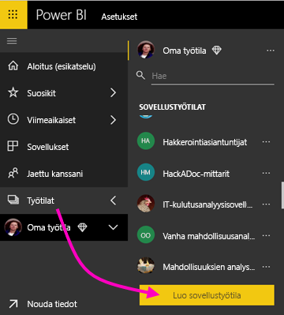

2. Valitse kohdassa **Luo työtila** **Päivitä uuteen**.

    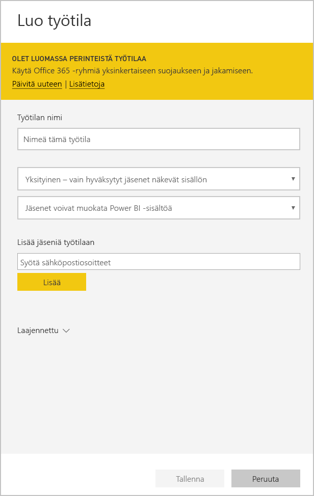

3. Kirjoita työtilan nimi, kuvaus (valinnainen) ja logokuva (valinnainen).

4. Laajenna **Lisäasetukset**-osio ja valitse **Kehitä mallisovellus**.

    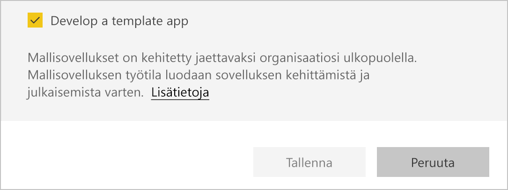

5. Valitse **Tallenna**.
>[!NOTE]
>Tarvitset Power BI -järjestelmänvalvojaltasi oikeudet tukea mallisovelluksia.

## Luo mallisovelluksesi sisältö

Kuten tavallisessakin Power BI -työtilassa, seuraava tehtäväsi on luoda työtilan sisältö.  

- [Luo oma Power BI -sisältösi](index.yml) työtilassa.

Jos käytät Power Query -parametreja, varmista, että niiden tietolaji on määritelty hyvin (esimerkiksi teksti). Tietolajeja Mikä tahansa ja Binaarinen ei tueta.

[Vihjeitä mallisovellusten luomiseen Power BI:ssä](service-template-apps-tips.md) -artikkelissa on ehdotuksia, jotka kannattaa ottaa huomioon, kun luodaan raportteja ja koontinäyttöjä mallisovellusta varten.

## Luo testimallisovellus

Nyt kun työtilassasi on sisältöä, voit pakata sen mallisovellukseksi. Ensimmäiseksi luodaan koemallisovellus, jota voi käyttää vain organisaatiostasi käsin omalla vuokraajallasi.

1. Valitse mallin työtilassa **Luo sovellus**.

    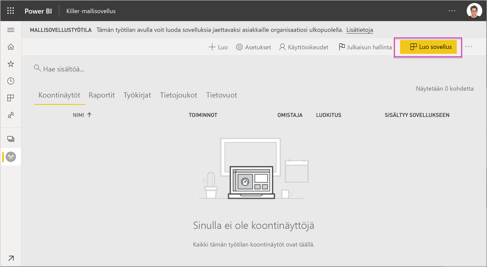

    Täällä voit lisätä mallisovellukseen viiden luokan kehitysvaihtoehtoja:

    **Tuotemukautus**

    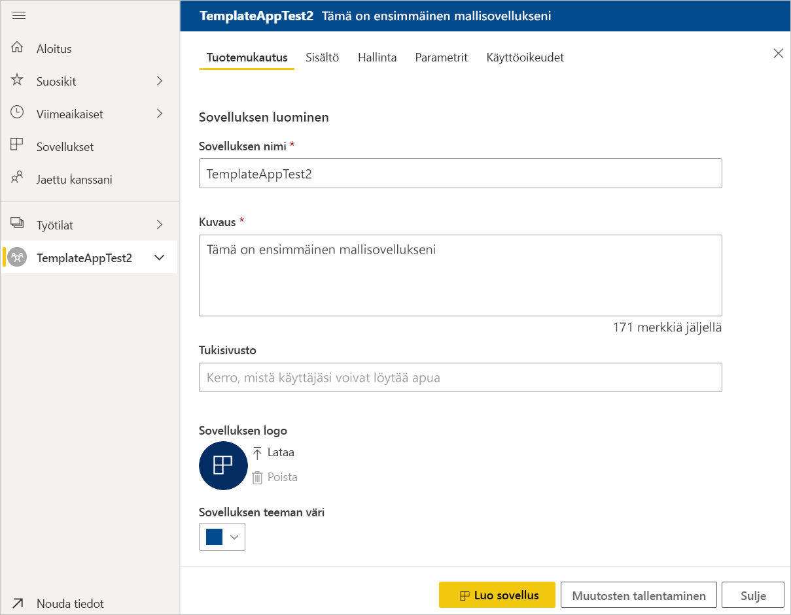
    - Sovelluksen nimi
    - Kuvaus
    - Tukisivustolla (linkki esitetään sovelluksen tiedoissa, kun sovellus on jaettu organisaation mallisovelluksena)
    - Sovelluksen logo (kokorajoitus 45 kt, kuvasuhde 1:1, muoto .png, .jpg tai .jpeg)
    - Sovelluksen teeman väri

    **Siirtyminen**

    Aktivoi **Uusi siirtymisen muodostin**, jossa voit määrittää sovelluksen siirtymisruudun (lisätietoja on tämän artikkelin kohdassa [Suunnittele siirtymistoiminnot](service-create-distribute-apps.md#design-the-navigation-experience)).

   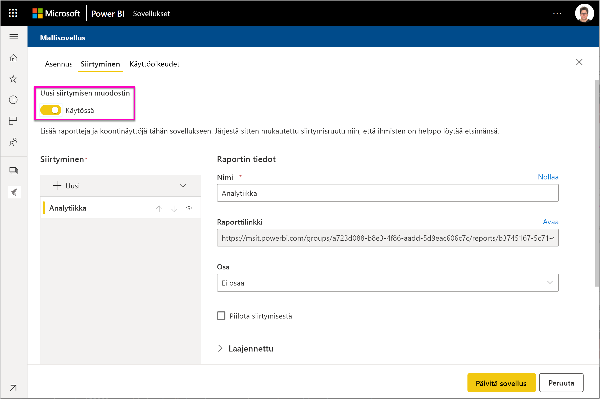
    
    **Sovelluksen aloitussivu:** Jos päätät jättäytyä pois siirtymisen muodostimesta, voit valita sovelluksen aloitussivun. Määritä sovelluksesi aloitussivuksi jokin raportti tai koontinäyttö. Käytä aloitussivua, joka antaa oikean vaikutelman.

    **Hallinta**

    Aseta rajoituksia, jotka säätelevät sitä, miten sovelluksen käyttäjät voivat käyttää sovelluksen sisältöä. Näin voit suojata tiettyjä sovelluksen sisältämiä immateriaalioikeuksia.

    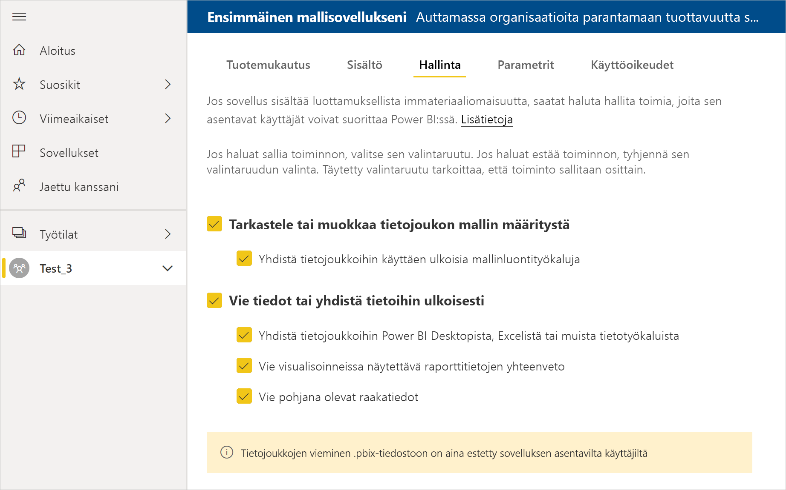

    >[!NOTE]
    >.pbix-muotoon vieminen estetään käyttäjiltä, jotka asentavat sovellusta.

    **Parametrit**

    Tämän luokan avulla voit hallita parametrin toiminta muodostaessa yhteyttä tietolähteisiin. Lue lisää [kyselyparametrien luomisesta](https://powerbi.microsoft.com/blog/deep-dive-into-query-parameters-and-power-bi-templates/).

    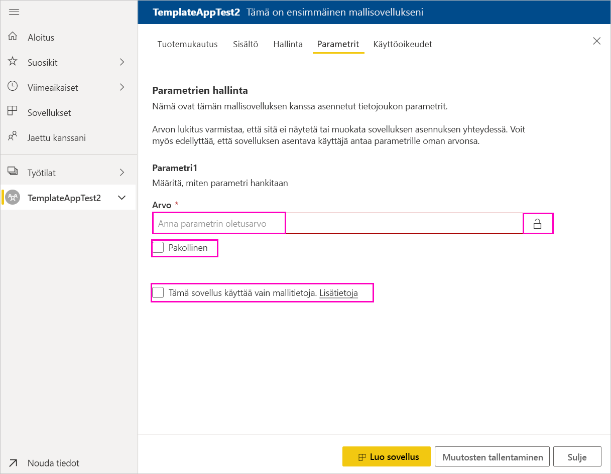
    - **Arvo**: parametrin oletusarvo.
    - **Pakollinen**: tämän avulla voit edellyttää asennusohjelmaa antamaan käyttäjäkohtaisen parametrin.
    - **Lukitse**: Lukitus estää parametrin päivittämisen.

    **Käyttöoikeudet** Päätä testivaiheessa, ketkä muut organisaatiosi käyttäjät voivat asentaa sovelluksesi ja testata sitä. Ei huolta. Voit milloin tahansa palata ja muuttaa näitä asetuksia (asetus ei vaikuta jaetun mallinsovelluksen käyttöoikeuksiin).

2. Valitse **Luo sovellus**.

    Näyttöön tulee sanoma, joka ilmoittaa koesovelluksen olevan valmis. Mukana on linkki, jonka voit kopioida ja jakaa sovelluksen testaajille.

    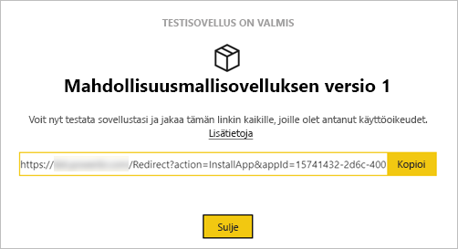

    Olet samalla suorittanut ensimmäisen vaiheen julkaisuhallinnan prosessista, joka käsitellään seuraavaksi.

## Mallisovelluksen julkaisemisen hallinta

Ennen kuin julkaiset mallisovellusta, kannattaa varmistaa, että kaikki on kunnossa. Power BI on luonut julkaisuhallinnan ruudun, jossa voit seurata ja tarkastella sovelluksen koko julkaisupolkua. Voit myös käynnistää siirtymän vaiheesta toiseen. Perusvaiheita ovat seuraavat:

- Testisovelluksen luonti: Vain organisaation sisäistä testausta varten.
- Testipaketin ylennys esituotantovaiheeseen: Testaus organisaatiosi ulkopuolella.
- Esituotantopaketin ylennys tuotannoksi: Tuotantoversio.
- Poista paketti tai aloita uudelleen edellisestä vaiheesta.

URL-osoite ei muutu, kun siirryt julkaisuvaiheiden välillä. Korottaminen ei vaikuta itse URL-osoitteeseen.

Käydään seuraavaksi vaiheet läpi:

1. Valitse mallin työtilassa **Julkaisun hallinta**.

    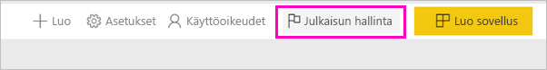

2. Valitse **Luo sovellus**.

    Jos olet luonut testisovelluksen yllä kuvatussa **Luo testimallisovellus** -vaiheessa, **Testataan**-kohdan vieressä oleva keltainen pallo on jo täyttynyt eikä tässä vaiheessa tarvitse valita **Luo sovellus** -vaihtoehtoa. Jos kuitenkin valitset sen, palaat mallisovelluksen luontiin.

3. Valitse **Hanki linkki**.

    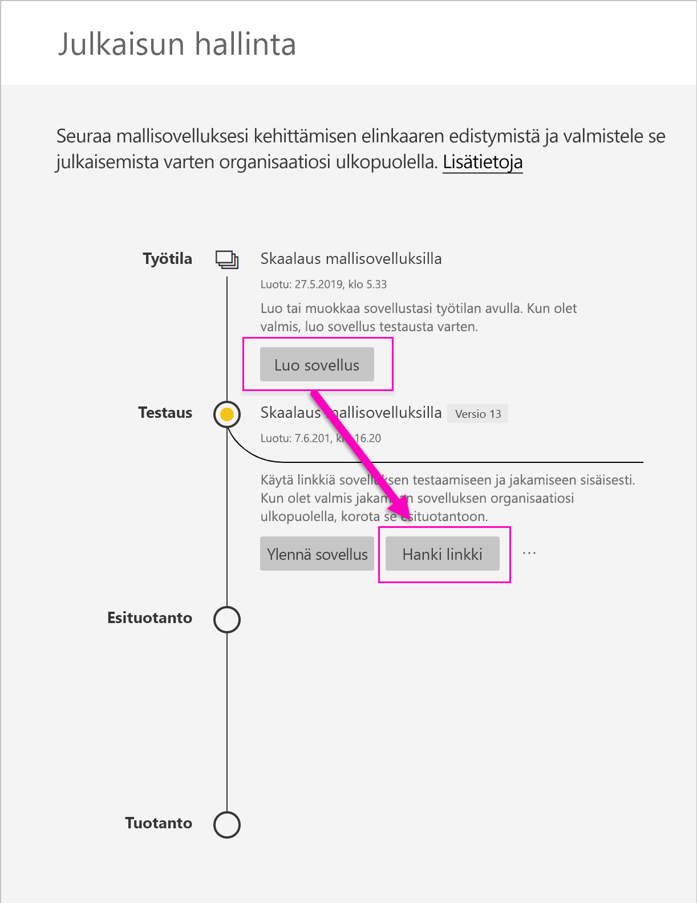

4. Voit testata sovelluksen asennusta kopioimalla ilmoitusikkunassa olevan linkin ja liittämällä sen uuteen selainikkunaan.

    Tästä eteenpäin teet samat toiminnot kuin mitä asiakkaasi tulevat tekemään. Asiakkaiden versio on kohdassa [Mallisovellusten asentaminen ja jakaminen organisaatiossa](service-template-apps-install-distribute.md).

5. Valitse valintaikkunassa **Asenna**.

    Kun asennus on valmis, näkyviin tulee ilmoitus, että uusi sovellus on valmis.

6. Valitse **Siirry sovellukseen**.
7. **Aloita uuden sovelluksesi käyttö** -kohdassa näet sovelluksen samanlaisena kuin asiakkaasi näkevät sen.

    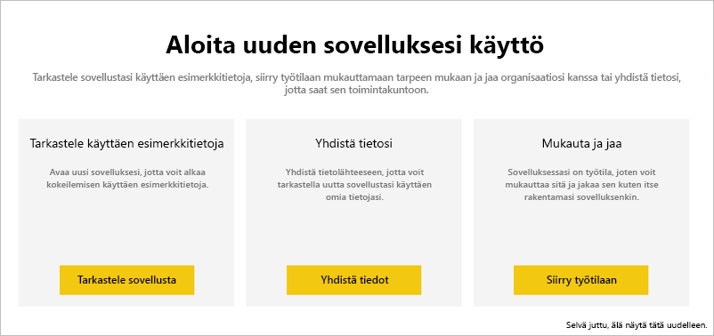
8. Valitse **Tarkastele sovellusta** ja vahvista testisovelluksen toiminta mallitietojen kanssa.
9. Jos haluat tehdä muutoksia, palaa sovellukseen alkuperäisessä työtilassa. Päivitä testisovellusta, kunnes olet tyytyväinen.
10. Kun olet valmis korottamaan sovelluksesi esituotantoon niin, että sen testausta voidaan jatkaa oman vuokraajasi ulkopuolella, palaa **Julkaisun hallinta** -ruutuun ja valitse **Korota sovellus**. 

    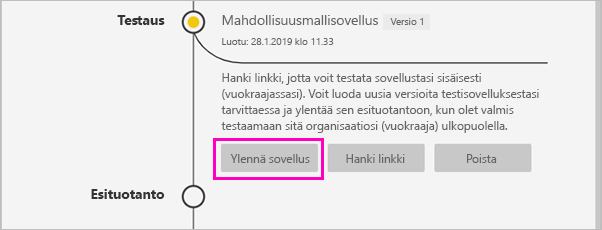
    >[!NOTE]
    > Kun sovellus on korotettu, se tulee yleisesti saataville organisaatiosi ulkopuolelle.

    Jos et näe tätä asetusta, ota yhteyttä Power BI-järjestelmänvalvojaasi ja pyydä häntä myöntämään [mallisovellusten kehitysoikeudet](service-admin-portal.md#template-apps-settings) hallintaportaalissa.
11. Vahvista valintasi valitsemalla **Ylennä**.
12. Kopioi tämä uusi URL-osoite, niin voit jakaa sen oman vuokraajasi ulkopuolelle testausta varten. Tämän linkin lähettämällä voit myös aloittaa sovelluksesi jakamisen AppSourcessa luomalla [uuden tarjouksen pilvikumppaniportaaliin](https://docs.microsoft.com/azure/marketplace/cloud-partner-portal/power-bi/cpp-publish-offer). Lähetä vain esituotannon linkkejä pilvikumppaniportaaliin. Vasta kun sovellus on hyväksytty ja saat ilmoituksen, että se on julkaistu AppSourcessa, voit korottaa kyseisen paketin tuotantoon Power BI:ssä.
13. Kun sovelluksesi on valmis tuotantoon tai jaettavaksi AppSourcen kautta, palaa takaisin **Julkaisuhallinta**-ruutuun ja valitse **Esituotanto**-kohdan vierestä **Ylennä sovellus**.
14. Vahvista valintasi valitsemalla **Ylennä**.

    Sovelluksesi on nyt tuotannossa ja valmis jaettavaksi.

    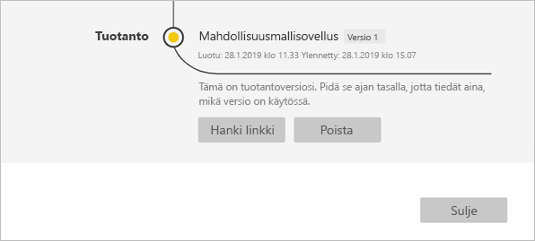

Jos haluat saada sovelluksesi tuhansien Power BI -käyttäjien saataville maailmanlaajuisesti, kannustamme sinua lähettämään sen AppSourceen. Lisätietoja on kohdassa [Power BI -sovellustarjous](https://docs.microsoft.com/azure/marketplace/cloud-partner-portal/power-bi/cpp-power-bi-offer).

## Seuraavat vaiheet

Ohjeaiheessa [Mallisovellusten asentaminen, mukauttaminen ja jakaminen organisaatiossa](service-template-apps-install-distribute.md) voit selvittää, miten asiakkaasi käsittelevät mallisovellusta.

Lisätietoja sovelluksen jakamisesta on kohdassa [Power BI -sovellustarjous](https://docs.microsoft.com/azure/marketplace/cloud-partner-portal/power-bi/cpp-power-bi-offer).
