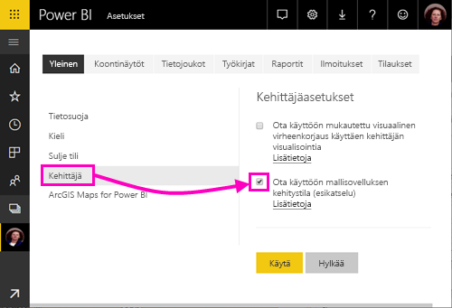
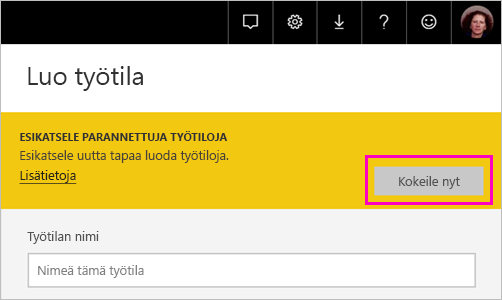
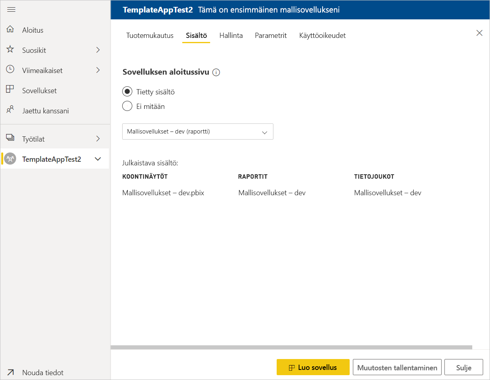
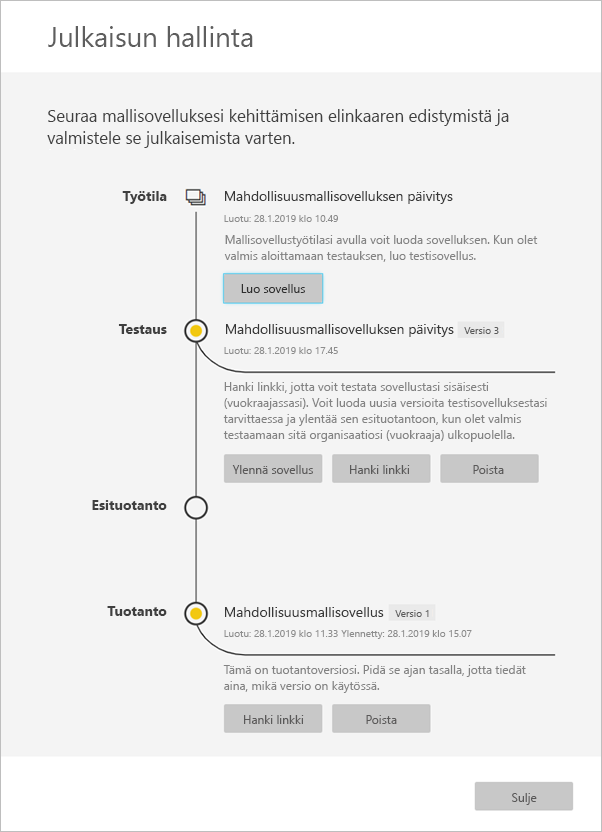

# Mallisovelluksen luominen Power BI:ssä (esikatselu)

Power BI:n uusien *mallisovellusten* avulla Power BI -kumppanit voivat kehittää Power BI -sovelluksia käyttäen vain vähän tai ei lainkaan koodausta, minkä lisäksi sovellukset voidaan ottaa käyttöön kenelle tahansa Power BI -asiakkaalle.  Tässä artikkelissa on vaiheittaiset ohjeet Power BI -mallisovelluksen luomiseen.

Jos luot Power BI-raportteja ja koontinäyttöjä, sinusta tulee *mallin sovelluskehittäjän* ja laatii paketoi analyysitietojen sisällön into *sovelluksen*. Sovelluksesi voi ottaa käyttöön muiden Power BI-vuokraajien kuten AppSource tai käyttämällä WWW-palvelun käytettävissä ympäristön kautta. Muodostimen sinulla on mahdollisuus luoda suojattuja analytics-paketin jaettavaksi.

Power BI -vuokraajan järjestelmänvalvojat hallinnoivat ja ohjaavat sitä, ketkä organisaation käyttäjät voivat luoda mallisovelluksia ja ketkä voivat asentaa niitä. Kyseiset käyttäjät, joilla on oikeus voit asentaa mallin sovelluksen ja sitten muokata sitä ja jakaa sen organisaation Power BI-käyttäjille.

## Edellytykset

Mallisovelluksen kehittämistä varten tarvitaan:  

- [Power BI Pro -käyttöoikeus](service-self-service-signup-for-power-bi.md)
- [Power BI Desktop -asennus](desktop-get-the-desktop.md) (valinnainen)
- Tuntee [Power BI-peruskäsitteet](service-basic-concepts.md)
- oikeudet luoda mallisovelluksia. Lisätietoja on Power BI:n [hallintaportaalin kohdassa Mallisovelluksen asetukset](service-admin-portal.md#template-apps-settings-preview).

## Ota käyttöön sovelluskehittäjän tila

Jotta voisit luoda mallisovelluksen, jonka voi jakaa muille Power BI -vuokraajille, sinun tulee olla sovelluskehittäjän tilassa. Muussa tapauksessa luot sovelluksen vain oman organisaatiosi Power BI -kuluttajille.

1. Avaa Power BI -palvelu selaimessa.
2. Valitse **Asetukset** > **Yleiset** > **Kehittäjä** > **Ota käyttöön mallisovelluksen kehitystila**.

    

    Jos et näe tätä asetusta, ota yhteyttä Power BI-järjestelmänvalvojaasi ja pyydä häntä myöntämään [mallisovellusten kehitysoikeudet](service-admin-portal.md#template-apps-settings-preview) hallintaportaalissa.

3. Valitse **Käytä**.

## Mallisovelluksen luonnin työtila

Jotta voisit luoda mallisovelluksen, jonka voi jakaa muille Power BI -vuokraajille, mallisovellus tulee luoda jossakin uusista sovellustyötiloista.

1. Valitse Power BI -palvelussa **Työtilat** > **Luo sovellustyötila**.

    

2. Valitse **Luo sovellustyötila** -kohdan **Esikatsele paranneltuja työtiloja** -asetuksessa **Kokeile nyt**.

    

3. Kirjoita sovellustyötilan nimi, kuvaus (valinnainen) ja logokuva (valinnainen).

4. Valitse **Kehitä mallisovellus**.

    

5. Valitse **Tallenna**.
>[!NOTE]
>Tarvitset oikeudet edistää mallin sovelluksia Power BI-järjestelmänvalvojaasi.

## Luo mallisovelluksesi sisältö

Kuten tavallisessakin Power BI -sovellustyötilassa, seuraava tehtäväsi on luoda työtilan sisältö.  Tässä mallisovellusten esikatseluversiossa tuetaan enintään yhtä kustakin lajista: yhtä tietojoukkoa, yhtä raporttia ja yhtä koontinäyttöä.

- [Luo oma Power BI -sisältösi](power-bi-creator-landing.md) sovellustyötilassa.

Jos käytät Power Query -parametreja, varmista, että niiden tietolaji on määritelty hyvin (esimerkiksi teksti). Tietolajeja Mikä tahansa ja Binaarinen ei tueta.

[Vihjeitä mallisovellusten luomiseen Power BI:ssä (esikatselu)](service-template-apps-tips.md) -artikkelissa on ehdotuksia, jotka kannattaa ottaa huomioon, kun luodaan raportteja ja koontinäyttöjä mallisovellusta varten.

## Luo testimallisovellus

Nyt kun työtilassasi on sisältöä, voit pakata sen mallisovellukseksi. Ensimmäiseksi luodaan koemallisovellus, jota voi käyttää vain organisaatiostasi käsin omalla vuokraajallasi.

1. Valitse mallisovellus-työtilassa **Luo sovellus**.

    

    Tässä täytät muita luominen asetukset mallin sovelluksesi viiden luokkiin:

    **Tuotemukautus**

    
    - Sovelluksen nimi
    - Kuvaus
    - Tukisivustossa (linkki esitetään kohdassa sovelluksen tiedot jälkeen uudelleenjakamista mallin sovelluksen organisaation sovelluksena)
    - Sovelluksen logo (45K kokorajoituksen, kuvasuhde 1:1, .png .jpg .jpeg muodoista)
    - Sovelluksen teeman väri

    **Sisältö**

    **Sovelluksen aloitussivu:** Määritä raportin tai koontinäytön aloitussivuksi sovelluksesi, käyttää, joka antaa oikeanlainen aloitussivu:

    

    **Hallinta**

    Määrittää rajoitukset ja rajoituksia, joilla sovelluksesi käyttäjät sovelluksesi sisällöllä. Tämän ohjausobjektin avulla voit suojata immateriaalioikeuksia sovelluksessasi.

    

    >[!NOTE]
    >Vieminen .pbix-muotoon estetään aina sovelluksen asentaminen käyttäjille.

    **Parametrit**

    Tämän luokan avulla voit hallita parametrin toiminta, kun yhteyksiä tietolähteisiin. Lue lisätietoja [luominen kyselyparametrit](https://powerbi.microsoft.com/blog/deep-dive-into-query-parameters-and-power-bi-templates/).

    
    - **Arvo**: parametrin oletusarvo.
    - **Pakollinen**: edellytä asennusohjelma käyttäjäkohtaiset syöteparametri tämän avulla.
    - **Lukitse**: Lukituksen estää päivittämisen parametri.
    - **Staattinen**: Ota käyttöön siltä varalta, että sovellus sisältää *vain* mallitiedot. Kun valitset **staattinen**, ohjattu asennus Pyydä käyttäjät voivat muodostaa yhteyden tietolähteeseen.

    **Access** test-vaiheessa päättää, mitkä muiden organisaatiosi asentaa ja testata sovellustasi. Eikä huolta, voit aina palata takaisin ja muuttaa näitä asetuksia myöhemmin (asetus ei vaikuta hajautetun mallin sovelluksen käyttöoikeus).

2. Valitse **Luo sovellus**.

    Näyttöön tulee sanoma, joka ilmoittaa koesovelluksen olevan valmis. Mukana on linkki, jonka voit kopioida ja jakaa sovelluksen testaajille.

    

    Olet samalla suorittanut ensimmäisen vaiheen julkaisuhallinnan prosessista, joka käsitellään seuraavaksi.

## Mallisovelluksen julkaisemisen hallinta

Ennen kuin julkaiset mallisovellusta, kannattaa varmistaa, että kaikki on kunnossa. Power BI on luonut julkaisuhallinnan ruudun, jossa voit seurata ja tarkastella sovelluksen koko julkaisupolkua. Voit myös käynnistää siirtymän vaiheesta toiseen. Perusvaiheita ovat seuraavat:

- Testisovelluksen luonti: Vain organisaation sisäistä testausta varten.
- Testipaketin ylennys esituotantovaiheeseen: Testaus organisaatiosi ulkopuolella.
- Esituotantopaketin ylennys tuotannoksi: Tuotantoversio.
- Poista paketti tai aloita uudelleen edellisestä vaiheesta.

URL-osoite ei muutu, kun siirryt release vaiheiden välillä. Kampanja ei vaikuta itse URL-Osoitetta.

Käydäänpä seuraavaksi läpi vaiheet:

1. Valitse mallisovellus-työtilassa **Julkaisun hallinta**.

    

2. Valitse **Luo sovellus**.

    Jos olet luonut testisovelluksen yllä kuvatussa **Luo testimallisovellus** -vaiheessa, **Testataan**-kohdan vieressä oleva keltainen pallo on jo täyttynyt eikä tässä vaiheessa tarvitse valita **Luo sovellus** -vaihtoehtoa. Jos kuitenkin valitset sen, palaat mallisovelluksen luontiin.

3. Valitse **Hanki linkki**.

    

4. Voit testata sovelluksen asennusta kopioimalla ilmoitusikkunassa olevan linkin ja liittämällä sen uuteen selainikkunaan.

    Tästä eteenpäin teet samat toiminnot kuin mitä asiakkaasi tulevat tekemään. Asiakkaiden versio on kohdassa [Mallisovellusten asentaminen ja jakaminen organisaatiossa](service-template-apps-install-distribute.md).

5. Valitse valintaikkunassa **Asenna**.

    Kun asennus on valmis, näkyviin tulee ilmoitus, että uusi sovellus on valmis.

6. Valitse **Siirry sovellukseen**.
7. **Aloita uuden sovelluksesi käyttö** -kohdassa näet sovelluksen samanlaisena kuin asiakkaasi näkevät sen.

    
8. Valitse **Tarkastele sovellusta** ja vahvista testisovelluksen toiminta mallitietojen kanssa.
9. Jos haluat tehdä muutoksia, palaa sovellukseen alkuperäisessä työtilassa. Päivitä testisovellusta, kunnes olet tyytyväinen.
10. Kun olet valmis markkinoimaan sovelluksiasi ennen tuotantoon testausta edelleen vuokraajasi ulkopuolella, palaa takaisin **Julkaisuhallinta** ruudussa ja valitse **Korota sovelluksen**. 

    

    >[!NOTE]
    > Kun sovellus on Ylennetty tulee yleisesti saatavilla organisaatiosi ulkopuolella.

11. Vahvista valintasi valitsemalla **Ylennä**.
12. Kopioi tämä uusi URL-osoite, niin voit jakaa sen oman vuokraajasi ulkopuolelle testausta varten. Tämä linkki on myös lähettää aloittaaksesi appsourcessa sovelluksen jakaminen luomalla [Pilvipalvelukumppanin portaalista uudeksi tarjoukseksi](https://docs.microsoft.com/azure/marketplace/cloud-partner-portal/power-bi/cpp-publish-offer). Lähetä vain ennen tuotannon linkkejä Pilvipalvelukumppanin portaalista. Vain, kun sovellus on hyväksytty ja saat ilmoituksen, että se on julkaistu appsourcessa, voit korottaa tämän paketin Power BI tuotantoon.
13. Kun sovelluksesi on valmis tuotantoon tai jaettavaksi AppSourcen kautta, palaa takaisin **Julkaisuhallinta**-ruutuun ja valitse **Esituotanto**-kohdan vierestä **Ylennä sovellus**.
14. Vahvista valintasi valitsemalla **Ylennä**.

    Sovelluksesi on nyt tuotannossa ja valmis jaettavaksi.

    

Jos haluat saada sovelluksesi tuhansien Power BI -käyttäjien saataville maailmanlaajuisesti, kannustamme sinua lähettämään sen AppSourceen. Lisätietoja on kohdassa [Power BI -sovellustarjous](https://docs.microsoft.com/azure/marketplace/cloud-partner-portal/power-bi/cpp-power-bi-offer).

## Päivitä sovelluksesi

Kun sovelluksesi on nyt tuotantoympäristössä, voit aloittaa alusta testausvaiheessa häiritsemättä tuotantoympäristössä olevaa sovellusta.

1. Valitse **Julkaisun hallinta** -ruudussa **Luo sovellus**.
2. Suorita sovelluksen luontiprosessi uudelleen.
3. Kun olet määrittänyt **tuotemerkkiohjeet**, **sisällön**, **hallinnan** ja **käyttöoikeudet**, voit uudelleen valita **Luo sovellus** -vaihtoehdon.
4. Valitse **Sulje** ja palaa **Julkaisun hallintaan**.

   Näkyvillä on nyt kaksi versiota: tuotantoympäristössä oleva versio sekä testausvaiheessa oleva uusi versio.

    

5. Kun olet valmis markkinoimaan sovelluksiasi ennen tuotantoon testausta edelleen vuokraajasi ulkopuolella, palaa Julkaisuhallinta-ruudussa ja valitse **Korota sovelluksen** kohdan **testaaminen**.
6. Linkki on nyt käytettävissä, lähetetään uudelleen Pilvipalvelukumppanin portaalista osoitteessa ohjeiden [Power BI-sovellus tarjouksen päivitys](https://docs.microsoft.com/azure/marketplace/cloud-partner-portal/power-bi/cpp-update-existing-offer).

>[!NOTE]
>Ylennä tuotantovaiheen sovelluksen vasta, kun sovelluksesi on hyväksynyt Pilvipalvelukumppanin portaali ja se on julkaistu.

## Seuraavat vaiheet

Ohjeaiheessa [Mallisovellusten asentaminen, mukauttaminen ja jakaminen organisaatiossa](service-template-apps-install-distribute.md) voit selvittää, miten asiakkaasi käsittelevät mallisovellusta.

Lisätietoja sovelluksen jakamisesta on kohdassa [Power BI -sovellustarjous](https://docs.microsoft.com/azure/marketplace/cloud-partner-portal/power-bi/cpp-power-bi-offer).
