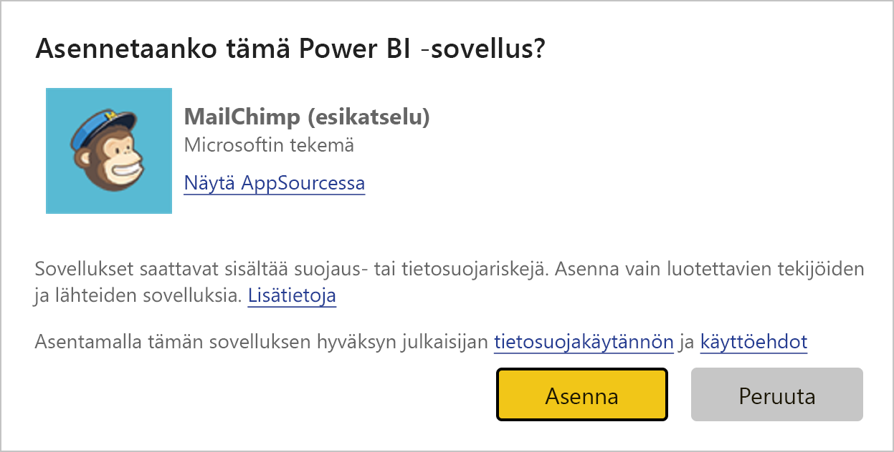
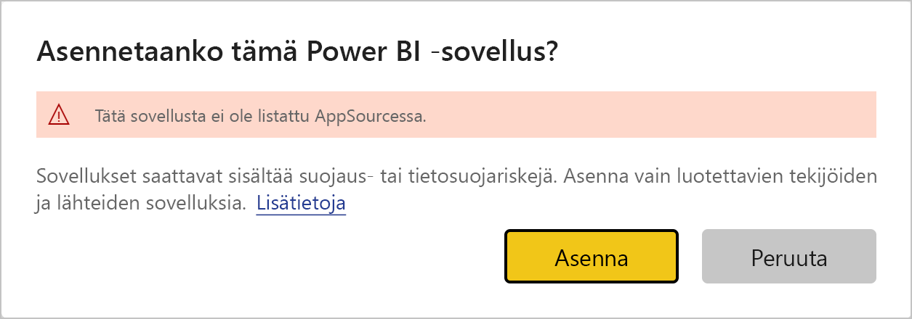

# Mallisovellusten asentaminen ja jakaminen organisaatiossa - Power BI

Oletko Power BI -analyytikko? Jos olet, tässä artikkelissa kerrotaan, miten voit asentaa *mallisovelluksia*, joiden avulla voit yhdistää moniin liiketoiminnassa käyttämiisi palveluihin. Tällaisia palveluita ovat esimerkiksi Salesforce, Microsoft Dynamics ja Google Analytics. Voit muokata raporttinäkymää ja raportteja organisaatiosi tarpeiden mukaiseksi ja jakaa ne työtovereillesi *sovelluksena*. 

Jos olet kiinnostunut luomaan mallisovelluksia ja jakamaan niitä itse, katso [Mallisovelluksen luominen Power BI:ssä](service-template-apps-create.md). Power BI -kumppanit voivat muodostaa Power BI -sovelluksia ja ottaa ne käyttöön Power BI -asiakkaille. Koodausta tarvitaan hyvin vähän tai ei lainkaan. 

## Edellytykset  

Mallisovelluksen asentamiseen, mukauttamiseen ja jakamiseen liittyvät seuraavat vaatimukset: 

- [Power BI Pro -käyttöoikeus](service-self-service-signup-for-power-bi.md)
- [Power BI-peruskäsitteiden](service-basic-concepts.md) tuntemus
- kelvollinen asennuslinkki mallisovelluksen luojalta tai AppSourcesta 
- oikeudet asentaa mallisovelluksia. 

## Mallisovelluksen asentaminen

Saatat saada linkin mallisovellukseen. Muussa tapauksessa voit etsiä AppSourcesta mallisovelluksen, josta olet kiinnostunut. Kummassakin tapauksessa voit asentamisen jälkeen muokata mallisovellusta ja jakaa sen organisaatioosi.

### Hae AppSourcesta selaimella

Valitse selaimessa tämä linkki, niin AppSource avautuu ja Power BI -sovellukset näkyvät suodatettuina:

- https://appsource.microsoft.com/marketplace/apps?product=power-bi

### AppSource-haku Power BI -palvelusta

1. Valitse Power BI -palvelun vasemmassa siirtymisruudussa **Sovellukset** > **Hanki sovelluksia**.

    

2. Valitse AppSourcessa **Sovellukset**.

    

3. Selaa sovellukseen tai hae sovellus ja valitse sitten **Hanki se nyt**.

4. Valitse valintaikkunassa **Asenna**.

     Jos sinulla on Power BI Pro -käyttöoikeus, sovellus asennetaan siihen liittyvän sovellustyötilan kanssa. Sovellusta mukautetaan siihen liittyvässä työtilassa.

    Kun asennus on valmis, näkyviin tulee ilmoitus, että uusi sovelluksesi on valmis.
4. Valitse **Siirry sovellukseen**.
5. Valitse **Aloita uuden sovelluksesi käyttö** -kohdassa jokin kolmesta vaihtoehdosta:

    

    - **Tarkastele sovellusta**: Mallitietojen perustarkastelua. Aloita tästä, niin saat perustuntuman sovelluksen ulkoasusta ja käytöstä. 
    - **Yhdistä tiedot**: Vaihda tietolähde mallitiedoista omaan tietolähteeseesi. Voit määrittää tietojoukon parametrit ja tietolähteen tunnistetiedot uudelleen. Katso [Tunnetut rajoitukset](service-template-apps-tips.md#known-limitations) mallisovellusten vinkkejä sisältävästä artikkelista. 
    - **Siirry työtilaan** (edistynein vaihtoehto): Voit tehdä mitä tahansa sovelluskehittäjän sallimia muutoksia.

    Voit myös ohittaa tämän valintaikkunan ja siirtyä suoraan sovellukseen liittyvään työtilaan käyttämällä vasemman siirtymisruudun **Työtilat**-vaihtoehtoa.
    >[!NOTE]
    >Mallisovelluksen asennus asentaa sekä *organisaation sovelluksen* että *sovelluksen työtilan*. Lue lisää [sovellusten jakamisesta Power BI:ssä](service-create-distribute-apps.md).
 
6. Ennen kuin mallisovellusta jaetaan työtovereille, kannattaa muodostaa yhteys omiin tietoihin. Haluat ehkä myös muokata raporttia tai koontinäyttöä, niin että se toimii mahdollisimman hyvin organisaatiossasi. Tässä vaiheessa voit myös lisätä muita raportteja tai raporttinäkymiä.

   Jos napsautat sellaisen sovelluksen asennuslinkkiä, jota ei ole AppSourcessa, näyttöön tulee vahvistusvalintaikkuna, joka pyytää sinua vahvistamaan valintasi.

   

   >[!NOTE]
   >Jotta voit asentaa mallisovelluksia, joita ei ole AppSourcessa, sinun on pyydettävä käyttöoikeudet järjestelmänvalvojaltasi. Lisätietoja on Power BI:n [hallintaportaalin kohdassa Mallisovelluksen asetukset](service-admin-portal.md#template-apps-settings).

## Sovelluksen päivittäminen ja jakaminen

Kun olet päivittänyt sovelluksen organisaatiotasi varten, voit julkaista sen. Vaiheet ovat samat kuin mitä tahansa sovellusta julkaistaessa.

1. Kun olet lopettanut mukauttamisen, valitse työtilan luettelonäkymän oikeasta yläkulmasta **Päivitä sovellus**.  

    

2. **Tiedot**-kohdassa voit muokata kuvausta ja taustaväriä.

   

3. **Sisältö**-kohdassa voit valita aloitussivuksi joko koontinäytön tai raportin.

   

4. **Käyttöoikeus**-kohdassa annat käyttöoikeuden joko valituille käyttäjille tai koko organisaatiolle.  

   

5. Valitse **Päivitä sovellus**. 

6. Kun sovellus on julkaistu, voit kopioida linkin ja jakaa sen käyttäjille, joille olet antanut käyttöoikeudet. Jos olet jakanut linkin käyttäjille, hekin näkevät sovelluksen AppSourcen **Oma organisaatio** -välilehdellä.

## Seuraavat vaiheet 

[Työtilojen luominen työtovereiden kanssa Power BI:ssä](service-create-workspaces.md)

 

 
