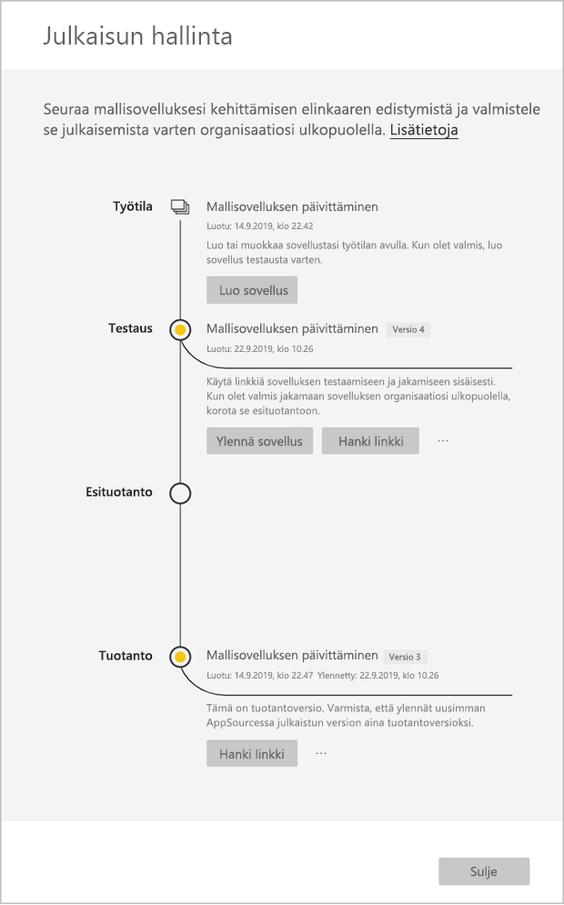

# Mallisovelluksen päivittäminen, poistaminen ja purkaminen

Kun sovelluksesi on nyt tuotantoympäristössä, voit aloittaa alusta testausvaiheessa häiritsemättä tuotantoympäristössä olevaa sovellusta.
## Päivitä sovelluksesi

1. Valitse **Julkaisun hallinta** -ruudussa **Luo sovellus**.
2. Suorita sovelluksen luontiprosessi uudelleen.
3. Kun olet määrittänyt **tuotemerkkiohjeet**, **sisällön**, **hallinnan** ja **käyttöoikeudet**, voit uudelleen valita **Luo sovellus** -vaihtoehdon.
4. Valitse **Sulje** ja palaa **Julkaisun hallintaan**.

   Näkyvillä on nyt kaksi versiota: tuotantoympäristössä oleva versio sekä testausvaiheessa oleva uusi versio.

    

5. Kun olet valmis korottamaan sovelluksesi esituotantoon niin, että sen testausta voidaan jatkaa oman vuokraajasi ulkopuolella, palaa Julkaisun hallinta -ruutuun ja valitse **Testaus**-kohdan vierestä **Korota sovellus**.
6. Linkkisi on nyt aktiivinen. Lähetä se uudelleen pilvikumppaniportaaliin (CPP) [Power BI -sovellustarjouksen päivitys](https://docs.microsoft.com/azure/marketplace/cloud-partner-portal/power-bi/cpp-update-existing-offer) -kohdan ohjeiden mukaisesti.
7. Tarjous on **julkaistava** CPP:ssä ja vahvistettava uudelleen.

>[!NOTE]
>Korota sovellus tuotantovaiheeseen vasta, kun pilvikumppaniportaali on hyväksynyt sovelluksen ja olet julkaissut sen.

## Työtilan purkaminen
Purkutoiminnon ansiosta on nyt entistäkin helpompi palata takaisin mallisovelluksen edelliseen versioon. Erityinen sovellusversio puretaan erilaisista julkaisun vaiheista uuteen työtilaan seuraavasti:

1. Paina Julkaisun hallinta -ruudussa Lisää **(...)**  ja sitten **Pura**.

     
2. Kirjoita valintaikkunaan puretun työtilan nimi. uusi työtila lisätään.

Uuden työtilan versiotiedot nollataan, ja voit jatkaa mallisovelluksen kehittämistä ja jakamista juuri puretusta työtilasta.

## Mallisovellusversion poistaminen
Mallisovelluksen työtila on aktiivisen hajautetun mallisovelluksen lähde. Mallisovelluksen käyttäjien suojaamiseksi työtilaa ei voida poistaa, ellei työtilasta ole ensin poistettu kaikkia luotuja sovellusversioita.
Sovellusversion poistaminen poistaa myös sovelluksen URL-osoitteen, joka ei enää toimi.

1. Paina Julkaisun hallinta -ruudussa kolmea pistettä **(...)**  ja sitten **Poista**.
 
 

>[!NOTE]
>Varmista, ettet poista asiakkaiden tai **AppSourcen** käyttämiä sovellusversioita tai ne eivät enää toimi.

## Seuraavat vaiheet

Ohjeaiheessa [Mallisovellusten asentaminen, mukauttaminen ja jakaminen organisaatiossa](service-template-apps-install-distribute.md) voit selvittää, miten asiakkaasi käsittelevät mallisovellusta.

Lisätietoja sovelluksen jakamisesta on kohdassa [Power BI -sovellustarjous](https://docs.microsoft.com/azure/marketplace/cloud-partner-portal/power-bi/cpp-power-bi-offer).
