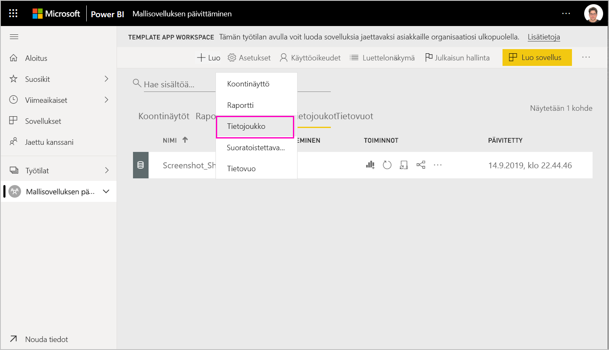
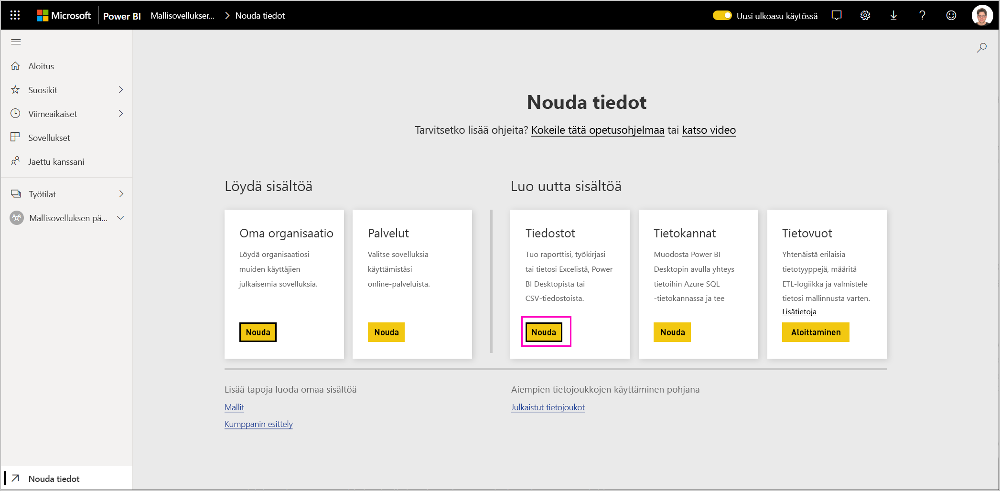
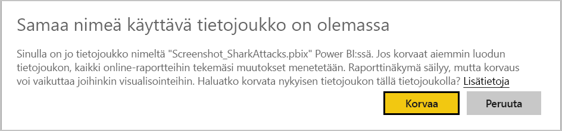
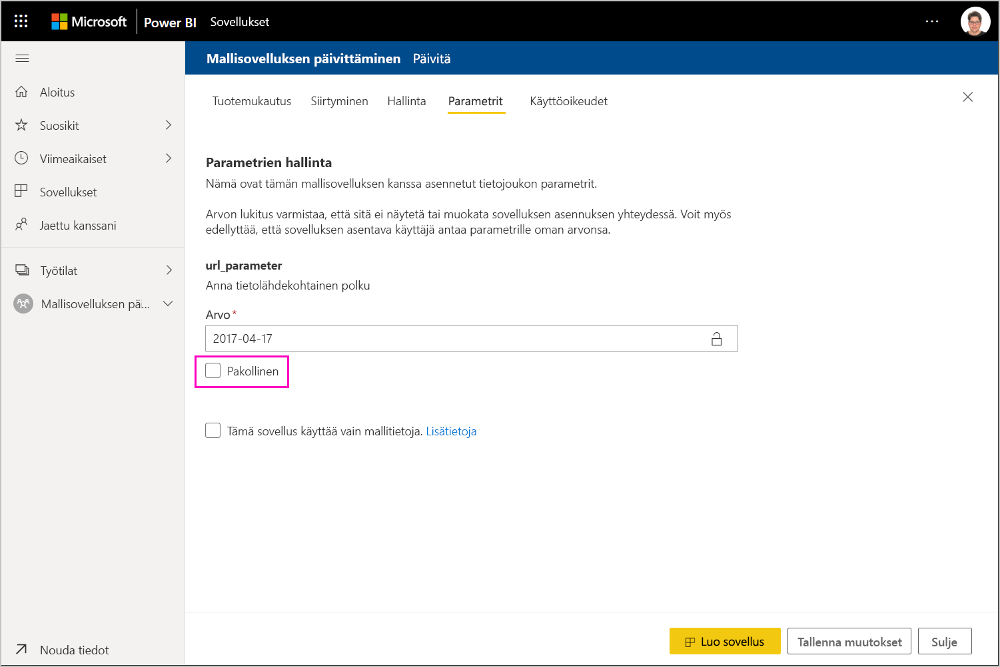

# Mallisovelluksen päivittäminen, poistaminen ja purkaminen

Kun sovelluksesi on nyt tuotantoympäristössä, voit aloittaa alusta testausvaiheessa häiritsemättä tuotantoympäristössä olevaa sovellusta.
## Päivitä sovelluksesi

Jos olet tehnyt muutoksia Power BI Desktopissa, aloita vaiheesta (1). Jos et ole tehnyt muutoksia Power BI Desktopissa, aloita vaiheesta (4).

1. Lataa päivitetty tietojoukko palvelimeen ja korvaa olemassa oleva tietojoukko. **Varmista, että käytät täsmälleen samaa tietojoukon nimeä**. Jos käytät eri nimeä, sovellusta päivittäville käyttäjille luodaan uusi tietojoukko.

1. Tuo pbix-tiedosto tietokoneestasi.

1. Vahvista korvaaminen.

1. Valitse **Julkaisun hallinta** -ruudussa **Luo sovellus**.
1. Suorita sovelluksen luontiprosessi uudelleen.
1. Kun olet määrittänyt **tuotemerkkiohjeet**, **sisällön**, **hallinnan** ja **käyttöoikeudet**, valitse **Luo sovellus** -vaihtoehto uudelleen.
1. Valitse **Sulje** ja palaa **Julkaisun hallintaan**.

   Näkyvillä on nyt kaksi versiota: tuotantoympäristössä oleva versio sekä testausvaiheessa oleva uusi versio.

    

1. Kun olet valmis korottamaan sovelluksesi esituotantoon niin, että sen testausta voidaan jatkaa oman vuokraajasi ulkopuolella, palaa Julkaisun hallinta -ruutuun ja valitse **Testaus**-kohdan vierestä **Korota sovellus**.

   Sinulla on nyt versio tuotannossa ja versio esituotannossa.

   

   Linkkisi on nyt aktiivinen. **Huomaa, että esituotannossa oleva Korota sovellus -painike näkyy harmaana**. Tämä estää nykyisen sovellusversion reaaliaikaisen tuotantolinkin korvaamisen vahingossa, ennen kuin pilvikumppaniportaali on vahvistanut ja hyväksynyt uuden sovellusversion.

1. Lähetä linkki uudelleen pilvikumppaniportaaliin (CPP) [Power BI -sovellustarjouksen päivitys](https://docs.microsoft.com/azure/marketplace/cloud-partner-portal/power-bi/cpp-update-existing-offer) -kohdan ohjeiden mukaisesti. Tarjous on **julkaistava** uudelleen pilvikumppaniportaalissa sekä vahvistettava ja hyväksyttävä.

   Kun tarjouksesi on hyväksytty, Korota sovellus -painike tulee uudelleen aktiiviseksi. 
1. Korota sovelluksesi tuotantovaiheeseen.
   
### Päivityksen toiminta

1. Sovelluksen päivittäminen sallii mallisovelluksen asennusohjelman [päivittää malli sovelluksen](service-template-apps-install-distribute.md#update-a-template-app) jo asennetussa työtilassa ilman yhteyden määrityksen menettämistä.
1. Tutustu asennusohjelman [korvaamisen toimintaan](service-template-apps-install-distribute.md#overwrite-behavior), jos haluat tietää, miten tietojoukon muutokset vaikuttavat asennettuun mallisovellukseen.
1. Kun päivität (korvaat) mallisovelluksen, se palautuu ensin mallitietoihin ja yhdistyy automaattisesti uudelleen käyttäjän määrityksiin (parametrit ja todentaminen). Raportit, koontinäytöt ja organisaation sovellus esittelevät mallitietopalkin, kunnes päivitys on valmis.
1. Jos olet lisännyt uuden kyselyparametrin päivitettyyn tietojoukkoon, joka edellyttää käyttäjien syötteitä, sinun on valittava *pakollinen* valintaruutu. Tämä tuo asentajan näkyviin yhteysmerkkijonon sovelluksen päivittämisen jälkeen.
 

## Työtilan purkaminen
Purkutoiminnon ansiosta on nyt entistäkin helpompi palata takaisin mallisovelluksen edelliseen versioon. Erityinen sovellusversio puretaan erilaisista julkaisun vaiheista uuteen työtilaan seuraavasti:

1. Paina Julkaisun hallinta -ruudussa Lisää **(...)**  ja sitten **Pura**.

     
2. Kirjoita valintaikkunaan puretun työtilan nimi. uusi työtila lisätään.

Uuden työtilan versiotiedot nollataan, ja voit jatkaa mallisovelluksen kehittämistä ja jakamista juuri puretusta työtilasta.

## Mallisovellusversion poistaminen
Mallityötila on aktiivisen hajautetun mallisovelluksen lähde. Mallisovelluksen käyttäjien suojaamiseksi työtilaa ei voida poistaa, ellei työtilasta ole ensin poistettu kaikkia luotuja sovellusversioita.
Sovellusversion poistaminen poistaa myös sovelluksen URL-osoitteen, joka ei enää toimi.

1. Paina Julkaisun hallinta -ruudussa kolmea pistettä **(...)**  ja sitten **Poista**.
 
 

>[!NOTE]
>Varmista, ettet poista asiakkaiden tai **AppSourcen** käyttämiä sovellusversioita tai ne eivät enää toimi.

## Seuraavat vaiheet

Ohjeaiheessa [Mallisovellusten asentaminen, mukauttaminen ja jakaminen organisaatiossa](service-template-apps-install-distribute.md) voit selvittää, miten asiakkaasi käsittelevät mallisovellusta.

Lisätietoja sovelluksen jakamisesta on kohdassa [Power BI -sovellustarjous](https://docs.microsoft.com/azure/marketplace/cloud-partner-portal/power-bi/cpp-power-bi-offer).
