# Power BI -palvelussa liikkuminen
## Vasen siirtymisruutu

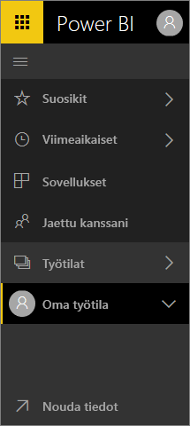

**Pikaopas**

| Toiminto | Uusi (nykyinen) polku |
| --- | --- | --- |
| Koontinäytön tai raportin lisääminen suosikkeihin |Työtila > Koontinäytöt tai Työtila > Raportit ja valitse tähtikuvake, niin se muuttuu keltaiseksi |
| Sovelluksen lisääminen suosikkeihin | Valitse **Sovellukset** vasemmasta siirtymisruudusta ja valitse sovelluksen nimen vieressä oleva tähti
| Näytä Suosikit-luettelo |Valitse **Suosikit** vasemmasta siirtymisruudusta |
| Näytä äskettäin käytettyjen koontinäyttöjen ja raporttien luettelo |Valitse **Viimeisimmät** vasemmasta siirtymisruudusta |
| Näytä kanssasi jaettujen koontinäyttöjen luettelo |Valitse **Jaettu kanssani** vasemmasta siirtymisruudusta |
| Jaa koontinäyttö |Avaa koontinäyttö ja valitse **Jaa** tai luo ja julkaise sovellus |
| Poista koontinäyttö |Oma työtila > Koontinäytöt > roskakorikuvake |
| Poista raportti |Oma työtila > Raportit > roskakorikuvake |
| Poista tietojoukko |Oma työtila > Tietojoukot > ... > Poista |
| Avaa koontinäyttö |Työtila > Koontinäytöt > ja valitse koontinäytön nimi |
| Avaa raportti |Työtila > Raportit > ja valitse raportin nimi |
| Avaa tietojoukko |Työtila > Tietojoukot > ja valitse tietojoukon nimi |
| Luo koontinäyttö |Valitse yläsiirtymispalkista Luo > Koontinäyttö |
| Luo raportti |Valitse yläsiirtymispalkista Luo > Raportti |
| Luo tietojoukko |Valitse yläsiirtymispalkista Luo > Tietojoukko |
| Luo sovellus |Työtilat > Luo sovellustyötila |
| Näytä kaikkien omistamiesi koontinäyttöjen, raporttien ja tietojoukkojen luettelo |Työtilat > Oma työtila |

## Yleiset tehtävät

Katso, miten Amanda esittelee Power BI -palvelun siirtymistoiminnot.  Kokeile sen jälkeen itse noudattamalla videon alapuolella olevia vaiheittaisia ohjeita.

<iframe width="560" height="315" src="https://www.youtube.com/embed/G26dr2PsEpk" frameborder="0" allowfullscreen></iframe>

## Näytä sisältö (koontinäytöt, raportit, työkirjat, tietojoukot, työtilat, sovellukset)
Aloitetaan katsomalla, miten perussisältö (koontinäytöt, raportit, tietojoukot, työkirjat) on järjestetty. Ennen tätä kaikki sisältösi oli lueteltu vasemmassa siirtymisruudussa. Sinulla on edelleen tämä mahdollisuus, mutta oletuksena on näyttö sisältötyypin mukaan työtilassa. Valitse työtila vasemmassa siirtymisruudussa (vasen siirtymisruutu) ja siihen liittyvän sisällön välilehdet (koontinäytöt, raportit, työkirjat, tietojoukot) täyttävät oikealla olevan Power BI -pohjan.

Jos sinulla on ilmainen Power BI, näet vain yhden työtilan, joka on **Oma työtila**.

### Suosikkikoontinäytöt, -raportit ja -sovellukset
**Suosikkien** avulla pääset nopeasti käyttämään itsellesi tärkeää sisältöä.  

1. Kun koontinäyttö tai raportti on auki, valitse **Lisää suosikkeihin** oikeasta yläkulmasta.
   
   
   
   **Lisää suosikkeihin** -kohdan tilalle tulee **Poista suosikeista** ja tähtikuvake muuttuu keltaiseksi.
   
   

2. Sovelluksen kohdalla valitse **Sovellukset** vasemmasta siirtymisruudusta, vie hiiren osoitin sovelluksen päälle ja aseta se suosikiksi valitsemalla tähti.

2. Jos haluat nähdä luettelon kaikesta suosikeiksi lisätystä sisällöstä, valitse vasemmassa siirtymisruudussa **Suosikit**-kohdan oikealla puolella oleva nuoli. Vasen siirtymisruutu on Power BI -palvelun pysyvä ominaisuus, joten voit käyttää luetteloa Power BI -palvelun missä tahansa kohdassa.
   
    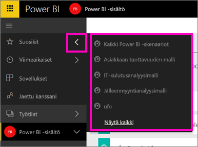
   
    Tästä voit valita ja avata koontinäytön, raportin tai sovelluksen.

3. Voit avata **Suosikit**-ruudun valitsemalla vasemmassa siirtymisruudussa **Suosikit** tai valitsemalla Suosikit-kuvakkeen .
   
   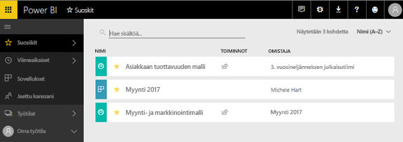
   
   Tästä voit avata ja etsiä sisältöä, poistaa sisältöä suosikeista tai jakaa sisältöä työtovereiden kanssa.

1. Koontinäytön tai raportin voi merkitä suosikiksi myös työtilan **Koontinäytöt**- tai **Raportit**-välilehdessä.  Näytä sisältönäkymä avaamalla työtila, ja valitse nimen vasemmalla puolella oleva tähtikuvake.
   
   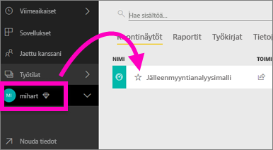

Katso lisätietoja artikkelista [Suosikit](service-dashboard-favorite.md)

### Viimeisimmät
Avaa nopeasti viimeksi käyttämäsi sisältö **Viimeisimmät**-ruudun kautta. Tässä on sisältöä kaikista työtiloistasi.

  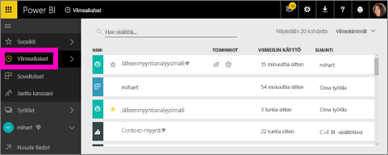

Suosikkien tapaan voit nopeasti käyttää myös viimeksi avaamaasi sisältöä missä tahansa Power BI -palvelun kohdassa valitsemalla vasemmassa siirtymisruudussa **Viimeisimmät**-kohdan vieressä olevan nuolen.

  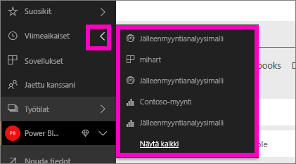

Katso lisätietoja artikkelista [Viimeisimmät Power BI:ssä](service-recent.md)

### Sovellukset
Sovellus on kokoelma koontinäyttöjä ja raportteja, joiden avulla voit nähdä keskeiset mittaluvut yhdestä paikasta. Sinulla voi olla organisaation sisäisiä sovelluksia sekä myös [ulkoisten palveluiden sovelluksia](service-connect-to-services.md), kuten Google Analytics ja Microsoft Dynamics CRM. 

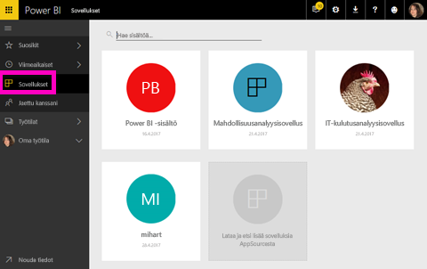

Katso lisätietoja artikkeleista **Sovellustyötilat** (alla) ja [Mitä Power BI -sovellukset ovat](service-install-use-apps.md).

### Jaettu kanssani
**Jaettu kanssani** -sijainnissa on kaikki työtovereiden kanssasi jakama sisältö.  Voit suodattaa koontinäytön omistajan mukaan, etsiä kiinnostavaa sisältöä hakukentän avulla ja lajitella kohteet päivämäärän mukaan.  Ja pystyt entistä helpommin lisäämään usein käyttämääsi jaettua sisältöä suosikkeihin suoraan **Jaettu kanssani** -näkymästä.

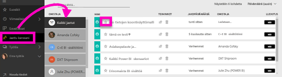

Katso lisätietoja artikkelista [Jaettu kanssani](service-shared-with-me.md)

### Työtilojen käyttäminen
Vasemmassa siirtymisruudussa on seuraavaksi *työtilat*. Työtilojen voi ajatella olevan Power BI -sisällön *säilöjä*. Työtiloja on kahdenlaisia: **Oma työtila** ja sovellustyötilat.

Jos et ole minkään sovellustyötilan jäsen tai järjestelmänvalvoja, vasemmassa siirtymisruudussa ei ehkä näy sovellustyötiloja. Jos käytät ilmaista Power BI -palvelua, et näe sovellustyötiloja.

#### Oma työtila
**Oma työtila** -sijaintiin voit tallentaa kaiken omistamasi sisällön. Ajattele sitä oman sisältösi henkilökohtaisena eristyksenä tai työskentelyalueena. Voit jakaa Oman työtilan sisältöä työtovereiden kanssa. Sisältö on jaettu Omassa työtilassa neljään välilehteen: Koontinäytöt, Raportit, Työkirjat ja Tietojoukot.

#### Sovellustyötilat
Sovellukset ja sovellustyötilat ovat Power BI Pron ominaisuuksia. Jos luot koontinäyttöjä ja raportteja muille, teet ne sovellustyötiloissa. Sovellustyötila on paikka, jossa sovellus luodaan, joten jos haluat luoda sovelluksen, sinun on ensin luotava sovellustyötila. Ne ovat ryhmätyötilojen seuraava kehitysaste – ne ovat sovelluksen sisällön valmistelualueita ja säilöjä.  Sinä ja työtoverisi voitte tehdä yhteistyötä koontinäyttöjen, raporttien tai muiden sisältöjen parissa, jotka aiotte jakaa laajemmalle kohderyhmälle tai jopa koko organisaatiolle.

Lisätietoja on artikkelissa [Sovelluksen luominen ja jakaminen Power BI:ssä](service-create-distribute-apps.md#app-workspaces).

**Oman työtilan** tapaan sisältö on jaettu neljään välilehteen: Koontinäytöt, Raportit, Työkirjat ja Tietojoukot.

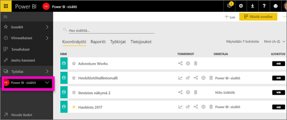

Vaihda työtilaa valitsemalla vasemmassa siirtymisruudussa **Työtilat**.

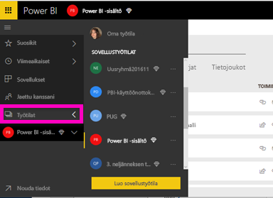

### Hae ja lajittele sisältöä
Sisältönäkymässä on helpompi hakea, suodattaa ja lajitella sisältöä. Jos haluat hakea koontinäyttöä, raporttia tai työkirjaa, kirjoita hakualueelle. Power BI suodattaa ja näyttää vain sisällön, jonka nimessä on kirjoittamasi hakumerkkijono.

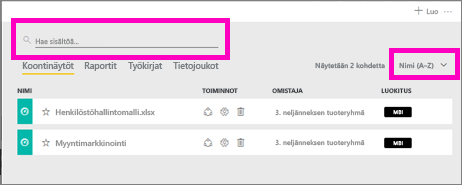

Voit lajitella sisällön myös nimen tai omistajan mukaan.  

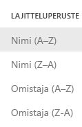

Lisätietoja on artikkelissa [Power BI -siirtyminen: haku, lajittelu, suodatus](service-navigation-search-filter-sort.md)

## Seuraavat vaiheet
Power BI -palvelun [peruskäsitteet](service-basic-concepts.md)    

Onko sinulla kysyttävää tai haluatko antaa palautetta? [Käy Power BI -yhteisön keskustelupalstalla](http://community.powerbi.com/t5/Navigation-Preview-Forum/bd-p/NavigationPreview)

