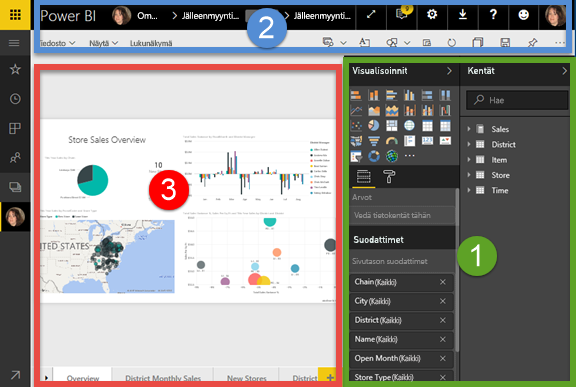
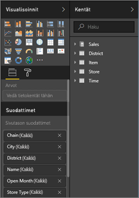
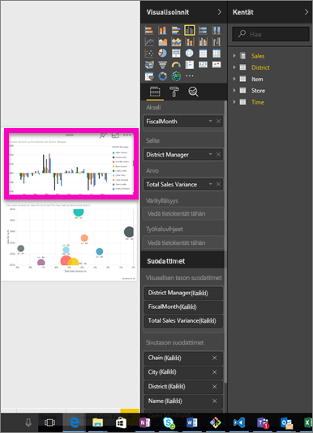
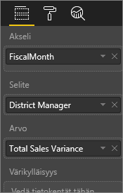
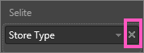
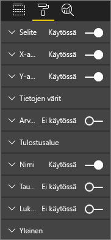
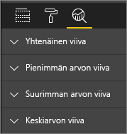
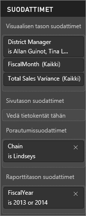
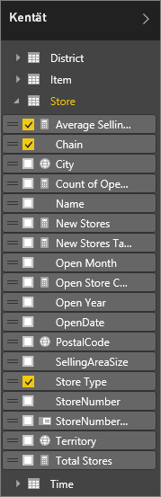

# Raporttieditori: esittely
## Raporttien muokkaus Power BI -palvelussa ja Power BI Desktopissa
Power BI -palvelun raporttieditori ja Power BI Desktopin raporttieditori ovat hyvin samankaltaisia. Videossa näytetään Power BI Desktopin raporttieditori ja tässä artikkelissa näytetään Power BI -palvelun raporttieditori. 

## Raportin *laatijoiden* ja raportin *käyttäjien* välinen ero
Vain raportin omistajat (eli raportin *laatijat*) voivat laatia ja muokata raportteja. Jos *käytät* raporttia, joka on jaettu kanssasi, voit yhä avata raportin ja käsitellä sitä Power BI -palvelussa [vain lukunäkymässä](consumer/end-user-reading-view.md). Et voi kuitenkaan hyötyä kaikista niistä tehokkaista ja laajoista ominaisuuksista, jotka ovat saatavilla raportin laatijalle.  

Löydät lisätietoja raportin lukunäkymästä artikkelista [Power BI -palvelun luku- ja muokkausnäkymä](consumer/end-user-reading-view.md). 

<iframe width="560" height="315" src="https://www.youtube.com/embed/IkJda4O7oGs" frameborder="0" allowfullscreen></iframe>

Power BI-palvelussa *raporttieditori* on saatavilla vain [muokkausnäkymässä](consumer/end-user-reading-view.md). Jotta voit avata raportin muokkausnäkymässä, sinun on oltava raportin omistaja tai laatija.

Power BI -raporttieditorissa on kolme osaa:  

1. **Kentät**-, **Visualisoinnit**- ja **Suodattimet**-ruudut.
2. yläosan siirtymispalkit    
3. raportin piirtoalusta     

## 1. Raporttieditorin ruudut

Kun avaat raportin ensimmäistä kertaa, näet kolme ruutua: Visualisoinnit, Suodattimet ja Kentät. Vasemmanpuoleisten Visualisoinnit- ja Suodattimet-ruutujen avulla hallitaan visualisointien ulkoasua – tyyppiä, värejä, suodatusta ja muotoilua.  Oikeanpuoleisen Kentät-ruudun avulla hallitaan visualisoinneissa käytettäviä pohjatietoja. 

Raporttieditorissa näytetty sisältö vaihtelee raportin piirtoalustassa tehtyjen valintojen mukaan.  Kun esimerkiksi valitset yksittäisen visualisoinnin: 

|  |  |
| --- | --- |
|  |<ul><li>Visualisointi-ruudun yläosassa määritetään käytettävän visualisoinnin tyyppi eli tässä esimerkissä yhdistelmäpylväskaavio.  </li> <li>Visualisointi-ruudun alaosassa (sinun on ehkä vieritettävä alaspäin) näytetään visualisoinnissa käytettävät kentät. Tässä kaaviossa käytetään Verokuukausi-, Aluepäällikkö- ja  Kokonaismyyntivaihtelu-kenttiä.   </li><li>Suodattimet-ruudussa (sinun on ehkä vieritettävä alaspäin) näytetään kaikki sovelletut suodattimet.   </li><li>Kentät-ruudussa luetteloidaan saatavilla olevat taulukot ja, jos laajennat taulukon nimeä, tämän taulukon perustana olevat kentät. Keltainen fontti kertoo, että visualisoinnissa käytetään vähintään yhtä tämän taulukon kenttää.  </li><li> Voit näyttää valitun visualisoinnin muotoiluruudun valitsemalla maalirullakuvakkeen.  </li><li> Voit näyttää Analytiikka-ruudun valitsemalla suurennuslasikuvakkeen.</ul> |

## Visualisoinnit-ruutu (ylhäältä alaspäin)

Voit täällä valita visualisointityypin. Pieniä kuvia kutsutaan *malleiksi*. Yllä olevassa kuvassa on valittu yhdistelmäpalkkikaavio. Jos et valitse ensin visualisointityyppiä vaan alat sen sijaan luoda visualisointia valitsemalla kentät, Power BI poimii visualisointityypin puolestasi. Voit pitää Power BI:n valinnan tai vaihtaa tyyppiä valitsemalla eri mallin. Voit vaihtaa mallia niin monta kertaa kuin tarvitset, jotta löydät tietojasi parhaiten vastaavan visualisointityypin.

### Hallitse visualisoinnissa käytettäviä kenttiä.

Tässä ruudussa näytetyt säilöt (joita kutsutaan joskus *lähteiksi*) vaihtelevat valitsemasi visualisointityypin mukaan.  Jos valitsit esimerkiksi palkkikaavion, näet säilöt Arvot-, Akseli- ja Selite-kentille. Kun valitset kentän tai vedät sen piirtoalustalle, Power BI lisää tämän kentän yhteen säilöistä.  Voit myös vetää kentät Kentät-luettelosta suoraan säilöihin.  Jotkin säilöt on rajoitettu tietyntyyppisiin tietoihin.  Esimerkiksi **Arvot**-kenttään ei hyväksytä ei-numeerisia kenttiä. Jos siis vedät **Työntekijän nimi** -kentän **Arvot**-säilöön, Power BI muuttaa sen **Työntekijän nimen lukumäärä** -kentäksi.

### Kentän poistaminen
Voit poistaa kentän visualisoinnista valitsemalla **X** kentän nimen oikealta puolelta.

Katso lisätietoja artikkelista [Visualisointien lisääminen Power BI -raporttiin](visuals/power-bi-report-add-visualizations-i.md).

### Visualisointien muotoileminen
Voit näyttää Muotoilu-ruudun valitsemalla maalirullakuvakkeen. Saatavilla oleva vaihtoehto riippuu valitun visualisoinnin tyypistä.

Muotoilumahdollisuudet ovat lähes loputtomat.  Saat lisätietoja tutustumalla aiheeseen omatoimisesti tai lukemalla seuraavat artikkelit:

* [Visualisoinnin otsikon, taustan ja selitteen mukauttaminen](visuals/power-bi-visualization-customize-title-background-and-legend.md)
* [Värin muotoileminen](visuals/service-getting-started-with-color-formatting-and-axis-properties.md)
* [X-akselin ja Y-akselin ominaisuuksien mukauttaminen](visuals/power-bi-visualization-customize-x-axis-and-y-axis.md)

### Analytiikan lisääminen visualisointeihin
Voit näyttää Analytiikka-ruudun valitsemalla suurennuslasikuvakkeen. Saatavilla oleva vaihtoehto riippuu valitun visualisoinnin tyypistä.

    
Power BI -palvelun Analytiikka-ruudussa voit lisätä dynaamisia viiteviivoja visualisointeihin ja määrittää kohdistuksen tärkeille trendeille tai merkityksellisille tiedoille. Lisätietoja on artikkelissa [Power BI -palvelun Analytiikka-ruutu](service-analytics-pane.md) tai [Power BI Desktopin Analytiikka-ruutu](desktop-analytics-pane.md).

- - -
## Suodattimet-ruutu
Voit Suodattimet-ruudun avulla tarkastella, määrittää ja muokata raporttien pysyviä suodattimia sivun, raportin, porautumisen ja visualisoinnin tasolla. Kyllä, voit suodattaa myös tilapäisesti raportin sivuja ja visualisointeja valitsemalla visualisoinnin elementit tai käyttämällä osittajien kaltaisia työkaluja. Kun käytät Suodattimet-ruutua, suodattimien tila tallennetaan kuitenkin raportin kanssa. 

Suodattimet-ruudulla on myös toinen tehokas ominaisuus eli voit suodattaa käyttämällä kenttää ***, jota ei jo käytetä raportin yhdessä visualisoinnissa***. Selvitän tätä tarkemmin. Kun luot raportin sivun, Power BI lisää automaattisesti kaikki käyttämäsi kentät visualisointeihin Suodattimet-ruudun Visualisointi-tason suodatinalueella.  Jos haluat määrittää visualisoinnin, sivun, porauksen tai raportin suodattimen käyttämällä kenttää, jota ei tällä hetkellä käytetä visualisoinnissa, vedä se yhteen Suodattimet-säilöistä.   

Katso lisätietoja artikkelista [Suodattimen lisääminen raporttiin](power-bi-report-add-filter.md).

- - -
## Kentät-ruutu
Kentät-ruudussa näytetään tiedoissasi olevat taulukot ja kentät, joiden avulla voit luoda visualisointeja.

|  |  |
| --- | --- |
|  |<ul><li>Voit aloittaa uuden visualisoinnin vetämällä kentän sivulle.  Voit myös vetää kentän aiemmin luotuun visualisointiin, jos haluat lisätä kentän tähän visualisointiin.  </li> <li>Kun lisäät valintamerkin kentän viereen, Power BI lisää tämän kentän aktiiviseen (tai uuteen) visualisointiin. Se myös päättää, mihin säilöön tämä kenttä sijoitetaan.  Esimerkiksi pitäisikö käyttää Selite-, Akseli- vai Arvo-kenttää? Power BI tekee parhaan arvauksen, ja voit siirtää sen tästä säilöstä toiseen tarvittaessa.   </li><li>Kummassakin tapauksessa kukin valittu kenttä lisätään Visualisoinnit-ruutuun raporttieditorissa.</li></ul> |

**HUOMAUTUS**: Jos käytät Power BI Desktopia, voit myös näyttää/piilottaa kentät, lisätä laskutoimituksia jne.

### Mitä kentän kuvakkeet tarkoittavat?
* **∑ Koosteet** Kooste on numeerinen arvo, joka esimerkiksi ynnätään yhteen tai pyöristetään keskiarvoksi. Koosteita tuodaan yhdessä tietojen kanssa (määritetty tietomallissa, johon raportti perustuu).
  Katso lisätietoja artikkelista [Power BI -raporttien koosteet](service-aggregates.md).
*  **Lasketut mitat (kutsutaan myös lasketuiksi kentiksi)**  
   Jokaisella lasketulla kentällä on oma pysyväiskoodattu kaavansa. Et voi muuttaa laskutoimitusta. Jos se on  esimerkiksi summa, se voi olla vain summa. Saat lisätietoja artikkelista [Mittayksikköjen ymmärtäminen](desktop-measures.md).
*  **Yksilölliset kentät**  
   Tämän kuvakkeen kentät on tuotu Excelistä ja ne on määritetty näyttämään kaikki arvot, vaikka niillä olisi kaksoiskappaleita. Tiedoissa voi olla esimerkiksi kaksi tietuetta henkilölle nimeltä ”Matti Virtanen”, ja jokaista niistä käsitellään yksilöllisenä, eikä niitä lasketa yhteen.  
* ** Maantiede-kentät**  
   Voit sijainnin kenttien avulla luoda karttavisualisointeja. 
* ** Hierarkia**  
   Valitse nuoli, jotta näet kentät, jotka muodostavat hierarkian. 

- - -
## 2. Yläreunan siirtymispalkki
Yläreunan siirtymispalkissa on useita toimintoja, joita lisätään koko ajan. Saat lisätietoja tietystä toiminnosta Power BI -dokumentaation sisällysluettelosta tai hakuruudusta.

## 3. Raportin piirtoalusta
Työsi tulee näkyviin raportin piirtoalustalle. Kun luot visualisointeja Kentät-, Suodattimet- ja Visualisoinnit-ruutujen avulla, visualisoinnit näytetään raportin piirtoalustalla. Piirtoalustan alareunan jokainen välilehti edustaa raportin sivua. Avaa tämä sivu valitsemalla välilehti. 

## Seuraavat vaiheet:
[Raportin luominen](service-report-create-new.md)

Lue lisää raporteista artikkeleista [Power BI -palvelu](consumer/end-user-reports.md), [Power BI Desktop](desktop-report-view.md) ja [Power BI -mobiilisovellus](consumer/mobile/mobile-apps-view-phone-report.md).

[Power BI:n peruskäsitteet](consumer/end-user-basic-concepts.md)

Onko sinulla muuta kysyttävää? [Kokeile Power BI -yhteisöä](http://community.powerbi.com/)

