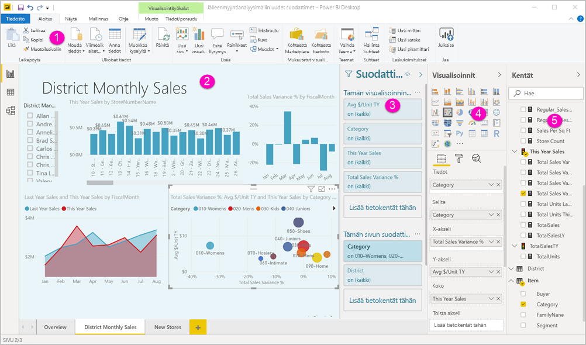
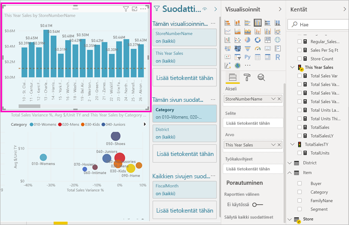
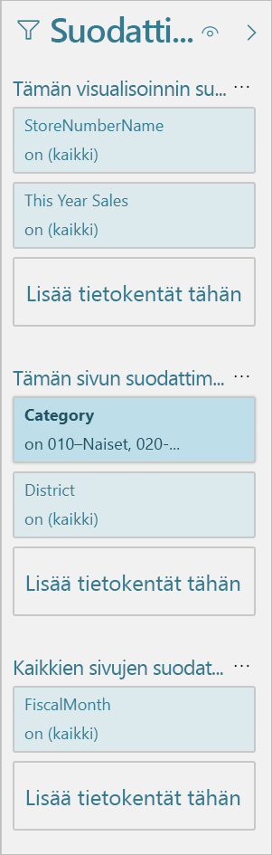
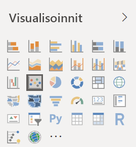
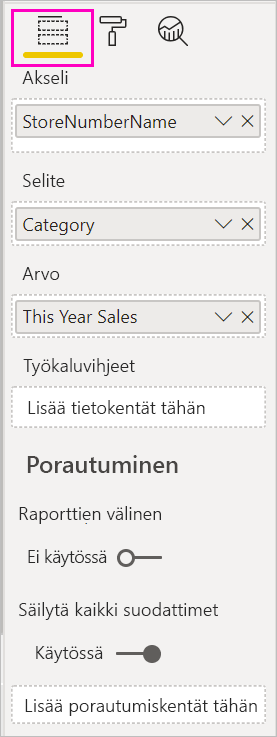
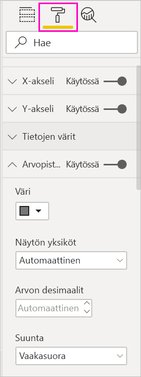
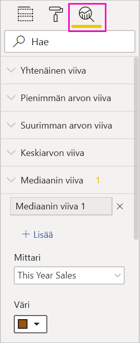
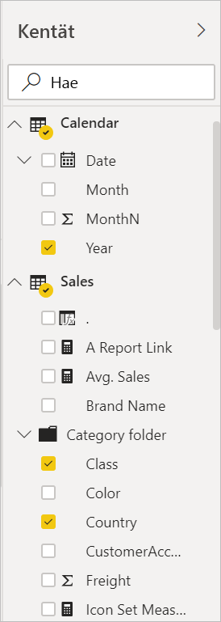

# Power BI -raporttieditoriin tutustuminen

Power BI Desktopissa ja Power BI -palvelussa voit rakentaa loppukäyttäjien näkemät raportit *raporttieditorissa* käyttämällä kaavioita, taulukoita, karttoja ja muita visualisointeja. Se on samankaltainen kummassakin ympäristössä. Aloitat tavallisesti raportin luomisen Power BI Desktopissa. Seuraavaksi julkaiset sen Power BI -palveluun, jossa voit jatkaa sen muokkaamista. Power BI -palvelussa luot myös raportteihisi perustuvat koontinäytöt.

Kun olet luonut koontinäyttöjä ja raportteja, jaat ne raporttien kuluttajille. Jakamistavan mukaan loppukäyttäjät voivat käsitellä niitä Power BI -palvelun lukunäkymässä, mutta eivät muokata. Lue lisää siitä, [mitä raporttien käyttäjät voivat tehdä Power BI -palvelussa](consumer/end-user-reading-view.md). 

Tässä videossa näytetään Power BI Desktopin raporttieditori. Tässä artikkelissa näytetään myös Power BI Desktopin raporttieditori. 

<iframe width="560" height="315" src="https://www.youtube.com/embed/IkJda4O7oGs" frameborder="0" allowfullscreen></iframe>

Power BI -palvelun raporttieditori on saatavilla vain muokkausnäkymässä. Jotta voit avata raportin muokkausnäkymässä, sinun on oltava raportin omistaja tai tekijä tai sen työtilan käyttäjä, jossa raporttia säilytetään.

Power BI:n raporttieditori on jaettu useisiin pääosiin:  

1. Yläreunan siirtymisruutu
1. Raportin pohja
1. Suodattimet-ruutu
1. Visualisoinnit-paneeli
1. Kentät-ruutu

## 1. Yläreunan siirtymisruutu
Yläreunan siirtymisruudussa on useita toimintoja, joita lisätään koko ajan. Saat lisätietoja tietystä toiminnosta Power BI -dokumentaation sisällysluettelosta tai hakuruudusta.

## 2. Raportin piirtoalusta
Työsi tulee näkyviin raportin piirtoalustalle. Kun luot visualisointeja Kentät-, Suodattimet- ja Visualisoinnit-ruutujen avulla, visualisoinnit näytetään raportin piirtoalustalla. Piirtoalustan alareunan jokainen välilehti edustaa raportin sivua. Avaa tämä sivu valitsemalla välilehti. 

## Raporttieditorin ruudut

Kolme ruutua näkyvät, kun avaat raportin ensimmäistä kertaa: Suodattimet, Visualisoinnit ja Kentät. Kaksi ensimmäistä ruutua vasemmalla (Visualisoinnit ja Suodattimet) hallitsevat visualisointien ulkoasua – tyyppiä, värejä, suodatusta ja muotoilua. Oikeanpuoleisen Kentät-ruudun avulla hallitaan visualisoinneissa käytettäviä pohjatietoja. Raporttieditorissa näytetty sisältö vaihtelee raportin piirtoalustassa tehtyjen valintojen mukaan. 

Kun esimerkiksi valitset yksittäisen visualisoinnin, kuten tämän pylväskaavion:

**Suodattimet-ruutu** näyttää visualisoinnin, sivun tai kaikkien sivujen suodattimet. Tässä tapauksessa sivutason suodattimia on, mutta visualisointitason suodattimia ei ole.

**Visualisointi-ruudun yläosassa** määritetään käytettävän visualisoinnin tyyppi. Tässä esimerkissä se on klusteroitu pylväskaavio. 

**Visualisointi-ruudun alaosassa** on kolme välilehteä:

 **Kentät** näyttää visualisoinnin kentät. Saatat joutua vierittämään alaspäin, jotta näet kaikki tiedot. Tässä kaaviossa on käytössä MyymälänNumeroNimi ja Tämän vuoden myynti.

 **Muotoilu** Voit näyttää valitun visualisoinnin muotoiluruudun valitsemalla maalirullakuvakkeen.

 **Analysointi** Voit näyttää Analysointi-ruudun valitsemalla suurennuslasikuvakkeen.

**Kentät-ruudussa** on luettelo kaikista tietomallin käytettävissä olevista taulukoista. Kun laajennat taulukon, näet kentät kyseisessä taulukossa. Keltainen valintamerkki kertoo, että visualisoinnissa on vähintään yksi tämän taulukon kenttä.

Lue lisätietoja kustakin ruudusta.

## 3. Suodattimet-ruutu
Voit Suodattimet-ruudun avulla tarkastella, määrittää ja muokata raporttien pysyviä suodattimia sivun, raportin, porautumisen ja visualisoinnin tasolla. Kyllä, voit suodattaa myös tilapäisesti raportin sivuja ja visualisointeja valitsemalla visualisoinnin elementit tai käyttämällä osittajien kaltaisia työkaluja. Suodattimet-ruudussa olevan suodatuksen etuna on, että suodattimien tila tallennetaan raportin mukana. 

Suodattimet-ruudulla on myös toinen tehokas ominaisuus: voit suodattaa käyttämällä kenttää, *jota ei jo käytetä raportin visualisoinneissa*. Selvitän tätä tarkemmin. Kun luot visualisoinnin, Power BI lisää automaattisesti kaikki visualisoinnissa käyttämäsi kentät Suodattimet-ruudun visualisointitason suodatinalueelle. Jos haluat määrittää visualisoinnin, sivun, porauksen tai raportin suodattimen käyttämällä kenttää, jota ei tällä hetkellä käytetä visualisoinnissa, vedä se johonkin Suodattimet-säilöön.

Uusi suodatuskokemus on entistä joustavampi. Voit esimerkiksi muotoilla uusia suodattimia niin, että ne näyttävät samalta kuin itse raportti. Voit myös lukita suodattimia tai piilottaa ne raportin kuluttajilta. 

Lue lisää [uudesta suodatuskokemuksesta](power-bi-report-filter.md).

## 4. Visualisoinnit-ruutu

Visualisoinnit-ruudussa on neljä osaa. Aloitamme ruudun yläreunasta.

Valitset täällä visualisointityypin. Pienet kuvakkeet näyttävät luotavissa olevat erityyppiset visualisoinnit. Yllä olevassa kuvassa on valittu kuplakaavio. Jos aloitat visualisoinnin rakentamisen valitsemalla kenttiä ilman että valitset ensin visualisointityypin, Power BI valitsee visualisointityypin puolestasi. Voit pitää Power BI:n valinnan tai vaihtaa tyyppiä valitsemalla eri kuvakkeen.

Voit ladata mukautettuja visualisointeja Power BI Desktopiin. Myös niiden kuvakkeet näkyvät tässä ruudussa. 

### Visualisoinnin kenttien hallinta

Tämän ruudun säilöt (joita kutsutaan joskus *lähteiksi*) vaihtelevat valitsemasi visualisointityypin mukaan.  Jos valitsit esimerkiksi palkkikaavion, näet kohdat Akseli, Selite ja Arvot. Kun valitset kentän tai vedät sen pohjaan, Power BI lisää tämän kentän yhteen säilöistä.  Voit myös vetää kentät Kentät-luettelosta suoraan säilöihin.  Jotkin säilöt on rajoitettu tietyntyyppisiin tietoihin.  Esimerkiksi **Arvot**-kenttään ei hyväksytä ei-numeerisia kenttiä. Jos siis vedät **Luokka**-kentän **Arvot**-säilöön, Power BI muuttaa sen **Luokkamäärä**-kentäksi.

Lisätietoja on artikkelissa [Visualisointien lisääminen Power BI -raporttiin](visuals/power-bi-report-add-visualizations-i.md).

Ruudun tässä osassa on myös vaihtoehtoja, joilla hallitaan [porauksen](desktop-drillthrough.md) ja suodatuksen toimintaa.

### Visualisointien muotoileminen
Voit näyttää Muotoilu-ruudun valitsemalla maalirullakuvakkeen. Saatavilla olevat vaihtoehdot riippuvat valitun visualisoinnin tyypistä.

Muotoilumahdollisuuksia on paljon.  Saat lisätietoja tutustumalla aiheeseen omatoimisesti tai lukemalla seuraavat artikkelit:

* [Visualisoinnin otsikon, taustan ja selitteen mukauttaminen](visuals/power-bi-visualization-customize-title-background-and-legend.md)
* [Värin muotoileminen](visuals/service-getting-started-with-color-formatting-and-axis-properties.md)
* [X-akselin ja Y-akselin ominaisuuksien mukauttaminen](visuals/power-bi-visualization-customize-x-axis-and-y-axis.md)

### Analytiikan lisääminen visualisointeihin
Voit näyttää Analytiikka-ruudun valitsemalla suurennuslasikuvakkeen. Saatavilla olevat vaihtoehdot riippuvat valitun visualisoinnin tyypistä.

Power BI -palvelun Analytiikka-ruudussa voit lisätä dynaamisia viiteviivoja visualisointeihin ja määrittää kohdistuksen tärkeille trendeille tai merkityksellisille tiedoille. Lisätietoja on artikkelissa [Analytiikkaruutu Power BI Desktopissa](desktop-analytics-pane.md).

## 5. Kentät-ruutu
Kentät-ruudussa näytetään tiedoissasi olevat taulukot, kansiot ja kentät, joiden avulla voit luoda visualisointeja.

|  |  |
| --- | --- |
|  |<ul><li>Voit aloittaa uuden visualisoinnin vetämällä kentän sivulle.  Voit myös vetää kentän aiemmin luotuun visualisointiin, jos haluat lisätä kentän tähän visualisointiin.  </li> <li>Kun lisäät valintamerkin kentän viereen, Power BI lisää tämän kentän aktiiviseen (tai uuteen) visualisointiin. Se myös päättää, mihin säilöön tämä kenttä sijoitetaan.  Esimerkiksi pitäisikö käyttää Selite-, Akseli- vai Arvo-kenttää? Power BI tekee parhaan arvauksen, ja voit siirtää sen tästä säilöstä toiseen tarvittaessa.   </li><li>Kummassakin tapauksessa kukin valittu kenttä lisätään Visualisoinnit-ruutuun raporttieditorissa.</li></ul> |

Power BI Desktopissa voit myös näyttää/piilottaa kentät, lisätä laskutoimituksia jne.

## Kenttäkuvakkeet

Power BI käyttää useita eri kuvakkeita raportin kenttätyyppien ilmaisemiseen. Kun tunnistat ne, ymmärrät paremmin, miten ne toimivat eri visualisoinneissa. Seuraavassa on muutamia yleisiä kuvakkeita.

|Kuvake  |Merkitys  |
|---------|---------|
|  | Kansio Kentät-luettelossa |
| | Numeerinen kenttä: Numeeriset kentät ovat koosteita, joista voidaan laskea esimerkiksi summa tai keskiarvo. Koosteita tuodaan yhdessä tietojen kanssa ja ne on määritetty tietomallissa, johon raportti perustuu. Katso lisätietoja artikkelista [Power BI -raporttien koosteet](service-aggregates.md). |
| | Laskettu sarake, jonka tietotyyppi on muu kuin numeerinen: Uusi muu kuin numeerinen sarake, jonka luot Data Analysis Expressions (DAX) -kaavalla, joka määrittää sarakkeen arvot. Lue lisää [lasketuista sarakkeista](desktop-calculated-columns.md). |
|     |   Numeerinen laskettu sarake: Uusi sarake, jonka luot Data Analysis Expressions (DAX) -kaavalla, joka määrittää sarakkeen arvot. Lue lisää [lasketuista sarakkeista](desktop-calculated-columns.md). |
| |  Mittari: Mittarilla on oma pysyväiskoodattu kaavansa. Et voi muuttaa laskutoimitusta. Jos se on  esimerkiksi summa, se voi olla vain summa. Arvoja ei tallenneta sarakkeeseen. Ne lasketaan lennossa sen mukaan, mikä on niiden sijainti visualisoinnissa. Lisätietoja on artikkelissa [Mittarien ymmärtäminen](desktop-measures.md). |
|     | Mittariryhmä  |
| |      Suorituskykyilmaisin: Visuaalinen vihje, joka kertoo edistymisen määrän kohti mitattavissa olevaa tavoitetta. Lue lisää artikkelista [Suorituskykyilmaisimen (KPI)](visuals/power-bi-visualization-kpi.md) visualisoinnit |
|     |  Kenttien hierarkia: Näet hierarkian muodostavat kentät valitsemalla nuolen.  Saat lisätietoja katsomalla tämän YouTubessa olevan Power BI -videon [hierarkioiden luomisesta ja käyttämisestä](https://www.youtube.com/watch?v=q8WDUAiTGeU). |
|     | Maantieteelliset tiedot: Näiden sijaintikenttien avulla voit luoda karttavisualisointeja. |
|      | Käyttäjätiedot-kenttä: Tämän kuvakkeen kentät ovat *yksilöllisiä kenttiä*. Ne on määritetty näyttämään kaikki arvot, vaikka niillä olisi kaksoiskappaleita. Tiedoissa voi olla esimerkiksi kaksi tietuetta henkilölle nimeltä ”Matti Virtanen”, ja jokaista niistä käsitellään yksilöllisenä. Niitä ei lasketa yhteen.   |
|   | Parametri: Määritä parametreja, jotta raporttien ja tietomallien osat (kuten kyselysuodatin, tietolähdeviittaus, mittarin määritys jne.) on riippuvainen vähintään yhdestä parametriarvosta. Lisätietoja [kyselyparametreista](https://powerbi.microsoft.com/blog/deep-dive-into-query-parameters-and-power-bi-templates/) on tässä Power BI -blogikirjoituksessa. |
|  | Kalenterin päivämääräkenttä, jossa on sisäinen päivämäärätaulukko |

## Seuraavat vaiheet
[Raportin luominen](service-report-create-new.md)

Lue lisää raporteista [Power BI -palvelussa](service-report-create-new.md), [Power BI Desktopissa](desktop-report-view.md) ja [Power BI -mobiilisovelluksissa](consumer/mobile/mobile-apps-view-phone-report.md).

[Peruskäsitteet Power BI -suunnittelijoille](service-basic-concepts.md)

Onko sinulla kysyttävää? [Kokeile Power BI -yhteisöä](https://community.powerbi.com/)

