# Opetusohjelma: Koneoppimismallin luominen Power BI:ssä

Tässä opetusartikkelissa käytetään **automaattianalyysipalveluita** binaariennustemallin luomiseen ja käyttämiseen Power BI:ssä. Opetusohjelma sisältää ohjeita siitä, miten voit luoda Power BI -tietovuon sekä tietovuossa määritettyjä entiteettejä käyttämällä harjoittaa ja vahvistaa koneoppimismallia suoraan Power BI:ssä. Käytämme sitten tätä mallia uusien tietojen pisteytykseen ennusteiden luomista varten.

Ensin luodaan binaarisen ennusteen koneoppimismalli online-ostajien ostoaikeen ennustamiseen heidän online-istunnon määritejoukkonsa perusteella. Tässä harjoituksessa käytetään koneoppimisen tietojoukon vertailuarvoa. Mallin harjoittamisen jälkeen Power BI luo automaattisesti vahvistusraportin, jossa kerrotaan mallin tulokset. Voit sitten tarkistaa vahvistusraportin ja ottaa mallin käyttöön tiedoissasi pisteytystä varten.

Tämä opetusohjelma koostuu seuraavista vaiheista:
> [!div class="checklist"]

> * Tietovuon luominen syötetietojen avulla
> * Koneoppimismallin luominen ja harjoittaminen
> * Mallin vahvistusraportin tarkasteleminen
> * Mallin käyttäminen tietovuoentiteetissä
> * Mallin pisteytetyn tulosteen käyttäminen Power BI -raportissa

## Tietovuon luominen syötetietojen avulla

Tämän opetusohjelman ensimmäinen osa on luoda tietovuo syötetietojen avulla. Prosessissa on muutamia eri vaiheita, kuten seuraavissa osioissa kuvataan, ja ensimmäisenä vaiheena on tietojen hankkiminen.

### Nouda tiedot

Tietovuon luomisen ensimmäinen vaihe on tietolähteiden valmistelu. Tässä tapauksessa käytämme koneoppimisen tietojoukkoa online-istuntojen joukosta, joista osa päättyi ostoon. Tietojoukko sisältää joukon määritteitä näistä istunnoista, ja käytämme niitä mallimme harjoittamiseen.

Voit ladata tietojoukon UC Irvine -verkkosivustosta. Tämä on käytettävissä myös tässä opetusohjelmassa seuraavasta linkistä: [online_shoppers_intention.csv](https://raw.githubusercontent.com/santoshc1/PowerBI-AI-samples/master/Tutorial_AutomatedML/online_shoppers_intention.csv).

### Luo entiteetit

Jotta voit luoda entiteetit tietovirrassa, kirjaudu sisään Power BI -palveluun ja siirry varatun kapasiteettisi työtilaan, jossa AI on käytössä.

Jos sinulla ei vielä ole työtilaa, voit luoda työtilan valitsemalla Power BI -palvelun siirtymisruudusta **Työtilat** ja valitsemalla sitten alareunan paneelista **Luo työtila**. Tämä avaa oikeaan reunaan ruudun, jossa voit antaa työtilan tiedot. Kirjoita työtilan nimi ja valitse **Lisäasetukset**. Varmista, että työtila käyttää varattua kapasiteettia valintanapin avulla ja että se on määritetty varattuun kapasiteettiesiintymään, jossa on käytössä tekoälyn esikatselu. Valitse **Tallenna**.

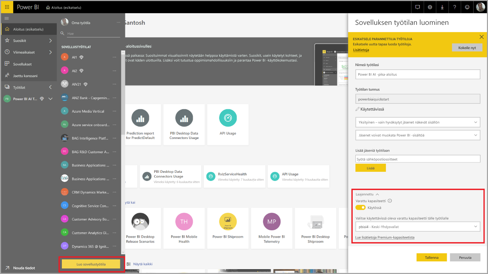

Kun työtila on luotu, voit valita aloitusnäytön oikeassa alanurkassa **Ohita** seuraavan kuvan mukaisesti.

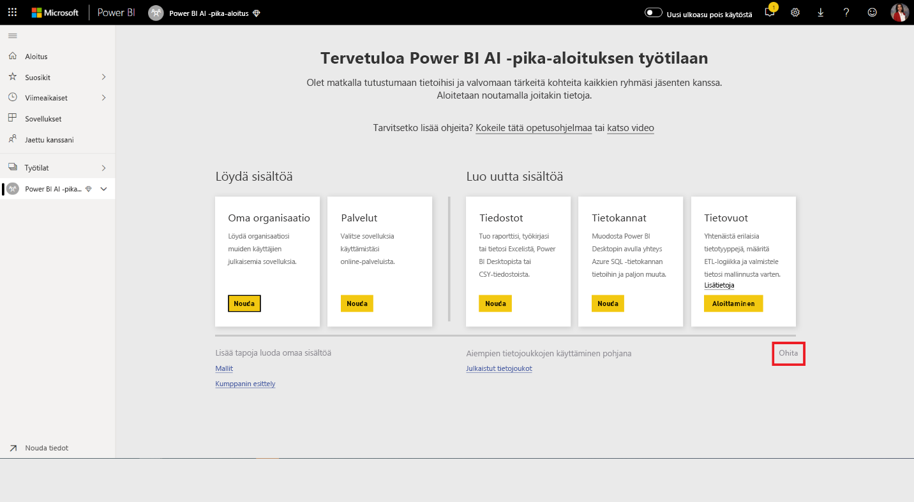

 Valitse työtilan oikeassa ylänurkassa oleva **Luo**-painike ja valitse sitten **Tietovuo**.

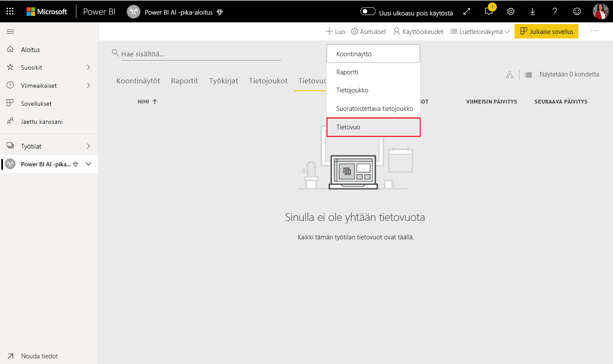

Valitse **Lisää uudet entiteetit**. Tämä käynnistää **Power Query** -editorin selaimessa.

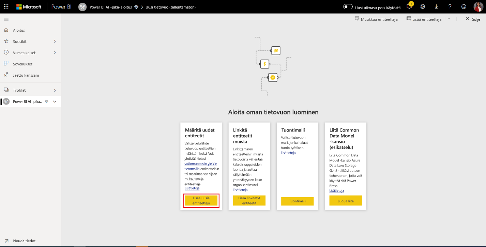

Valitse tietolähteeksi **teksti- tai CSV-tiedosto** seuraavan kuvan mukaisesti.

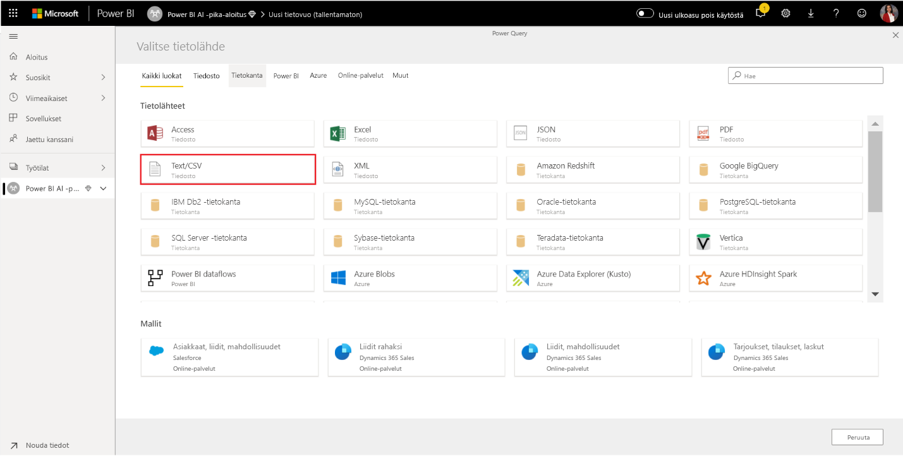

Liitä seuraavaksi näyttöön tulevalla **Muodosta yhteys tietolähteeseen** -sivulla seuraava linkki _online_shoppers_intention.csv_-tiedostoon **Tiedostopolku tai URL-osoite** -ruutuun ja valitse sitten **Seuraava**.

`https://raw.githubusercontent.com/santoshc1/PowerBI-AI-samples/master/Tutorial_AutomatedML/online_shoppers_intention.csv`

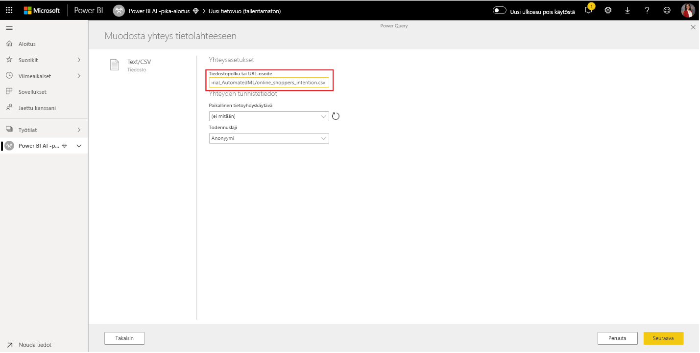

Power Query -editori näyttää CSV-tiedostossa olevien tietojen esikatselun. Voit nimetä kyselyn uudelleen muuttamalla oikealla olevan Nimi-ruudun arvoa. Voit esimerkiksi muuttaa kyselyn nimeksi _Online-vierailijat_.

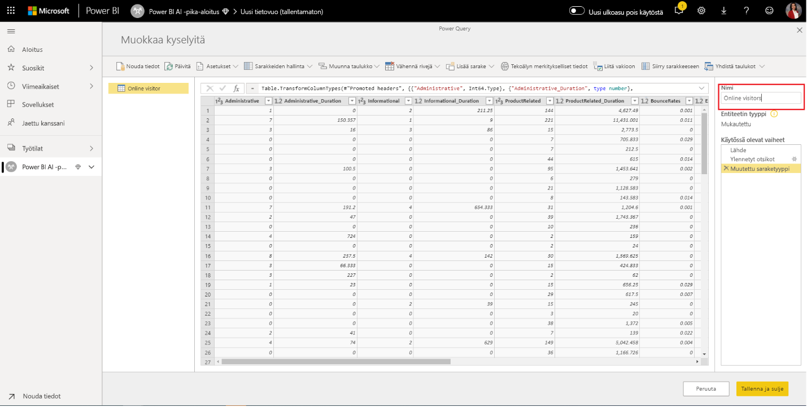

Power Query johtaa sarakkeiden tyypin automaattisesti. Voit muuttaa saraketyyppiä napsauttamalla sarakeotsikon yläosassa olevaa määritetyyppikuvaketta. Tässä esimerkissä Revenue-sarakkeen tyypiksi muutetaan True/False.

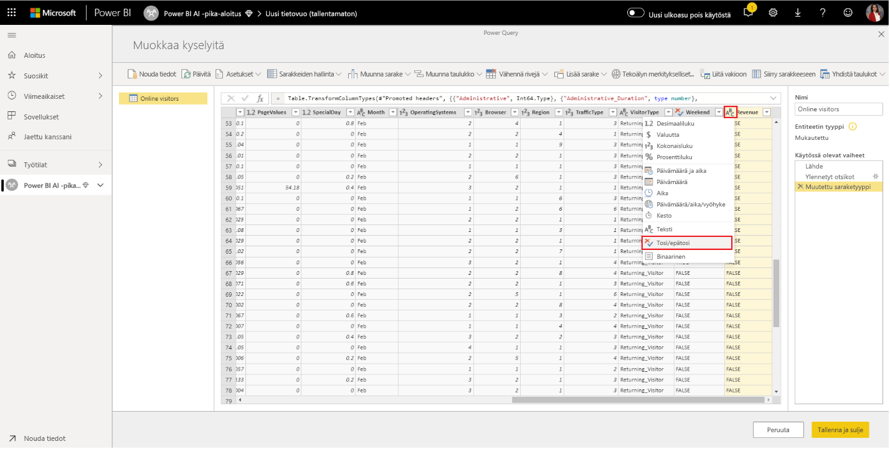

Sulje Power Query -editori valitsemalla **Tallenna ja sulje**. Anna tietovuolle nimi ja valitse sitten valintaikkunassa **Tallenna** seuraavan kuvan mukaisesti.

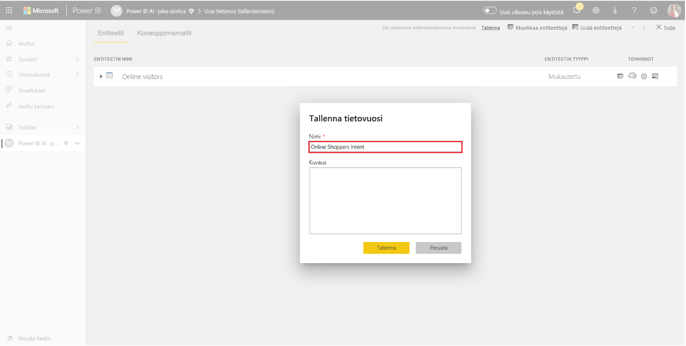

## Koneoppimismallin luominen ja harjoittaminen

Jos haluat lisätä koneoppimismallin, valitse **Käytä koneoppimismallia** -painike **Toiminnot**-luettelossa sen perusentiteetin kohdalla, joka sisältää harjoitus- ja otsikkotiedot, ja valitse sitten **Lisää koneoppimismalli**.

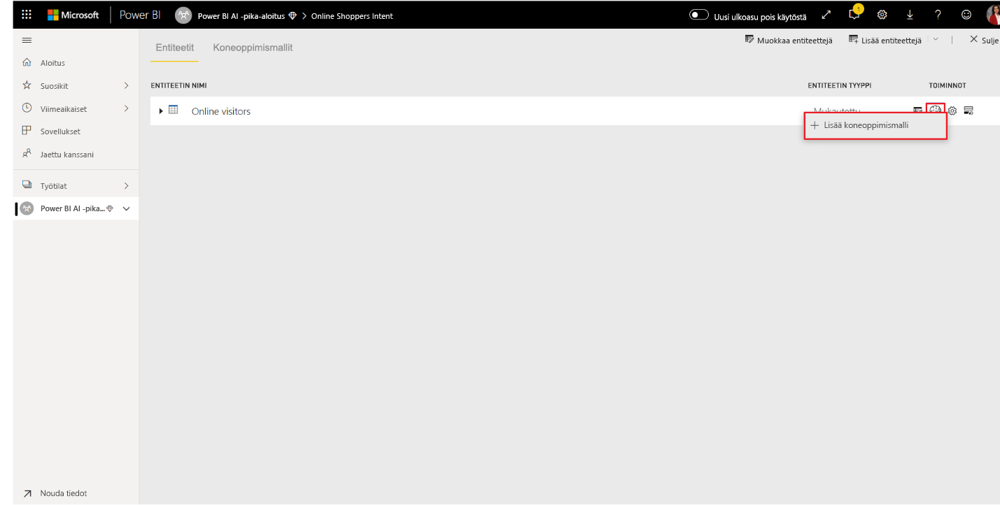

Ensimmäinen vaihe koneoppimismallin luomisessa on tunnistaa ne historialliset tiedot, mukaan lukien tuloskenttä, jonka haluat ennustaa. Malli luodaan näistä tiedoista oppimalla.

Käytetyn tietokentän kohdalla kyseessä on **Tuotto**-kenttä. Valitse tuloskentän arvoksi **Tuotto** ja valitse sitten **Seuraava**.

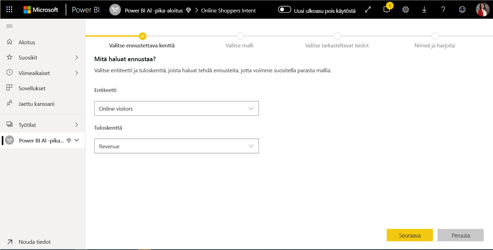

Seuraavaksi on valittava luotavan koneoppimismallin tyyppi. Power BI analysoi määrittämäsi tuloskentän arvot ja ehdottaa tämän kentän ennakoimiseksi luotavien koneoppimismallien tyyppejä.

Tässä tapauksessa, koska ennakoimme binaarista tulosta siitä, tekeekö käyttäjä oston vai ei, on suositeltavaa valita Binaarinen ennuste. Koska olemme kiinnostuneita ennustamaan käyttäjiä, jotka tekevät ostoksen, valitse True sen tuoton tulokseksi, josta olet eniten kiinnostunut. Lisäksi voi antaa otsikot niille tuloksille, joita käytetään automaattisesti luodussa raportissa, joka tekee yhteenvedon mallin vahvistuksen tuloksista. Valitse Seuraava.

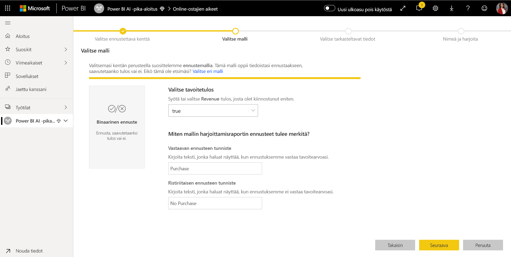

Seuraavaksi Power BI tarkistaa tietonäytteen alustavasti ja ehdottaa syötteitä, jotka saattavat tuottaa tarkempia ennusteita. Jos Power BI ei suosittele kenttää, sen vieressä lukee selitys. Voit halutessasi muuttaa valinnat sisältämään vain kentät, jotka haluat mallin tutkivan, tai voit valita kaikki kentät valitsemalla entiteetin nimen vieressä olevan valintaruudun. Hyväksy syötteet valitsemalla **Seuraava**.

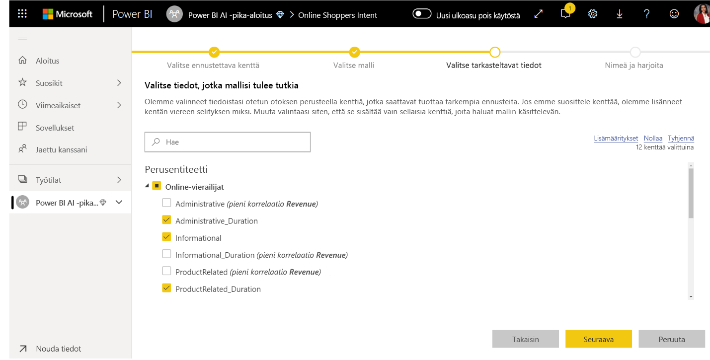

Viimeisessä vaiheessa meidän on annettava mallillemme nimi. Anna mallille nimi _Ostoaikeen ennuste_. Voit lyhentää harjoitusaikaa saadaksesi nopeita tuloksia tai lisätä harjoittamiseen käytettyä aikaa parhaan mallin saamiseksi. Aloita mallin harjoittaminen valitsemalla **Tallenna ja harjoita**.

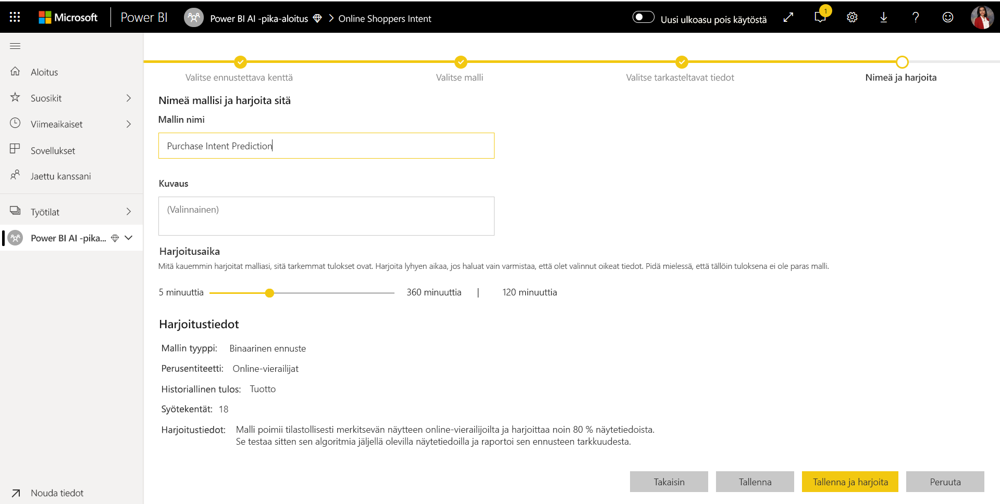

Harjoitusprosessi aloitetaan ottamalla näytteitä historiallisista tiedoista ja normalisoimalla ne ja sitten jakamalla tietojoukkosi kahdeksi uudeksi entiteeteiksi: _Ostoaikeen ennusteen harjoitustiedot_ ja _Ostoaikeen ennusteen testitiedot_.

Tietojoukon koosta riippuen harjoitusprosessi voi kestää muutamasta minuutista edellisessä näytössä valittuun harjoitusaikaan. Tässä vaiheessa näet mallin tietovuon **Koneoppimismallit**-välilehdellä. Valmis-tila ilmaisee, että malli on asetettu jonoon harjoittamista varten tai että sitä harjoitetaan parhaillaan.

Voit vahvistaa mallin harjoittamisen ja vahvistamisen tietovuon tilan kautta. Tämä näkyy tietojen päivittämisenä työtilan **Tietovuot**-välilehdessä.

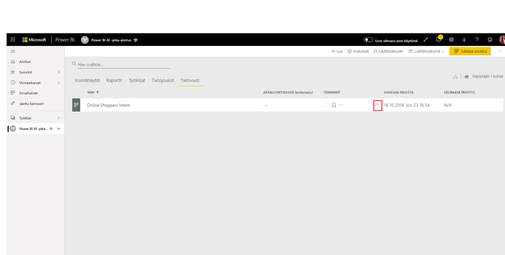

Kun mallin harjoittaminen on valmis, tietovuossa näkyy päivitetty päivitysaika. Voit vahvistaa mallin harjoittamisen valmistumisen siirtymällä tietovuon **Koneoppimismallit**-välilehteen. Luomasi mallin tilana pitäisi näkyä **Harjoitettu**, ja **Harjoitettu viimeksi** -ajan pitäisi nyt olla päivitetty.

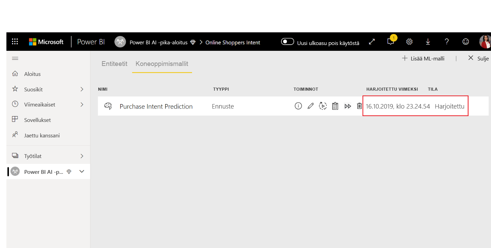

## Mallin vahvistusraportin tarkasteleminen
Jos haluat tarkastella mallin vahvistusraporttia, valitse Koneoppimismallit-välilehdessä Näytä harjoitusraportti -painike mallin Toiminnot-sarakkeesta. Tässä raportissa kuvataan, miten koneoppimismalli todennäköisesti suoriutuu.

Valitse raportin **Mallin suorituskyky** -sivulla **Tärkeimmät ennusteet** tarkastellaksesi mallisi tärkeimpiä ennusteita. Voit valita jonkin ennusteen nähdäksesi, miten kyseiseen ennusteeseen liittyvät tulokset jakautuvat.

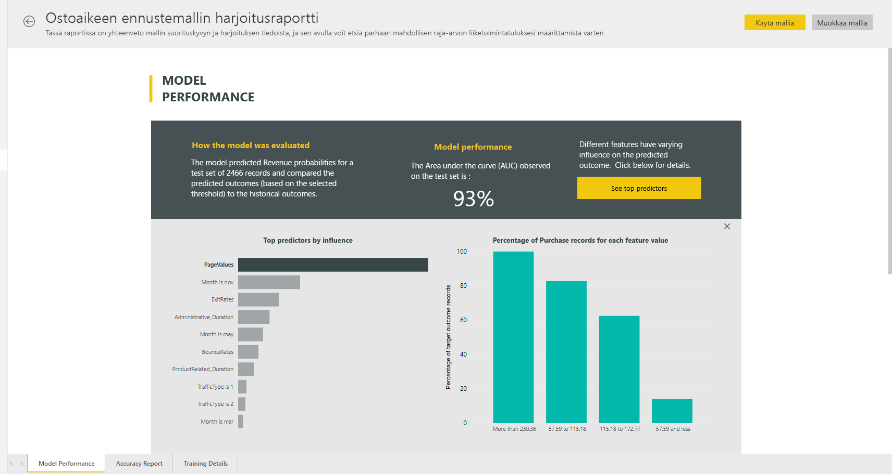

Mallin suorituskyky -sivulla olevan **Todennäköisyyden raja-arvo** -osittajan avulla voit tarkastella sen vaikutusta mallin Tarkkuus- ja Saanti-mittareihin.

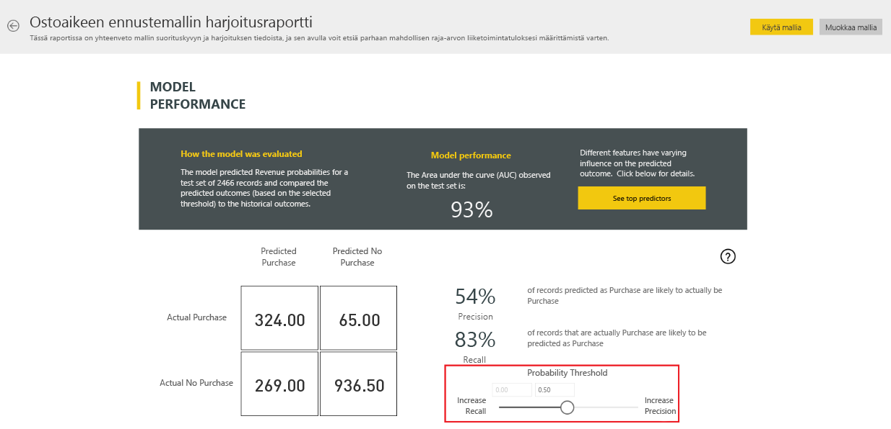

Raportin muut sivut kuvailevat mallin tilastollisia suorituskykymittareita.

Raportti sisältää myös Harjoitustiedot-sivun, jossa kuvataan erilaisia suoritettuja toistoja, miten ominaisuudet poimittiin syötteistä ja käytetyn lopullisen mallin hyperparametreja.

## Mallin käyttäminen tietovuoentiteetissä

Valitse **Käytä mallia** -painike raportin yläosasta, jos haluat käynnistää tämän mallin. **Käytä**-valintaikkunassa voit määrittää kohde-entiteetin, jonka lähdetietoja malli käyttää.

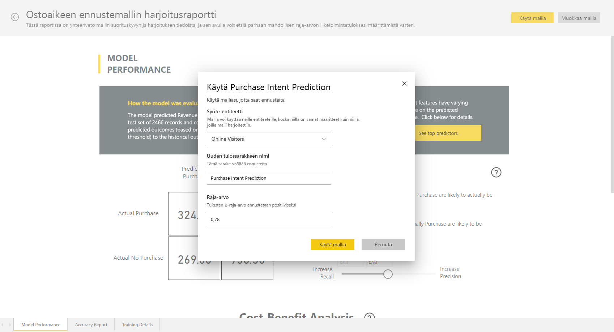

**Päivitä** pyydettäessä tietovuo, jotta voit esikatsella mallin tuloksia.

Mallin käyttäminen luo kaksi uutta entiteettiä, joiden jälkiliitteet ovat **täydennetty <mallin_nimi>** ja **täydennetty <mallin_nimi> selitykset**. Tässä tapauksessa mallin ottaminen käyttöön **Online-vierailijat**-entiteetissä luo entiteetin **Online-vierailijat täydennetty Ostoaikeen ennuste**, joka sisältää ennustetun tuloksen mallista ja **Online-vierailijat täydennetty Ostoaikeen ennuste selitykset**, joka sisältää ennakoinnin parhaat tietuekohtaiset vaikuttajat. 

Binaariennustemallin käyttäminen lisää ennusteeseen neljä saraketta, jotka sisältävät ennustetun tuloksen, todennäköisyyden pistemäärän, parhaat tietuekohtaiset vaikuttajat ja selitysindeksin, joista jokaisen etuliitteenä on määritetty sarakkeen nimi.  

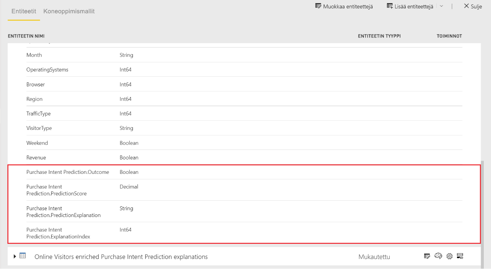

Kun tietovuon päivitys on valmis, voit tarkastella tuloksia valitsemalla **Online-vierailijat täydennetty Ostoaikeen ennuste** -entiteetin.

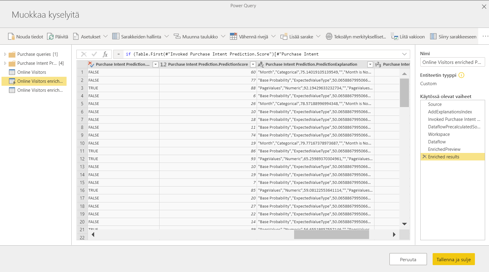

## Mallin pisteytetyn tulosteen käyttäminen Power BI -raportissa

Jos haluat käyttää koneoppimismallin pisteytettyä tulosta, voit muodostaa yhteyden tietovuohon Power BI Desktopista käyttämällä tietovoiden liitintä. **Online-vierailijat täydennetty Ostoaikeen ennuste** -entiteettiä voidaan nyt käyttää mallin ennustusten sisällyttämiseen Power BI -raportteihin.

## Seuraavat vaiheet

Tässä opetusohjelmassa loit ja käytit binaariennustemallia Power BI:ssä seuraavien vaiheiden avulla:

* Tietovuon luominen syötetietojen avulla
* Koneoppimismallin luominen ja harjoittaminen
* Mallin vahvistusraportin tarkasteleminen
* Mallin käyttäminen tietovuoentiteetissä
* Mallin pisteytetyn tulosteen käyttäminen Power BI -raportissa

Katso lisätietoja automaattianalyysipalveluista Power BI:ssä artikkelista [Automaattianalyysipalvelut Power BI:ssä](service-machine-learning-automated.md).
