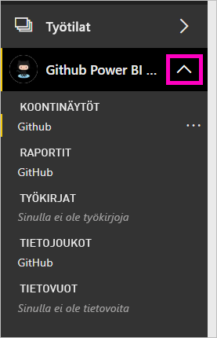

# Opetusohjelma: Power BI-ja GitHub-säilön yhdistäminen
Tässä opetusohjelmassa yhdistät Power BI:n GitHub-palvelun oikeisiin tietoihin, jolloin Power BI luo automaattisesti koontinäyttöjä ja raportteja. Voit muodostaa yhteyden Power BI-sisällön julkiseen säilöön (tunnetaan myös nimellä *säilön*) ja vastauksia kysymyksiin, kuten: kuinka moni henkilö osallistuu Power BI:n julkiseen sisältöön? Kuka osallistuu eniten? Minä viikonpäivänä on eniten osallistumisia? Ja muihin kysymyksiin. 

Tässä opetusohjelmassa käyt läpi seuraavat vaiheet:

> [!div class="checklist"]
> * Rekisteröi GitHub-tili, jos sinulla ei ole sellaista vielä 
> * Kirjaudu sisään Power BI -tilillesi tai rekisteröi tili, jos sinulla ei ole sellaista vielä
> * Avaa Power BI -palvelu
> * Etsi GitHub-sovellus
> * Anna Power BI:n julkisen GitHub-säilön tiedot
> * Tarkastele GitHub-tiedot sisältävää koontinäyttöä ja raporttia
> * Tyhjennä resursseja poistamalla sovellus

Jos et ole rekisteröitynyt Power BI:hin, [rekisteröidy ilmaiseen kokeiluversioon](https://app.powerbi.com/signupredirect?pbi_source=web) ennen aloittamista.

## Edellytykset

Tarvitset tämän opetusohjelman suorittamiseen GitHub-tilin, jos sinulla ei ole vielä sellaista. 

- Rekisteröi [GitHub-tilin](https://docs.microsoft.com/contribute/get-started-setup-github).

## Yhteyden muodostaminen
1. Kirjaudu sisään Power BI -palveluun (https://app.powerbi.com). 
2. Valitse vasemmassa siirtymisruudussa **Sovellukset** ja **Hanki sovelluksia**.
   
    

3. Valitse **sovelluksia**, tyyppi **GitHub** hakuruutuun > **hanki se nyt**.
   
    

4. - **Asentaa Power BI-sovelluksesta?** Valitse **asentaa**.
5. - **Uusi sovellus on valmis**, valitse **Siirry sovellukseen**.
6. - **Uuden sovelluksen käytön aloittaminen**, valitse **yhdistää tiedot**.

    

7. Kirjoita säilön nimi ja omistaja. Tämän säilön URL-osoite on https://github.com/MicrosoftDocs/powerbi-docs, joten **Säilön omistaja** on **MicrosoftDocs** ja **Säilö** on **powerbi-docs**. 
   
    

5. Anna luomasi GitHub-tunnistetiedot. Power BI saattaa ohittaa tämän vaiheen, jos olet jo kirjautuneena GitHubiin selaimessa. 

6. - **Todennusmenetelmä**, pidä **oAuth2** valitun \> **Kirjaudu sisään**.

7. Noudata Githubin todennusnäyttöjä. Anna Power BI:lle GitHub-tietojen käyttöoikeus.
   
   Nyt Power BI voi muodostaa yhteyden GitHubiin ja tietoihin.  Tiedot päivitetään kerran päivässä.

8. Kun Power BI on tuonut tiedot, näkyviin tulee uusi GitHub-työtila sisällön. 
9. Valitse vasemmassa siirtymispalkissa työtilan nimen vieressä olevaa nuolta. Näet työtila sisältää koontinäytön ja raportin. 

    

10. Valitse kolme pistettä (...) koontinäytön nimen vieressä > **nimeä** > tyyppi **GitHub-koontinäyttö**.
 
     

8. Pienennä vasen siirtymisruutu valitsemalla yleinen siirtymiskuvake, jotta saat enemmän tilaa.

    

10. Valitse GitHub-koontinäyttö.
    
    GitHub-koontinäyttö sisältää reaaliaikaisia tietoja, joten näkemäsi arvot voivat olla erilaisia.

    

    

## Esitä kysymys

1. Siirrä kohdistin **esitä tietojasi koskeva kysymys**. Power BI tarjoaa **kysymyksiä alkuun pääsemiseksi**. 

1. Valitse **kuinka moni onko**.
 
    

13. Väliltä **montako** ja **käyttäjät ovat olemassa**, tyyppi **pull-pyyntöjen**. 

     Power BI Luo palkkikaavion, joka näyttää noutopyyntöjen henkilöä kohti määrän.

    

13. Valitse Kiinnitä se koontinäyttöön, sitten PIN-koodi **poistu Q & A: n**.

## GitHub-raportin tarkasteleminen 

1. Valitse GitHub-koontinäyttö pylväskaavio **noutopyynnöt kuukauden mukaan** Avaa raportti.

    

2. Valitse käyttäjänimi **noutopyynnöt yhteensä käyttäjän mukaan** kaavion. Tässä esimerkissä näemme tunnit useimmat oli helmikuuta.

    

3. Näytä raportin seuraava sivu valitsemalla **Pistekortti**-välilehti. 
 
    

    Ilmeisesti tiistai kello 15 on eniten yleisin ja aika viikon päivä *vahvistuksia*, kun käyttäjät kuittaavat työnsä.

## Resurssien tyhjentäminen

Nyt kun olet suorittanut opetusohjelman, voit poistaa GitHub-sovelluksen. 

1. Valitse vasemmassa siirtymispalkissa **Sovellukset**.
2. Siirrä hiiren osoitin GitHub-ruudun päälle ja valitse **Poista**-roskakori.

    

## Seuraavat vaiheet

Tässä opetusohjelmassa olet muodostanut yhteyden GitHubin julkiseen säilöön ja saanut tiedot, jotka Power BI on muotoillut koontinäytöksi ja raportiksi. Olet vastannut joihinkin tietoja koskeviin kysymyksiin tutkimalla koontinäyttöä ja raporttia. Nyt voi lukea lisää yhteyden muodostamisesta muihin palveluihin, kuten Salesforceen, Microsoft Dynamicsiin ja Google Analyticsiin. 
 
> [!div class="nextstepaction"]
> [Käyttämiisi verkkopalveluihin yhdistäminen](service-connect-to-services.md)

