# Opetusohjelma: Yhteyden muodostaminen GitHub-otokseen Power BI:llä
Tässä opetusohjelmassa yhdistät Power BI:n GitHub-palvelun oikeisiin tietoihin, jolloin Power BI luo automaattisesti koontinäyttöjä ja raportteja. Muodostat yhteyden Power BI:n sisällön julkiseen säilöön (eli *säilöön*) ja näet seuraavia tietoja: kuinka moni henkilö osallistuu Power BI:n julkiseen sisältöön? Kuka osallistuu eniten? Minä viikonpäivänä on eniten osallistumisia? Lisäksi näet vastauksia muihin kysymyksiin. 

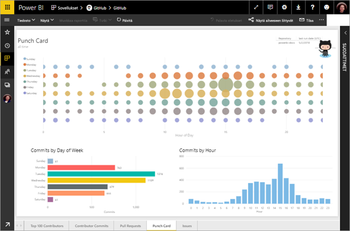

Tässä opetusohjelmassa käyt läpi seuraavat vaiheet:

> [!div class="checklist"]
> * Rekisteröi GitHub-tili, jos sinulla ei ole sellaista vielä 
> * Kirjaudu sisään Power BI -tilillesi tai rekisteröi tili, jos sinulla ei ole sellaista vielä
> * Avaa Power BI -palvelu
> * Etsi GitHub-sovellus
> * Anna Power BI:n julkisen GitHub-säilön tiedot
> * Tarkastele GitHub-tietojen koontinäyttöä ja raporttia
> * Tyhjennä resursseja poistamalla sovellus

Jos et ole rekisteröitynyt Power BI:hin, [rekisteröidy ilmaiseen kokeiluversioon](https://app.powerbi.com/signupredirect?pbi_source=web) ennen aloittamista.

## Edellytykset

Tarvitset tämän opetusohjelman suorittamiseen GitHub-tilin, jos sinulla ei ole vielä sellaista. 

- Rekisteröi [GitHub-tili](https://docs.microsoft.com/contribute/get-started-setup-github)

## Yhteyden muodostaminen
1. Kirjaudu sisään Power BI -palveluun (http://powerbi.com). 
2. Valitse vasemmassa siirtymisruudussa **Sovellukset** ja **Hanki sovelluksia**.
   
   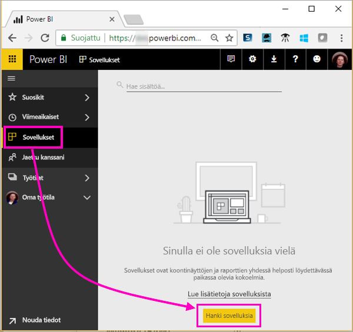 

3. Valitse **Sovellukset**, kirjoita **github** hakuruutuun > **Hanki se nyt**.
   
   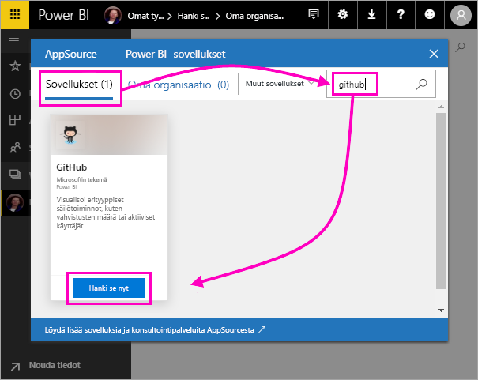 

4. Kirjoita säilön nimi ja omistaja. Tämän säilön URL-osoite on https://github.com/MicrosoftDocs/powerbi-docs, joten **Säilön omistaja** on **MicrosoftDocs** ja **Säilö** on **powerbi-docs**. 
   
    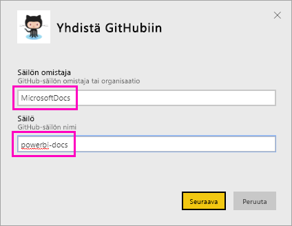

5. Anna luomasi GitHub-tunnistetiedot. Power BI saattaa ohittaa tämän vaiheen, jos olet jo kirjautuneena GitHubiin selaimessa. 

6. Valitse **todennusmenetelmäksi** **oAuth2** \> **Kirjaudu sisään**.

7. Noudata GitHubin todennusnäyttöjä. Anna Power BI:lle GitHub-tietojen käyttöoikeus.
   
   Nyt Power BI voi muodostaa yhteyden GitHubiin ja tietoihin.  Tiedot päivitetään kerran päivässä.

8. Kun Power BI on tuonut tiedot, näkyviin tulee uusi GitHub-ruutu. 
 
   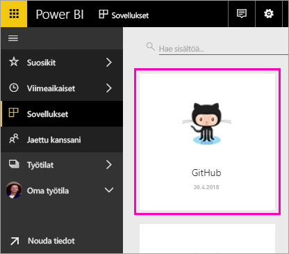 

8. Pienennä vasen siirtymisruutu valitsemalla yleinen siirtymiskuvake, jotta saat enemmän tilaa.

    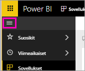

10. Valitse GitHub-ruutu vaiheesta 8. 
    
    GitHub-koontinäyttö avautuu. Nämä ovat reaaliaikaisia tietoja, joten näkemäsi arvot voivat olla erilaisia.

    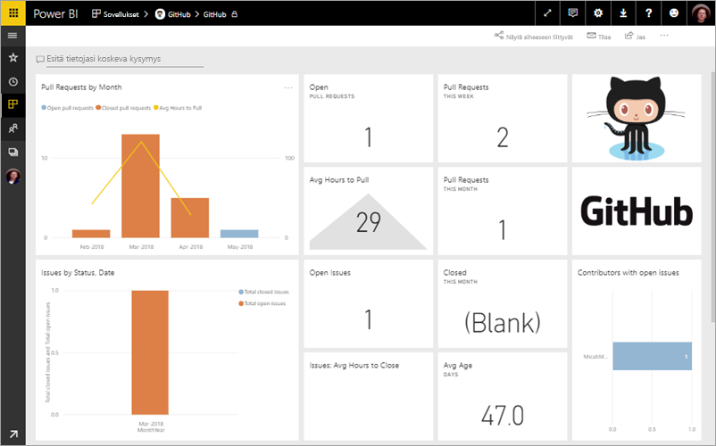

    

## Esitä kysymys

11. Siirrä kohdistin **Esitä tietojasi koskeva kysymys** -kohtaan ja valitse sitten **noutopyynnöt**. 

    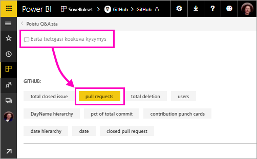

12. Kirjoita **kuukauden mukaan**.
 
    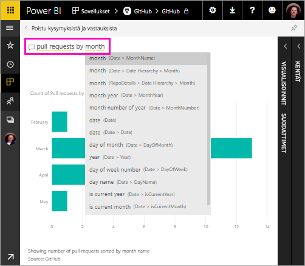

     Power BI luo palkkikaavion, joka näyttää noutopyyntöjen määrän kuukautta kohti.

13. Valitse **Poistu Q&A:sta**.

## GitHub-raportin tarkasteleminen 

1. Avaa raportti valitsemalla GitHub-koontinäytössä yhdistetty sarake- ja rivikaavio **Noutopyynnöt kuukauden mukaan**.

    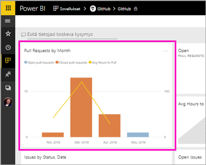

2. Valitse käyttäjänimi **Noutopyynnöt yhteensä käyttäjän mukaan** -kaaviosta ja katso tämän esimerkin mukaisesti, että keskimääräinen tuntimäärä on suurempi kuin keskimääräinen kokonaismäärä maaliskuussa.

    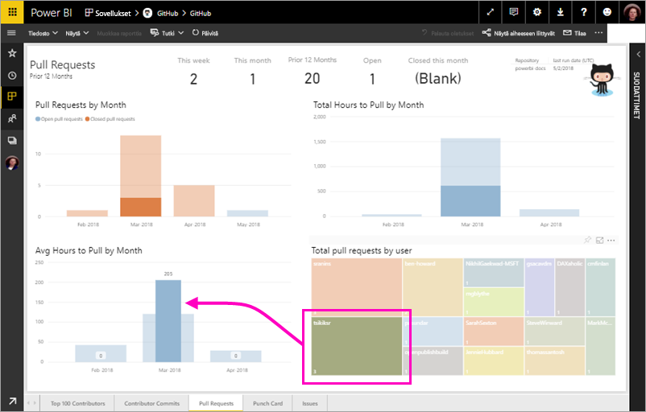

3. Näytä raportin seuraava sivu valitsemalla **Pistekortti**-välilehti. 
 
    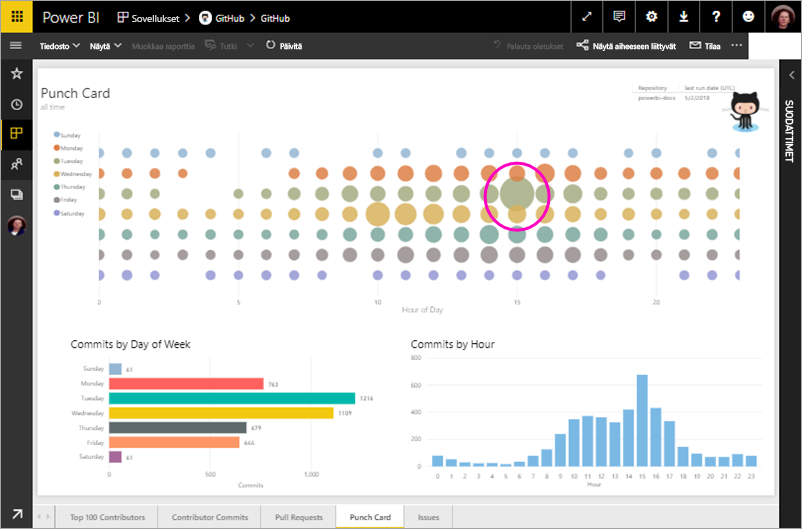

    Ilmeisesti tiistai kello 15 on yleisin viikonpäivä ja aika *vahvistuksille*, kun käyttäjät kuittaavat työnsä.

## Resurssien tyhjentäminen

Nyt kun olet suorittanut opetusohjelman, voit poistaa GitHub-sovelluksen. 

1. Valitse vasemmassa siirtymispalkissa **Sovellukset**.
2. Siirrä hiiren osoitin GitHub-ruudun päälle ja valitse **Poista**-roskakori.

    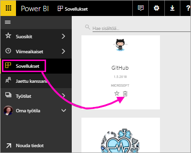

## Seuraavat vaiheet

Tässä opetusohjelmassa olet muodostanut yhteyden GitHubin julkiseen säilöön ja saanut tiedot, jotka Power BI on muotoillut koontinäytöksi ja raportiksi. Olet vastannut joihinkin tietoja koskeviin kysymyksiin tutkimalla koontinäyttöä ja raporttia. Nyt voi lukea lisää yhteyden muodostamisesta muihin palveluihin, kuten Salesforceen, Microsoft Dynamicsiin ja Google Analyticsiin. 
 
> [!div class="nextstepaction"]
> [Käyttämiisi verkkopalveluihin yhdistäminen](./service-connect-to-services.md)

