# Opetusohjelma: Automaattianalyysistudion mallin käynnistys Power BI:ssä (esikatselu)

Tässä opetusohjelmassa käymme läpi merkityksellisten tietojen sisällyttämisen **Azuren automaattianalyysistudio** -mallista Power BI:hin. Opetusohjelma sisältää ohjeita siitä, miten Power BI -käyttäjälle myönnetään käyttöoikeus Azuren automaattianalyysipalveluiden malliin, kuinka tietovirta luodaan ja kuinka Azuren automaattianalyysipalveluiden mallin merkityksellisiä tietoja käytetään omassa tietovuossa. Opetusohjelmassa on myös viite Azuren automaattianalyysipalveluiden mallin luonnin pikaoppaaseen, jos sinulla ei vielä ole mallia.

Opetusohjelmassa on seuraavat vaiheet:

> [!div class="checklist"]
> * Azuren automaattianalyysipalveluiden mallin luominen ja julkaiseminen
> * Mallin käyttöoikeuksien myöntäminen Power BI -käyttäjälle
> * Tietovirran luominen
> * Azuren automaattianalyysipalveluiden mallin merkityksellisten tietojen lisääminen tietovirtaan

## Azuren automaattianalyysipalveluiden mallin luominen ja julkaiseminen

Noudata ohjeita kohdassa [Ohjeiden vaihe 1: Luo automaattianalyysistudion työtila](https://docs.microsoft.com/azure/machine-learning/studio/walkthrough-1-create-ml-workspace) -kohdan ohjeita ja luo **Automaattianalyysipalvelut**-työtila.

Voit käyttää näitä vaiheita minkä tahansa valmiin Azuren automaattianalyysipalveluiden mallin tai tietojoukon kanssa. Jos sinulla ei ole julkaistua mallia, voit luoda mallin hetkessä katsomalla ohjeet [Luo ensimmäinen datatiedekokeilu Azuren automaattianalyysistudiossa](https://docs.microsoft.com/azure/machine-learning/studio/create-experiment) -artikkelista, jossa määritetään Azuren automaattianalyysipalveluiden malli autojen hintaennusteita varten.

Noudata artikkelissa [Azuren Automaattianalyysistudio -verkkopalvelun käyttöönotto](https://docs.microsoft.com/azure/machine-learning/studio/publish-a-machine-learning-web-service) olevia ohjeita ja julkaise Azuren Automaattianalyysistudio -malli verkkopalveluna.

## Käyttöoikeuden myöntäminen Power BI -käyttäjälle

Jotta voisit käsitellä Azuren Automaattianalyysistudio-mallia Power BI:stä käsin, tarvitset **luku**oikeuden Azure-tilaukseen ja -resurssiryhmään sekä **luku**oikeuden Azuren Automaattianalyysistudio -verkkopalveluun Automaattianalyysistudio-malleja varten.  Azuren automaattianalyysipalveluiden mallia varten tarvitset **luku**oikeuden Automaattianalyysipalvelu-työtilaan.

Seuraavissa vaiheissa oletetaan, että olet sen Azure-tilauksen ja -resurssiryhmän rinnakkaisjärjestelmänvalvoja, johon malli on julkaistu.

Kirjaudu sisään [Azure-portaaliin](https://portal.azure.com) ja siirry **Tilaukset**-sivulle, jonka voit etsiä käyttämällä vasemmanpuoleisen valikon **Kaikki palvelut** -luetteloa.

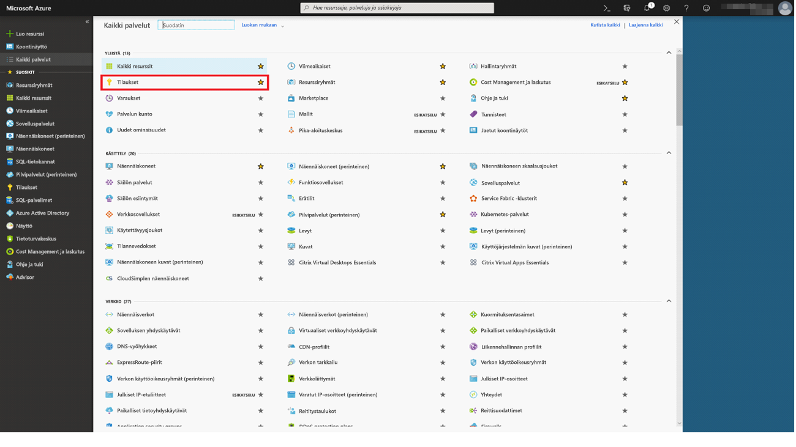

Valitse Azure-tilaus, jota käytit mallin julkaisemiseen, ja valitse sitten **Käyttöoikeuksien hallinta (IAM)** . Valitse **Lisää roolimääritys**, valitse **Lukija**-rooli ja valitse sitten Power BI -käyttäjä. Kun olet valmis, valitse **Tallenna**. Valinnat näkyvät seuraavassa kuvassa.

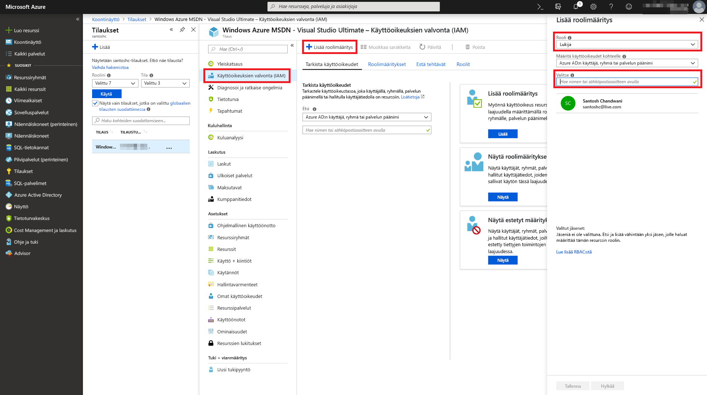

Toista sitten yllä olevat vaiheet ja myönnä Power BI -käyttäjälle **Osallistuja**-roolin käyttöoikeudet siihen Automaattianalyysipalvelujen verkkopalveluun, jossa Azuren automaattianalyysimalli on otettu käyttöön.

## Tietovirran luominen

### Tietojen noutaminen tietovirran luomista varten

Kirjaudu sisään Power BI -palveluun käyttämällä niitä käyttäjän tunnistetietoja, joille edellisessä vaiheessa myönsit Azuren automaattianalyysipalveluiden mallin käyttöoikeuden.

Tässä vaiheessa oletetaan, että tiedot, joita haluat käyttää Azuren automaattianalyysipalveluiden mallissa, ovat CSV-muodossa.  Jos olet luonut mallin automaattianalyysistudiossa käyttämällä **kokeellista autojen hinnoittelua**, tietojoukko on jaettu seuraavassa linkissä:

* [Azuren automaattianalyysistudion esimerkkimalli](https://github.com/santoshc1/PowerBI-AI-samples/blob/master/Tutorial_MLStudio_model_integration/Automobile%20price%20data%20_Raw_.csv)

### Tietovirran luominen

Jotta voit luoda entiteetit tietovirrassa, kirjaudu sisään Power BI -palveluun ja siirry varatun kapasiteettisi työtilaan, jossa AI-esikatselu on käytössä.

Jos sinulla ei vielä ole työtilaa, voit luoda sellaisen valitsemalla vasemmanpuoleisesta valikosta **Työtilat** ja valitsemalla sitten alareunan paneelista **Luo työtila**.  Tämä avaa ruudun, jossa voit antaa työtilan tiedot. Kirjoita työtilan nimi ja valitse sitten **Tallenna**.

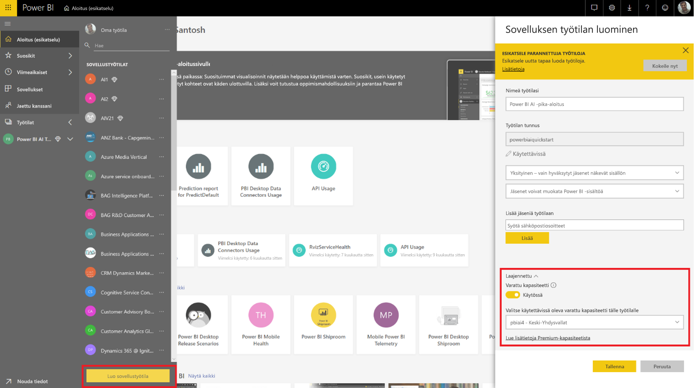

Kun työtila on luotu, voit valita aloitusnäytön oikeassa alanurkassa **Ohita**.

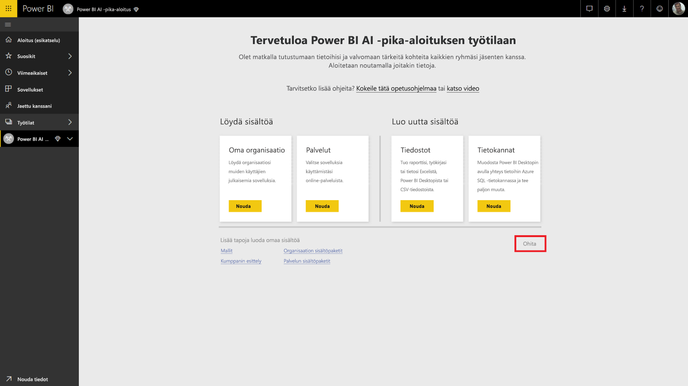

Valitse **Tietovuot (esikatselu)** -välilehti, valitse työtilan oikeassa ylänurkassa oleva **Luo**-painike ja valitse sitten **Tietovuo**.

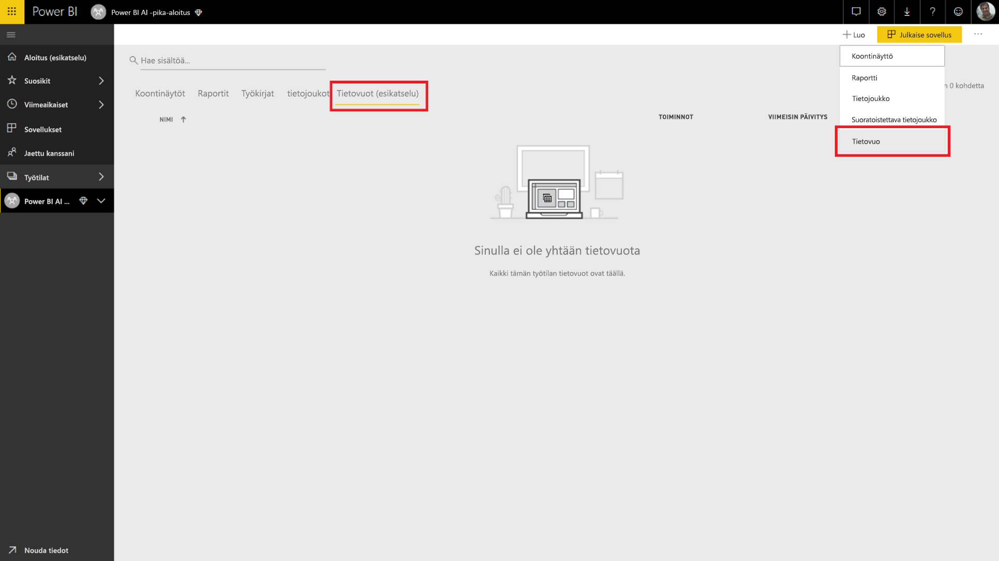

Valitse **Lisää uudet entiteetit**, joka käynnistää selaimessa **Power Query -editorin**.

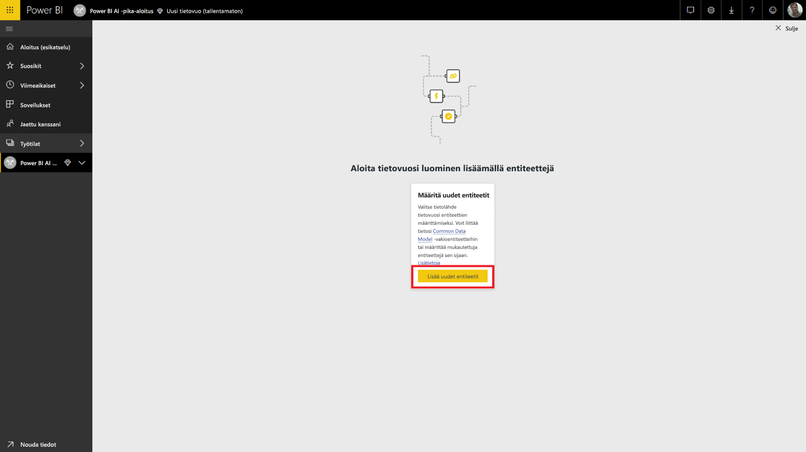

Valitse tietolähteeksi **teksti- tai CSV-tiedosto**.

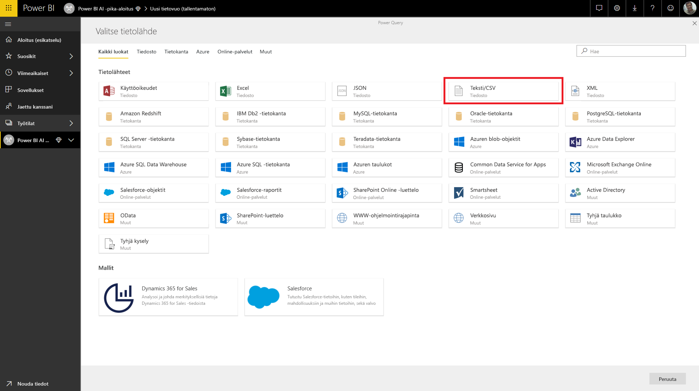

Seuraavassa näytössä sinua pyydetään muodostamaan yhteys tietolähteeseen. Liitä linkki tietoihin, joita käytit Azuren automaattianalyysipalveluiden mallin luomiseen. Jos käytit _Automotive Pricing_ -tietoja, voit liittää seuraavan linkin **Tiedostopolku tai URL-osoite** -ruutuun ja valita sitten **Seuraava**.

`https://raw.githubusercontent.com/MicrosoftLearning/Principles-of-Machine-Learning-Python/master/Module7/Automobile%20price%20data%20_Raw_.csv`

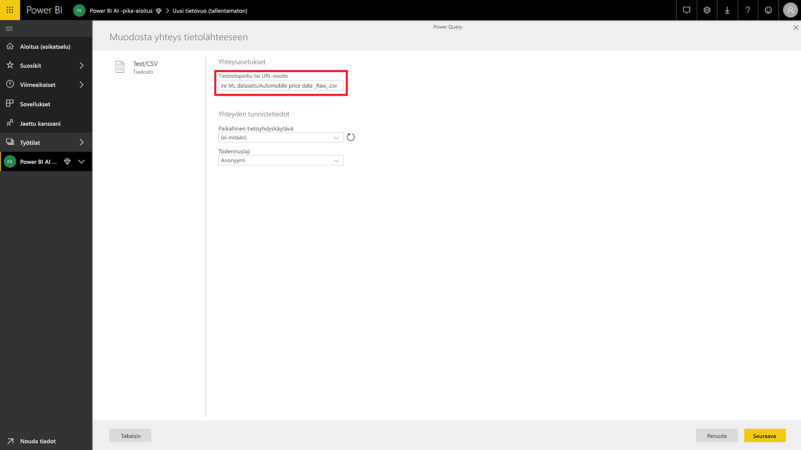

Power Query -editori näyttää CSV-tiedostossa olevien tietojen esikatselun. Valitse komentopalkista **Muunna taulukko** ja valitse sitten **Käytä ensimmäistä riviä otsikkoina**.  Tämä lisää _Ylennetyt otsikot_ -kyselyvaiheen oikealla puolella olevaan **Käytössä olevat vaiheet** -ruutuun. Voit myös nimetä kyselyn uudelleen ja määrittää sille kätevämmän nimen, kuten _Auton hinnoittelu_, käyttämällä oikealla olevaa ruutua.

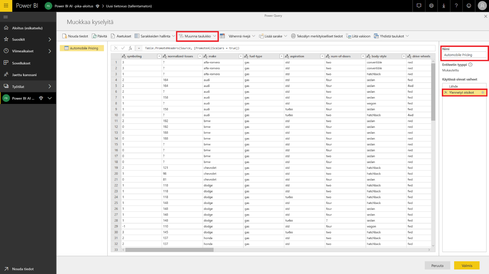

Lähdetietojoukossa tuntemattomien arvojen muodoksi on määritetty ’?’.  Arvon '?' voi korvata arvolla '0', jotta jatkossa vältytään virheiltä.  Voit tehdä tämän valitsemalla sarakkeet *normalisoidut-menetykset (normalized-losses)* , *putki (bore)* , *tahtisuus (stroke)* , *puristussuhde (compression-ratio)* , *hevosvoimat (horsepower)* , *huippukierrokset (peak-rpm)* ja *hinta (price)* napsauttamalla sarakkeiden nimiä sarakeotsikoissa ja valitsemalla ensin Muunna sarakkeet ja sitten Korvaa arvot.  Korvaa ?-merkki 0-merkillä.

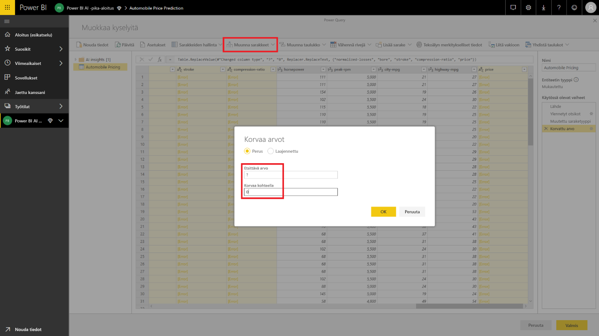

Kaikkia teksti- tai CSV-lähteestä tulevia taulukon sarakkeita käsitellään tekstisarakkeina.  Seuraavaksi numeeriset sarakkeet on muutettava oikeiden tietotyyppien mukaisiksi.  Voit tehdä tämän Power Queryssä napsauttamalla tietotyyppisymbolia sarakeotsikossa.  Muuta sarakkeet alla oleviksi tietotyypeiksi:

- **Kokonaisluku**: symboling, normalized-losses, curb-weight, engine-size, horsepower, peak-rpm, city-mpg, highway-mpg, price
- **Desimaaliluku**: wheel-base, length, width, height, bore, stroke, compression-ratio

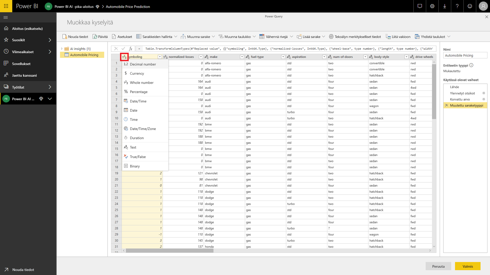

Sulje Power Query-editori valitsemalla **Valmis**. Tämä toiminto näyttää entiteettien luettelon, joka sisältää lisätyt _Auton hinnoittelu_ -kyselyn tiedot. Valitse oikeassa yläkulmassa **Tallenna**, anna tietovuolle nimi ja valitse sitten **Tallenna**.

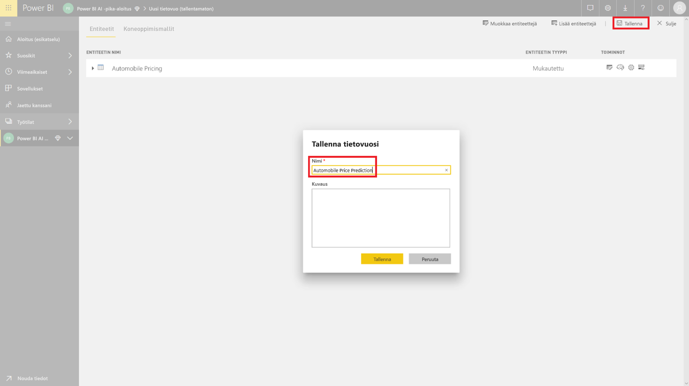

### Tietovuon päivittäminen

Tietovuon tallentaminen tuo näyttöön ilmoituksen siitä, että tietovuo on tallennettu. Valitse **Päivitä nyt**, niin lähteen tietoja käytetään tietovuossa.

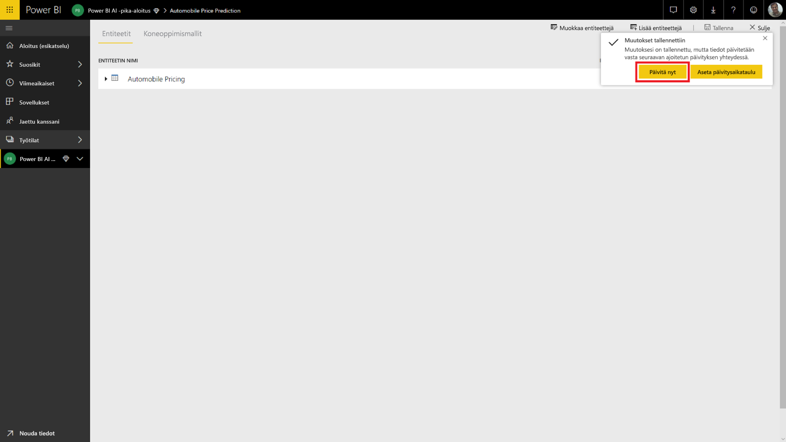

Valitse oikeasta yläkulmasta **Sulje** ja odota, kunnes tietovuon päivitys on valmis.

Voit päivittää tietovuon myös käyttämällä **Toiminnot**-komentoja. Tietovuossa näkyy aikaleima päivityksen valmistumisesta.

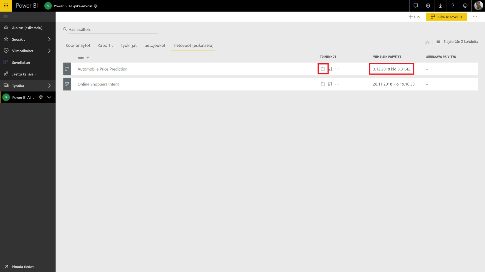

## Käytä merkityksellisiä tietoja Azuren automaattianalyysipalveluiden mallista

Jos haluat käyttää Azuren automaattianalyysipalveluiden mallia _autojen hintaennusteiden_ yhteydessä, voit muokata _Auton hinnoittelu_ -entiteettiä, johon haluamme lisätä ennustetun hinnan.

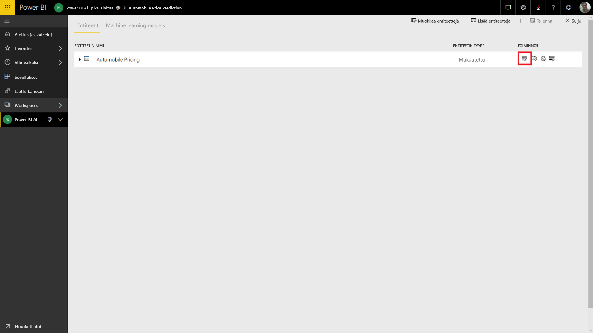

**Muokkaa**-kuvakkeen valitseminen avaa Power Query -editorin tietovuossa oleville entiteeteille.

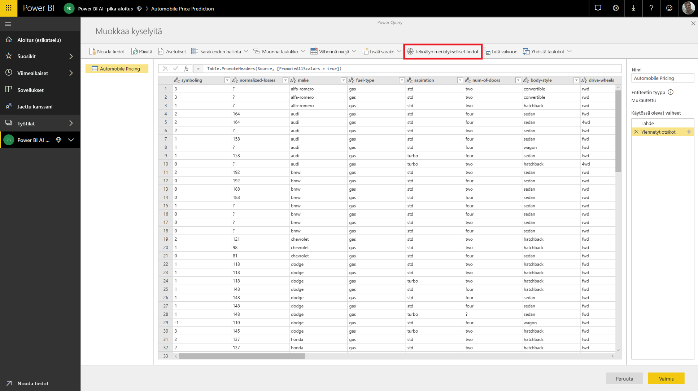

Valitse valintanauhan **Tekoälyn merkitykselliset tiedot** -painike ja valitse sitten vasemmasta siirtymisvalikosta _Azuren koneoppimismallit_ -kansio.

Ne Azuren automaattianalyysipalveluiden mallit, joihin olet saanut käyttöoikeudet, näkyvät Power Query -funktioina etuliitteellä *AzureML*.  Kun napsautat _AutomobilePricePrediction_-mallia vastaavaa funktiota, mallin verkkopalvelun parametrit merkitään funktioparametreiksi.

Jos haluat käynnistää Azuren automaattianalyysipalveluiden mallin, voit määrittää avattavassa luettelossa minkä tahansa valitun entiteetin sarakkeista syötteeksi. Voit myös määrittää syötteenä käytettävän vakioarvon käyttämällä syötevalintaikkunan vasemmalla puolella olevaa sarakekuvaketta. Kun sarakkeen nimi, joka vastaa funktion jonkin parametrin nimeä, saraketta ehdotetaan automaattisesti syötteeksi.  Jos sarakkeen nimi ei vastaa mitään, voit valita sen avattavasta valikosta.

_Automobile Pricing Prediction_ -mallin osalta syöteparametreja ovat seuraavat:

- malli (make)
- rungon-tyyli (body-style)
- akseliväli (wheel-base)
- moottorin-koko (engine-size)
- hevosvoimat (horsepower)
- huippukierrokset (peak-rpm)
- mailia-gallonaa-kohti-valtatiellä (highway-mpg)

Tässä tapauksessa taulukkomme vastaa alkuperäistä tietojoukkoa, jota käytettiin mallin koulutukseen, joten kaikille parametreille on jo valittu oikeat sarakkeet.

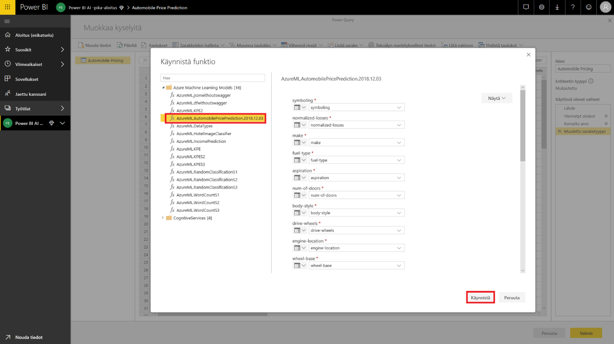

Valitse **Käynnistä**, niin voit tarkastella Azuren automaattianalyysipalveluiden mallin tulostetta entiteettitaulukon uutena sarakkeena. Näet myös mallin kutsun kyselyyn käytettynä vaiheena.

Mallin tuloste näkyy tietueena tulostesarakkeessa. Voit laajentaa sarakkeen, niin että saat yksittäiset tulosteparametrit erillisiin sarakkeisiin. Tässä tapauksessa olemme kiinnostuneita vain _Pisteytetyt otsikot (Scored Labels)_ -kohdasta, jossa on auton ennustettu hinta.  Poistetaan siis muiden valinta ja valitaan **OK**.

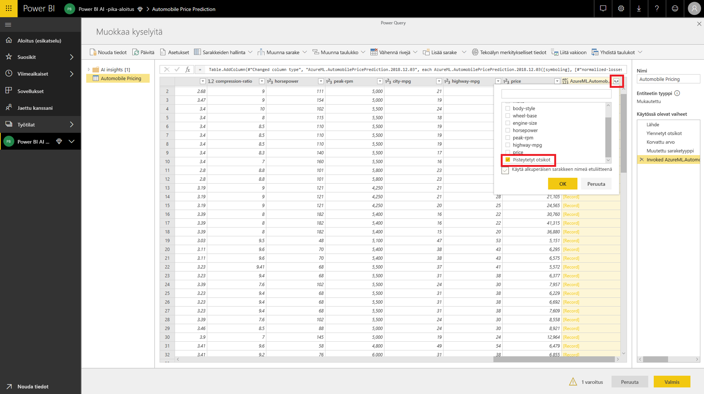

Tulokseksi saadussa *Pisteytetyt otsikot (Scored Labels)* -sarakkeessa on hinta-ennuste Azuren automaattianalyysipalveluiden mallista.

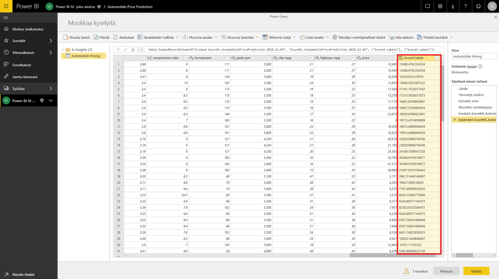

Kun tallennat tietovuon, Azuren automaattianalyysipalveluiden malli käynnistetään automaattisesti, kun tietovuohon päivitetään entiteettitaulukon uusia tai päivitettyjä rivejä.

## Resurssien tyhjentäminen

Jos et enää tarvitse tässä artikkelissa luotuja Azure-resursseja, poista niitä, jotta ne eivät aiheuta kustannuksia.  Voit poistaa myös luomasi tietovuot, jos et enää tarvitse niitä.

## Seuraavat vaiheet

Tässä opetusohjelmassa olet luonut yksinkertaisen kokeilun käyttämällä Azuren automaattianalyysistudiota käyttämällä yksinkertaista tietojoukkoa ja seuraavia vaiheita:

- Azuren automaattianalyysipalveluiden mallin luominen ja julkaiseminen
- Mallin käyttöoikeuksien myöntäminen Power BI -käyttäjälle
- Tietovirran luominen
- Azuren automaattianalyysipalveluiden mallin merkityksellisten tietojen lisääminen tietovirtaan

Katso lisätietoja Azuren automaattianalyysipalvelujen integroinnista Power BI:ssä artikkelista [Azuren Automaattianalyysipalveluiden Power BI -integrointi (esikatselu)](service-machine-learning-integration.md).
