# <a name="tutorial-use-cognitive-services-in-power-bi"></a>Opetusohjelma: Kognitiivisten palveluiden käyttäminen Power BI:ssä

Power BI tarjoaa joukon Azuren kognitiivisten palveluiden funktioita, joiden avulla voit rikastaa tietojasi tietovoiden omatoimisessa tietojen valmistelussa. Tällä hetkellä tuettuja palveluita ovat [asenneanalyysi](https://docs.microsoft.com/azure/cognitive-services/text-analytics/how-tos/text-analytics-how-to-sentiment-analysis), [avainlauseiden poiminta](https://docs.microsoft.com/azure/cognitive-services/text-analytics/how-tos/text-analytics-how-to-keyword-extraction), [kielentunnistus](https://docs.microsoft.com/azure/cognitive-services/text-analytics/how-tos/text-analytics-how-to-language-detection), ja [kuvan merkitseminen](https://docs.microsoft.com/azure/cognitive-services/computer-vision/concept-tagging-images). Muunnokset suoritetaan Power BI -palvelussa, eikä niihin tarvita Azuren kognitiivisten palvelujen tilausta. Tämä toiminto edellyttää Power BI Premiumia.

Kognitiivisten palvelujen muunnoksia tuetaan [tietovoiden omatoimisessa tietojen valmistelussa](https://powerbi.microsoft.com/blog/introducing-power-bi-data-prep-wtih-dataflows/). Pääset alkuun hyödyntämällä alla olevia vaiheittaisia esimerkkejä tekstianalyysista ja kuvien merkitsemisestä.

Tässä opetusohjelmassa opit:

> [!div class="checklist"]
> * tuomaan tietoja tietovuohon
> * pisteyttämään asenteen ja poimimaan tärkeimmät lauseet tietovirran tekstisarakkeesta
> * muodostamaan yhteyden tuloksiin Power BI Desktopista.


## <a name="prerequisites"></a>Edellytykset

Tätä opetusohjelmaa varten tarvitset seuraavat asiat: 

- Power BI -tili. Jos et ole rekisteröitynyt Power BI:hin, [rekisteröidy ilmaiseen kokeiluversioon](https://app.powerbi.com/signupredirect?pbi_source=web) ennen aloittamista.
- Power BI Premium -kapasiteetin käyttöoikeus, niin että tekoälykuormitus on käytössä. Tämä kuormitus poistetaan oletusarvon mukaan käytöstä esikatselun aikana. Jos käytössäsi on Premium-kapasiteetti ja tekoälyn merkitykselliset tiedot eivät tule näkyviin, ota yhteyttä Premium-kapasiteetin järjestelmänvalvojaasi ja pyydä häntä ottamaan tekoälyn kuormitus käyttöön hallintaportaalissa.

## <a name="text-analytics"></a>Tekstianalyysi

Suorita opetusohjelman tekstianalyysi-osio noudattamalla tämän osion ohjeita.

### <a name="step-1-apply-sentiment-scoring-in-power-bi-service"></a>Vaihe 1: Käytä asennepisteytystä Power BI -palvelussa

Aloita siirtymällä Premium-kapasiteetin sisältävään Power BI -työtilaan ja luomalla uusi tietovuo käyttämällä näytön oikeassa yläkulmassa olevaa **Luo** painiketta.

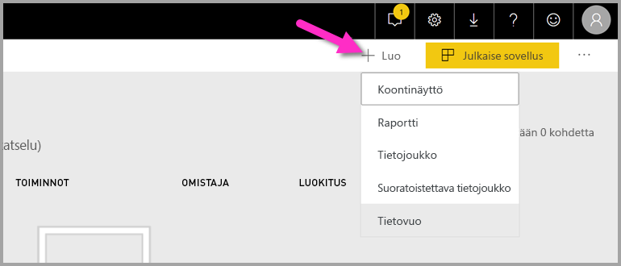

Tietovuo-valintaikkunassa näkyvät uuden tietovuon luomiseen liittyvät asetukset, valitse **Lisää uudet entiteetit**. Valitse seuraavaksi tietolähteiden valikosta vaihtoehto **Teksti/CSV**.

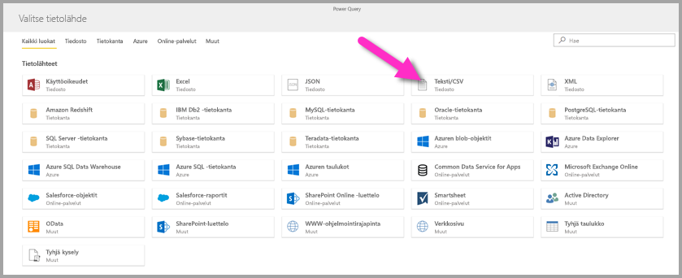

Liitä URL-kenttään tämä URL-osoite: [ https://pbiaitutorials.blob.core.windows.net/textanalytics/FabrikamComments.csv ](https://pbiaitutorials.blob.core.windows.net/textanalytics/FabrikamComments.csv) ja valitse **Seuraava**.

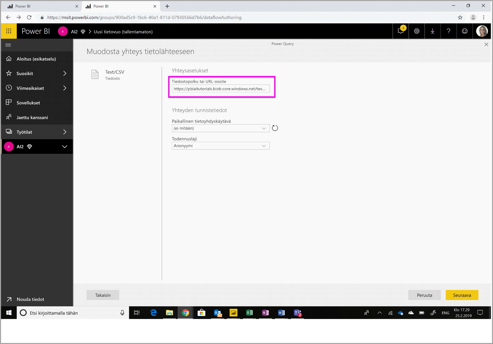

Valitse ylemmästä valintanauhasta **Muunna taulukko** ja valitse sitten **Käytä ensimmäistä riviä otsikkoina**. Tietoja voi nyt käyttää tekstianalyysissa, ja voimme käyttää asennepisteytystä ja avainlauseiden poimintaa asiakkaiden kommenttisarakkeessa.

Valitse Power Query -editorissa **Tekoälyn merkitykselliset tiedot**

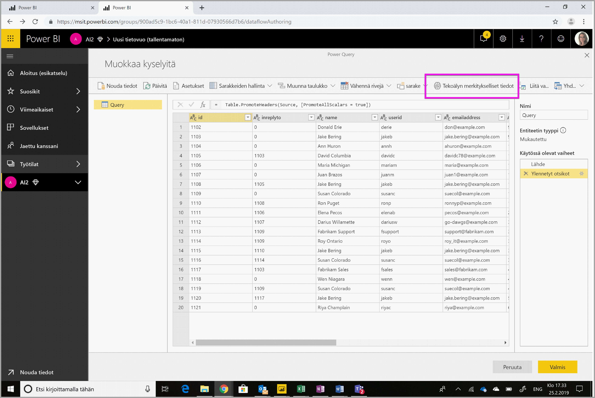

Laajenna **kognitiivisten palvelujen** kansio ja valitse funktio, jota haluat käyttää. Tässä esimerkissä pisteytetään kommenttisarakkeen asenne, mutta tekemällä samat toimet voit kokeilla myös kielentunnistusta ja avainlauseen poimintaa.

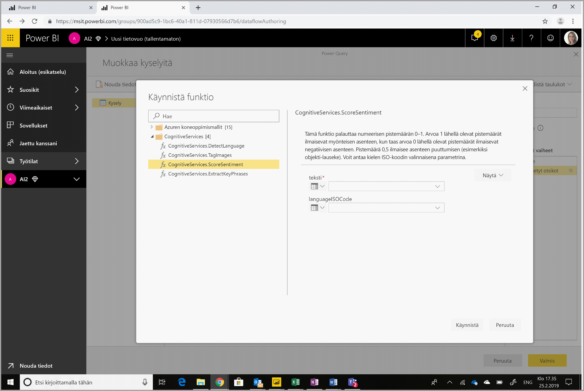

Kun funktio on valittuna, pakolliset ja valinnaiset kentät tulevat näkyviin. Jos haluat määrittää esimerkkiarvostelujen pisteet, valitse tekstisyötteeksi arvostelusarake. Maa-asetuksen tiedot ovat valinnainen syöte, joka on annettava ISO-muodossa. Voit esimerkiksi antaa arvon 'en', jos haluat käsitellä englanninkielisen tekstin. Jos kenttä on jätetty tyhjäksi, Power BI tunnistaa ensin syöttöarvon kielen ja pisteyttää asenteen sitten.

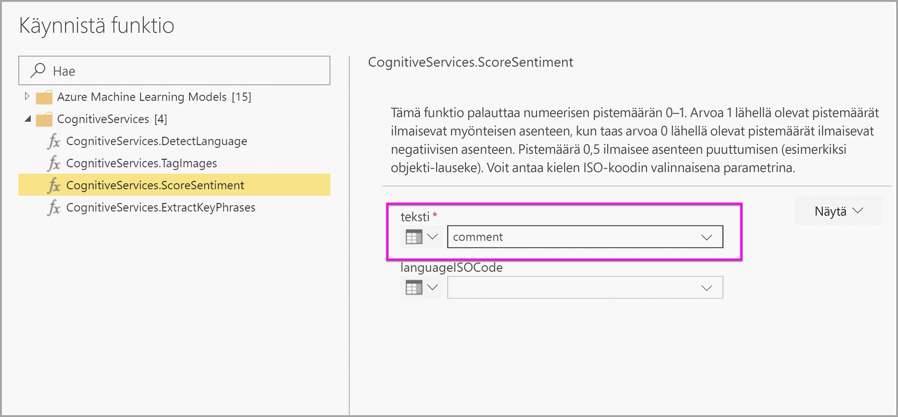

Voit nyt suorittaa funktion valitsemalla **Käynnistä**. Taulukkoon lisätään uusi sarake, jossa on kunkin rivin asennepistemäärä. Voit palata **Tekoälyn merkitykselliset tiedot** -kohtaan ja poimia arvosteltavan tekstin avainlauseet samalla tavalla.

Kun olet saanut muunnokset valmiiksi, muuta kyselyn nimeksi ”Asiakkaiden kommentit” ja valitse sitten **Valmis**.

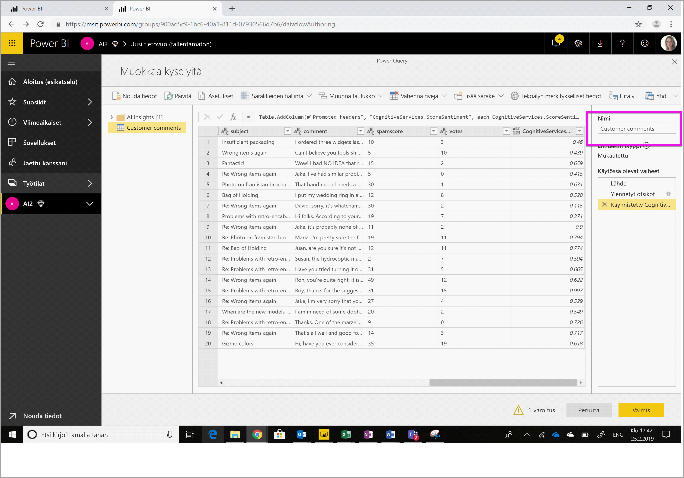

**Tallenna** sitten tietovuo ja anna sille nimeksi Fabrikam. Valitse **Päivitä nyt** -painike, joka tulee näyttöön tietovuon tallennuksen jälkeen.

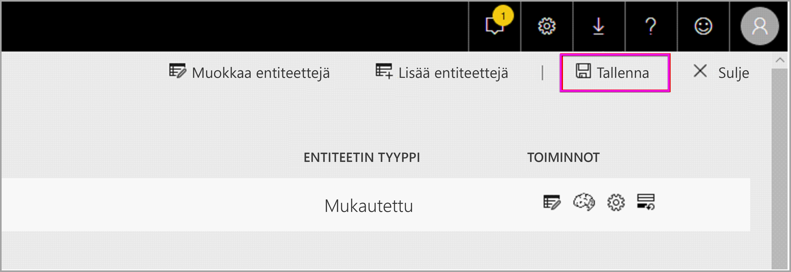

Kun tietovuo on tallennettu ja päivitetty, voit käyttää sitä Power BI -raportissa.

### <a name="step-2-connect-from-power-bi-desktop"></a>Vaihe 2: Muodosta yhteys Power BI Desktopista

Avaa Power BI Desktop. Valitse Aloitus-valintanauhasta **Nouda tiedot**.

Siirry Power BI -osassa kohtaan **Power BI -tietovuot (beeta**) ja valitse **Yhdistä**.

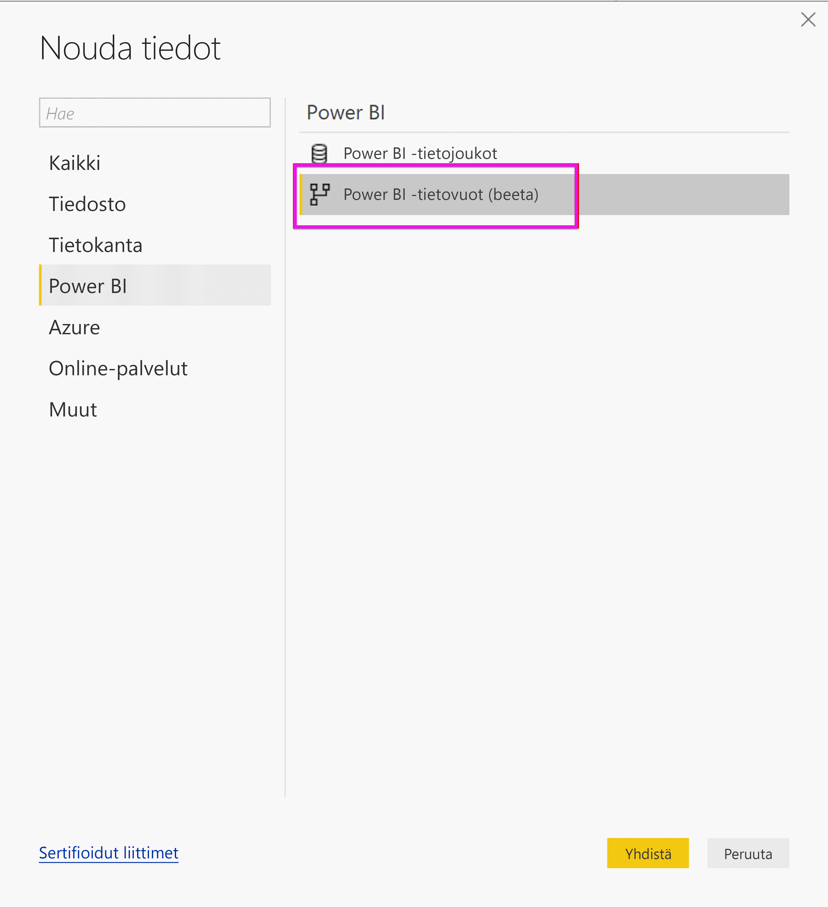

Koska tämä on esikatselutoiminto, kytkentä pyytää sinua hyväksymään esikatselun ehdot. Kun olet hyväksynyt ne, kirjaudu sisään käyttämällä organisaation tiliäsi.

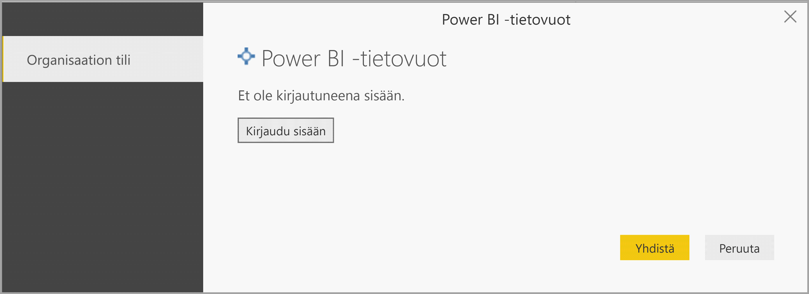

Valitse juuri luomasi tietovuo. Siirry asiakaskommenttien taulukkoon ja valitse **Lataa**.

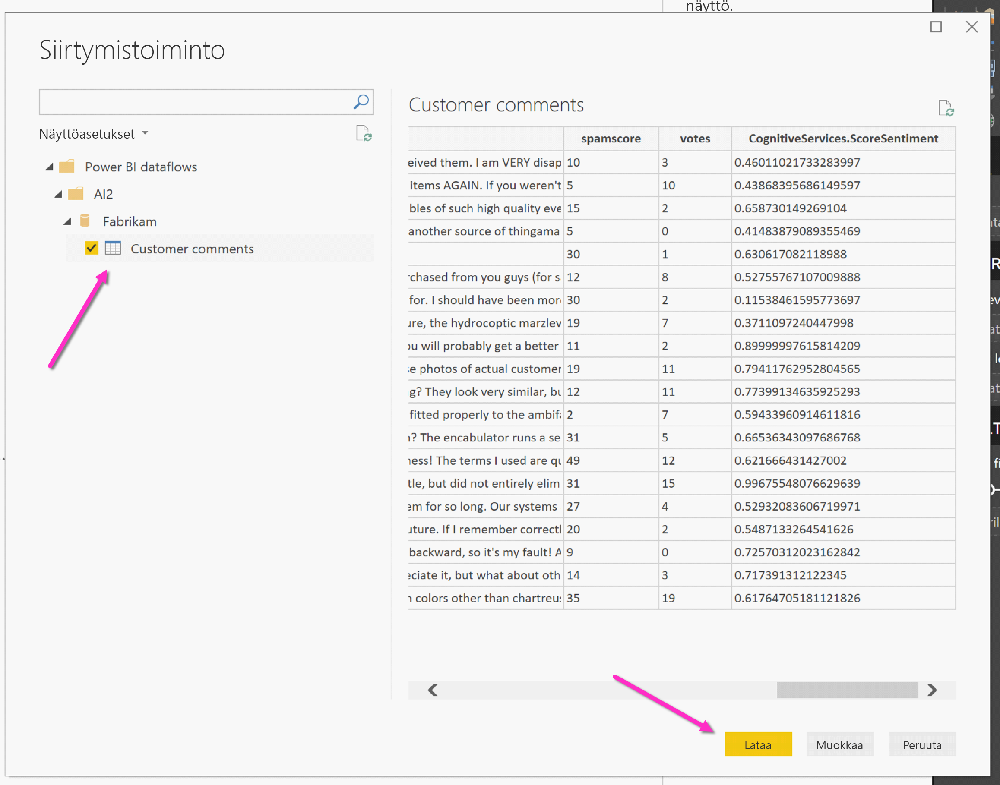

Tiedot on ladattu, joten voit aloittaa raportin luomisen.

## <a name="image-tagging"></a>Kuvien merkitseminen

Siirry Power BI -työtilaan, jossa on Premium-kapasiteetti. Luo uusi tietovuo käyttämällä näytön oikeassa yläkulmassa olevaa **Luo**-painiketta.

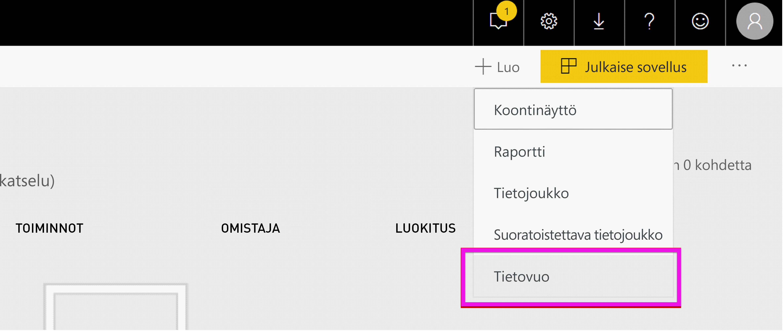

Valitse **Lisää uudet entiteetit**.

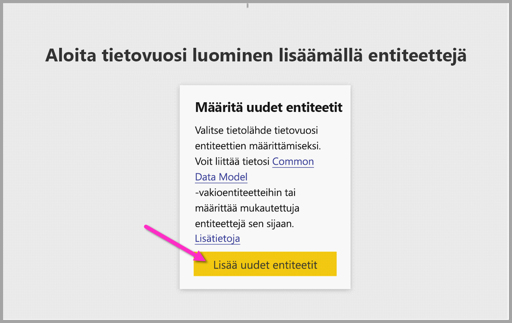

Kun sinua pyydetään valitsemaan tietolähde, valitse **Tyhjä kysely**.

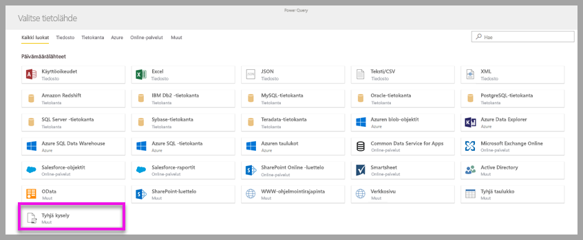

Kopioi alla oleva kysely kyselyeditoriin ja valitse Seuraava. Voit korvata alla olevat URL-osoitteet muilla kuvilla tai lisätä rivejä. *Web.Contents*-funktio tuo kuvan URL-osoitteen binaarimuodossa. Jos sinulla on tietolähde, johon kuvat on tallennettu binaarimuodossa, voit myös käyttää suoraan kyseistä tietolähdettä.


```python
let
  Source = Table.FromRows({
  { Web.Contents("https://images.pexels.com/photos/87452/flowers-background-butterflies-beautiful-87452.jpeg") },
  { Web.Contents("https://upload.wikimedia.org/wikipedia/commons/5/53/Colosseum_in_Rome%2C_Italy_-_April_2007.jpg") }}, { "Image" })
in
  Source
```

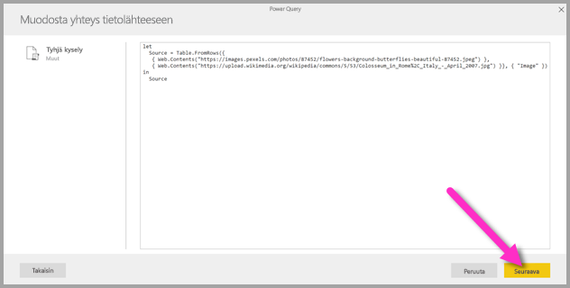

Kun tunnistetietoja pyydetään, valitse *anonyymi*.

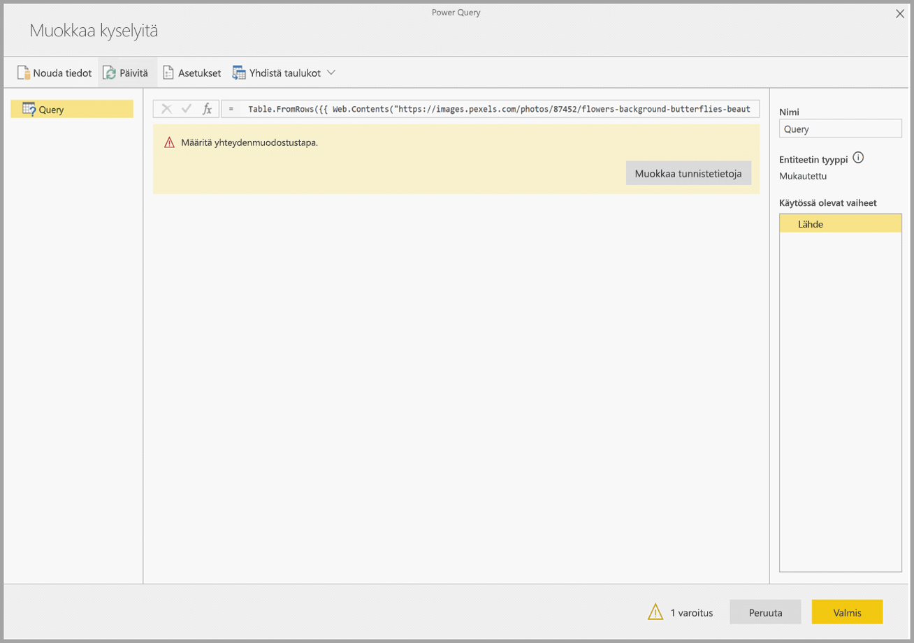

Seuraava kuva tulee näkyviin.

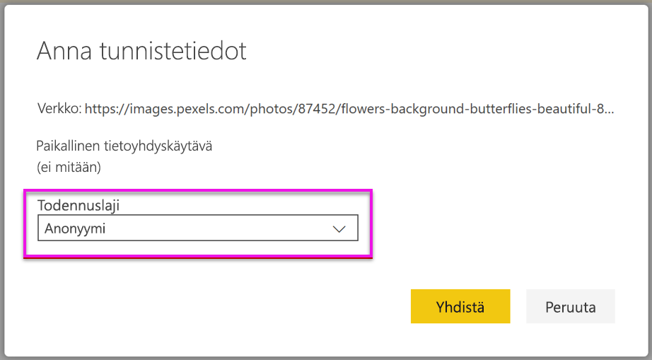

Sinulta pyydetään tunnistetiedot kutakin yksittäistä verkkosivua varten.

Valitse kyselyeditorissa **Tekoälyn merkitykselliset tiedot**.

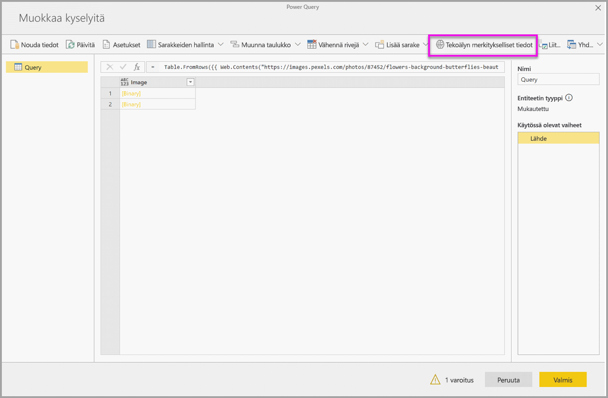

Kirjaudu seuraavaksi sisään käyttämällä **organisaatiotiliäsi**.

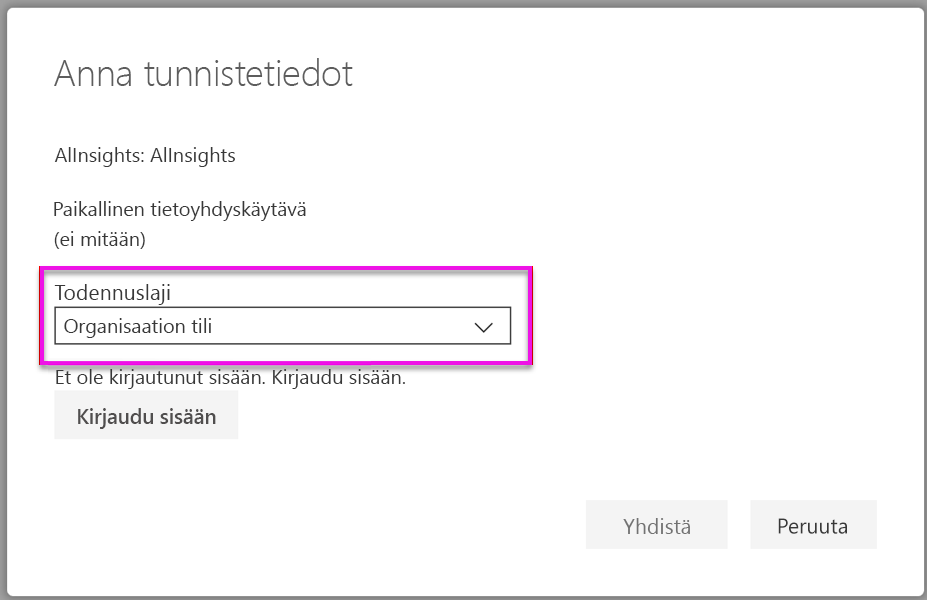

Valitse Merkitse kuvat -funktio, kirjoita sarakekenttään _[Binary]_ ja maa-asetuksen tietokenttään _en_. 

> [!NOTE]
> Saraketta ei tällä hetkellä voi valita avattavan valikon avulla, ja tämä ongelma ratkaistaan mahdollisimman pian yksityisen esikatselun aikana.

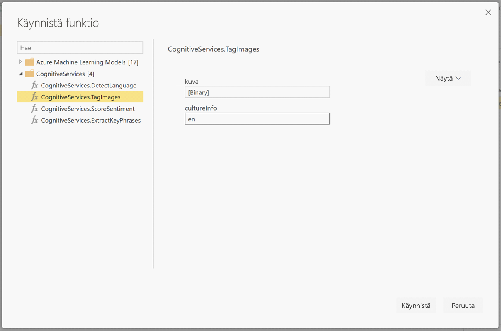

Poista funktioeditorissa lainausmerkit sarakkeen nimen ympäriltä. 

> [!NOTE]
> Lainausmerkkien poistaminen on väliaikainen ratkaisu, joka selvitetään mahdollisimman pian esikatselun aikana.

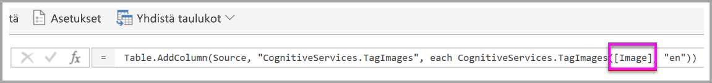

Funktio palauttaa tietueen sekä niin, että tunnisteet ovat .csv-tiedostossa, että json-tietueena. Valitse laajennuspainike ja lisää taulukkoon jompikumpi sarake tai molemmat sarakkeet.

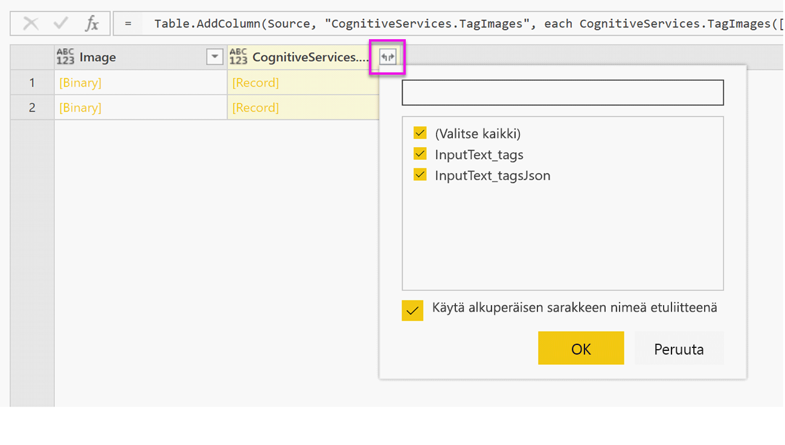

Valitse **Valmis** ja tallenna tietovuo. Kun olet päivittänyt tietovirran, voit muodostaa siihen yhteyden Power BI Desktopista käyttäen Tietovuot-liittimiä. (Ohjeet ovat tämän asiakirjan sivulla 5).

## <a name="clean-up-resources"></a>Resurssien tyhjentäminen

Kun kyselyä ei enää tarvita, poista se napsauttamalla kyselyn nimeä hiiren kakkospainikkeella Power Query -editorissa ja valitsemalla **Poista**.

## <a name="next-steps"></a>Seuraavat vaiheet

Tässä opetusohjelmassa käytit asenteen pisteytys- ja kuvien merkitseminen -funktioita Power BI -tietovuossa. Jos haluat lisätietoja Power BI:n kognitiivisista palveluista, lue seuraavat artikkelit.

* [Kognitiiviset palvelut Azuressa](https://docs.microsoft.com/azure/cognitive-services/)
* Aloita [omatoiminen tietojen valmistelu tietovoiden avulla](service-dataflows-overview.md)
* Lisätietoja [Power BI Premiumista](https://powerbi.microsoft.com/power-bi-premium/)

Voit olla kiinnostunut myös seuraavista artikkeleista.

* [Opetusohjelma: Automaattianalyysistudion mallin käynnistys Power BI:ssä (esikatselu)](service-tutorial-invoke-machine-learning-model.md)
* [Azuren automaattianalyysipalveluiden integroiminen Power BI:hin (esikatselu)](service-machine-learning-integration.md)
* [Kognitiiviset palvelut Power BI:ssä (esikatselu)](service-cognitive-services.md)