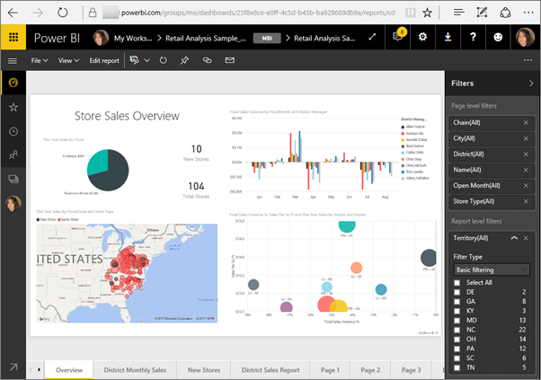
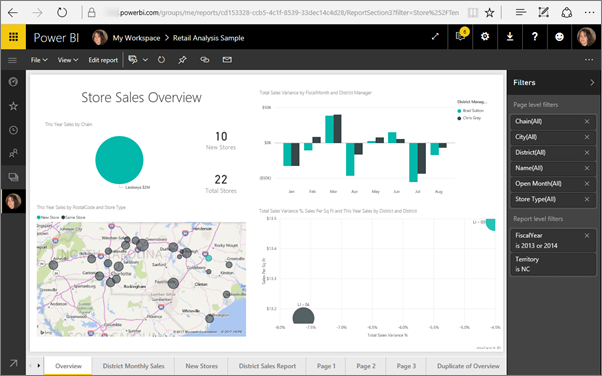
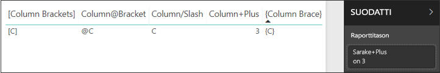
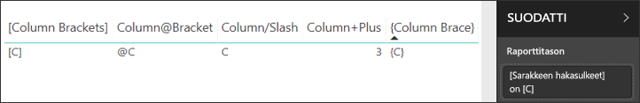

# <a name="filter-a-report-using-query-string-parameters-in-the-url"></a>Raportin suodattaminen URL-osoitteen kyselymerkkijonoparametrien avulla

Kun avaat raportin Power BI -palvelussa, raportin jokaisella sivulla on oma yksilöllinen URL-osoitteensa. Voit suodattaa raporttisivun käyttämällä Suodattimet-ruutua raportin alustalla.  Voit myös lisätä kyselymerkkijonoparametrit URL-osoitteeseen, jolloin raportti suodatetaan jo etukäteen. Ehkäpä sinulla on raportti, jonka haluat näyttää työtovereille, ja haluat suodattaa sen heille valmiiksi. Eräs tapa on aloittaa raportin oletusarvoisesta URL-osoitteesta, lisätä suodatinparametreja URL-osoitteeseen ja lähettää sitten heille uusi URL-osoite kokonaisuudessaan sähköpostilla.



## <a name="uses-for-query-string-parameters"></a>Kyselymerkkijonoparametrien käyttötavat

Oletetaan, että käytät Power BI Desktopia. Haluat luoda raportin, jossa on linkit muihin Power BI -raportteihin, mutta haluat näyttää vain joitakin muiden raporttien tietoja. Suodata raportit ensin kyselymerkkijonoparametrien avulla ja tallenna URL-osoitteet. Luo seuraavaksi Desktopissa taulukko, jossa käytät uusien raporttien URL-osoitteita.  Sitten voit julkaista ja jakaa raportin.

Toinen kyselymerkkijonoparametrien käyttötapa on hyödyllinen edistynyttä Power BI -ratkaisua luotaessa.  DAX-kielen avulla he luovat raportin, joka luo suodatetun raportin URL-osoitteen dynaamisesti asiakkaan nykyisessä raportissa tekemän valinnan perusteella. Kun asiakas valitsee URL-osoitteen, hän näkee vain itselleen tarkoitetut tiedot. 

## <a name="query-string-parameter-syntax-for-filtering"></a>Kyselyn merkkijonon parametrisyntaksi suodattamista varten

Parametreilla voit suodattaa raportista yhden arvon tai useita arvoja, vaikka kyseiset arvot sisältäisivät välilyöntejä tai erikoismerkkejä. Perussyntaksi on melko yksinkertainen: aloita raportin URL-osoitteella, lisää kysymysmerkki ja lisää sitten suodattimen syntaksi.

URL?filter=***Table***/***Field*** eq '***value***'


* **Table** (Taulukko)- ja **Field** (Kenttä) -nimissä merkkikoko on merkitsevä, kun taas **value** (arvo) -kohdassa näin ei ole.
* Kentät, jotka on piilotettu raporttinäkymästä, voidaan edelleen suodattaa.

### <a name="reports-in-apps"></a>Raportit sovelluksissa

Jos haluat lisätä raporttiin URL-suodattimen sovelluksessa, muotoilu on hiukan erilainen. Sovelluksen raportteihin osoittavissa linkeissä on kyselyparametri (ctid), joka lisätään URL-osoitteeseen. Erota kyselyparametrit käyttäen et-merkkiä (&). Säilytä "?filter=" ja siirrä ctid-parametri URL-osoitteen loppuun et-merkin (&) jälkeen. 

Tässä esimerkki:

app.powerbi.com/groups/me/apps/*app-id*/reports/*report-id*/ReportSection?filter=*Table*/*Field* eq '*value*&'ctid=*ctid*

### <a name="field-types"></a>Kenttätyypit

Kenttätyyppi voi olla luku, päivämäärä ja aika tai merkkijono, ja käytetyn tyypin on vastattava tietojoukossa määritettyä tyyppiä.  Esimerkiksi taulukon sarakkeen määrittäminen Merkkijono-tyyppiseksi ei ole toimiva ratkaisu, jos etsit Päivämäärä-tyyppiseksi määritetyssä tietojoukon sarakkeessa sijaitsevaa päivämäärä/aika-tietoa tai numeerista arvoa (esimerkiksi Table/StringColumn eq 1).

* **Merkkijonot** on sijoitettava puolilainausmerkkeihin, esim. 'esimiehen nimi'.
* **Luvut** eivät edellytä erityistä muotoilua. Lisätietoja on tämän artikkelin osiossa [Numeeriset tietotyypit](#numeric-data-types).
* **Päivämäärät ja ajat** Katso tämän artikkelin osio [Päivämäärän tietotyypit](#date-data-types). 

Jos tuntuu sekavalta, jatka lukemista, kohta asia selviää.  

## <a name="filter-on-a-field"></a>Kentän suodattaminen

Oletetaan, että raportin URL-osoite on seuraava.


Näemme karttavisualisoinnissa (edellä), että meillä on varastoja Pohjois-Carolinassa.

>[!NOTE]
>Tämä esimerkissä perustuu [Jälleenmyyntianalyysimalliin](sample-datasets.md).
> 

Jos haluat suodattaa raportin näyttämään tiedot vain myymälöille ”NC” (Pohjois-Carolina), lisää URL-osoitteeseen

?filter=Store/Territory eq 'NC'


>[!NOTE]
>*NC* on tallennettu arvo **Alue**-kenttään **Store**-taulukossa.
> 

Raporttimme on suodatettu Pohjois-Carolinassa. Kaikki raporttisivun visualisoinnit näkyvät vain Pohjois-Carolinassa.



## <a name="filter-on-multiple-fields"></a>Useiden kenttien suodattaminen

Voit myös suodattaa useita kenttiä lisäämällä lisäparametrit URL-osoitteeseesi. Palataan takaisin alkuperäisen suodattimen parametriin.

```
?filter=Store/Territory eq 'NC'
```

Voit suodattaa lisäkenttiä lisäämällä **and**-sanan ja toisen kentän samassa muodossa kuin edellä. Tässä esimerkki:

```
?filter=Store/Territory eq 'NC' and Store/Chain eq 'Fashions Direct'
```

<iframe width="640" height="360" src="https://www.youtube.com/embed/0sDGKxOaC8w?showinfo=0" frameborder="0" allowfullscreen></iframe>

## <a name="operators"></a>Operaattorit

Power BI tukee useita muitakin operaattoreita kuin **and**. Seuraavassa taulukossa on lueteltu kyseiset operaattorit ja niiden tukemat sisältötyypit.

|operaattori  | määritelmä | merkkijono  | luku | Päivämäärä |  Esimerkki|
|---------|---------|---------|---------|---------|---------|
|**and**     | ja |  kyllä      | kyllä |  kyllä|  product/price le 200 and price gt 3.5 |
|**eq**     | yhtä suuri kuin |  kyllä      | kyllä   |  kyllä       | Address/City eq 'Redmond' |
|**ne**     | eri suuri kuin |   kyllä      | kyllä  | kyllä        |  Address/City ne 'London' |
|**ge**     |  suurempi tai yhtä suuri kuin       | ei | kyllä |kyllä |  product/price ge 10
|**gt**     | suurempi kuin        |ei | kyllä | kyllä  | product/price gt 20
|**le**     |   pienempi tai yhtä suuri kuin      | ei | kyllä | kyllä  | product/price le 100
|**lt**     |  pienempi kuin       | ei | kyllä | kyllä |  product/price lt 20
|**in\*\***     |  mukaan lukien       | kyllä | kyllä |  kyllä | Student/Age in (27, 29)


\*\* Kun käytät **in**-operaattoria, **in**-operaattorin oikealla puolella olevat arvot voidaan merkitä sulkeiden sisälle pilkuilla erotettuna luettelona tai yksittäisenä lausekkeena, joka palauttaa kokoelman.

### <a name="numeric-data-types"></a>Numeeriset tietotyypit

Power BI:n URL-suodatin voi sisältää lukuja seuraavissa muodoissa.

|Luvun tyyppi  |Esimerkki  |
|---------|---------|
|**kokonaisluku**     |   5      |
|**pitkä**     |   5 L tai 5 l      |
|**kaksinkertainen**     |   5.5 tai 55e-1 tai 0.55e+1 tai 5D tai 5d tai 0.5e1D tai 0.5e1d tai 5.5D tai 5.5d tai 55e-1D tai 55e-1d     |
|**desimaaliluku**     |   5 M tai 5 m tai 5.5 M tai 5.5 m      |
|**liukuluku**     | 5 F tai 5 f tai 0.5e1 F tai 0.5e-1 d        |

### <a name="date-data-types"></a>Päivämäärän tietotyypit

Power BI tukee sekä OData V3- että V4-versioita **Date**- ja **DateTimeOffset**-tietotyypeille. OData V3 -versiossa päivämäärät on sijoitettava puolilainausmerkkeihin ja niiden edellä on oltava sana datetime. OData V4 -versiossa ei tarvitse olla puolilainausmerkkejä tai sanaa datetime. 
  
Päivämäärät esitetään EDM-muodossa (2019-02-12T00:00:00): Kun määrität päivämäärän muodossa 'VVVV-KK-PP', Power BI tulkitsee sen muodossa 'VVVV-KK-PPT00:00:00'. Varmista, että kuukausi ja päivä ovat kaksimerkkisiä eli KK ja PP.

Miksi tämä ero on merkityksellinen? Oletetaan, että luot kyselymerkkijonoparametrin **Table/Date gt '2018-08-03'** .  Sisältävätkö tulokset elokuun kolmannen päivän 2018 vai alkavatko ne elokuun neljännestä 2018? Power BI kääntää kyselysi muotoon **Table/Date gt '2018-08-03T00:00:00'** . Tulokset siis sisältävät päivämäärät, joilla on nollasta poikkeava aikaosa, koska nämä päivämäärät ovat suurempia kuin **'2018-08-03T00:00:00'** .

V3- ja V4-versioiden välillä on muitakin eroja. OData V3 ei tue Dates- vaan ainoastaan DateTime-muotoa. Jos siis käytät V3-muotoa, sille on annettava täydellinen päivämäärä ja aika. Päivämäärän literaaleja, kuten "datetime'2019-05-20'", ei tueta V3-muodossa. V4-muodossa voit kuitenkin kirjoittaa "2019-05-20". Seuraavassa on kaksi samanlaista suodatinkyselyä V3- ja V4-versiossa:

- OData V4 -muoto: filter=Table/Date gt 2019-05-20
- OData V3 -muoto: filter=Table/Date gt datetime'2019-05-20T00:00:00'


## <a name="special-characters-in-url-filters"></a>URL-suodattimien erikoismerkit

Erikoismerkit ja välilyönnit edellyttävät lisämuotoiluja. Kun kysely sisältää välilyöntejä, ajatusviivoja tai muita kuin ASCII-merkkejä, lisää kyseisiin erikoismerkkeihin etuliitteeksi *escape-koodi*, joka alkaa alaviivalla ja X:llä ( **_x**), sitten 4-numeroinen **Unicode-tunnus** ja lopuksi toinen alaviiva. Jos Unicode-tunnuksessa on vähemmän kuin neljä merkkiä, sinun on täydennettävä sitä nollilla. Seuraavassa on joitakin esimerkkejä.

|Tunniste  |Unicode  | Koodaus Power BI:ssä  |
|---------|---------|---------|
|**Taulukon nimi**     | Välilyönti on 0x20        |  Taulukon_x0020_nimi       |
|**Sarakkeen**@**numero**     |   @ on 0x40     |  Sarakkeen_x0040_numero       |
|**[Sarake]**     |  [ on 0x005B ] on 0x005D       |  _x005B_Column_x005D_       |
|**Sarake+Plus**     | + on 0x2B        |  Sarake_x002B_Plus       |

Table_x0020_Name/Column_x002B_Plus eq 3 


Table_x0020_Special/_x005B_Column_x0020_Brackets_x005D_ eq '[C]' 

## <a name="use-dax-to-filter-on-multiple-values"></a>DAX-kielen käyttäminen useiden arvojen suodattamisessa

Toinen tapa suodattaa useita kenttiä on luoda laskettu sarake, joka yhdistää kaksi kenttää yhdeksi arvoksi. Sitten voit suodattaa tuon arvon.

Meillä on esimerkiksi kaksi kenttää: Territory (alue) ja Chain (ketju). Luo Power BI Desktopissa [uusi laskettu sarake](desktop-tutorial-create-calculated-columns.md) (kenttä), jota kutsutaan nimellä TerritoryChain (alueketju). Muista, että **kentän** nimessä ei voi olla välilyöntejä. Tässä on kyseisen sarakkeen DAX-kaava.

TerritoryChain = [Territory] & " - " & [Chain]

Julkaise raportti Power BI -palvelussa ja suodata URL-kyselymerkkijonon avulla näyttämään vain Lindseys- myymälät, NC.

    https://app.powerbi.com/groups/me/reports/8d6e300b-696f-498e-b611-41ae03366851/ReportSection3?filter=Store/TerritoryChain eq 'NC – Lindseys'

## <a name="pin-a-tile-from-a-filtered-report"></a>Kiinnitä ruutu suodatetusta raportista

Kun olet suodattanut raportin käyttämällä kyselymerkkijonon parametreja, voit kiinnittää visualisointeja kyseisestä raportista raporttinäkymääsi.  Raporttinäkymän ruutu tuo näkyviin suodatetut tiedot, ja valitsemalla kyseisen raporttinäkymän ruutu avaa raportin, jota käytettiin sen luomiseen.  URL-osoitteen kautta tehtyä suodatusta ei kuitenkaan tallenneta raportin yhteydessä. Kun valitset koontinäyttöruudun, raportti avautuu suodattamattomassa tilassa.  Tällöin raporttinäkymäruudussa näytettävät tiedot eivät vastaa raportin visualisoinnissa näkyviä tietoja.

Tästä ristiriidasta on hyötyä, kun haluat nähdä eri tuloksia: raporttinäkymässä suodatettuna ja raportissa suodattamattomana.

## <a name="considerations-and-troubleshooting"></a>Huomioon otettavat seikat ja vianmääritys

On muutamia asioita, jotka tulee ottaa huomioon merkkijonon kyselyparametreja käytettäessä.

* Käytettäessä *in*-operaattoria *in*-operaattorin oikealla puolella olevat arvot on esitettävä sulkeissa olevana pilkuin eroteltuna luettelona.    
* Power BI -raporttipalvelimessa voit [välittää raporttiparametrit](https://docs.microsoft.com/sql/reporting-services/pass-a-report-parameter-within-a-url?view=sql-server-2017.md) sisällyttämällä ne raportin URL-osoitteeseen. Näissä URL-parametreissa ei ole etuliitettä, koska ne on välitetty suoraan raportin käsittelyohjelmaan.
* Kyselyn merkkijonon suodatus ei toimi [Julkaise verkkoon](service-publish-to-web.md)- tai [Vie PDF-muotoon](consumer/end-user-pdf.md) -toiminnoissa.
* [Upota raportin verkko-osa SharePoint Onlinessa](service-embed-report-spo.md) ei tue URL-suodattimia.
* Pitkä tietotyyppi on (2^53-1) JavaScriptin rajoitusten vuoksi.
* Raporttisuodattimien URL-suodattimissa on 10 lausekkeen rajoitus (10 AND-funktiolla yhdistettyä suodatinta).

## <a name="next-steps"></a>Seuraavat vaiheet

[Visualisoinnin kiinnittäminen koontinäyttöön](service-dashboard-pin-tile-from-report.md)  
[Rekisteröi ilmainen kokeiluversio](https://powerbi.microsoft.com/get-started/)

Onko sinulla kysyttävää? [Voit esittää kysymyksiä Power BI -yhteisössä](https://community.powerbi.com/)
