# Koontinäyttöjen ja raporttien käyttötiedot
Jos luot koontinäyttöjä ja raportteja, käyttötiedot auttavat ymmärtämään niiden vaikutusta. Käyttötietojen avulla saat selville, miten koontinäyttöjä ja raportteja käytetään koko organisaatiossa: mitä käytetään, kuka käyttää ja mihin tarkoitukseen.  

Käyttötiedoissa seurataan SharePoint Onlineen upotettujen raporttien käyttöä. Niissä seurataan myös koontinäyttöjen ja raporttien upottamista sekä käyttäjän omistamien tunnistetietojen että sovelluksen omistamien tunnistetietojen kautta. Käyttötiedoissa ei seurata [Julkaise verkkoon](service-publish-to-web.md) -toiminnolla upotettujen raporttien käyttöä.

Käyttötietoraportit ovat vain luku -tyyppiä. Voit kuitenkin mukauttaa käyttötietoraportteja käyttämällä Tallenna nimellä -toimintoa. Toiminto luo täysin uuden tietojoukon ja muuntaa vain luku -raportin täydeksi Power BI -raportiksi, jota voi muokata. Mukautettu raportti sisältää valitun koontinäytön käyttötiedot, minkä lisäksi oletussuodattimen poistamalla saat käyttöösi valitun työtilan kaikkien koontinäyttöjen tai kaikkien raporttien käyttötiedot.

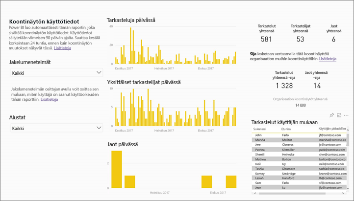

## Miksi käyttötiedot ovat tärkeitä?
Kun tiedät, miten sisältöäsi käytetään, voit esitellä vaikutustasi ja priorisoida toimintaasi. Saatat käyttötiedoista esimerkiksi nähdä, että valtava osa organisaatiosta käyttää jotakin raporttiasi päivittäin tai että luomaasi koontinäyttöä ei tarkastella lainkaan. Tällainen palaute on korvaamatonta työpanoksen kohdentamisessa.

Käyttötietoraporttien tuottaminen on käytettävissä vain Power BI -palvelussa.  Jos kuitenkin tallennat käyttötietoraportin tai kiinnität sen koontinäyttöön, pystyt avaamaan sen ja käyttämään sitä mobiililaitteilla.

### Edellytykset
- Käyttötietoihin tallennetaan tietoa sekä Free- että Pro-käyttäjistä. Käyttötietodatan keräämiseen ja käyttämiseen vaaditaan kuitenkin Pro-käyttöoikeus.
- Käyttötiedot tarjotaan koontinäyttöinä tai raportteina valitussa työtilassa. Käyttötietojen käyttäminen tietyssä koontinäytössä tai raportissa edellyttää, että sinulla on    
    • muokkausoikeudet koontinäyttöön tai raporttiin   
    • Pro-käyttöoikeus

## Tietoja käyttötietoraportista

Kun valitset **Käyttötiedot**-vaihtoehdon tai , Power BI luo valmiiksi luodun raportin kyseisen sisällön käyttötiedoista viimeisten 90 päivän ajalta.  Raportti näyttää samanlaiselta kuin jo tutut Power BI -raportit, mutta se on suunniteltu vain tiedoksi vuorovaikutteisuuden sijaan. Voit osittaa tietoja esimerkiksi sen mukaan, miten loppukäyttäjät käyttivät sisältöä tai käytettiinkö sitä verkossa vai mobiilisovelluksella. Sitä mukaa kun koontinäyttösi ja raporttisi kehittyvät, kehittyy myös käyttötietoraportti, sillä siihen päivitetään uusia tietoja joka päivä.  

Käyttötietoraportit eivät näy **Viimeaikaiset**-, **Työtilat**-, **Suosikit**- tai muissa sisältöluetteloissa. Niitä ei voi lisätä sovellukseen. Jos kiinnität ruudun käyttötietoraportista koontinäyttöön, koontinäyttöä ei voi lisätä sovellukseen tai sisältöpakettiin.

Jos haluat pureutua raporttitietoihin tai luoda omia raporttejasi tästä tietojoukosta, käytä **Tallenna nimellä** -vaihtoehtoa. Lisätietoja on osiossa [Käyttötietoraportin tallentaminen täytenä Power BI -raporttina](#Save-the-Usage-Metrics-report-as-a-full-featured-Power-BI-report-(personalize)).

## Käyttötietoraportin avaaminen koontinäyttöä tai raporttia varten
1. Aloita työtilasta, joka sisältää koontinäytön tai raportin.
2. Valitse joko työtilan sisältöluettelosta tai itse koontinäytöstä tai raportista **Käyttötiedot**-kuvake .
   
    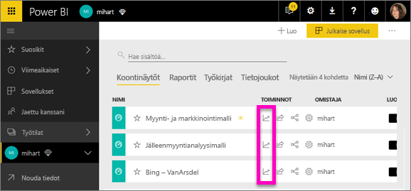
   
    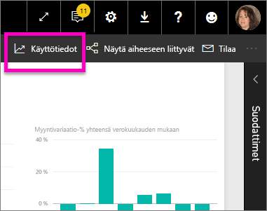
3. Kun teet tämän ensimmäistä kertaa, Power BI luo käyttötietoraportin ja ilmoittaa, kun se on valmis.
   
        
4. Avaa tulokset valitsemalla **Näytä käyttötiedot**.
   
    Käyttötiedoista on runsaasti hyötyä, kun otat käyttöön ja ylläpidät Power BI -koontinäyttöjä ja -raportteja. Mietitkö, mitkä raportin sivut ovat hyödyllisimpiä ja mistä voisi luopua? Saat sen selville, kun ositat raportin **raporttisivun** mukaan. Kannattaisiko koontinäytöstä ehkä tehdä mobiiliasettelu? Osita raportti **ympäristöjen** mukaan, niin saat tietää, kuinka monet käyttävät sisältöäsi mobiilisovelluksilla ja kuinka monet selaimella.

5. Voit halutessasi viedä hiiren visualisoinnin päälle ja lisätä visualisoinnin koontinäyttöön valitsemalla kiinnityskuvakkeen. Voit myös valita yläosan valikkopalkista **Kiinnitä reaaliaikainen sivu**, niin koko sivu lisätään koontinäyttöön. Koontinäytössä voit valvoa käyttötietoja entistä helpommin tai jakaa niitä muiden kanssa.
   
   > **HUOMAA**: Jos kiinnität ruudun käyttötietoraportista koontinäyttöön, koontinäyttöä ei voi lisätä sovellukseen tai sisältöpakettiin.
   > 
   > 

  

## Mitkä tiedot raportoidaan?
| Tieto | Koontinäyttö | Raportti | Kuvaus |
| --- | --- | --- | --- |
| Jakelutavan osittaja |kyllä |kyllä |Millä tavalla käyttäjä pääsi käyttämään sisältöä? Mahdollisia tapoja on kolme: käyttäjä voi käyttää koontinäyttöä tai raporttia [sovellustyötilan](service-the-new-power-bi-experience.md) jäsenenä, vastaanottamalla sisällön itselleen [jaettuna](service-share-dashboards.md) tai asentamalla sisältöpaketin tai sovelluksen.  Huomaa, että sovelluksen kautta tulleet näyttökerrat lasketaan sisältöpaketiksi. |
| Ympäristöosittaja |kyllä |kyllä |Käytettiinkö koontinäyttöä tai raporttia Power BI -palvelun (powerbi.com) vai mobiililaitteen kautta? Mobiililaitteisiin sisältyvät kaikki iOS-, Android- ja Windows-sovellukset. |
| Raporttisivuosittaja |ei |kyllä |Jos raportissa on useampia kuin yksi sivu, osita raportti tarkasteltujen sivujen mukaan. Jos näet luettelossa Tyhjä-vaihtoehdon, raporttisivu on lisätty äskettäin (uuden sivun todellinen nimi tulee näkyviin osittajaluetteloon 24 tunnin kuluessa) ja/tai raporttisivuja on poistettu. Tyhjä-arvolla kuvataan tällaiset tilanteet. |
| Tarkasteluja päivässä |kyllä |kyllä |Päivittäisten näyttökertojen kokonaismäärä. Näyttökerralla tarkoitetaan sitä, kun käyttäjä lataa raporttisivun tai koontinäytön. |
| Yksittäiset tarkastelijat päivässä |kyllä |kyllä |Koontinäyttöä tai raporttia tarkastelleiden *yksittäisten* käyttäjien määrä AAD-käyttäjätilin perusteella. |
| Tarkasteluja per käyttäjä |kyllä |kyllä |Näyttökertojen määrä viimeisten 90 päivän ajalta yksittäisten käyttäjien mukaan jaoteltuna. |
| Jaot päivässä |kyllä |ei |Koontinäytön jakamisten määrä toiselle käyttäjälle tai ryhmälle. |
| Tarkastelut yhteensä |kyllä |kyllä |Näyttökertojen määrä viimeisten 90 päivän aikana. |
| Tarkastelijat yhteensä |kyllä |kyllä |Yksittäisten tarkastelijoiden määrä viimeisten 90 päivän aikana. |
| Jaot yhteensä |kyllä |ei |Koontinäytön tai raportin jakamismäärä viimeisten 90 päivän aikana. |
| Organisaatiossa yhteensä |kyllä |kyllä |Sellaisten koontinäyttöjen tai raporttien määrä koko organisaatiossa, jotka saivat vähintään yhden näyttökerran viimeisten 90 päivän aikana.  Käytetään sijan laskemiseen. |
| Sija: Tarkastelut yhteensä |kyllä |kyllä |Näet koontinäytön tai raportin sijoituksen verrattuna kaikkien koontinäyttöjen ja raporttien näyttökertojen kokonaismäärään viimeisten 90 päivän ajalta. |
| Sija: Jaot yhteensä |kyllä |ei |Näet koontinäytön sijoituksen verrattuna kaikkien koontinäyttöjen jakamiskertojen kokonaismäärään viimeisten 90 päivän ajalta. |

### Koontinäytön käyttötietoraportti

### Raportin käyttötietoraportti
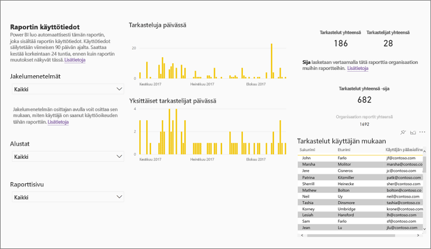

## Käyttötietoraportin tallentaminen täytenä Power BI -raporttina (mukauttaminen)

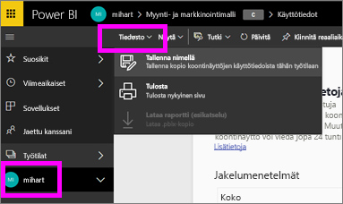

Käytä **Tallenna nimellä** -vaihtoehtoa, kun haluat muuntaa käyttötietoraportin täydeksi Power BI -raportiksi mukauttamista ja jakamista varten. Kun olet luonut mukautetun kopion, saat täydet käyttöoikeudet pohjana olevaan tietojoukkoon. Sitten voi mukauttaa käyttötietoraporttia omien tarpeidesi mukaan. Voit jopa käyttää Power BI Desktopia mukautettujen käyttötietoraporttien luomiseen käyttämällä [reaaliaikaista yhteyttä Power BI -palveluun](https://powerbi.microsoft.com/blog/connecting-to-datasets-in-the-power-bi-service-from-desktop).

Mikä parasta, pohjana olevaan tietojoukkoon sisältyvät työtilan kaikkien koontinäyttöjen ja raporttien käyttötiedot. Se avaa aivan uusia mahdollisuuksia. Voit esimerkiksi luoda raportin, jossa verrataan kaikkia työtilan koontinäyttöjä käytön perusteella. Vaihtoehtoisesti voit luoda käyttötietojen koontinäytön Power BI -sovelluksellesi yhdistämällä käyttötiedot kaikesta sovelluksessa jaellusta sisällöstä.  Lisätietoja [sivutason suodattimen poistamisesta](#remove-the-filter-to-see-all-the-usage-metrics-data-in-the-workspace) on alla.

### Mitä luodaan Tallenna nimellä -vaihtoehtoa käytettäessä?
Kun Power BI luo täyden raportin, se luo myös uuden tietojoukon, **joka koostuu nykyisen työtilan sisältämistä kaikista koontinäytöistä tai kaikista raporteista**, joita on käytetty viimeisten 90 päivän aikana. Oletetaan, että sinulla on työtila nimeltä Myynti, joka sisältää kolme koontinäyttöä ja kaksi raporttia. Luot käyttötietoraportin Koillinen-koontinäytöstä. Käytät **Tallenna nimellä** -vaihtoehtoa ja muunnat sen täydeksi raportiksi. Uuden raportin tietojoukko sisältää käyttötiedot *Koillinen-koontinäytön lisäksi* myös kaikilta Myynti-työtilan kolmelta koontinäytöltä. Oletusarvoisesti raportti näyttää vain Koillinen-koontinäytön tiedot, joten sinun on [poistettava suodatin](#remove-the-filter-to-see-all-the-usage-metrics-data-in-the-workspace) (yksi napsautus), jos haluat nähdä jokaisen kolmen koontinäytön tiedot.

### Luo kopio käyttötietoraportista Tallenna nimellä -toiminnolla.
Kun luot kopion Tallenna nimellä -toiminnolla mukauttamista varten, Power BI muuntaa valmiiksi luodun vain luku -raportin täydeksi raportiksi.  Ensinäkemältä ne näyttävät aivan samoilta. Nyt voit kuitenkin avata raportin muokkausnäkymään, lisätä uusia visualisointeja, suodattimia ja sivuja, muokata tai poistaa aiemmin luotuja visualisointeja ja paljon muuta. Power BI tallentaa uuden raportin ja tietojoukon nykyiseen työtilaan. Alla olevassa esimerkissä nykyinen työtila on **mihart**.

1. Valitse valmiiksi luodussa käyttötietoraportissa **Tiedosto > Tallenna nimellä**. Power BI muuntaa käyttötietoraportin täydeksi Power BI -raportiksi. Tätä kutsutaan *mukautetuksi* käyttötietoraportiksi. Mukautettu käyttöraportti ja tietojoukko tallennetaan nykyiseen työtilaan, jolle annetaan nimi **mihart*.
   
    
2. Avaa raportti muokkausnäkymässä ja [tee sille samat toimet kuin tekisit mille tahansa muulle Power BI -raportille](service-interact-with-a-report-in-editing-view.md). Lisää uusia sivuja, luo uusia visualisointeja, lisää suodattimia, muotoile fontteja ja värejä ja niin edelleen.
   
    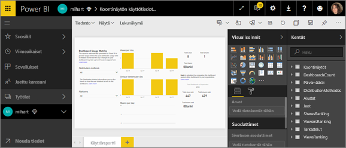
3. Vaihtoehtoisesti voit aloittaa uudella tietojoukolla ja luoda raportin alusta asti.
   
    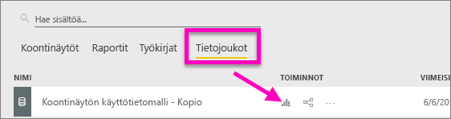
4. Uusi raportti on tallennettu nykyiseen työtilaan (mihart) ja lisätty myös **Viimeaikaiset**-sisältöluetteloon.
   
    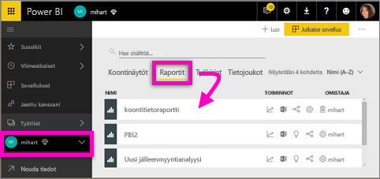

### Suodattimen poistaminen työtilan ***kaikkien*** käyttötietojen näkemiseksi
Jos haluat nähdä työtilan kaikkien koontinäyttöjen tai raporttien käyttötiedot, sinun on poistettava suodatin. Oletusarvoisesti mukautettu raportti on suodatettu näyttämään vain sen luomiseen käytetyn koontinäytön tai raportin tiedot.

Jos käytit esimerkiksi Euroopan myynti -nimistä koontinäyttöä uuden mukautetun raportin luomiseen, näet vain Euroopan myynti -koontinäytön käyttötiedot. Poista suodatin ja ottaa käyttöön työtilan kaikkien koontinäyttöjen tiedot seuraavasti:

1. Avaa mukautettu raportti muokkausnäkymässä.
   
    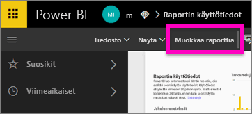
2. Etsi Suodattimet-ruudusta **Raporttitason suodattimet** -säilö ja poista suodatin valitsemalla x-kuvake.
   
    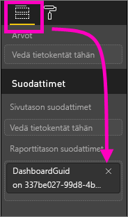
   
    Nyt mukautettu raporttisi näyttää tiedot koko työtilasta.

## Järjestelmänvalvojan ohjausobjektit käyttötiedoille – Power BI:n järjestelmänvalvojille
Käyttötietoraportit ovat ominaisuus, jonka Power BI:n tai Office 365:n järjestelmänvalvoja voi ottaa käyttöön tai poistaa käytöstä. Järjestelmänvalvojat voivat hallita sitä, millä käyttäjillä on oikeus käyttötietoihin. Ne ovat oletusarvoisesti käytössä organisaation kaikilla käyttäjillä.

1. Avaa hallintaportaali valitsemalla rataskuvake Power BI -palvelun oikeassa yläkulmassa ja valitsemalla **Hallintaportaali**.
   
    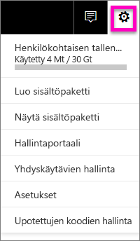
2. Valitse hallintaportaalissa **Vuokraaja-asetukset** ja sitten **Käyttötiedot sisällöntekijöille**.
   
    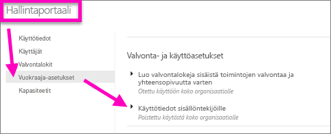
3. Ota käyttötiedot käyttöön (tai poista ne käytöstä) ja valitse **Käytä**.
   
    

Kun käyttötietoja poistetaan koko organisaation käytöstä, järjestelmänvalvojat voivat käyttää **Poista kaikki olemassa oleva käyttömittarien sisältö** -vaihtoehtoa. Se poistaa kaikki aiemmin luodut raportit ja koontinäytön ruudut, jotka on luotu käyttämällä käyttötietoraportteja ja tietojoukkoja. Tämä vaihtoehto poistaa käyttöoikeuden käyttötietoihin kaikilta organisaation käyttäjiltä, jotka tietoja ehkä jo käyttävät. Ole varovainen, sillä aiemmin luodun käyttötietosisällön poistamista ei voi peruuttaa.

## Huomioon otettavat seikat ja rajoitukset
K:    En voi hakea käyttötietoja koontinäytöstä tai raportista.    
V:    Voit nähdä käyttötietoja vain sisällöstä, jonka omistat tai johon sinulla on muokkausoikeudet.

K:    Tallennetaanko käyttötietoihin näyttökerrat upotetuista koontinäytöistä ja raporteista?     
V:    Käyttötiedot eivät tällä hetkellä tue upotettujen koontinäyttöjen tai raporttien käyttötietojen tallentamista. Näihin sisältyvät [käyttäjän omistamat tiedot](developer/integrate-report.md), [sovelluksen omistamat tiedot](developer/embed-sample-for-customers.md) ja [verkkoon julkaistut tiedot](service-publish-to-web.md). Suosittelemme tällaisissa tapauksissa käyttämään muuta verkko-analytiikkaratkaisua isännöivän sovelluksen tai portaalin käytön seurantaan.

K:    En voi hakea käyttötietoja mistään sisällöstä.    
V1:    Järjestelmänvalvojat voivat poistaa tämän ominaisuuden käytöstä organisaatioissaan.  Kysy järjestelmänvalvojaltasi, onko kyse tästä.    
V2:    Käyttötiedot ovat Power BI Pro -ominaisuus.

K:    Tiedot eivät näyttäisi olevan ajan tasalla. Esimerkiksi jakelutapoja ei näytetä, raporttisivuja puuttuu ja niin edelleen.   
V:    Tietojen päivittymisessä voi mennä jopa 24 tuntia.

K:    Työtilassa on neljä raporttia, mutta käyttötietoraportti näyttää vain kolme.    
V:    Käyttötietoraporttiin sisällytetään vain raportit (tai koontinäytöt), joita on käytetty viimeisten 90 päivän aikana.  Jos raportti (tai koontinäyttö) ei näy, sitä ei todennäköisesti ole käytetty viimeisten 90 päivän aikana.

## Seuraavat vaiheet
[Koontinäytön lisääminen suosikkeihin](service-dashboard-favorite.md)

Ilmenikö muuta kysyttävää? [Kokeile Power BI -yhteisöä](http://community.powerbi.com/)

