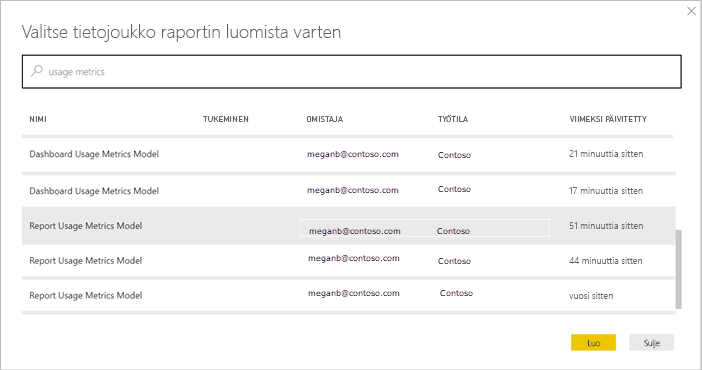
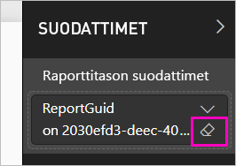

# Power BI:n koontinäyttöjen ja raporttien käyttötietojen valvonta

Jos luot koontinäyttöjä ja raportteja, käyttötiedot auttavat ymmärtämään niiden vaikutusta. Kun haet joko koontinäytön tai raportin käyttötietoja, saat selville, miten kyseisiä koontinäyttöjä ja raportteja käytetään koko organisaatiossasi, ketkä niitä käyttävät ja mihin tarkoitukseen.  

Käyttötietoraportit ovat vain luku -tyyppiä. Voit kuitenkin kopioida käyttötietoraportin. Kopionti luo tavallisen Power BI -raportin, jota voit muokata. Voit myös luoda omia raportteja Power BI Desktopissa hyödyntämällä pohjana olevaa tietojoukkoa, joka sisältää työtilan kaikkien koontinäyttöjen tai kaikkien raporttien käyttötiedot. Aluksi kopioitu raportti näyttää vain valitun koontinäytön tai raportin tiedot. Voit poistaa oletussuodattimen ja käyttää pohjana olevaa tietojoukkoa, joka sisältää kaikki valitun työtilan käyttötiedot. Voit myös nähdä yksittäisten käyttäjien nimet, jos järjestelmänvalvojasi on sallinut sen.

> [!NOTE]
> Käyttötiedoissa seurataan SharePoint Onlineen upotettujen raporttien käyttöä. Käyttötiedoissa ei kuitenkaan seurata ”käyttäjän omistamien tunnistetietojen” tai ”sovelluksen omistamien tunnistetietojen” työnkulun kautta upotettuja koontinäyttöjä ja raportteja. Käyttötiedoissa ei myöskään seurata [Julkaise verkkoon](service-publish-to-web.md) -toiminnolla upotettujen raporttien käyttöä.

## Miksi käyttötiedot ovat tärkeitä

Kun tiedät, miten sisältöäsi käytetään, voit esitellä vaikutustasi ja priorisoida toimintaasi. Saatat käyttötiedoista esimerkiksi nähdä, että valtava osa organisaatiosta käyttää jotakin raporttiasi päivittäin tai että luomaasi koontinäyttöä ei tarkastella lainkaan. Tällainen palaute on korvaamatonta työpanoksen kohdentamisessa.

Voit hakea käyttötietoraportteja vain Power BI-palvelussa. Jos kuitenkin tallennat käyttötietoraportin tai kiinnität sen koontinäyttöön, voit avata tämän raportin ja käyttää sitä mobiililaitteilla.

## Edellytykset

- Käyttötietodatan suorittamiseen ja käyttämiseen tarvitaan Power BI Pro -käyttöoikeus. Käyttötieto-ominaisuus kuitenkin tallentaa tietoa kaikista käyttäjistä heille määritetyistä käyttöoikeuksista riippumatta.
- Käyttötietojen käyttäminen tietyssä koontinäytössä tai raportissa edellyttää, että sinulla on muokkausoikeus kyseiseen koontinäyttöön tai raporttiin.
- Power BI -järjestelmänvalvojan on täytynyt ottaa käyttöön käyttötiedot sisällöntekijöille. Power BI -järjestelmänvalvoja on voinut ottaa käyttöön myös käyttäjäkohtaisten käyttötietojen tietojen keruun. Lue lisää [näiden asetusten käyttöönotosta hallintaportaalissa](service-admin-portal.md#control-usage-metrics). 

## Käyttötietoraportin tarkasteleminen

1. Aloita työtilasta, joka sisältää koontinäytön tai raportin.
2. Valitse joko työtilan sisältöluettelosta tai itse koontinäytöstä tai raportista **Käyttötiedot**-kuvake  .

    

    
3. Kun teet tämän ensimmäistä kertaa, Power BI luo käyttötietoraportin ja ilmoittaa, kun se on valmis.

    
4. Tarkastele tuloksia valitsemalla **Näytä käyttötiedot**.

    Käyttötiedoista on hyötyä, kun otat käyttöön ja ylläpidät Power BI:n koontinäyttöjä ja raportteja. Mietitkö, mitkä raportin sivut ovat hyödyllisimpiä ja mistä voisi luopua? Saat sen selville, kun ositat raportin **raporttisivun** mukaan. Kannattaisiko koontinäytöstä ehkä tehdä mobiiliasettelu? Osita raportti **ympäristöjen** mukaan, niin saat tietää, kuinka monet käyttävät sisältöäsi mobiilisovelluksilla ja kuinka monet selaimella.

5. Voit halutessasi viedä hiiren visualisoinnin päälle ja lisätä visualisoinnin koontinäyttöön valitsemalla kiinnityskuvakkeen. Voit myös valita yläosan valikkopalkista **Kiinnitä reaaliaikainen sivu**, niin koko sivu lisätään koontinäyttöön. Koontinäytössä voit valvoa käyttötietoja entistä helpommin tai jakaa niitä muiden kanssa.

    > [!NOTE]
    > Jos kiinnität ruudun käyttötietoraportista koontinäyttöön, et voi lisätä koontinäyttöä sovellukseen.

### Koontinäytön käyttötietoraportti

### Raportin käyttötietoraportti

## Tietoja käyttötietoraportista

Kun valitset **Käyttötiedot**-vaihtoehdon tai  koontinäytön tai raportin vierestä, Power BI luo valmiiksi luodun raportin kyseisen sisällön käyttötiedoista viimeisten 90 päivän ajalta.  Raportti näyttää samanlaiselta kuin Power BI-raportit, joihin olet jo tutustunut. Voit osittaa tietoja esimerkiksi sen mukaan, miten loppukäyttäjät käyttivät sisältöä tai käytettiinkö sitä verkossa vai mobiilisovelluksella. Sitä mukaa kun koontinäyttösi ja raporttisi kehittyvät, kehittyy myös käyttötietoraportti, sillä siihen päivitetään uusia tietoja joka päivä.  

Käyttötietoraportit eivät näy **Viimeaikaiset**-, **Työtilat**-, **Suosikit**- tai muissa sisältöluetteloissa. Niitä ei voi lisätä sovellukseen. Jos kiinnität ruudun käyttötietoraportista koontinäyttöön, et voi lisätä koontinäyttöä sovellukseen.

Jos haluat syventyä raportin tietoihin tai luoda omia raporttejasi pohjana olevan tietojoukon perusteella, sinulla on kaksi vaihtoehtoa: 

- Luo raportista kopio Power BI -palvelussa. Lue lisätietoja tämän artikkelin osiosta [Käyttötietoraportin kopion tallentaminen](#save-a-copy-of-the-usage-metrics-report).
- Muodosta yhteys tuloksiin Power BI Desktopista. Jokaisessa työtilassa tietojoukolla on nimi "Raportin käyttötiedot -malli". Lue lisätietoja artikkelista [Yhteyden muodostaminen julkaistuun tietojoukkoon](desktop-report-lifecycle-datasets.md#establish-a-power-bi-service-live-connection-to-the-published-dataset).

    

## Mitkä tiedot raportoidaan?

| Arvo | Koontinäyttö | Raportti | Kuvaus |
| --- | --- | --- | --- |
| Jakelutavan osittaja |kyllä |kyllä |Millä tavalla käyttäjä pääsi käyttämään sisältöä? Mahdollisia tapoja on kolme: käyttäjä voi käyttää koontinäyttöä tai raporttia [työtilan](consumer/end-user-experience.md) jäsenenä, vastaanottamalla sisällön itselleen [jaettuna](service-share-dashboards.md) tai asentamalla sisältöpaketin tai sovelluksen.  Huomaa, että sovelluksen kautta tulleet näyttökerrat lasketaan sisältöpaketiksi. |
| Ympäristöosittaja |kyllä |kyllä |Käytettiinkö koontinäyttöä tai raporttia Power BI -palvelun (powerbi.com) vai mobiililaitteen kautta? Mobiililaitteisiin sisältyvät kaikki iOS-, Android- ja Windows-sovellukset. |
| Raporttisivuosittaja |ei |kyllä |Jos raportissa on useampia kuin yksi sivu, osita raportti tarkasteltujen sivujen mukaan. Jos näet luettelossa Tyhjä-vaihtoehdon, raporttisivu on lisätty äskettäin (uuden sivun todellinen nimi tulee näkyviin osittajaluetteloon 24 tunnin kuluessa) ja/tai raporttisivuja on poistettu. Tyhjä-arvolla kuvataan tällaiset tilanteet. |
| Tarkasteluja päivässä |kyllä |kyllä |Päivittäisten näyttökertojen kokonaismäärä. Näyttökerralla tarkoitetaan sitä, kun käyttäjä lataa raporttisivun tai koontinäytön. |
| Yksittäiset tarkastelijat päivässä |kyllä |kyllä |Koontinäyttöä tai raporttia tarkastelleiden *yksittäisten* käyttäjien määrä AAD-käyttäjätilin perusteella. |
| Tarkasteluja per käyttäjä |kyllä |kyllä |Näyttökertojen määrä viimeisten 90 päivän ajalta yksittäisten käyttäjien mukaan jaoteltuna. |
| Jaot päivässä |kyllä |ei |Koontinäytön jakamisten määrä toiselle käyttäjälle tai ryhmälle. |
| Tarkastelut yhteensä |kyllä |kyllä |Näyttökertojen määrä viimeisten 90 päivän aikana. |
| Tarkastelijat yhteensä |kyllä |kyllä |Yksittäisten tarkastelijoiden määrä viimeisten 90 päivän aikana. |
| Jaot yhteensä |kyllä |ei |Koontinäytön tai raportin jakamismäärä viimeisten 90 päivän aikana. |
| Organisaatiossa yhteensä |kyllä |kyllä |Sellaisten koontinäyttöjen tai raporttien määrä koko organisaatiossa, jotka saivat vähintään yhden näyttökerran viimeisten 90 päivän aikana.  Käytetään sijan laskemiseen. |
| Sija: Tarkastelut yhteensä |kyllä |kyllä |Näet koontinäytön tai raportin sijoituksen verrattuna kaikkien koontinäyttöjen ja raporttien näyttökertojen kokonaismäärään viimeisten 90 päivän ajalta. |
| Sija: Jaot yhteensä |kyllä |ei |Näet koontinäytön sijoituksen verrattuna kaikkien koontinäyttöjen jakamiskertojen kokonaismäärään viimeisten 90 päivän ajalta. |

## Käyttötietoraportin kopion tallentaminen

Valitse **Tallenna nimellä**, jos haluat muuntaa käyttötietoraportin tavalliseksi Power BI -raportiksi, jota voit mukauttaa omien tarpeidesi mukaan. Voit käyttää myös Power BI Desktopia mukautettujen käyttötietoraporttien luomiseen pohjana olevan tietojoukon perusteella. Lue lisätietoja artikkelista [Yhteyden muodostaminen julkaistuun tietojoukkoon](desktop-report-lifecycle-datasets.md#establish-a-power-bi-service-live-connection-to-the-published-dataset).

Mikä parasta, pohjana olevaan tietojoukkoon sisältyvät työtilan kaikkien koontinäyttöjen ja raporttien käyttötiedot. Tämä avaa lisää mahdollisuuksia. Voit esimerkiksi luoda raportin, jossa verrataan kaikkia työtilan koontinäyttöjä käytön perusteella. Vaihtoehtoisesti voit luoda käyttötietojen koontinäytön Power BI -sovelluksellesi yhdistämällä käyttötiedot kaikesta sovelluksessa jaellusta sisällöstä.  Lue, miten voit poistaa suodattimen ja [tarkastella työtilan kaikkia käyttömittareita](#see-all-workspace-usage-metrics) jäljempänä tässä artikkelissa.

### Luo kopio käyttötietoraportista

Kun luot kopion vain luku -tyyppisestä, valmiiksi luodusta käyttöraportista, Power BI luo raportista muokattavan kopion. Ensinäkemältä se näyttää samalta. Nyt voit kuitenkin avata raportin muokkausnäkymään, lisätä uusia visualisointeja, suodattimia ja sivuja, muokata tai poistaa aiemmin luotuja visualisointeja ja niin edelleen. Power BI tallentaa uuden raportin nykyiseen työtilaan.

1. Valitse valmiiksi luodussa käyttötietoraportissa **Tiedosto > Tallenna nimellä**. Power BI luo muokattavan Power BI -raportin, joka on tallennettu nykyiseen työtilaan.

    
2. Avaa raportti muokkausnäkymässä ja [tee sille samat toimet kuin tekisit mille tahansa muulle Power BI -raportille](service-interact-with-a-report-in-editing-view.md). Lisää uusia sivuja, luo uusia visualisointeja, lisää suodattimia, muotoile fontteja ja värejä ja niin edelleen.

    
3. Uusi raportti on tallennettu **Raportit**-välilehteen nykyiseen työtilaan ja lisätty **Viimeaikaiset**-sisältöluetteloon.

    

## Näytä *kaikki* työtilan käyttömittarit

Jos haluat nähdä työtilan kaikkien koontinäyttöjen tai raporttien käyttötiedot, sinun on poistettava suodatin. Oletusarvoisesti raportti on suodatettu näyttämään vain sen luomiseen käyttämäsi koontinäytön tai raportin tiedot.

1. Avaa uusi muokattava raportti muokkausnäkymässä valitsemalla **Muokkaa raporttia**.

    
2. Etsi Suodattimet-ruudusta **Raporttitason suodattimet** -säilö ja poista suodatin valitsemalla pyyhin kohdan **Raporttiopas** vierestä.

    

    Nyt raporttisi näyttää tiedot koko työtilasta.

## Power BI:n järjestelmänvalvojan ohjausobjektit käyttötiedoille

Käyttötietoraportit ovat ominaisuus, jonka Power BI:n tai Office 365:n järjestelmänvalvoja voi ottaa käyttöön tai poistaa käytöstä. Järjestelmänvalvojat voivat hallita sitä, millä käyttäjillä on oikeus käyttötietoihin. Ne ovat oletusarvoisesti **käytössä** organisaation kaikilla käyttäjillä.

> [!NOTE]
> Vain Power BI -vuokraajan järjestelmänvalvojat voivat nähdä hallintaportaalin ja muokata asetuksia. 

Oletusarvoisesti käyttäjäkohtaiset tiedot on otettu käyttöön käyttötiedoille ja sisällön kuluttajan tilitiedot sisältyvät tietoraporttiin. Jos järjestelmänvalvojat eivät halua paljastaa näitä tietoja joillekin tai kaikille käyttäjille, he voivat poistaa ominaisuuden käytöstä määritetyille käyttöoikeusryhmille tai koko organisaatiolle. Tilitiedot näkyvät sitten raportissa *nimettöminä*.

Kun käyttötietoja poistetaan koko organisaation käytöstä, järjestelmänvalvojat voivat käyttää **Poista kaikki olemassa oleva käyttömittarien sisältö** -vaihtoehtoa. Se poistaa kaikki aiemmin luodut raportit ja koontinäytön ruudut, jotka on luotu käyttämällä käyttötietoraportteja. Tämä vaihtoehto poistaa käyttöoikeuden käyttötietoihin kaikilta organisaation käyttäjiltä, jotka tietoja ehkä jo käyttävät. Aiemmin luodun käyttötietosisällön poistamista ei voi peruuttaa.

Lue lisätietoja asetuksista hallintaportaalin artikkelista [Käyttötietojen hallinta](service-admin-portal.md#control-usage-metrics). 

## Käyttötiedot kansallisissa pilvipalveluissa

Power BI on saatavilla erillisissä kansallisissa pilvipalveluissa. Nämä pilvipalveluissa tarjoavat saman tasoisen suojauksen, tietosuojan, yhteensopivuuden ja läpinäkyvyyden kuin Power BI:n yleinen versio, yhdistettynä ainutlaatuisiin paikallisia säädöksiä noudattaviin palveluntarjonta-, tietojen tallennus-, käyttöoikeus- ja hallintamalleihin. Paikallisia säädöksiä noudattavasta ainutlaatuisesta mallista johtuen, käyttötiedot eivät ole saatavilla kansallisissa pilvipalveluissa. Jos haluat lisätietoja, katso [kansalliset pilvipalvelut](https://powerbi.microsoft.com/clouds/).

## Huomioitavat asiat ja rajoitukset

### Valvontalokien ja käyttömittareiden väliset erot

On tärkeää ymmärtää, että käyttömittareita ja valvontalokeja verrattaessa voi ilmetä eroja, sekä ymmärtää niiden syyt. *Valvontalokit* kerätään käyttämällä tietoja Power BI -palvelusta ja *käyttömittarit* kerätään asiakkaalta. Toimintojen koostemäärät valvontalokeissa eivät välttämättä aina vastaa käyttömittareita seuraavista syistä:

* Käyttömittarit saattavat joskus laskea liian vähän toimintoja vaihtelevien verkkoyhteyksien, mainosten eston tai muiden ongelmien vuoksi, jotka voivat häiritä tapahtumien lähettämistä asiakkaalta.
* Tietyntyyppiset näkymät eivät sisälly käyttömittareihin aiemmin tässä artikkelissa kuvatun mukaisesti.
* Käyttötiedot saattavat joskus laskea liian paljon toimintoja tilanteissa, joissa asiakasohjelma päivittyy ilman, että pyyntöä pitää lähettää takaisin Power BI -palveluun.

### Muuta huomioitavaa

Sinun täytyy tarkastella työtilassasi olevaa sisältöä työtilan sisältä vähintään kerran. Jos sisältöä ei ole tarkasteltu työtilasta itsestään vähintään kerran, tietoja ei liitetä käyttömittariraporttien sovellusnäkymistä. Jos haluat poistaa tämän raportin tietojen käsittelemisen eston, tarkastele vain sisältöä työtilan sisältä vähintään kerran.

## Usein kysyttyjä kysymyksiä

Käyttömittareiden ja valvontalokien mahdollisten erojen lisäksi seuraavat käyttömittareita koskevat kysymykset ja vastaukset voivat olla hyödyllisiä käyttäjille ja järjestelmänvalvojille:

**Kysymys:**    En voi käyttää käyttötietoja koontinäytössä tai raportissa.

**Vastaus:**    Voit nähdä käyttötiedot vain sisällölle, jonka omistat tai johon sinulla on muokkausoikeudet.

**Kysymys:**    Tallentavatko käyttötiedot näyttökerrat upotetuista koontinäytöistä ja raporteista?

**Vastaus:**    Käyttömittarit eivät tällä hetkellä tue upotettujen koontinäyttöjen, raporttien ja [verkkoon julkaistujen tietojen](service-publish-to-web.md) käytön tallentamista. Suosittelemme tällaisissa tapauksissa käyttämään muuta verkko-analytiikkaratkaisua isännöivän sovelluksen tai portaalin käytön seurantaan.

**Kysymys:**    En voi käyttää käyttötietoja mistään sisällöstä.

**Vastaus 1:**    Järjestelmänvalvojat voivat poistaa tämän ominaisuuden käytöstä organisaatiossaan.  Kysy järjestelmänvalvojaltasi, onko kyse tästä.

**Vastaus 2:**    Käyttötiedot ovat Power BI Pro -ominaisuus.

**Kysymys:**    Tiedot eivät näytä olevan ajan tasalla. Esimerkiksi jakelutapoja ei näytetä, raporttisivuja puuttuu ja niin edelleen.

**Vastaus:**    Tietojen päivittyminen voi kestää jopa 24 tuntia.

**Kysymys:**    Työtilassa on neljä raporttia, mutta käyttötietoraportti näyttää vain kolme.

**Vastaus:**    Käyttötietoraporttiin sisällytetään vain raportit (tai koontinäytöt), joita on käytetty viimeisten 90 päivän aikana.  Jos raportti (tai koontinäyttö) ei näy, sitä ei todennäköisesti ole käytetty viimeisten 90 päivän aikana.

## Seuraavat vaiheet

[Power BI:n hallinta hallintaportaalissa](service-admin-portal.md)

Onko sinulla kysyttävää? [Kokeile Power BI -yhteisöä](https://community.powerbi.com/)
