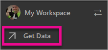
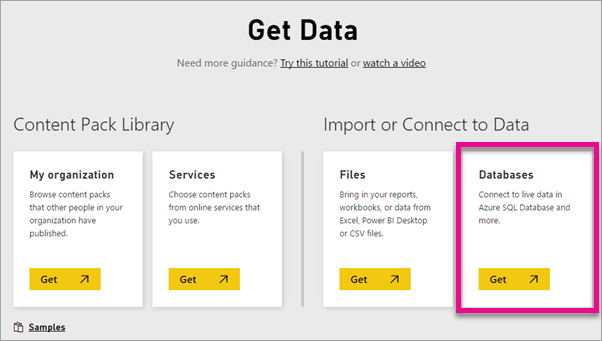
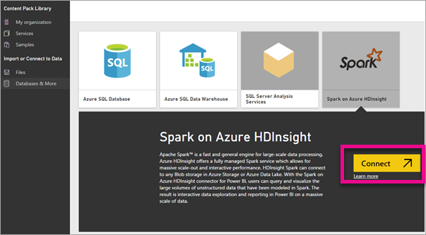
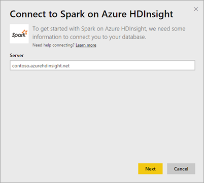
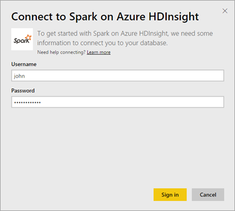
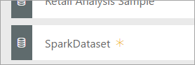
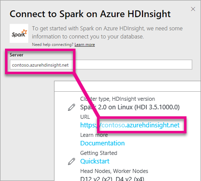
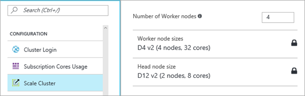

# Spark + HDInsight ja DirectQuery
Azure HDInsightin Sparkin ja DirectQueryn avulla voit luoda dynaamisia raportteja niiden tietojen ja arvojen perusteella, joita sinulla jo on Spark-klusterissasi. DirectQueryn avulla kyselyt lähetetään takaisin Azure HDInsight Spark -klusteriin reaaliaikaisesti tutkiessasi tietoja raporttinäkymässä. Tätä kokemusta ehdotetaan käyttäjille, jotka ovat perehtyneet entiteetteihin, joihin he ovat muodostamassa yhteyttä.

> [!WARNING]
> Automaattinen ruutujen päivitys on poistettu käytöstä koontinäytön ruuduissa, jotka on luotu Spark-pohjautuvista tietojoukoista. Voit päivittää manuaalisesti valitsemalla **Päivitä koontinäytön ruudut**. Tämä ei vaikuta raportteihin ja niiden pitäisi pysyä ajan tasalla. 
> 
> 

Seuraavien vaiheiden avulla voit muodostaa yhteyden Azure HDInsightin Spark-tietolähteeseen käyttäen Power BI -palveluun sisältyvää DirectQueryä.

1. Valitse vasemman siirtymisruudun alareunasta **Nouda tiedot**.
   
     
2. Valitse **Tietokannat ja muut**.
   
     
3. Valitse **Spark HDInsight** -liitin ja valitse **Yhdistä**.
   
     
4. Kirjoita sen **palvelimen** nimi, johon haluat muodostaa yhteyden, sekä **käyttäjänimi** ja **salasana**. Palvelin on aina muodossa \<klusterinimi\>.azurehdinsight.net. Alla on lisätietoja näiden arvojen löytämisestä.
   
     
   
     
5. Kun yhteys on muodostettu, näet uuden tietojoukon nimeltä SparkDataset. Voit myös käyttää tietojoukkoa luodun paikkamerkkiruudun kautta.
   
     
6. Porautumalla tietojoukkoon voit tarkastella kaikkia tietokannassa olevia taulukoita ja sarakkeita. Sarakkeen valitseminen lähettää kyselyn takaisin lähteeseen luoden visualisoinnin dynaamisesti. Nämä visualisoinnit voidaan tallentaa uudessa raportissa ja kiinnittää takaisin koontinäyttöön.

## Omien Spark HDInsight -parametrien löytäminen
Palvelin on aina muodossa \<klusterinimi\>.azurehdinsight.net, ja se löytyy Azure-portaalista.

Käyttäjänimi ja salasana löytyvät myös Azure-portaalista.

## Rajoitukset
Nämä rajoitukset ja muistiinpanot saattavat muuttua jatkaessamme käyttökokemusten kehittämistä. Lisäohjeita on artikkelissa [BI-työkalujen käyttäminen Azure HDInsightin Apache Sparkin avulla](https://azure.microsoft.com/documentation/articles/hdinsight-apache-spark-use-bi-tools/).

* Power BI -palvelu tukee vain Spark 2.0:n ja HDInsight 3.5:n kokoonpanoa.
* Jokainen toiminto, esimerkiksi sarakkeen valitseminen tai suodattimen lisääminen, lähettää kyselyn takaisin tietokantaan. Valitse sopiva visualisointityyppi ennen erittäin suurten kenttien valitsemista.
* Q&A ei ole käytettävissä DirectQuery-tietojoukoissa.
* Rakenteen muutoksia ei poimita automaattisesti.
* Power BI tukee tietojoukossa 16 000 saraketta **kaikissa taulukoissa**. Power BI sisältää myös sisäisen rivinumerosarakkeen taulukkoa kohden. Tämä tarkoittaa sitä, että jos tietojoukossa on 100 taulukkoa, käytettävissä olevien sarakkeiden määrä on 15 900. Spark-tietolähteestä käsiteltävien tietojen määrästä riippuen tämä rajoitus saattaa tulla vastaan.

## Vianmääritys
Jos kohtaat ongelmia suorittaessasi kyselyitä klusterista, varmista, sovellus on yhä käynnissä ja käynnistä se uudelleen tarvittaessa.

Voit myös varata lisäresursseja Azure-portaalin kohdassa **Kokoonpano** > **Klusterin skaalaus**:

## Seuraavat vaiheet
[Aloittaminen: luo Apache Spark -klusteri HDInsight Linuxissa ja suorita vuorovaikutteisia kyselyitä Spark SQL:llä](https://azure.microsoft.com/documentation/articles/hdinsight-apache-spark-jupyter-spark-sql)  
[Power BI:n käytön aloittaminen](service-get-started.md)  
[Tietojen noutaminen Power BI:hin](service-get-data.md)  
Onko sinulla muuta kysyttävää? [Kokeile Power BI -yhteisöä](http://community.powerbi.com/)

