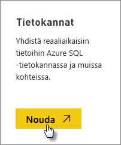
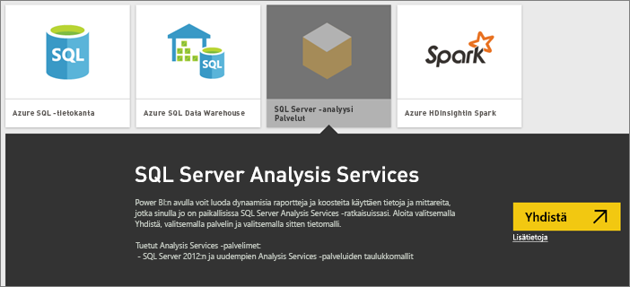
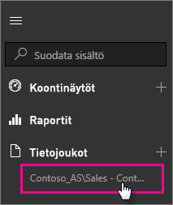

# SQL Server Analysis Servicesin reaaliaikaiset tiedot Power BI:ssä

Power BI:ssä on käytössä kaksi tapaa muodostaa reaaliaikainen yhteys SQL Server Analysis Services -palvelimeen. **Nouda tiedot** -osassa voit muodostaa yhteyden joko suoraan SQL Server Analysis Services -palvelimeen tai vaihtoehtoisesti [Power BI Desktop -tiedostoon](service-desktop-files.md) tai [Excel-työkirjaan](service-excel-workbook-files.md), joka on jo yhteydessä Analysis Services -palvelimeen. Parhaana käytäntönä Microsoft suosittelee käyttämään Power BI Desktopia, sillä siinä on hyvä työkaluvalikoima ja mahdollisuus ylläpitää Power BI Desktop -tiedoston paikallista varmuuskopiota.

>[!IMPORTANT]
> * Jotta voit muodostaa reaaliaikaisen yhteyden Analysis Services -palvelimeen, järjestelmänvalvojan on asennettava ja määritettävä paikallinen tietoyhdyskäytävä. Lisätietoja on ohjeaiheessa [Paikallinen tietoyhdyskäytävä](service-gateway-onprem.md).
> * Paikallista yhdyskäytävää käytettäessä tiedot pysyvät paikallisina.  Näistä tiedoista luodut raportit tallennetaan Power BI -palveluun. 
> * [Luonnollisella kielellä tehtävät kyselyt](service-q-and-a-direct-query.md) ovat reaaliaikaisissa Analysis Services -yhteyksissä käytettävissä esiversiona.

## Yhteyden muodostaminen Nouda tiedot -osan malliin

1. Valitse **Oma työtila** -osassa **Nouda tiedot**. Voit myös vaihtaa ryhmän työtilaan, jos sellainen on käytettävissä.

   

2. Valitse **Tietokannat ja muut**.

   

3. Valitse **SQL Server Analysis Services**  >  **Yhdistä**.

   

4. Valitse palvelin. Jos et näe palvelinten luetteloa, yhdyskäytävää ja tietolähdettä ei ole määritetty tai tiliäsi ei ole listattu tietolähteen **Käyttäjät**-välilehdellä yhdyskäytävässä. Tarkista asia järjestelmänvalvojalta.

5. Valitse malli, johon haluat muodostaa yhteyden. Se voi olla joko taulukko- tai monidimensiomalli.

Yhteyden muodostamisen jälkeen malli näkyy Power BI -sivustosi kohdassa **Oma työtila -> Tietojoukot**. Jos vaihdoit ryhmän työtilaan, tietojoukko näkyy silloin ryhmässä.

## Koontinäytön ruudut

Jos kiinnität visualisointeja raportista koontinäyttöön, kiinnitetyt ruudut päivitetään automaattisesti aina 10 minuutin välein. Jos paikallisen Analysis Services -palvelimen tiedot päivitetään, ruudut päivitetään automaattisesti 10 minuutin kuluttua.

## Yleisiä ongelmia

* Mallin rakenteen lataus ei onnistu -virhe - Tämä virhe ilmenee, kun SSAS:ään yhteyttä muodostavalla käyttäjällä ei ole pääsyä SSAS-tietokantaan, -kuutioon ja -malliin.

## Seuraavat vaiheet

* [Paikallinen tietoyhdyskäytävä](service-gateway-onprem.md)  
* [Analysis Services -tietolähteiden hallinta](service-gateway-enterprise-manage-ssas.md)  
* [Paikallisen tietoyhdyskäytävän vianmääritys](service-gateway-onprem-tshoot.md)  

Onko sinulla muuta kysyttävää? [Kokeile Power BI -yhteisöä](http://community.powerbi.com/)