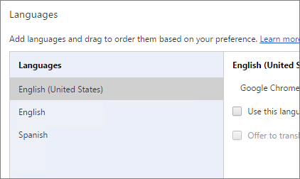
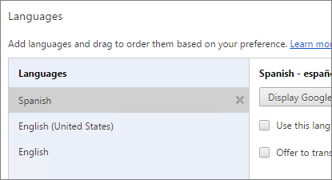
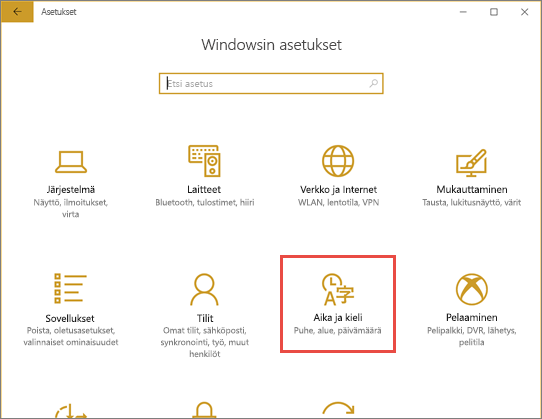
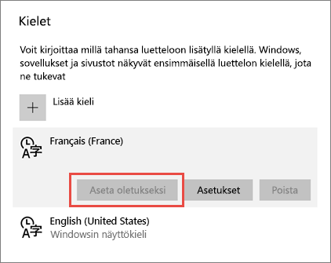
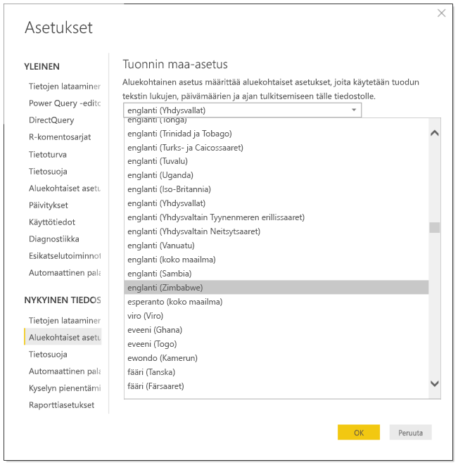
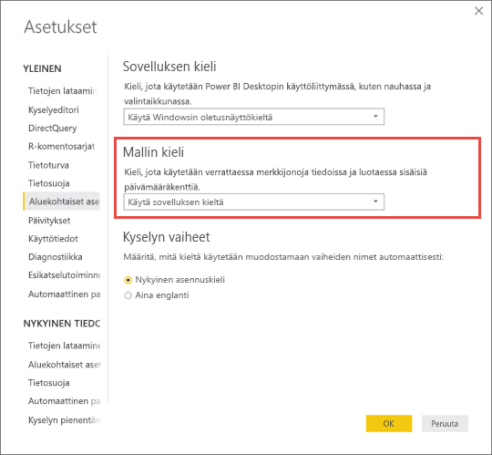

# Power BI:n tuetut kielet ja maat tai alueet

Tämä artikkeli sisältää luettelot Power BI -palvelun, Power BI Desktopin ja Power BI:n dokumentaation tuetuista kielistä ja maista tai alueista.

## Maat ja alueet, joissa Power BI on saatavilla
Katso maat ja alueet, joissa Power BI on saatavilla, [kansainvälisen saatavuuden luettelosta](https://products.office.com/business/international-availability). 

## Power BI -palvelun kielet
Power BI -palvelu (selaimessa) on saatavilla seuraavilla 44 kielellä:

* arabia
* baski – basque
* bulgaria – Български
* katalaani – català
* kiina (yksinkertaistettu) – 中文(简体)
* kiina (perinteinen) – 中文(繁體)
* kroatia – hrvatski
* tšekki – čeština
* tanska – dansk
* hollanti – nederlands
* englanti – English
* viro – eesti
* suomi – suomi
* ranska – français
* galego – galego
* saksa – Deutsch
* kreikka – Ελληνικά
* heprea
* hindi – हिंदी
* unkari – magyar
* indonesia – Bahasa Indonesia
* italia – italiano
* japani – 日本語
* kazakki – Қазақ
* korea – 한국어
* latvia – latviešu
* liettua – lietuvių
* malaiji – Bahasa Melayu
* norjan (bokmål) – norsk (bokmål)
* puola – polski
* portugali (Brasilia) – português
* portugali (Portugali) – português
* romania – română
* venäjä – Русский
* serbia (kyrillinen) – српски
* serbia (latinalainen) – srpski
* slovakki – slovenčina
* sloveeni – slovenski
* espanja – español
* ruotsi – svenska
* thai – ไทย
* turkki – türkçe
* ukraina – українська
* vietnam – Tiếng Việt

### Käännetyt osat
Valikot, painikkeet, viestit ja muut käyttöliittymän osat on käännetty kielellesi, jolloin sinun on helpompi siirtyä Power BI:hin ja käyttää sitä.

Tällä hetkellä joitakin ominaisuuksia on saatavilla vain englanniksi:

* Raporttinäkymät ja raportit, jotka Power BI luo puolestasi, kun muodostat yhteyden palveluihin, kuten Microsoft Dynamics CRM -palveluun, Google Analyticsiin, Salesforceen ja niin edelleen. (Voit edelleen luoda omia raporttinäkymiä ja raportteja omalla kielelläsi.)
* Tietojen tutkiminen Q&A:n avulla

Lisäominaisuuksia on tulossa muilla kielillä. 

### Kielen valitseminen Power BI -palvelussa
1. Valitse Power BI -palvelussa **Asetukset**-kuvake  > **Asetukset**.
2. Valitse **Yleiset**-välilehti > **Kieli**.
3. Valitse haluamasi kieli > **Käytä**.

### Kielen valitseminen selaimessa
Power BI tunnistaa kielen tietokoneesi kieliasetusten perusteella. Näiden asetusten käyttö- ja muuttamistapa saattaa vaihdella käyttöjärjestelmän ja selaimen mukaan. Seuraavassa on ohjeet näiden asetusten käyttämiseen Internet Explorerissa ja Google Chromessa.

#### Internet Explorer (versio 11)
1. Valitse **Työkalut**-painike selainikkunan oikeasta yläkulmasta:
   
   
2. Valitse **Internet-asetukset**.
3. Napsauta Internet-asetukset-valintaikkunan Yleiset-välilehden Ulkoasu-kohdan **Kielet**-painiketta.

#### Google Chrome (versio 42)
1. Napsauta selainikkunan oikeassa yläkulmassa olevaa valikkopainiketta:
   
   
2. Valitse **Asetukset**.
3. Valitse **Näytä lisäasetukset**.
4. Napsauta Kielet-kohdassa **Kieli- ja syöttöasetukset** -painiketta.
5. Valitse **Lisää**, valitse kieli ja valitse **OK**.
   
   
   
   Uusi kieli on luettelon lopussa. 
6. Vedä uusi kieli luettelon alkuun ja valitse **Näytä Google Chrome tällä kielellä**.
   
   
   
   Sinun on ehkä suljettava selain ja avattava se uudelleen, jotta muutos näkyy.

## Kielen tai aluekohtaisten asetusten valitseminen Power BI Desktopissa
Voit hankkia Power BI Desktopin kahdella tavalla: voit ladata sen tai asentaa sen Windows-kaupasta.

* Kun [asennat Power BI Desktopin Windows-kaupasta](#choose-a-language-for-power-bi-desktop-installed-from-the-windows-store), se asentaa kaikki kielet ja näyttää Windowsin oletuskieltä vastaavan kielen.
* Kun [lataat Power BI Desktopin](#choose-a-language-when-you-download-power-bi-desktop), valitset haluamasi kielen latauksen yhteydessä. 
* Voit myös [valita tietoja tuotaessa käytettävät aluekohtaiset asetukset](#choose-the-locale-for-importing-data-into-power-bi-desktop) tietylle raportille.

### Windows-kaupasta asennetun Power BI Desktopin kielen valitseminen
1. [Asenna Power BI Desktop](http://aka.ms/pbidesktopstore) Windows-kaupasta.
2. Jos haluat vaihtaa kielen, tee tietokoneella haku **Windows-asetukset**. 
3. Valitse **Aika ja kieli**.
   
     
4. Valitse **Alue ja kieli**, valitse kieli ja valitse **Aseta oletukseksi**.
   
     
   
     Seuraavalla kerralla kun käynnistät Power BI Desktopin, se käyttää oletukseksi määrittämääsi kieltä. 

### Kielen valitseminen Power BI Desktopin lataamisen yhteydessä
Power BI Desktopille valitsemasi kieli vaikuttaa lukujen ja päivämäärien näyttömuotoon raporteissa. 

* Valitse kieli, kun [lataat Power BI Desktopin](https://powerbi.microsoft.com/desktop). 

Jos haluat vaihtaa kielen Power BI Desktopissa, palaa takaisin lataussivulle ja lataa se toisella kielellä.

### Aluekohtaisten asetusten valitseminen tietojen Power BI Desktopiin tuomista varten
Riippumatta siitä, lataatko Power BI Desktopin vai asennatko sen Windows-kaupasta, voit valita tietylle raportille aluekohtaiset asetukset, jotka ovat muut kuin Power BI Desktop -versiossasi. Tämä muuttaa tietojen tulkintatapaa, kun tiedot tuodaan tietolähteestä, esimerkiksi onko ”3/4/2017” 3. huhtikuuta vai 4. maaliskuuta. 

1. Siirry Power BI Desktopissa kohtaan **Tiedosto** > **Asetukset ja vaihtoehdot** > **Asetukset**.
2. Valitse kohdassa **Nykyinen tiedosto** **Aluekohtaiset asetukset**.
3. Valitse **Tuonnin aluekohtainen asetus** -ruudusta muu aluekohtainen asetus. 
   
   
4. Valitse **OK**.

### Power BI Desktopin mallin kielen valitseminen

Power BI Desktop -sovelluksen kieliasetuksen lisäksi voit määrittää myös mallin kielen. Mallin kieli vaikuttaa pääasiassa kahteen asiaan:

- merkkijonojen vertailuun ja lajitteluun. Esimerkiksi koska turkin kielessä on kaksi i-kirjainta, ne voidaan lajitella eri järjestykseen tietokantasi lajittelun mukaan. 
- Kieli, jota Power BI Desktop käyttää luodessaan piilotettuja päivämäärätaulukoita päivämääräkentistä. Kentän nimi voi olla esimerkiksi Kuukausi/Monat/Mois jne.

> [!NOTE]
> Power BI:n malli käyttää tällä hetkellä aluekohtaista asetusta, jossa kirjainkoko ei ole merkitsevä, joten ”ABC” ja ”abc” käsitellään toisiaan vastaavina. Jos ”ABC”ladataan tietokantaan ensin, muita merkkijonoja, jotka eroavat vain kirjainkooltaan (esim. ”Abc”), ei ladata erillisenä arvona.
> 
>

Voit määrittää mallin kielen seuraavien ohjeiden mukaan.

1. Siirry Power BI Desktopissa kohtaan **Tiedosto** > **Asetukset ja vaihtoehdot** > **Asetukset**.
2. Valitse **Yleinen** ja sitten **Aluekohtaiset asetukset**.
3. Valitse toinen kieli **Mallin kieli** -ruudusta. 

    

> [!NOTE]
> Power BI -mallin kieltä ei voi vaihtaa luonnin jälkeen.
> 
>

## Ohjeen kielet
Ohje on lokalisoitu näille 10 kielelle: 

* kiina (yksinkertaistettu) – 中文(简体)
* kiina (perinteinen) – 中文(繁體)
* ranska – français
* saksa – Deutsch
* italia – italiano
* japani – 日本語
* korea – 한국어
* portugali (Brasilia) – português
* venäjä – Русский
* espanja – español

## Seuraavat vaiheet
* Onko käytössäsi jokin Power BI -mobiilisovelluksista? Katso lisätietoja artikkelista [Power BI -mobiilisovelluksissa tuetut kielet](consumer/mobile/mobile-apps-supported-languages.md).
* Onko sinulla kysyttävää? Voit esittää kysymyksiä [Power BI -yhteisössä](http://community.powerbi.com/).
* Eikö ongelma ratkennut? Käy [Power BI -tukisivulla](https://powerbi.microsoft.com/support/).

