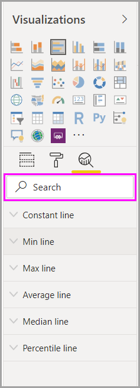
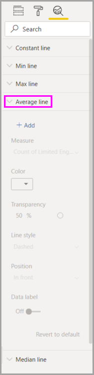
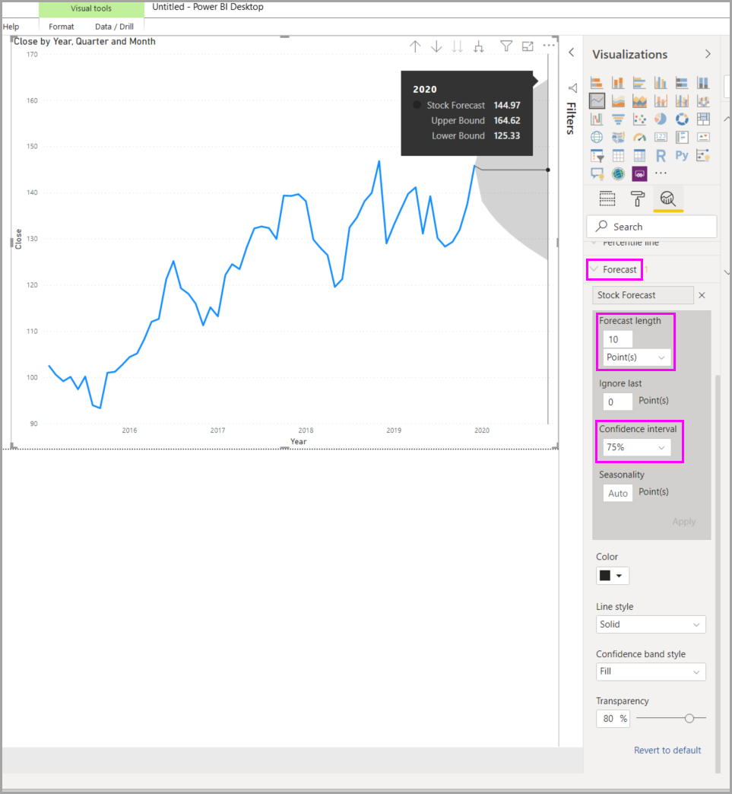

# Analytiikka-ruudun käyttäminen Power BI Desktopissa

Power BI Desktopin **Analytiikka**-ruudussa voit lisätä dynaamisia *viiteviivoja* visualisointeihin ja määrittää kohdistuksen tärkeille trendeille tai merkityksellisille tiedoille. **Analytiikka**-kuvake ja -ruutu sijaitsevat Power BI Desktopin **Visualisoinnit**-alueella.

> [!NOTE]
> **Analytiikka**-ruutu näkyy ainoastaan, jos valitset visualisoinnin Power BI Desktop -pohjalla.

## Haku Analytiikka-ruudussa

Helmikuun 2018 Power BI Desktop -julkaisusta (versio 2.55.5010.201 tai uudempi) alkaen voit tehdä hakuja**Analytiikka**-ruudussa, joka on **Visualisoinnit**-ruudun alaosio. Hakuruutu tulee näkyviin, kun valitset **Analytiikka**-kuvakkeen.

## Analytiikka-ruudun käyttäminen

**Analytiikka**-ruudussa voit luoda seuraavanlaisia dynaamisia viiteviivoja:

* X-akselin yhtenäinen viiva
* Y-akselin yhtenäinen viiva
* Pienimmän arvon viiva
* Suurimman arvon viiva
* Keskiarvon viiva
* Mediaanin viiva
* Prosenttipisteviiva
* Symmetriavarjostus

> [!NOTE]
> Kaikki viivat eivät ole saatavissa kaikille visualisointityypeille.

Seuraavissa osiossa esitetään, kuinka voit käyttää **Analytiikka**-ruutua ja dynaamisia viiteviivoja visualisoinneissa.

Voit tarkastella tietylle visualisoinnille käytettävissä olevia dynaamisia viiteviivoja noudattamalla seuraavia ohjeita:

1. Valitse tai luo visualisointi ja valitse sitten **Analytiikka**-kuvake **Visualisoinnit**-osiosta.

    

2. Valitse viivatyyppi, jonka haluat luoda, jotta saat sen asetukset esille. Tässä tapauksessa valitaan **Keskiarvon viiva**.

    

3. Luo uusi viiva valitsemalla **+&nbsp;Lisää**. Sen jälkeen voit nimetä viivan. Kaksoisnapsauta tekstiruutua ja syötä nimesi.

    Nyt sinulla on käytettävissäsi monenlaisia asetuksia viivallesi. Voit määrittää sen **värin**, **läpinäkyvyyden** prosenttiluvun, **viivatyylin** ja **sijainnin** (suhteessa visualisoinnin tietoelementteihin). Voit myös valita, sisällytetäänkö **arvopisteen otsikko**. Jos haluat määrittää visuaalisen mittayksikön, jolle viivasi perustuu, valitse avattava luettelo **Mitta**, joka täyttyy automaattisesti visualisoinnin tietoelementeillä. Tässä valitsemme mittarin **Kulttuuri**, annamme sille otsikon *Keskimääräinen kulttuuri* ja mukautamme muutamia muita asetuksia.

    

4. Jos haluat arvopisteen otsikon näkyvän, liikuta **Arvopisteen otsikko** -liukusäädintä asennosta **Ei käytössä** asentoon **Käytössä**. Tekemällä niin saat näkyviin koko joukon arvopisteen otsikon lisäasetuksia.

    

5. Huomioi luku, joka näkyy **Keskiarvon viiva** -kohdan vieressä **Analytiikka**-ruudussa. Se kertoo sinulle, kuinka monta dynaamista viivaa sinulla on tällä hetkellä visualisoinnissa ja minkä tyyppisiä ne ovat. Jos lisäämme **suurimman arvon viivan** **Kohtuuhintaisuus**-visualisointiin, **Analytiikka**-ruudussa näkyy, että tässä visualisoinnissa on nyt käytössä myös dynaaminen **Suurimman arvon viiva** -viiteviiva.

    

Jos valitsemassasi visualisoinnissa (tässä tapauksessa **Kartta**-visualisoinnissa) ei voi käyttää dynaamisia viiteviivoja, näkyviin tulee seuraava ilmoitus, kun valitset **Analytiikka**-ruudun.

Voit korostaa kaikenlaisia merkityksellisiä tietoja luomalla dynaamisia viiteviivoja **Analytiikka**-ruudun avulla.

Aiomme lisätä enemmän ominaisuuksia ja toimintoja, muun muassa lisätä niiden visualisointien määrää, joissa voidaan käyttää dynaamisia viiteviivoja. Sinun kannattaa tarkistaa uudet ominaisuudet tihein välein.

## Ennusteiden käyttäminen

Jos tietolähteesi sisältää aikatietoja, sinun kannattaa käyttää *Ennustaminen*-ominaisuutta. Valitse vain visualisointi ja laajenna sitten **Ennuste**-osaa **Analytiikka**-ruudussa. Ennusteen muokkaamiseksi on määritettävissä useita syötteitä, kuten **Ennusteen pituus** tai **Luottamusväli**. Seuraava kuva esittää perusviivavisualisointia, jossa käytetään ennusteita. Käytä mielikuvitustasi (ja kokeile ennusteita mielesi mukaan), niin näet, miten ne voivat vaikuttaa malleihisi.

> [!NOTE]
> Ennusteominaisuus on saatavissa vain viivakaaviovisualisoinneille.

## Rajoitukset

Dynaamisten viiteviivojen käyttömahdollisuus perustuu käytössä olevan visualisoinnin tyyppiin. Seuraavat luettelot kuvaavat näitä rajoituksia yksityiskohtaisemmin.

Voit käyttää *x-akselin vakioviivaa*, *y-akselin vakioviivaa* ja *symmetriavarjostusta* seuraavassa visualisoinnissa:

* Pistekaavio

*Vakioviivan*, *minimiviivan*, *maksimiviivan*, *keskiarvoviivan*, *mediaaniviivan*, ja *prosenttipisteviivan* käyttö on mahdollista näillä visualisoinneilla:

* Aluekaavio
* Klusteroitu palkkikaavio
* Klusteroitu pylväskaavio
* Viivakaavio
* Pistekaavio

Seuraavissa visualisoinneissa voidaan käyttää vain *yhtenäistä viivaa***Analytiikka**-ruudusta:

* Pinottu aluekaavio
* Pinottu palkkikaavio
* Pinottu pylväskaavio
* Vesiputouskaavio
* 100 % pinottu palkkikaavio
* 100 % pinottu pylväskaavio

Seuraavissa visualisoinneissa voi käyttää *trendiviivaa*, jos aikatietoja on käytettävissä:

* Aluekaavio
* Klusteroitu pylväskaavio
* Viivakaavio
* Viiva- ja klusteroitu pylväskaavio

Lopuksi: on monia visualisointeja, joissa et voi käyttää mitään dynaamisia viivoja kuten (mutta ei pelkästään) seuraavat:

* Suppilo
* Viiva- ja klusteroitu pylväskaavio
* Viiva- ja pinottu pylväskaavio
* Nauhakaavio
* Epäkartesiaaniset visualisoinnit, kuten donitsikaavio, mittari, matriisi, ympyräkaavio ja taulukko.

Prosenttipisteviiva on käytettävissä vain, kun käytetään tuotuja tietoja *Power BI Desktopissa* tai kun muodostetaan reaaliaikainen yhteys malliin palvelimessa, jonka käytössä on **Analysis Service 2016** tai uudempi, **Azure Analysis Services** -tietokantaan tai Power BI -palvelun tietojoukkoon.

## Seuraavat vaiheet

Power BI Desktopilla voit tehdä kaikenlaista. Saat lisätietoja sen toiminnoista seuraavista resursseista:

* [Power BI Desktopin uudet ominaisuudet](../fundamentals/desktop-latest-update.md)
* [Power BI Desktopin hankkiminen](../fundamentals/desktop-get-the-desktop.md)
* [Mikä on Power BI Desktop?](../fundamentals/desktop-what-is-desktop.md)
* [Power BI Desktopin kyselyjen yleiskatsaus](desktop-query-overview.md)
* [Tietotyypit Power BI Desktopissa](../connect-data/desktop-data-types.md)
* [Tietojen muotoilu ja yhdistäminen Power BI Desktopissa](../connect-data/desktop-shape-and-combine-data.md)
* [Yleisten tehtävien suorittaminen Power BI Desktopissa](desktop-common-query-tasks.md)
