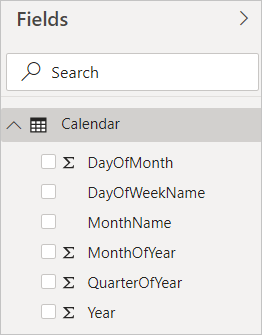
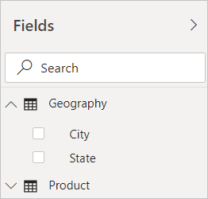

# Laskettujen sarakkeiden luominen Power BI Desktopissa
Laskettujen sarakkeiden avulla voit lisätä uutta tietoa taulukkoon, joka on jo mallissasi. Sen sijaan, että hakisit ja lataisit arvoja uuteen sarakkeeseen tietolähteestä, luot Data Analysis Expressions (DAX) -kaavan, joka määrittää sarakkeen arvot. Power BI Desktopissa lasketut sarakkeet luodaan käyttämällä **raporttinäkymän** Uusi sarake -toimintoa.

Toisin kuin mukautetut sarakkeet, jotka on luotu osana kyselyä käyttämällä kyselyeditorin toimintoa **Lisää mukautettu sarake**, **raporttinäkymässä** tai **tietonäkymässä** luodut lasketut sarakkeet perustuvat tietoihin, jotka olet jo ladannut malliin. Saatat esimerkiksi päättää liittää yhteen arvoja kahdessa erillisessä mutta toisiinsa liittyvässä taulukossa olevista kahdesta eri sarakkeesta, tehdä lisäyksen tai poimia alimerkkijonoja.

Luomasi lasketut sarakkeet tulevat näkyviin **Kentät**-luettelossa niin kuin mikä tahansa muu kenttä, mutta niillä on erityinen kuvake, josta näkyy niiden arvojen olevan kaavan tulos. Voit nimetä sarakkeet miten haluat ja lisätä niitä raportin visualisointiin muiden kenttien tapaan.

Lasketut sarakkeet laskevat tuloksia käyttämällä DAX-kaavakieltä, joka on tarkoitettu käytettäväksi suhteellisten tietojen, kuten Power BI Desktopin tietojen, kanssa. DAX sisältää kirjaston, jossa on yli 200 funktioita, operaattoria ja rakennetta. Se tarjoaa valtavan joustavuuden luotaessa kaavoja lähes minkä tahansa tietoanalyysitarpeen tulosten laskemiseksi. Lisätietoja DAX-kielestä on kohdassa [DAX-perusteet Power BI Desktopissa](desktop-quickstart-learn-dax-basics.md).

DAX-kaavat ovat samankaltaisia kuin Excel-kaavat. DAX käsittää itse asiassa monia samoja funktioita kuin Excel. DAX-funktiot on kuitenkin tarkoitettu sellaisten tietojen käsittelyyn, jotka on vuorovaikutteisesti viipaloitu tai suodatettu raportissa, kuten Power BI Desktopin tiedot. Excelissä voit käyttää eri kaavaa taulukon eri riveillä. Kun luot Power BI:ssä DAX-kaavan uutta saraketta varten, se laskee tuloksen taulukon jokaista riviä varten. Sarakkeen arvot lasketaan uudelleen tarpeen mukaan esimerkiksi silloin, kun pohjana olevat tiedot päivitetään ja arvot ovat muuttuneet.

## Tarkastellaan esimerkkiä
Jeff on Contoson kuljetuspäällikkö ja haluaa luoda raportin, jossa näkyy eri kaupunkeihin tehtyjen toimitusten määrä. Jeffillä on **Geography**-taulukko, jossa on erilliset kentät kaupungille ja osavaltiolle. Jeff haluaa kuitenkin, että kaupungin ja osavaltion arvot näkyvät raporteissa yksittäisenä arvona samalla rivillä. Tällä hetkellä Jeffin **Geography**-taulukossa ei ole hänen haluamaansa kenttää.

Lasketun sarakkeen avulla Jeff voi kuitenkin yhdistää **City**-sarakkeen kaupungit ja **State**-sarakkeen osavaltiot.

Jeff napsauttaa hiiren kakkospainikkeella **Geography**-taulukkoa ja valitsee sitten **Uusi sarake**. Sitten Jeff syöttää seuraavan DAX-kaavan kaavariville:

Tämä kaava luo yksinkertaisesti uuden **CityState**-nimisen sarakkeen. Se ottaa **Geography**-taulukon jokaisen rivin osalta arvot **City**-sarakkeesta, lisää pilkun ja välilyönnin ja liittää sitten yhteen **State**-sarakkeen arvot.

Nyt Jeffillä on haluttu kenttä.

Jeff voi nyt lisätä sen raporttipohjaansa yhdessä toimitusten määrän kanssa. Jeff sai hyvin vaivattomasti kentän**CityState**, joka voidaan lisätä lähes minkä tyyppiseen visualisointiin tahansa. Kun Jeff luo uuden kartan, Power BI Desktop tietää jo, miten uudessa sarakkeessa olevat kaupungin ja osavaltion arvot luetaan.

## Seuraavat vaiheet
Tässä on vain lyhyt esittely lasketuista sarakkeista. Katso lisätietoja seuraavista resursseista:

* Jos haluat ladata mallitiedoston ja saada vaiheittaiset ohjeet uusien sarakkeiden luomiseen, katso [Opetusohjelma: Laskettujen sarakkeiden luominen Power BI Desktopissa](desktop-tutorial-create-calculated-columns.md)

* Lisätietoja DAX-kielestä on kohdassa [DAX-perusteet Power BI Desktopissa](desktop-quickstart-learn-dax-basics.md).

* Lisätietoja kyselyn osana luotavista sarakkeista saat osasta **Mukautettujen sarakkeiden luominen** artikkelissa [Tavalliset kyselyn tehtävät Power BI Desktopissa.](desktop-common-query-tasks.md)  

