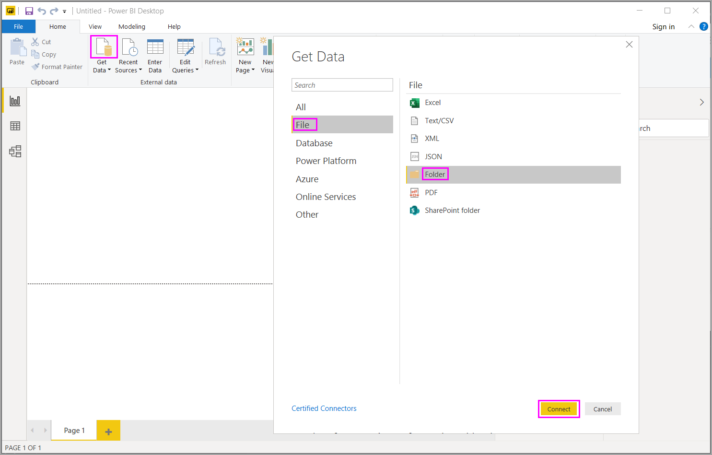

# Power BI Desktopin tiedostojen (binaaritiedostot) yhdistäminen

Tässä on tehokas tapa tuoda tietoja **Power BI Desktopiin**: Jos sinulla on useita tiedostoja, joilla on sama rakenne, yhdistä ne yhdeksi loogiseksi taulukoksi. Tästä suositusta tekniikasta on tehty entistä kätevämpi ja laajempi.

Aloita tiedostojen yhdistäminen samasta kansiosta valitsemalla **Nouda tiedot**, valitse **Tiedosto** > **Kansio** ja valitse sitten **Yhdistä**.

Anna kansion polku, valitse **OK** ja valitse sitten **Muunna tiedot**, niin näet kansion tiedostot Power Query -editorissa.

## Yhdistettyjen tiedostojen toiminta

Jos haluat yhdistää binääritiedostoja Power Query -editorissa, valitse **Sisältö** (ensimmäisen sarakkeen nimi) ja valitse **Aloitus** > **Yhdistä tiedostot**. Tai voit vain valita **Yhdistä tiedostot** -kuvakkeen kohteen **Sisältö** vieressä.

*Yhdistä tiedostot* toimii seuraavasti:

* Yhdistä tiedostot -toiminto analysoi kunkin syötetiedoston ja määrittää oikean tiedostomuodon, kuten *teksti*, *Excel-työkirja* tai *JSON-tiedosto*.
* Muunnos antaa valita tietyn objektin ensimmäisestä tiedostosta, kuten Excel-työkirjan, poimittavaksi.
  
  
* Yhdistä tiedostot -muunnos suorittaa sitten automaattisesti seuraavat toimet:
  
  * Luo esimerkkikyselyn, joka suorittaa kaikki tarvittavat poimintavaiheet yhteen tiedostoon.
  * Luo *funktiokyselykyselyn*, joka parametrisoi tiedoston/binäärisyötteen *esimerkkikyselyyn*. Esimerkkikysely ja funktiokysely on linkitetty, jotta esimerkkikyselyyn tehdyt muutokset näkyvät funktiokyselyssä.
  * Soveltaa *toimintokyselyä* alkuperäiseen binaarisyötteelliseen kyselyyn, kuten *Kansio*-kyselyyn. Se soveltaa toimintokyselyä kunkin rivin binäärisyötteisiin ja laajentaa tuloksena saatavat tietopoiminnat ylimmän tason sarakkeiksi.

    

> [!NOTE]
> Excel-työkirjan valitun alueen koko vaikuttaa yhdistettävien binaaritiedostojen toimintaa. Voit esimerkiksi valita yhdistettäväksi tietyn laskentataulukon tai valita päätason, jos haluat yhdistää koko tiedoston. Kansion valitseminen yhdistää kansiossa olevat tiedostot. 

Tiedostojen yhdistämiskäyttäytymisen avulla voit helposti yhdistää kaikki tiedostot tietyn kansion sisällä, jos niillä on sama tiedostotyyppi ja rakenne (esimerkiksi sama määrä sarakkeita).

Lisäksi voit helposti käyttää lisämuunnos- tai poimintavaiheita muokkaamalla automaattisesti luotua esimerkkikyselyä, eikä sinun tarvitse huolehtia uusien funktiokyselyn vaiheiden muokkaamisesta tai luomisesta. Tehdyt muutokset esimerkkikyselyyn luodaan automaattisesti linkitetyssä funktiokyselyssä.

## Seuraavat vaiheet

Voit muodostaa yhteyden kaikenlaisiin tietoihin käyttämällä Power BI Desktopia. Lisätietoja näistä tietolähteistä saat perehtymällä seuraaviin resursseihin:

* [Mikä on Power BI Desktop?](../fundamentals/desktop-what-is-desktop.md)
* [Power BI Desktopin tietolähteet](../connect-data/desktop-data-sources.md)
* [Tietojen muotoilu ja yhdistäminen Power BI Desktopissa](../connect-data/desktop-shape-and-combine-data.md)
* [CSV-tiedostoihin yhdistäminen Power BI Desktopissa](../connect-data/desktop-connect-csv.md)
* [Tietojen antaminen suoraan Power BI Desktopiin](../connect-data/desktop-enter-data-directly-into-desktop.md)
