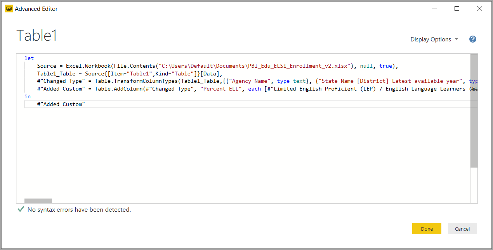

# Yleisten kyselytehtävien suorittaminen Power BI Desktopissa

Power BI Desktopin Power Query -editorin ikkunassa on muutamia usein käytettyjä tehtäviä. Tässä artikkelissa esitellään nämä yleiset tehtävät ja annetaan linkkejä lisätietoihin.

Tässä esiteltyjä yleisiä kyselytehtäviä ovat seuraavat:

* Tietoihin yhdistäminen
* tietojen muotoileminen ja yhdistäminen
* rivien ryhmitteleminen
* sarakkeiden pivotointi
* mukautettujen sarakkeiden luominen
* kyselykaavat.

Suoritamme näitä tehtäviä muutamien tietoyhteyksien avulla. Voit ladata tiedot tai muodostaa yhteyden niihin, jos haluat suorittaa tässä ohjeartikkelissa kuvatut toimet itse lukiessasi artikkelia.

Ensimmäinen tietoyhteys on [Excel-työkirja](https://download.microsoft.com/download/5/7/0/5701F78F-C3C2-450C-BCCE-AAB60C31051D/PBI_Edu_ELSi_Enrollment_v2.xlsx), jonka voit ladata ja tallentaa paikallisesti. Toinen on verkkoresurssi, jota käytetään myös muissa Power BI Desktop -artikkeleissa:

<https://www.bankrate.com/retirement/best-and-worst-states-for-retirement/>

Yleiset kyselytehtävät alkavat vaiheilla, joita tarvitaan yhdistämiseen kumpaankin tietolähteeseen.

## Tietoihin yhdistäminen

Jos haluat yhdistää Power BI Desktop -tietoihin, valitse **Aloitus** ja sitten **Nouda tiedot**. Power BI Desktop näyttää valikon, jonka sisältää yleisimmät tietolähteet. Jos haluat nähdä kattavan luettelon tietolähteistä, joihin Power BI Desktop voi yhdistää, valitse valikon alareunasta **Lisää**. Lisätietoja on artikkelissa [Power BI Desktopin tietolähteet](../connect-data/desktop-data-sources.md).

Aloita valitsemalla **Excel**, määritä aiemmin mainittu Excel-työkirja ja valitse sitten **Avaa**. Kysely tarkistaa työkirjan ja näyttää sitten löytämänsä tiedot **Siirtymistoiminto**-valintaikkunassa, jonka jälkeen voit valita taulukon.

Valitsemalla **Muokkaa tietoja** voit muokata, mukauttaa tai *muotoilla* tietoja ennen niiden lataamista Power BI Desktopiin. Muokkaamisesta on hyötyä erityisesti silloin, kun käsittelet suuria tietojoukkoja, joiden määrää haluat supistaa ennen lataamista.

Erityyppisiin tietoihin yhdistäminen on helppoa. Haluat ehkä myös yhdistää verkkoresurssiin. Valitse **Nouda tiedot** > **Lisää**, ja valitse sitten **Muu** > **Verkko** > **Yhdistä**.

Kun **Verkosta**-valintaikkuna avautuu, voit kirjoittaa siihen verkkosivun URL-osoitteen.

Valitse **OK**. Kuten aiemmin, Power BI Desktop tarkastaa verkkosivun tiedot ja näyttää esikatseluasetukset **Siirtymistoiminto**-valintaikkunassa. Kun valitset taulukon, se näyttää tietojen esikatselun.

Muut tietoyhteydet ovat samankaltaisia. Jos tietoyhteyden muodostaminen edellyttää todennusta, Power BI Desktop pyytää sinulta soveltuvia tunnistetietoja.

Jos haluat vaiheittaisen esittelyn tietoihin yhdistämisestä Power BI Desktopissa, lue artikkeli [Tietoihin yhdistäminen Power BI Desktopissa](../connect-data/desktop-connect-to-data.md).

## Tietojen muotoileminen ja yhdistäminen

Power Query -editorilla voit muotoilla ja yhdistää tietoja helposti. Tämä osio sisältää muutamia esimerkkejä tietojen muotoilemisesta. Jos haluat kattavamman esittelyn tietojen muotoilemisesta ja yhdistämisestä, lue artikkeli [Tietojen muotoileminen ja yhdistäminen Power BI Desktopissa](../connect-data/desktop-shape-and-combine-data.md).

Edellisessä osiossa yhdistit kaksi tietojoukkoa: Excel-työkirjan ja verkkoresurssin. Kun tiedot on ladattu Power Query -editorissa, valitse verkkosivukysely käytettävissä olevista kyselyistä **Kyselyt**-ruudussa alla esitetyllä tavalla:

Kun muotoilet tietoja, muokkaat tietolähdettä haluamaasi muotoon ja muotoiluun.

Power Query -editorissa monet komennot löytyvät valintanauhasta ja tilannekohtaisista valikoista. Kun esimerkiksi napsautat saraketta hiiren kakkospainikkeella, voit tilannekohtaisen valikon avulla poistaa sarakkeen. Voit myös valita sarakkeen ja valita sitten **Poista sarakkeet** -painikkeen valintanauhan **Aloitus**-välilehdestä.

Voit muotoilla tietoja monella muulla tavalla tässä kyselyssä. Voit poistaa minkä tahansa määrän rivejä ylhäältä tai alhaalta. Voit myös lisätä ja jakaa sarakkeita, korvata arvoja ja tehdä muita muotoilutehtäviä. Näiden ominaisuuksien avulla voit ohjata Power Query -editoria ja saada tiedot haluamallasi tavalla.

## Rivien ryhmitteleminen

Power Query -editorissa voit ryhmitellä arvoja useilta riveiltä yhdeksi arvoksi. Tästä ominaisuudesta voi olla hyötyä silloin, kun teet yhteenvedon tarjotuista tuotteista, kokonaismyynnistä tai opiskelijoiden määrästä.

Tässä esimerkissä ryhmittelit rivejä oppilaitoksen rekisteröitymistietojoukosta. Tiedot ovat Excel-työkirjasta. Se on muotoiltu Power Query -editorissa, jotta saat vain tarvitsemasi sarakkeet sekä voit nimetä taulukon uudelleen ja tehdä pari muuta muunnosta.

Selvitetäänpä, montako virastoa on kussakin osavaltiossa. (Virastoja voivat olla esimerkiksi koulupiirit ja muut opetusvirastot, kuten aluepalvelupiirit.) Valitse **Viraston tunnus - NCES-määritetty \[Piiri\] Viimeisin saatavilla oleva vuosi** -sarake. Valitse sitten **Ryhmittelyperuste**-painike valintanauhan **Muunna**-välilehdeltä tai **Aloitus**-välilehdeltä. (**Ryhmittelyperuste** on käytettävissä molemmissa välilehdissä.)

**Ryhmittelyperuste**-valintaikkuna tulee näkyviin. Kun Power Query -editori ryhmittelee rivejä, se luo uuden sarakkeen, johon se sijoittaa **Ryhmittelyperuste**-tulokset. Voit muokata **Ryhmittelyperuste**-toimintoa seuraavin tavoin:

1. Otsikoimaton avattava luettelo määrittää ryhmiteltävän sarakkeen. Power Query -editori käyttää tätä arvoa oletuksen mukaisesti valittuun sarakkeeseen, mutta voit muuttaa sen miksi tahansa taulukon sarakkeeksi.
2. **Uuden sarakkeen nimi**: Power Query -editori ehdottaa uudelle sarakkeelle nimeä sen perusteella, minkä toiminnon se suorittaa ryhmiteltävälle sarakkeelle. Voit kuitenkin antaa uudelle sarakkeelle minkä tahansa haluamasi nimen.
3. **Toiminto**: Voit valita toiminnon, jota Power Query -editori soveltaa, kuten **Summa**, **Mediaani**tai **Laske erilliset rivit**. Oletusarvo on **Laske rivit**.
4. **Lisää ryhmittely** ja **Lisää kooste**: Nämä painikkeet ovat käytettävissä vain, jos valitset **Lisäasetukset**-vaihtoehdon. Yhdellä toiminnolla voit tehdä ryhmittelytoimintoja (**Ryhmittelyperuste**-toimintoja) monissa sarakkeissa ja luoda useita koosteita näiden painikkeiden avulla. Tässä valintaikkunassa tekemiesi valintojen mukaisesti Power Query -editori luo uuden sarakkeen, joka hyödyntää tietoja useista sarakkeista.

Valitse **Lisää ryhmittely** tai **Lisää kooste**, jos haluat lisätä ryhmittelyjä tai koosteita **Ryhmittelyperuste**-toimintoon. Voit poistaa ryhmittelyn tai koosteen valitsemalla rivin oikealla puolella olevan ellipsikuvakkeen ( **...** ), ja sitten **Poista**. Kokeile **Ryhmittelyperuste**-toimintoa käyttämällä oletusarvoja, jotta näet, mitä tapahtuu.

Kun valitset **OK**, kysely suorittaa **Ryhmittelyperuste**-toiminnon ja palauttaa tulokset. Oho, katsopa tätä! Ohiossa, Illinoisissa, Teksasissa ja Kaliforniassa on nyt kussakin yli tuhat virastoa!

Power Query -editorin avulla voit aina poistaa viimeisimmän muotoilutoiminnon. Valitse **Kyselyasetukset**-ruudun **Käytössä olevat vaiheet** -kohdasta **X** äskettäin suoritetun vaiheen vierestä. Kokeile rohkeasti. Jos et pidä tuloksista, tee vaihe uudelleen, kunnes Power Query -editori muotoilee tiedot haluamallasi tavalla.

## Sarakkeiden pivotointi

Voit pivotoida sarakkeita ja luoda taulukon, joka sisältää koostearvot sarakkeen kullekin yksilölliselle arvolle. Jos haluat esimerkiksi tietää, kuinka monta erilaista tuotetta on kussakin tuoteluokassa, voit luoda nopeasti taulukon tämän selvittämiseksi.

Tarkastellaan esimerkkiä. Seuraavaa **Products_by_Categories** -taulukkoa on muotoiltu siten, että se näyttää vain jokaisen yksilöllisen tuotteen (nimen mukaan) ja sen, mihin tuoteluokkaan se kuuluu. Voit luoda uuden taulukon, joka näyttää kunkin luokan tuotteiden määrän (**CategoryName**-sarakkeen mukaan), valitsemalla sarakkeen ja sitten **Muunna** > **Pivot-sarake**.

Näyttöön tulee **Pivot-sarake**-valintaikkuna, jossa kerrotaan, mitä sarakkeen arvoja käytetään uusien sarakkeiden luomiseen (1). (Jos **CategoryName**-kohdan haluttua sarakkeen nimeä ei näytetä, valitse se avattavasta luettelosta.) Kun laajennat **Lisäasetukset**-kohtaa (2), voit valita toiminnon, jota sovelletaan koostettuihin arvoihin (3).

Kun valitset **OK**, kysely näyttää taulukon **Pivot-sarake**-valintaikkunassa annettujen muunto-ohjeiden mukaisesti.

## Mukautettujen sarakkeiden luominen

Power Query -editorissa voit luoda mukautettuja kaavoja, joita sovelletaan taulukon useisiin sarakkeisiin. Tämän jälkeen voit sijoittaa tällaisten kaavojen tulokset uuteen (mukautettuun) sarakkeeseen. Power Query -editorilla voit luoda mukautettuja sarakkeita helposti.

Kun käytössäsi on Excel-työkirjan tiedot Power Query -editorissa, siirry valintanauhan **Lisää sarake** -välilehteen ja valitse sitten **Mukautettu sarake**.

Näyttöön avautuu seuraava valintaikkuna. Tässä esimerkissä luodaan mukautettu sarake nimeltä *Percent ELL*, joka laskee, kuinka monen (tämä ilmaistaan prosenttiosuutena) opiskelijan äidinkieli on jokin muu kuin englanti.

Kuten Power Query -editorin muiden sovellettujen vaiheiden tavoin, jos uusi mukautettu sarake ei sisällä etsimiäsi tietoja, voit poistaa vaiheen. Valitse **Kyselyasetukset**-ruudun **Käytössä olevat vaiheet** -kohdasta **X** **Lisätty mukautettu** -vaiheen vierestä.

## Kyselykaavat

Voit muokata Power Query -editorin luomia vaiheita. Voit myös luoda mukautettuja kaavoja, joiden avulla voit yhdistää tietoihin ja muotoilla niitä tarkemmin. Aina kun Power Query -editori suorittaa toiminnon tiedoille, toimintoon liittyvä kaava näytetään kaavarivillä. Saat kaavarivin näkyviin siirtymällä valintanauhan **Näytä**-välilehteen ja valitsemalla sitten **Kaavarivi**.

Power Query -editori säilyttää kunkin kyselyn kaikki käytetyt vaiheet tekstinä, jota voit tarkastella ja muokata. Voit tarkastella tai muokata minkä tahansa kyselyn tekstiä **Laajennettu editori** -kohdan avulla. Valitse vain **Näytä** ja sitten **Laajennettu editori**.

Tässä on näkymä **laajennetusta editorista**: näet siinä **USA\_StudentEnrollment**-kyselyn vaiheet. Nämä vaiheet on luotu Power Query Formula Language -kielellä, jota kutsutaan usein myös *M*-kieleksi. Lisätietoja on artikkelissa [Lisätietoja Power Query -kaavoista](https://support.office.com/article/learn-about-power-query-formulas-6bc50988-022b-4799-a709-f8aafdee2b2f). Jos haluat näyttää kielimäärityksen, lue artikkeli [Power Query M -kielimääritys](/powerquery-m/power-query-m-language-specification).

Power BI Desktop tarjoaa laajan valikoiman kaavaluokkia. Saat lisätietoja ja kattavan luettelon kaikista Power Query -editorin kaavoista artikkelista [Power Query M -funktioviite](/powerquery-m/power-query-m-function-reference).

## Seuraavat vaiheet

Voit tehdä kaikenlaista Power BI Desktopilla. Saat lisätietoja sen ominaisuuksista seuraavista resursseista:

* [Mikä on Power BI Desktop?](../fundamentals/desktop-what-is-desktop.md)
* [Kyselyn yleiskatsaus Power BI Desktopissa](desktop-query-overview.md)
* [Power BI Desktopin tietolähteet](../connect-data/desktop-data-sources.md)
* [Tietoihin yhdistäminen Power BI Desktopissa](../connect-data/desktop-connect-to-data.md)
* [Tietojen muotoilu ja yhdistäminen Power BI Desktopissa](../connect-data/desktop-shape-and-combine-data.md)
