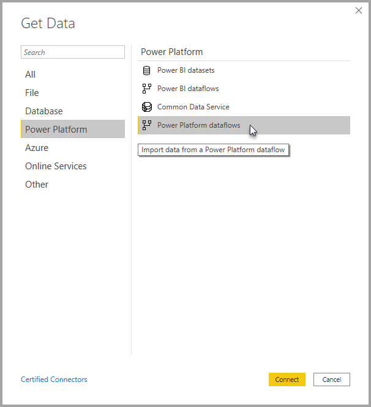

# Yhdistäminen Power Platform -tietovoissa luotuihin tietoihin Power BI Desktopissa
**Power BI Desktopissa** voit yhdistää **Power Platform -tietovoiden** luomiin tietoihin samaan tapaan kuin muihin tietolähteisiin Power BI Desktopissa.

**Power Platform -tietovuot** -liittimen avulla voit yhdistää tietovoiden luomiin entiteetteihin Power BI -palvelussa. 

## Huomioitavat asiat ja rajoitukset

Jotta voit käyttää **Power Platform -tietovoiden liitintä**, sinulla on oltava **Power BI Desktopin** uusi versio. Voit aina [ladata Power BI Desktopin](../fundamentals/desktop-get-the-desktop.md) ja asentaa sen tietokoneellesi, jotta sinulla on varmasti uusin versio.  

> [!NOTE]
> Power Platform -tietovuoliittimen aiempi versio edellyttää, että lataat .MEZ-tiedoston ja siirrät sen kansioon. **Power BI Desktopin** nykyiset versiot sisältävät Power Platform -tietovuoliittimen, minkä ansiosta tiedostoa ei enää tarvita. Tiedosto saattaa häiritä liittimen sisäänrakennetun version toimintaa. Jos siirsit .MEZ-tiedoston manuaalisesti kansioon, sinun on *ehdottomasti* poistettava kyseinen .MEZ-tiedosto **Tiedostot > Power BI Desktop > Custom connectors** -kansiosta, jotta häiriöitä ei esiinny. 

## Desktopin suorituskyky
**Power BI Desktop** suoritetaan paikallisesti tietokoneessa, jolle se on asennettu. Useat tekijät vaikuttavat tietovuon tietojen käsittelynopeuteen. Näitä tekijöitä ovat mm. tietojen koko, tietokoneen suoritin ja RAM-muisti, verkon kaistanleveys ja etäisyys konesalista.

Voit parantaa tietovuon tietojen käsittelynopeutta. Jos käsiteltävät tiedot ovat esimerkiksi niin suuria, että **Power BI Desktop** ei pysty käsittelemään niitä tietokoneellasi, voit käyttää tietovoiden linkitettyjä ja laskettuja entiteettejä tietojen koostamiseen (tietovoiden sisällä), jolloin voit käsitellä vain valmistellut, koostetut tiedot. 

Näin suuret tiedot käsitellään verkossa tietovoissa, ei paikallisessa **Power BI Desktop** -esiintymässä. Tämän ansiosta Power BI Desktopin tarvitsee käsitellä pienempiä tietomääriä, jolloin tietovoiden käsittely käy nopeammin.

## Huomioitavat asiat ja rajoitukset

Useimmat tietovuot ovat Power BI -palvelun vuokraajassa. **Power BI Desktop** -käyttäjät eivät voi kuitenkaan käyttää Azure Data Lake Storage Gen2 -tiliin tallennettuja tietovoita, elleivät he ole tietovuon omistajia tai heille ei ole myönnetty nimenomaista oikeutta käyttää tietovuon CDM-kansiota. Katso seuraavaa esimerkkiä:

1.  Anna luo uuden työtilan ja määrittää sen tallentamaan tietovuot organisaation Data Lake -tallennustilaan.
2.  Ben, joka on myös jäsen Annan luomassa työtilassa, haluaa noutaa tietoja Annan luomasta tietovuosta Power BI Desktopin ja tietovuon liittimen avulla.
3.  Ben saa virheen, koska häntä ei ole lisätty tietovuon CDM-kansion valtuutetuksi käyttäjäksi Data Lake -järjestelmässä.

    

Tämän ongelman ratkaisemiseksi Benin on saatava CDM-kansion ja sen tiedostojen lukuoikeudet. Lisätietoja oikeuksien myöntämisestä CDM-kansioon on [tässä artikkelissa](https://go.microsoft.com/fwlink/?linkid=2029121).

## Seuraavat vaiheet
Voit tehdä monia kiinnostavia asioita Power Platform -tietovoiden avulla. Katso lisätietoja seuraavista resursseista:

* [Omatoiminen tietojen valmistelu tietovoiden avulla](service-dataflows-overview.md)
* [Tietovoiden luominen ja käyttäminen Power BI:ssä](service-dataflows-create-use.md)
* [Laskettujen entiteettien käyttäminen Power BI Premiumissa (esikatselu)](service-dataflows-computed-entities-premium.md)
* [Tietovoiden käyttäminen paikallisten tietolähteiden kanssa (esikatselu)](service-dataflows-on-premises-gateways.md)
* [Kehittäjien resurssit Power Platform -tietovoille (esikatselu)](service-dataflows-developer-resources.md)

Lisätietoja integroinnista Azure Data Lake Storage Gen2:een on seuraavissa artikkeleissa:

* [Tietovuot ja Azure Data Lake -integrointi (esikatselu)](service-dataflows-azure-data-lake-integration.md)
* [Määritä työtilan tietovuoasetukset (esikatselu)](service-dataflows-configure-workspace-storage-settings.md)
* [Lisää CDM-kansio Power BI:hin tietovuona (esikatselu)](service-dataflows-add-cdm-folder.md)
* [Yhdistä Azure Data Lake Storage Gen2 tietovuotallennusta varten (esikatselu)](service-dataflows-connect-azure-data-lake-storage-gen2.md)

Myös seuraavista **Power BI Desktop** -artikkeleista voi olla hyötyä:

* [Power BI Desktopin tietolähteet](../connect-data/desktop-data-sources.md)
* [Tietojen muotoilu ja yhdistäminen Power BI Desktopissa](../connect-data/desktop-shape-and-combine-data.md)
* [Tietojen antaminen suoraan Power BI Desktopiin](../connect-data/desktop-enter-data-directly-into-desktop.md)   
