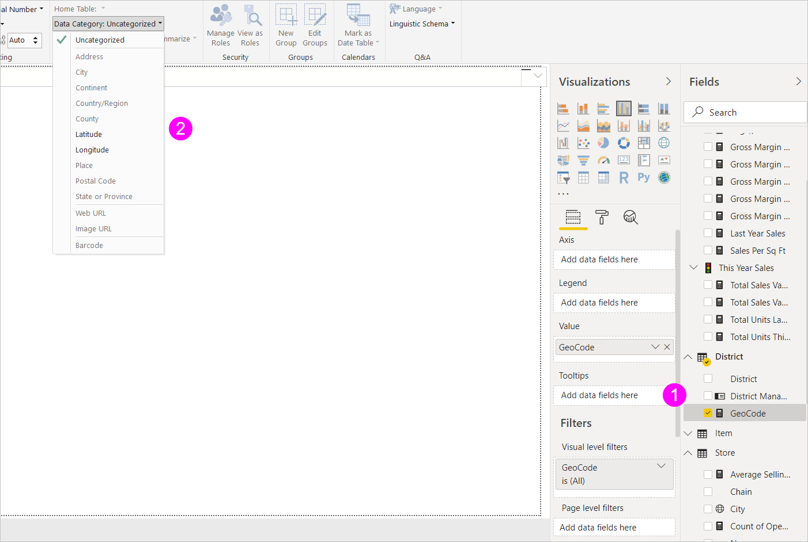

# Tietoluokkien määrittäminen Power BI Desktopissa
Power BI Desktopissa voit määrittää sarakkeen *tietoluokan*, jolloin Power BI Desktop tietää, miten sen on käsiteltävä kyseisen sarakkeen arvoja visualisoinnissa.

Kun Power BI Desktop tuo tietoja, se saa tuotavien tietojen lisäksi myös muita tietoja, kuten taulukoiden ja sarakkeiden nimet, sekä tiedon siitä, ovatko tiedot ensisijainen avain. Näillä tiedoilla Power BI Desktop tekee joitakin oletuksia siitä, miten se voi antaa sinulle hyvän oletuskokemuksen visualisointia luodessaan.
Jos esimerkiksi sarakkeessa on numeerisia arvoja, haluat luultavasti koostaa sen jotenkin, joten Power BI Desktop sijoittaa sen **Visualisoinnit**-ruudun **Arvot**-alueelle. Jos taas viivakaavion sarakkeessa on päivämäärä-aika-arvoja, Power BI Desktopin oletuksena on, että käytät sitä luultavasti aikahierarkia-akselina.

On kuitenkin joitakin haastavampia tapauksia, esimerkiksi maantiede. Tarkastele seuraavaa Excel-laskentataulukon taulukkoa:

Pitäisikö Power BI Desktopin käsitellä **GeoCode**-sarakkeen koodeja maalyhenteinä vai Yhdysvaltojen osavaltioiden lyhenteinä?  Se ei ole selvää, koska tällainen koodi voi tarkoittaa kumpaa tahansa. Esimerkiksi AL voi tarkoittaa Alabamaa tai Albaniaa, AR voi tarkoittaa Arkansasia tai Argentiinaa tai CA voi tarkoittaa Kalifornia tai Kanadaa. Tällä on merkitystä, kun aletaan siirtää GeoCode-kenttää kartalle. 

Tuleeko Power BI Desktopin näyttää kuva maailmasta, jossa maat ovat korostettuja? Vai pitäisikö sen näyttää kuva Yhdysvalloista, jossa osavaltiot ovat korostettuja?  Voit määrittää tietoluokan juuri tällaisille tiedoille. Tietojen luokittelulla tarkennetaan edelleen tietoja, joita Power BI Desktop voi käyttää parhaiden mahdollisten visualisointien tarjoamiseksi.  

**Tietoluokan määrittäminen**

1. Valitse **raportti**näkymässä tai **tieto**näkymässä olevasta **Kentät**-luettelosta kenttä, jonka haluat lajiteltavan eri luokittelun mukaan.
2. Valitse valintanauhan **Mallinnus**-välilehden **Ominaisuudet**-alueella avausnuoli kohdan **Tietoluokka**vieressä.  Luettelossa näkyvät tietoluokat, jotka voit sarakkeellesi valita. Jotkut valinnat voi olla poistettu käytöstä, jos ne eivät toimi sarakkeesi tämänhetkisen tietotyypin kanssa.  Jos sarake on esimerkiksi päivämäärä- tai aikatyyppinen, Power BI Desktop ei anna sinun valita maantieteellisten tietojen luokkia. 
3. Valitse haluamasi luokka.

   

Saatat olla myös kiinnostunut oppimaan aiheesta [maantieteellinen suodatus Power BI -mobiilisovelluksissa](desktop-mobile-geofiltering.md).

