# Opetusohjelma: Omien mittarien luominen Power BI Desktopissa
Mittareiden avulla voit luoda tehokkaimpiin kuuluvia tietojen analysointiratkaisuja Power BI Desktopissa. Mittarit auttavat suorittamalla tiedoillesi laskutoimituksia samalla, kun käsittelet raporttejasi. Tässä opetusohjelmassa kerrotaan Power BI Desktopin mittareista ja siitä, kuinka voit luoda omia perusmittareita.

## Edellytykset

- Tämä opetusohjelma on tarkoitettu kehittyneempien mallien luomiseen Power BI -käyttäjille, joille Power BI Desktopin käyttö on jo tuttua. Edellytyksenä on, että osaat jo tuoda tietoja Nouda tiedot -toiminnon ja kyselyeditorin avulla, työskennellä useiden toisiinsa liitettyjen taulukoiden kanssa ja lisätä kenttiä raporttipohjaan. Jos olet vasta aloittamassa Power BI Desktopin käyttöä, muista tutustua [Power BI Desktopin käytön aloittaminen](../fundamentals/desktop-getting-started.md) -resurssiin.
  
- Tässä opetusohjelmassa käytetään [Contoso-myyntimalli Power BI Desktopille](https://download.microsoft.com/download/4/6/A/46AB5E74-50F6-4761-8EDB-5AE077FD603C/Contoso%20Sales%20Sample%20for%20Power%20BI%20Desktop.zip) -tiedostoa, joka sisältää fiktiivisen Contoso, Inc. -yrityksen verkkomyyntitietoja. Koska nämä tiedot on tuotu tietokannasta, et voi muodostaa yhteyttä tietolähteeseen tai tarkastella niitä kyselyeditorissa. Lataa tiedosto omaan tietokoneeseesi ja pura se.

## Automaattiset mittarit

Kun Power BI Desktop luo mittarin, usein se luodaan automaattisesti puolestasi. Jos haluat nähdä, miten Power BI Desktop luo mittarin, toimi seuraavasti:

1. Valitse Power BI Desktopissa **Tiedosto** > **Avaa**, etsi *Contoso-myyntimalli Power BI Desktopille.pbix* -tiedosto selaamalla ja valitse sitten **Avaa**.

2. Laajenna **Kentät**-ruudun **Myynti**-taulukko. Valitse sitten **SalesAmount**-kenttä tai vedä **SalesAmount** raporttipohjaan.

    Näyttöön tulee uusi pylväskaaviovisualisointi, joka näyttää **Sales**-taulukon **SalesAmount**-sarakkeen kaikkien arvojen kokonaissumman.

    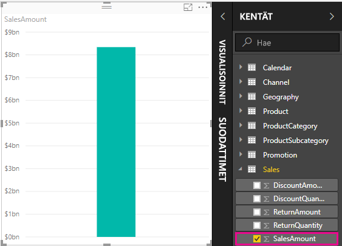

Mikä tahansa kenttä (sarake) **Kentät**-ruudussa, jossa on Sigma-kuvake , on numeerinen. Näiden kenttien arvoja voi koostaa. Sen sijaan, että Power BI Desktop näyttäisi paljon arvoja (kaksi miljoonaa **SalesAmount**-riviä) sisältävän taulukon, se luo ja laskee automaattisesti mittarin tietojen koostamiseksi, jos se havaitsee numeerisen tietotyypin. Summa on numeerisen tietotyypin oletuskooste, mutta voit helposti käyttää eri koosteita, kuten keskiarvo tai määrä. Koosteiden ymmärtäminen on keskeistä mittarien ymmärtämiselle, koska jokainen mittari suorittaa jonkinlaisen koostamisen. 

Voit muuttaa kaavion koostamista seuraavasti:

1. Valitse **SalesAmount**-visualisointi raporttipohjassa.  

1. Valitse **Visualisoinnit**-ruudun **Arvo**-alueelta alaspäin osoittava nuoli **SalesAmount**-kohdan oikealta puolelta. 

1. Valitse näkyviin tulevasta valikosta **Keskiarvo**. 

    Visualisointi muuttuu kaikkien **SalesAmount**-kentän myyntiarvojen keskiarvoksi.

    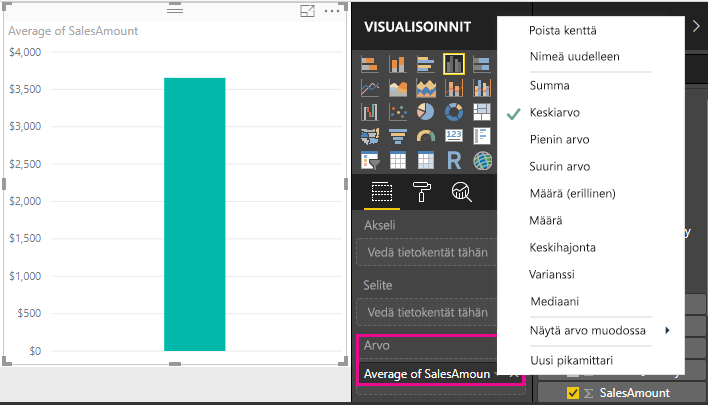

Voit muuttaa koostetyyppiä haluamasi tuloksen mukaan. Kaikki koostetyypit eivät kuitenkaan sovellu kaikille numeerisille tietotyypeille. **SalesAmount**-kentässä hyödyllisiä ovat esimerkiksi Summa ja Keskiarvo – ja myös Pienin arvo sekä Suurin arvo voivat olla hyödyllisiä. Määrä taas ei ole kovinkaan järkevä **SalesAmount**-kentässä, sillä vaikka sen arvot ovatkin numeerisia, ne ilmaisevat todellisuudessa valuuttaa.

Mittareista lasketut arvot muuttuvat vastauksena raportin kanssa tekemiesi toimien kanssa. Jos vedät esimerkiksi **RegionCountryName**-kentän **Geography**-taulukosta olemassa olevaan **SalesAmount**-kaavioon, se muuttuu näyttämään kunkin maan keskimääräiset myyntimäärät.

Kun mittarin tulos muuttuu raportissa tekemiesi toimien vuoksi, toimesi ovat vaikuttaneet mittarin *kontekstiin*. Aina tehdessäsi toimia raportin visualisoinneille muutat kontekstia, jossa mittari laskee ja näyttää tuloksensa.

## Omien mittarien luonti ja käyttö

Useimmissa tapauksissa Power BI Desktop laskee ja palauttaa arvoja automaattisesti valitsemiesi kenttien ja koosteiden tyyppien mukaan. Joissakin tapauksissa haluat ehkä luoda omia mittareita, jotka suorittavat monimutkaisempia ja yksilöllisempiä laskutoimituksia. Power BI Desktopilla voit luoda omia mittareita Data Analysis Expressions (DAX) -kaavan kielellä. 

DAX-kaavat käyttävät monia samoja funktioita, operaattoreita ja syntakseja kuin Excel-kaavat. DAX-funktiot on kuitenkin suunniteltu toimimaan relaatiotietojen kanssa ja suorittamaan dynaamisempia laskutoimituksia, kun teet toimia raporteissasi. DAX-funktioita on yli 200, ja ne tekevät kaikkea yksinkertaisista koosteista, kuten summa ja keskiarvo, monimutkaisiin tilasto- ja suodatusfunktioihin. Saatavilla on useita resursseja, joista saat lisätietoja DAX-kaavasta. Kun olet suorittanut tämän opetusohjelman, muista tutustua [Power BI Desktopin DAX-perusteisiin](desktop-quickstart-learn-dax-basics.md).

Kun luot oman mittarin, sitä kutsutaan *mallimittariksi*. Se myös lisätään valitsemasi taulukon **Kentät**-luetteloon. Mallimittarien etuja ovat muun muassa se, että voit nimetä ne haluamallasi tavalla, jolloin ne ovat paremmin tunnistettavissa. Lisäksi voit käyttää niitä argumentteina muissa DAX-lausekkeissa ja laatia ne suorittamaan monimutkaisia laskutoimituksia nopeasti.

### Pikamittarit

Power BI Desktopin helmikuun 2018 versiosta alkaen monet yleiset laskutoimitukset ovat saatavilla *pikamittareina*, jotka kirjoittavat DAX-kaavat puolestasi ikkunassa antamiesi tietojen perusteella. Nämä nopeat ja tehokkaat laskutoimitukset sopivat erinomaisesti myös DAX:n opetteluun tai omien mittariesi alkuarvojen sijoittamiseen. 

Voit luoda pikamittarin seuraavin tavoin: 
 - Napsauta **Kentät**-ruudun taulukossa hiiren kakkospainiketta tai valitse **Enemmän vaihtoehtoja** ( **...** ) ja valitse sitten luettelosta **Uusi pikamittari**.

 - Valitse Power BI Desktopin valintanauhan **Aloitus**-välilehden **Laskutoimitukset**-kohdasta **Uusi pikamittari**.

Lisätietoja pikamittareiden luonnista ja käytöstä saat artikkelista [Pikamittareiden käyttö](desktop-quick-measures.md).

### Mittarin luominen

Oletetaan, että haluat analysoida nettomyyntiäsi vähentämällä alennukset ja palautukset myynnin kokonaismääristä. Olipa visualisointisi konteksti mikä tahansa, tarvitset mittarin, joka vähentää DiscountAmount- ja ReturnAmount-arvojen summan SalesAmount-summasta. Nettomyynnille ei ole kenttää **Kentät**-luettelossa, mutta käytössäsi on elementtejä, joilla voit luoda oman mittarin nettomyynnin laskemista varten. 

Voit luoda mittarin seuraavasti:

1. Napsauta **Kentät**-ruudun **Sales**-taulukkoa hiiren kakkospainikkeella tai pidä hiiren osoitinta taulukon päällä ja valitse **Enemmän vaihtoehtoja** ( **...** ). 

1. Valitse näkyviin tulevasta valikosta **Uusi mittari**. 

    Tämä tallentaa uuden mittarin **Sales**-taulukkoon, josta se on helppo löytää.
    
    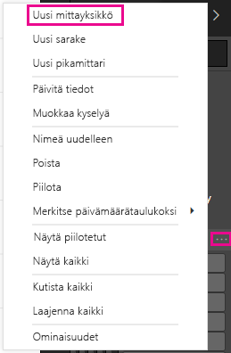
    
    Voit luoda uuden mittarin myös valitsemalla Power BI Desktopin valintanauhan **Aloitus**-välilehden **Laskutoimitukset**-ryhmästä **Uusi mittari**.
    
    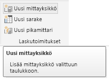
    
    >[!TIP]
    >Kun luot mittarin valintanauhan kautta, sen voi luoda missä tahansa taulukossa, mutta se on helpompi löytää, jos luot sen paikkaan, jossa aiot käyttää sitä. Valitse tässä tapauksessa ensin **Sales**-taulukko, jotta se aktivoituu, ja valitse sitten **Uusi mittari**. 
    
    Raporttipohjan yläosaan tulee näkyviin kaavarivi, johon voit nimetä mittarin ja kirjoittaa DAX-kaavan.
    
    
    
1. Uuden mittarin oletusnimeksi annetaan *Mittari*. Jos et nimeä sitä uudelleen, sitä seuraavat uudet mittarit saavat nimen *Mittari 2*, *Mittari 3* jne. Koska haluamme mittarien olevan paremmin tunnistettavissa, joten korosta kaavarivin *Mittari*-kohta ja kirjoita sitten nimeksi *Net Sales*.
    
1. Aloita nyt kaavan kirjoittaminen. Ala kirjoittamaan yhtäläisyysmerkin jälkeen sanaa *Sum*. Kirjoittaessasi näkyviin tulee ehdotusluettelo, jossa näkyvät kaikki DAX-funktiot, jotka alkavat kirjoittamillasi kirjaimilla. Vieritä tarvittaessa alaspäin, valitse luettelosta **SUM** ja paina lopuksi **Enter**-näppäintä.
    
    
    
    Näkyviin tulee vasen sulkumerkki ja avautuva ehdotusluettelo kaikista saatavilla olevista sarakkeista, jotka voit välittää SUM-funktioon.
    
    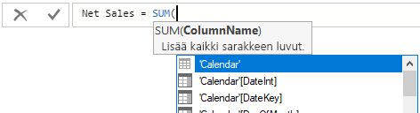
    
1. Lausekkeet näkyvät aina vasemman ja oikean sulkumerkin välissä. Tässä esimerkissä lauseke sisältää yhden argumentin välitettäväksi SUM-funktioon: **SalesAmount**-sarakkeen. Ala kirjoittaa *SalesAmount*, kunnes luettelossa on jäljellä vain yksi arvo: **Sales(SalesAmount)** . 

    Taulukon nimen edessä olevaa sarakkeen nimeä kutsutaan sarakkeen täydelliseksi nimeksi. Sarakkeiden täydelliset nimet helpottavat kaavojen lukemista.
    
    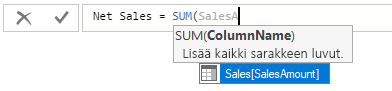
    
1. Valitse **Sales[SalesAmount]** luettelosta ja kirjoita loppusulje.
    
    > [!TIP]
    > Syntaksivirheiden syynä on useimmiten puuttuvat tai väärin sijoitetut loppusulkeet.
    
    
    
1. Vähennä kaksi muuta saraketta kaavasta:

    a. Kirjoita ensimmäisen lausekkeen loppusulkeen jälkeen välilyönti, miinusoperaattori (-) ja sitten toinen välilyönti. 

    b. Anna toinen SUM-funktio ja ala kirjoittaa *DiscountAmount*, kunnes voit valita **Sales[DiscountAmount]** -sarakkeen argumentiksi. Lisää loppusulje. 

    c. Kirjoita välilyönti, miinusoperaattori, välilyönti, toinen SUM-funktio, jonka argumenttina on **Sales[ReturnAmount]** ja sitten loppusulje.
    
    
    
1. Vahvista valmis kaava painamalla **Enter**-näppäintä tai napsauttamalla kaavarivin **vahvistuskohtaa**  (valintamerkkikuvaketta). 

    Vahvistettu **Net Sales** -mittari on nyt valmis käytettäväksi **Sales**-taulukon **Kentät**-luettelossa.
    
    
    
1. Jos kaavan kirjoittamista varten tarkoitettu tila on loppumassa tai haluat kaavan erillisille riveille, valitse kaavarivin oikeassa sivussa näkyvä alaspäin osoittava nuoli, jolloin saat lisää tilaa. 

    Alaspäin osoittava nuoli muuttuu ylöspäin osoittavaksi nuoleksi ja näyttöön avautuu suuri ruutu.

    

1. Erota kaavan osat lisäämällä rivivaihto painamalla **Alt** + **Enter** tai lisäämällä sarkainväli painamalla **Sarkain**-näppäintä.

   

### Oman mittarin käyttö raportissa
Lisää uusi **Net Sales** -mittari raporttipohjaan ja laske nettomyynti mille tahansa muille kentille, jotka lisäät raporttiin. 

Voit tarkastella maakohtaista nettomyyntiä seuraavasti:

1. Valitse **Net Sales** -mittari **Sales**-taulukosta tai vedä se raporttipohjaan.
    
1. Valitse **Geography**-taulukosta **RegionCountryName**-kenttä tai vedä se **Net Sales** -kaavioon.
    
    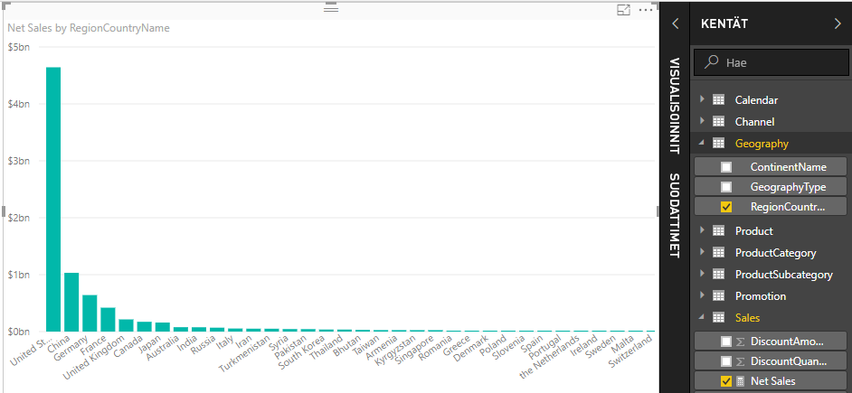
    
1. Kun haluat nähdä maakohtaisen nettomyynnin ja kokonaismyynnin välisen eron, valitse **SalesAmount**-kenttä tai vedä se kaavioon. 

    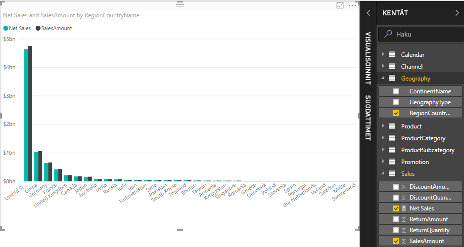

    Kaaviossa käytetään nyt kahta mittaria: **SalesAmount**-mittaria, joka laskettiin yhteen automaattisesti, ja manuaalisesti luomaasi **Net Sales** -mittaria. Kumpikin mittari laskettiin toisen kentän, **RegionCountryName**-kentän, kontekstissa.
    
### Mittarin käyttäminen osittajan kanssa

Lisää osittaja suodattaaksesi lisää kalenterivuosittaista nettomyyntiä ja myyntimäärää:
    
1. Valitse tyhjä kohta kaavion vierestä. Valitse **Visualisoinnit**-ruudusta **Taulukko**-visualisointityyppi. 

    Tämä luo tyhjän taulukkovisualisoinnin raporttipohjaan.
    
    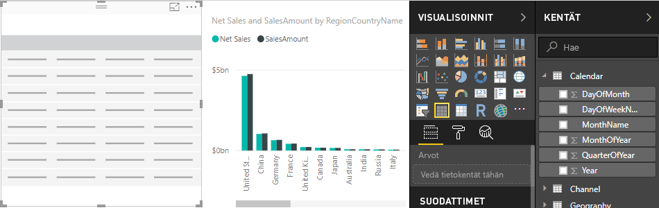
    
1. Vedä **Calendar**-taulukon **Year**-kenttä uuteen tyhjään taulukkovisualisointiin. 
    
    Koska **Year**-kenttä on numeerinen, Power BI Desktop laskee sen arvot yhteen. Tämä ei kuitenkaan toimi hyvin koosteena. Käsittelemme tätä tarkemmin seuraavassa vaiheessa.

    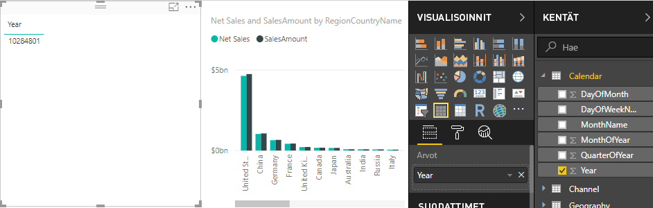
    
3. Valitse **Visualisoinnit**-ruudun **Arvot**-ruudusta **Year**-kohdan vieressä näkyvä alaspäin osoittava nuoli ja valitse luettelosta **Älä tee yhteenvetoa**. Taulukko näyttää nyt vuodet erikseen lueteltuina.
    
    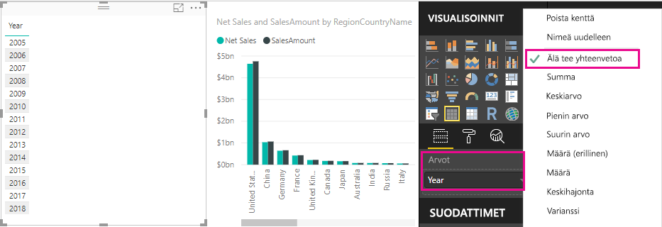
    
4.  Valitse **Visualisoinnit**-ruudun **Osittaja**-kuvake, jolloin taulukko muuttuu osittajaksi. Jos visualisointi näyttää liukusäätimen luettelon sijaan, valitse liukusäätimen alanuolesta **Luettelo**.

    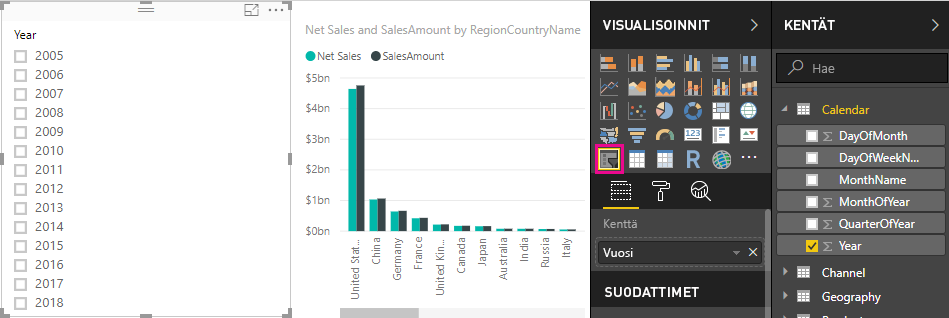
    
5.  Valitse mikä tahansa arvo **Year**-osittajasta, jolloin **Net Sales and Sales Amount by RegionCountryName** -kaavio suodattuu sen mukaisesti. **Net Sales**- ja **SalesAmount**-mittarit laskevat tulokset uudestaan ja näyttävät ne valitun **Year**-kentän kontekstissa. 
    
    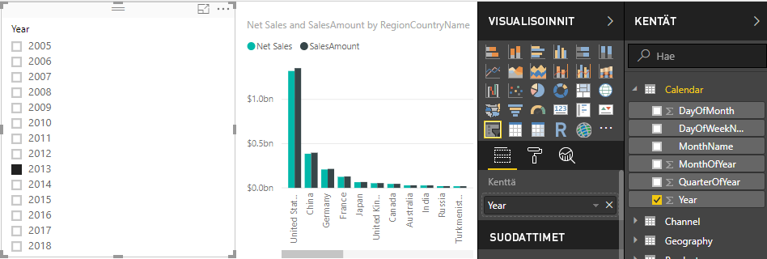

### Oman mittarin käyttö toisessa mittarissa

Oletetaan, että haluat selvittää, minkä tuotteiden nettomyyntimäärä myytyä yksikköä kohti on korkein. Tarvitset tähän mittarin, joka jakaa nettomyynnin myytyjen yksiköiden määrällä. Luo uusi mittari, joka jakaa **Net Sales**-mittarin **Sales[SalesQuantity]** -mittarin summalla.

1.  Luo **Kentät**-ruudussa **Sales**-taulukkoon uusi mittari nimeltä **Net Sales per Unit**.
    
1. Ala kirjoittaa kaavariville *Net Sales* -sanaa. Ehdotusluettelo näyttää, mitä voit lisätä. Valitse **[Net Sales]** .
    
    
    
1. Voit viitata mittareihin myös vain kirjoittamalla avaavan hakasulkeen ( **[** ). Ehdotusluettelossa näkyvät vain kaavaan lisättävät mittarit.
    
    
    
1. Lisää välilyönti, jako-operaattori (/), toinen välilyönti, SUM-funktio ja kirjoita sitten *Quantity*. Ehdotusluettelo näyttää kaikki sarakkeet, joiden nimessä on sana *Quantity*. Valitse **Sales[SalesQuantity]** , kirjoita loppusulje ja vahvista kaava painamalla **ENTER**-näppäintä napsauttamalla kaavarivin **vahvistuskohtaa** (valintamerkkikuvaketta). 

    Kaavan pitäisi näkyvä seuraavasti:
    
    `Net Sales per Unit = [Net Sales] / SUM(Sales[SalesQuantity])`
    
1. Valitse **Net Sales per Unit** -mittari **Sales**-taulukosta tai vedä se raporttipohjan tyhjään alueeseen. 

    Kaavio näyttää nettomyyntimäärän yksikköä kohti kaikkien myytyjen tuotteiden osalta. Tämä ei ole kovin informatiivista, mutta käsittelemme tätä tarkemmin seuraavassa vaiheessa.
    
    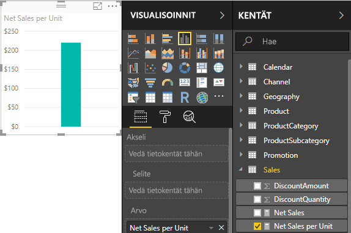
    
1. Voit muuttaa kaavion ulkoasua muuttamalla visualisointityypiksi **puukartan**.
    
    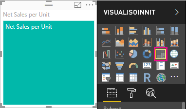
    
1. Valitse **Product Category**-kenttä tai vedä se puukarttaan tai **Visualisoinnit**-ruudun **Ryhmä**-kenttään. Nyt käytössäsi on hyödyllisiä tietoja!
    
    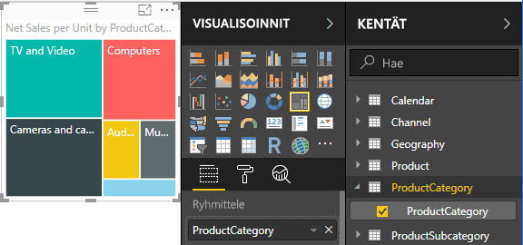
    
7. Yritä poistaa **ProductCategory**-kenttä ja vetää **ProductName**-kenttä kaavioon sen tilalle. 
    
    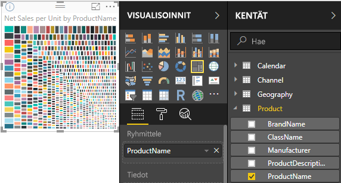
    
   Ok, nyt vain leikimme, mutta lienet samaa mieltä, että tämä on hauskaa! Kokeile myös muita tapoja suodattaa ja muotoilla visualisointia.

## Opitut asiat
Mittarien avulla saat paljon merkityksellisiä tietoja omista tiedoistasi. Olet oppinut, kuinka voit luoda mittareita käyttämällä kaavariviä, miten voit nimetä ne järkevimmäksi havaitsemallasi tavalla ja kuinka voit hakea ja valita oikeat kaavan osat käyttämällä DAX-ehdotusluetteloita. Lisäksi olet tutustunut kontekstiin, jossa laskutoimitusten tulokset mittareissa muuttuvat muiden kenttien tai kaavan muiden lausekkeiden mukaan.

## Seuraavat vaiheet
- Lisätietoja Power BI Desktopin pikamittareista, jotka tekevät puolestasi monia yleisiä mittarilaskutoimituksia, saat artikkelista [Pikamittareiden avulla voit suorittaa helposti yleisiä ja tehokkaita laskutoimituksia](desktop-quick-measures.md).
  
- Jos haluat tutustua tarkemmin DAX-kaavoihin ja siihen, miten voit luoda edistyneempiä mittareita, lue [DAX-perusteet Power BI Desktopissa](desktop-quickstart-learn-dax-basics.md). Tässä artikkelissa keskitytään DAX-peruskäsitteisiin, kuten syntaksiin ja funktioihin, ja annetaan tarkempaa tietoa kontekstista.
  
- Muista lisätä [Data Analysis Expressions (DAX) -viite](https://docs.microsoft.com/dax/index) suosikkeihin. Sieltä saat tarkempia tietoja DAX-syntaksista ja -operaattoreista sekä yli 200 DAX-funktiosta.
