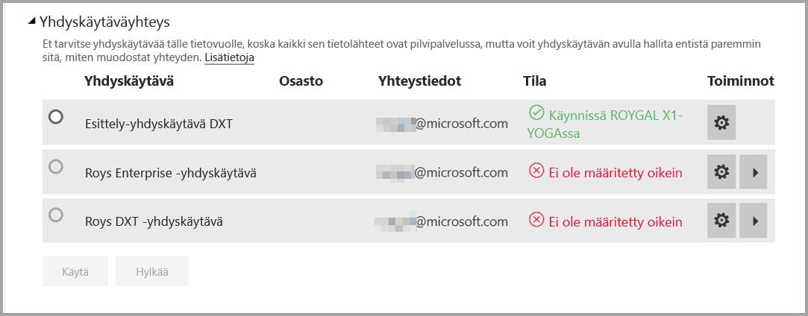
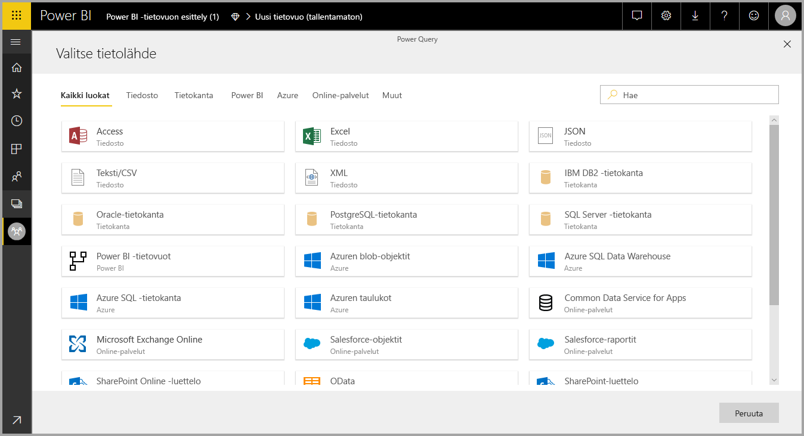
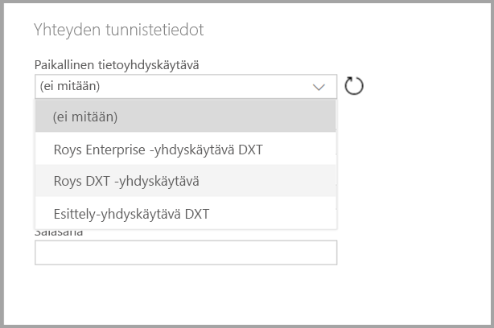

# Tietovoiden käyttö paikallisiin tietolähteisiin

Voit **tietovoiden** avulla luoda tietokokoelmia erilaisista lähteistä, puhdistaa tietoja, muuntaa tietoja ja ladata sitten tiedot Power BI -säilöön. Kun luot tietovuossa, haluat ehkä käyttää paikallisia tietolähteitä. Tässä artikkelissa selvitetään tietovoiden luomiseen liittyvää vaatimusta ja sitä, miten **yritysyhdyskäytävä** on määritettävä näiden yhteyksien käyttöönottamiseksi.

## Yritysyhdyskäytävän määrittäminen tietovuokäyttöä varten

Jos haluat luoda tietovuon yhdyskäytävän avulla, käyttäjän täytyy olla yritysyhdyskäytävän järjestelmänvalvoja – tai järjestelmänvalvojan on täytynyt jakaa tietolähde, jota aiotaan käyttää käyttäjän kanssa. 

> [!NOTE]
> Tietovoita tuetaan vain käyttämällä yritysyhdyskäytäviä.

## Paikallisen tietolähteen käyttäminen tietovuossa

Kun luot tietovuota, valitse paikallinen tietolähde tietolähteiden luettelosta seuraavassa kuvassa näytetyn mukaisesti.

Kun olet tehnyt valintasi, sinua pyydetään antamaan yhteystiedot yritysyhdyskäytävästä, jota käytetään yhteyden muodostamiseen paikalliseen tietoon. Sinun on itse valittava yhdyskäytävä ja annettava valitun yhdyskäytävän tunnistetiedot.

## Yhdyskäytävän valvonta

Voit valvoa tietovuon yritysyhdyskäytävää samalla tavoin kuin tietojoukon yhdyskäytäviä.

Power BI:n tietovuon asetusnäytössä voit valvoa tietovuon yhdyskäytävän tilaa ja määrittää yhdyskäytävän tietovuolle seuraavan kuvan mukaisesti.

## Yhdyskäytävän vaihtaminen

Voit vaihtaa tietylle tietovuolle käytettyä yritysyhdyskäytävää kahdella tavalla:

1. **Luontityökalusta** – voit muuttaa kaikille kyselyillesi määritettyä yhdyskäytävää tietovuon luontityökalun avulla.

    > [!NOTE]
    > Tietovuo yrittää löytää tai luoda vaaditut tietolähteet uuden yhdyskäytävän avulla. Jos se ei voi tehdä tätä, et voi vaihtaa yhdyskäytävää ennen kuin kaikki tarvittavat tietovuot ovat saatavilla valitusta yhdyskäytävästä.

2. **Asetusnäytöstä** – voit vaihtaa määritettyä yhdyskäytävää tietovuon asetusnäytön avulla Power BI -palvelussa.

Lue lisää yritysyhdyskäytävistä artikkelista [Paikallisen tiedon yhdyskäytävä](../connect-data/service-gateway-onprem.md).

## Huomioitavat asiat ja rajoitukset

Yritysyhdyskäytävien ja tietovoiden käyttöön liittyy pari tunnettua rajoitusta:

* Jokainen tietovuo voi käyttää vain yhtä yhdyskäytävää. Näin ollen kaikki kyselyt on määritettävä saman yhdyskäytävän avulla.
* Yhdyskäytävän vaihtaminen vaikuttaa koko tietovuohon.
* Jos tarvitaan useampia yhdyskäytäviä, paras keino on luoda useita tietovoita (yksi kutakin yhdyskäytävää varten) ja yhdistää tiedot laskennan tai entiteetin viitetoimintojen avulla.
* Tietovoita tuetaan vain käyttämällä yritysyhdyskäytäviä. Henkilökohtaisia yhdyskäytäviä ei voi käyttää valintaan avattavissa luetteloissa ja asetusnäytöissä.

## Seuraavat vaiheet

Tässä artikkelissa on lisätietoja paikallisen tietolähteen käyttämisestä tietovoille ja siitä, miten yhdyskäytäviä voidaan käyttää ja määrittää tällaisen tiedon käsittelemiseksi. Myös seuraavista artikkeleista voi olla apua

* [Omatoiminen tietojen valmisteleminen tietovoiden avulla](service-dataflows-overview.md)
* [Tietovoiden luominen ja käyttäminen Power BI:ssä](service-dataflows-create-use.md)
* [Laskettujen entiteettien käyttäminen Power BI Premiumissa](service-dataflows-computed-entities-premium.md)
* [Kehittäjien resurssit Power BI -tietovoille](service-dataflows-developer-resources.md)

Lisätietoja Power Querysta ja ajoitetusta päivityksestä on seuraavissa artikkeleissa:
* [Kyselyn yleiskatsaus Power BI Desktopissa](desktop-query-overview.md)
* [Ajoitetun päivityksen määrittäminen](../connect-data/refresh-scheduled-refresh.md)

Lisätietoja Common Data Modelista on sen yleiskatsauksen sisältävässä artikkelissa:
* [Common Data Model – yleiskatsaus](https://docs.microsoft.com/powerapps/common-data-model/overview)
