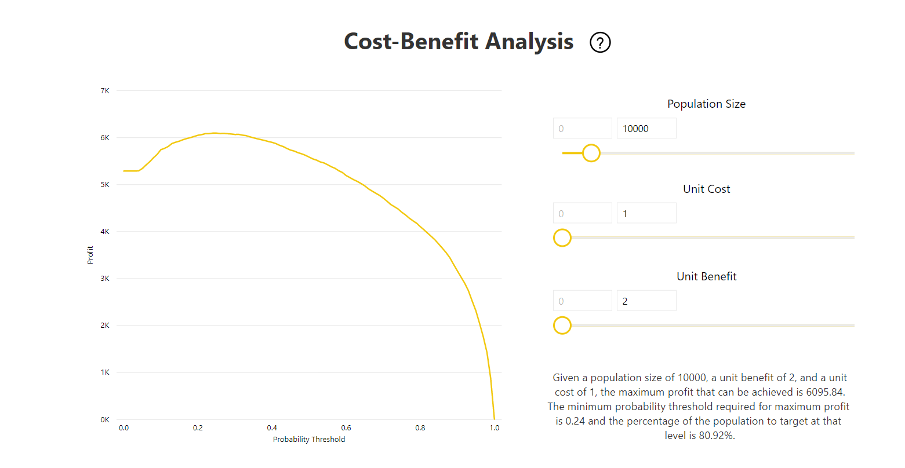

# Automaattianalyysipalvelut Power BI:ssä

Tietovoiden automaattianalyysipalveluiden avulla yritysanalyytikot voivat harjoittaa, vahvistaa ja käynnistää koneoppimismalleja suoraan Power BI:ssä. Se sisältää yksinkertaisen kokemuksen uuden koneoppimismallin luomiseen – siinä analyytikot voivat tietovoita käyttämällä määrittää syötetiedot mallin harjoittamista varten. Palvelu poimii automaattisesti tärkeimmät ominaisuudet, valitsee sopivan algoritmin ja virittää ja vahvistaa koneoppimismallin. Kun mallia on harjoitettu, Power BI luo automaattisesti suorituskykyraportin, joka sisältää vahvistuksen tulokset. Malli voidaan sitten käynnistää kaikista uusista tai päivitetyistä tiedoista tietovuossa.

Automaattianalyysipalvelut on käytettävissä vain Power BI Premiumissa ja upotetuissa kapasiteeteissa isännöidyissä tietovoissa.

## Automaattianalyysipalveluiden käyttö

[Power BI -tietovuot](service-dataflows-overview.md) tarjoavat omatoimisen tietojen valmistelemisen massadataa varten. Automaattianalyysipalvelut on integroitu tietovoihin, ja niiden avulla voit hyödyntää tietojen valmistelua koneoppimismallien rakentamiseen suoraan Power BI:ssä.

Power BI:n automaattianalyysipalveluiden avulla tietoanalyytikot voivat käyttää tietovoita koneoppimismallien luomiseen yksinkertaistetulla kokemuksella käyttäen vain Power BI -taitoja. Suurin osa automaattianalyysipalveluiden mallien taustalla olevasta tietotieteestä on automatisoitu Power BI:ssä. Siinä on varmistuksia, joiden avulla taataan, että tuotetun mallin laatu on hyvä ja että sen avulla voidaan tarkastella automaattianalyysipalveluiden mallin luonnissa käytettyä prosessia.

Automaattianalyysipalvelut tukee tietovoiden **binaariennuste**-, **luokitus**- ja **regressiomallien** luomista. Nämä ovat valvottavien koneoppimistekniikoiden tyyppejä, mikä tarkoittaa sitä, että ne oppivat aiempien havaintojen tunnetuista tuloksista muiden havaintojen tulosten ennustamiseksi. Automaattianalyysipalvelumallin harjoittamiseen käytettävä syötteiden tietojoukko on joukko tietueita, jotka **on merkitty** tunnetuilla tuloksilla.

Power BI:n automaattianalyysipalvelut integroi [automaattianalyysipalvelut](https://docs.microsoft.com/azure/machine-learning/service/concept-automated-ml) [Azuren automaattianalyysipalveluista](https://docs.microsoft.com/azure/machine-learning/service/overview-what-is-azure-ml) automaattianalyysipalvelumallien luomista varten. Voit kuitenkin käyttää automaattianalyysipalveluita Power BI:ssä ilman Azure-tilausta. Power BI -palvelu hallitsee täysin koneoppimismallien harjoittamista ja isännöintiä.

Kun koneoppimismallia on harjoitettu, automaattianalyysipalvelut luo automaattisesti Power BI -raportin, jossa selitetään koneoppimismallisi todennäköinen suorituskyky. Automaattianalyysipalvelut korostaa selitettävyyttä korostamalla syötteesi tärkeimmät vaikuttajat, jotka vaikuttavat mallisi palauttamiin ennusteisiin. Raportti sisältää myös mallin keskeiset arvot.

Muut luodun raportin sivut näyttävät mallin tilastollisen yhteenvedon ja harjoittamisen tiedot. Tilastollinen yhteenveto kiinnostaa käyttäjiä, jotka haluavat tarkastella mallin suorituskyvyn tietotieteen vakiomittareita. Harjoitustiedoissa on yhteenveto kaikista niistä iteroinneista, jotka suoritettiin mallin luomiseksi, niihin liittyvillä mallinnusparametreilla. Siinä kuvataan myös, miten kutakin syötettä käytettiin koneoppimismallin luomisessa.

Voit sitten käyttää koneoppimismalliasi tiedoissasi pisteyttämistä varten. Kun tietovuo päivitetään, tietosi päivitetään automaattianalyysipalveluiden mallin ennusteilla. Power BI sisältää myös yksilöllisen selvityksen kunkin tietyn ennusteen osalta, jonka koneoppimismalli tuottaa.

## Koneoppimismallin luominen

Tässä osiossa kuvataan, miten voit luoda automaattianalyysipalveluiden mallin.

### Tietojen valmistelu koneoppimismallin luontia varten

Koneoppimismallin luomiseksi Power BI:ssä sinun on ensin luotava tiedoille tietovuo historiallisilla tulostiedoilla, joita käytetään koneoppimismallin harjoittamiseen. Sinun tulee myös lisätä laskettuja sarakkeita sellaisiin liiketoimintamittareihin, jotka saattavat olla vahvoja ennustajia sen tuloksen kannalta, jota yrität ennustaa. Lisätietoja tietovuon määrittämisestä on kohdassa [Omatoiminen tietojen valmistelu Power BI:ssä](service-dataflows-overview.md).

Automaattianalyysipalveluilla on tiettyjä tietovaatimuksia, jotka koskevat koneoppimismallin harjoittamista. Nämä vaatimukset on kuvattu alla olevissa osissa kunkin mallityypin perusteella.

### Koneoppimismallin syötteiden määrittäminen

Jos haluat luoda automaattianalyysipalvelumallin, valitse koneoppimisen kuvake tietovuoentiteetin **Toiminnot**-sarakkeesta ja valitse **Lisää koneoppimismalli**.

Tämän jälkeen käynnistyy yksinkertaistettu käyttökokemus, joka sisältää koneoppimismallin luomisprosessissa opastavan ohjatun toiminnon. Ohjatussa toiminnossa on seuraavat yksinkertaiset vaiheet.

**1. Valitse historialliset tiedot sisältävä entiteetti sekä tuloskenttä, jolle haluat saada ennusteen**

Tuloskenttä tunnistaa koneoppimismallin harjoittamisessa käytettävän otsikon määritteen seuraavassa kuvassa esitetyllä tavalla.

**2. Valitse mallin tyyppi**

Kun määrität tuloskentän, automaattianalyysipalvelu analysoi nimitiedot ja suosittelee todennäköisimpiä automaattianalyysipalveluiden mallityyppejä koulutettavaksi. Voit valita eri mallityypin alla esitetyllä tavalla napsauttamalla "Valitse eri malli".

> [!NOTE]
> Joitakin mallityyppejä ei välttämättä tueta valitsemiasi tietoja varten, minkä vuoksi ne eivät ole valittavissa. Yllä olevassa esimerkissä regressio on poistettu käytöstä, koska tuloskentäksi on valittu tekstisarake.

**3. Valitse syötteet, joita haluat mallin käyttävän ennustavina signaaleina**

Automaattianalyysipalvelut analysoi otoksen valitun entiteetin kentistä ja ehdottaa syötteitä, joita voidaan käyttää koneoppimismallin harjoittamiseen. Valitsematta jätettyjen kenttien viereen on lisätty selitykset. Jos tietyllä kentällä on liian monta erillistä arvoa tai vain yksi arvo tai jos sillä on alhainen tai suuri vastaavuus tuloskentän kanssa, sitä ei suositella.

Syötteitä, jotka ovat riippuvaisia tuloskentästä (tai otsikkokentästä), ei tule käyttää koneoppimismallin harjoittamisessa, koska ne vaikuttavat sen suorituskykyyn. Tällaiset kentät merkitään viestillä ”epäilyttävän suuri yhteneväisyys tuloskentän kanssa”. Näiden kenttien käyttäminen harjoitustiedoissa aiheuttaa otsikoiden vuotamista, jolloin malli toimii hyvin vahvistukseen tai testitietoihin mutta ei pysty vastaavaan suorituskykyyn, kun sitä käytetään tuotannossa pisteytystä varten. Otsikoiden vuotaminen voi olla kyseessä automaattianalyysipalveluiden malleissa silloin, kun mallin suorituskyky vaikuttaa liian hyvältä ollakseen totta.

Ominaisuussuositus perustuu tietojen otokseen, joten tarkista käytetyt syötteet. Voit halutessasi muuttaa valintaa siten, että se sisältää vain sellaisia kenttiä, joita haluat mallin käsittelevän. Voit myös valita kaikki kentät valitsemalla entiteetin nimen vieressä olevan valintaruudun.

**4. Nimeä mallisi ja tallenna määritykset**

Viimeisessä vaiheessa voit nimetä mallin ja valita Tallenna ja harjoita, jolloin automaattianalyysipalvelumallin harjoittaminen aloitetaan. Voit lyhentää harjoitusaikaa saadaksesi nopeita tuloksia tai lisätä harjoittamiseen käytettyä aikaa parhaan mallin saamiseksi.

### Koneoppimismallin harjoittaminen

Automaattianalyysipalvelumallien harjoittaminen on osa tietovuon päivitystä. Automaattianalyysipalvelut valmistelee ensin tietosi harjoittamista varten.
Automaattianalyysipalvelut jakaa antamasi historialliset tiedot harjoittamisen ja testauksen tietojoukkoihin. Testitietojoukko on pidätysjoukko, jota käytetään mallin suorituskyvyn vahvistamiseen harjoittamisen jälkeen. Nämä toteutuvat **harjoittamis- ja testaus**entiteetteinä tietovuossa. Automaattianalyysipalvelut käyttää ristiintarkistusta mallin vahvistuksessa.

Seuraavaksi kunkin syötekentän tiedot analysoidaan ja imputointi otetaan käyttöön, mikä korvaa puuttuvat arvot muilla arvoilla. Automaattianalyysipalvelut käyttää paria erilaista imputointistrategiaa. Numeromuotoisina ominaisuuksina käsitellyissä syötemääritteissä laskentaan käytetään sarakearvojen keskiarvoa. Kategorisina ominaisuuksina käsitellyissä syötemääritteissä automaattianalyysipalvelut käyttää sarakearvojen tilaa. Automaattianalyysipalveluiden kehys laskee käytettyjen arvojen keskiarvon ja tilan harjoitettavan tietojoukon otoksesta.

Tämän jälkeen näytteenotot ja normalisointi otetaan käyttöön tiedoissa tarpeen mukaan. Luokitusmallien osalta automaattianalyysipalvelut ajaa syötetiedot kerrostettujen näytteiden avulla ja tasapainottaa luokat, jotta rivimäärät ovat samat kaikille.

Automaattianalyysipalvelut käyttää useita muunnoksia kuhunkin valittuun syötekenttään sen tietotyypin ja tilastollisten ominaisuuksien perusteella. Näiden muunnosten avulla automaattianalyysipalvelut poimii ominaisuuksia koneoppimismallisi harjoittamista varten.

Automaattianalyysipalvelumallien harjoittamisprosessi koostuu enintään 50 iteroinnista eri mallinnusalgoritmeilla ja hyperparametriasetuksilla suorituskykyisimmän mallin löytämiseksi. Harjoittaminen voi päättyä aikaisemmin pienemmällä määrällä toistoja, jos automaattianalyysipalvelut huomaa, ettei havaittavaa suorituskyvyn parannusta ole. Kunkin mallin suorituskyky arvioidaan vahvistuksella pidätystestin tietojoukon kanssa. Tämän harjoitusvaiheen aikana automaattianalyysipalvelut luovat useita jaksoja näiden iteraatioiden harjoittamiselle ja vahvistukselle. Mallien suorituskyvyn arviointiprosessi voi kestää jonkin aikaa muutamasta minuutista muutamaan tuntiin ohjattuun toimintoon määritettyyn ylärajaan asti, riippuen tietojoukon koosta ja käytettävissä olevista varatuista kapasiteettiresursseista.

Joissakin tapauksissa lopullinen luotu malli voi käyttää yhdistelmäoppimista, jossa useita malleja käytetään paremman ennakoivan suorituskyvyn saamiseksi.

### Automaattianalyysipalvelumallin selitettävyys

Mallin harjoittamisen jälkeen automaattianalyysipalvelut analysoi syöteominaisuuksien ja mallitulosteen välistä suhdetta. Se arvioi pidätystestin tietojoukon mallitulosteen muutoksen suuruuden kullekin syöteominaisuudelle. Tätä kutsutaan _ominaisuuden tärkeydeksi_. Se sisällytetään osaksi päivitystä, kun koulutus on valmis. Näin ollen päivityksesi voi kestää pidempään kuin ohjattuun toimintoon määritetyn harjoittamisajan.

### Automaattianalyysipalvelumallin raportti

Automaattianalyysipalvelut luo Power BI -raportin, jossa on yhteenveto mallin suorituskyvystä vahvistuksen aikana sekä ominaisuuden yleinen tärkeys. Tätä raporttia voidaan käyttää Koneoppimismalli-välilehden kautta, kun tietovuo on päivitetty onnistuneesti. Raportissa on yhteenveto tuloksista, jotka koskevat koneoppimismallin käyttämistä pidätystestin tiedoissa ja ennustusten vertaamista tunnettuihin tulosarvoihin.

Voit tutustua malliraporttiin, jotta ymmärrät sen suorituskyvyn. Voit myös vahvistaa, että mallin tärkeimmät vaikuttajat ovat yhdenmukaisia tunnettuja tuloksia koskevien liiketoimintatietojen kanssa.

Raportin mallin suorituskyvyn kuvaamisessa käytetyt kaaviot ja mittarit riippuvat mallin tyypistä. Nämä suorituskykykaaviot ja -mittarit kuvataan seuraavissa osissa.

Raportin lisäsivuilla saatetaan kuvailla tilastollisia mittareita mallista tietotieteen näkökulmasta. Esimerkiksi **Binaarinen ennuste** -raportti sisältää mallin voittokaavion ja ROC-käyrän.

Raporteissa on myös **Harjoitustiedot**-sivu, joka sisältää kuvauksen mallin harjoittamisesta sekä kaavion, jossa kuvataan mallin suorituskyky kunkin iteraation suorittamisen aikana.

Tämän sivun toisessa osiossa kuvataan syötekentän tyypin havaitsemista ja puuttuvien arvojen täyttämiseen käytettävää laskentamenetelmää. Se sisältää myös lopullisen mallin käyttämät parametrit.

Jos tuotettu malli käyttää yhdistelmäoppimista, niin **Harjoitustiedot**-sivulla on myös kaavio, jossa näkyy kunkin perustana olevan mallin painotus yhdistelmässä sekä sen parametrit.

## Automaattianalyysipalvelumallin käyttäminen

Jos olet tyytyväinen luodun koneoppimismallin suorituskykyyn, voit ottaa sen käyttöön uusissa tai päivitetyissä tiedoissa, kun tietovuo päivitetään. Voit tehdä tämän mallin raportista napsauttamalla **Käytä**-painiketta oikeassa yläkulmassa tai Käytä koneoppimismallia -painiketta Koneoppimismallit-välilehden toiminnoissa.

Jos haluat käyttää koneoppimismallia, sinun täytyy määrittää sen entiteetin nimi, jossa se pitää ottaa käyttöön, sekä etuliite niille sarakkeille, jotka lisätään tähän entiteettiin mallitulostetta varten. Sarakkeiden nimien oletusetuliite on mallin nimi. _Käytä_-funktio voi sisältää mallityypille määritettyjä lisäparametreja.

Kun koneoppimismalli otetaan käyttöön, se luo kaksi uutta tietovoiden entiteettiä, jotka sisältävät ennusteet ja yksilölliset selitykset kullekin riville, jotka on pisteytetty tulosentiteetissä. Jos esimerkiksi käytät _Ostoaie_-mallia _OnlineOstajat_-entiteetissä, tuloste luo entiteetit **OnlineOstajat täydennetty Ostoaie** ja **OnlineOstajat täydennetty Ostoaie -selitykset**. **Selitykset** on jaettu useisiin riveihin täydennetyn entiteetin kullekin riville syöteominaisuuden perusteella. **Selitysindeksi** auttaa yhdistämään täydennettyjen selitysten entiteetin rivit täydennetyn entiteetin riveihin.

Kun olet ottanut mallin käyttöön, automaattianalyysipalvelut pitää ennusteet aina ajan tasalla, kun tietovuo päivitetään.

Jos haluat käyttää koneoppimismallin merkityksellisiä tietoja ja ennusteita Power BI -raportissa, voit muodostaa yhteyden tuloste-entiteettiin Power BI Desktopista käyttämällä **tietovuo**liitintä.

## Binaariennustemallit

Binaariennustemalleja, jotka tunnetaan paremmin **binaariluokitusmalleina**, käytetään tietojoukon luokittelemisessa kahteen ryhmään. Niitä käytetään ennakoimaan tapahtumia, joilla voi olla binaarinen tulos. Esimerkiksi onko myyntimahdollisuus muunnettavissa, vaihtuuko asiakas, maksetaanko lasku ajallaan, onko tapahtuma vilpillinen, ja niin edelleen.

Binaariennustemallin tuloste on todennäköisyyden pistemäärä, joka määrittää todennäköisyyden sille, että tavoitetulos toteutuu.

### Binaariennustemallin harjoittaminen

Edellytykset:

- Kullekin tulosluokalle vaaditaan vähintään 20 riviä historiallista tietoa

Binaariennustemallin luontiprosessi noudattaa samoja vaiheita kuin muutkin automaattianalyysipalvelumallit. Vaiheet on kuvattu yllä olevassa osassa **Koneoppimismallin syötteiden määrittäminen**. Ainoa ero on ”Valitse malli” -vaiheessa, jossa voit valita sinua eniten kiinnostavan tavoitetulosarvon. Voit myös antaa otsikot niille tuloksille, joita käytetään automaattisesti luodussa raportissa, joka tekee yhteenvedon mallin vahvistuksen tuloksista.

### Binaariennustemallin raportti

Binaariennustemalli tuottaa tulosteena todennäköisyyden sille, että tietue saavuttaa tavoitetuloksen. Raportti sisältää todennäköisyyden raja-arvolle osittajan, joka vaikuttaa siihen, miten todennäköisyyden raja-arvon ylä- ja alapuolella olevat pistemäärät tulkitaan.

Raportissa kuvataan mallin suorituskyky arvoilla _True-positiiviset, False-positiiviset, True-negatiiviset ja False-negatiiviset_. True-positiiviset ja True-negatiiviset ovat oikein ennustettuja tuloksia kahdelle luokalle tulostiedoissa. False-positiiviset tulokset ovat tietueita, joiden ennustettiin saavuttavan tavoitetulos mutta jotka todellisuudessa eivät saavuttaneet sitä. Sitä vastoin false-negatiiviset ovat tietueita, jotka saavuttivat tavoitetuloksen, vaikka ennusteen mukaan ne eivät saavuttaisi sitä.

Mittarit, kuten Tarkkuus ja Saanti, kuvaavat todennäköisyyden raja-arvon vaikutusta ennustettuihin tuloksiin. Todennäköisyyden raja-arvon osittajan avulla voit valita raja-arvon, joka saavuttaa tasapainoisen kompromissin tarkkuuden ja saannin välillä.

Raportissa on myös Kustannus-hyötyanalyysi-työkalu, jonka avulla voidaan tunnistaa populaation alijoukko, johon kohdentamalla saadaan korkein tuotto. Kustannus-hyötyanalyysi yrittää maksimoida tuoton määritetyn kohdentamisen arvioidun yksikkökustannuksen ja tavoitetuloksen saavuttamisella saadun yksikköhyödyn perusteella. Työkalun avulla voit tuoton maksimoimiseksi valita todennäköisyyden raja-arvon kaavion korkeimman pisteen perusteella. Voit myös käyttää kaaviota valitsemasi todennäköisyyden raja-arvon tuoton tai kustannuksen laskemiseen.

Malliraportin **Tarkkuusraportti**-sivu sisältää _Kertyneet voitot_ -kaavion ja ROC-käyrän mallille. Nämä ovat mallin suorituskykyyn liittyviä tilastollisia mittareita. Raportit sisältävät kuvauksen näytetyistä kaavioista.

### Binaariennustemallin käyttäminen

Jos haluat käyttää binaariennustemallia, sinun on määritettävä entiteetti ja tiedot, joissa haluat käyttää koneoppimismallin ennusteita. Muita parametreja ovat tulostesarakkeen nimen etuliite ja todennäköisyyden raja-arvo ennustetun tuloksen luokittelemiseksi.

Kun binaariennustemallia käytetään, se lisää neljä tulostesaraketta täydennettyyn tuloste-entiteettiin: **Tulos**, **EnnusteenPisteet**, **EnnusteenSelitys**ja **Selitysindeksi**. Entiteetin sarakkeiden nimien etuliite on määritetty, kun mallia käytetään.

**EnnusteenPisteet** on prosentuaalinen ennuste, joka määrittää todennäköisyyden sille, että tavoitetulos toteutuu.

**Tulos**-sarake sisältää ennustetun tuloksen otsikon. Tietueiden, joiden todennäköisyydet ylittävät raja-arvon, ennustetaan todennäköisesti saavuttavan tuloksen, ja ne merkitään True-arvoiksi. Raja-arvon alapuolelle jäävät tietueet ennustetaan epätodennäköisiksi saavuttavan tuloksen, ja ne merkitään False-arvoiksi.

**EnnusteenSelitys**-sarake sisältää selityksen ja määrittää tietyn vaikutteen, joka syöteominaisuuksilla oli **EnnusteenPisteet**-kohdassa.

## Luokitusmallit

Luokitusmallien avulla tietojoukot luokitellaan useisiin ryhmiin tai luokkiin. Niitä käytetään ennakoimaan tapahtumia, joilla voi olla jokin useista mahdollisista tuloksista. Esimerkiksi onko asiakkaan elinkaariarvo todennäköisesti erittäin suuri, suuri, normaali vai pieni, tai onko oletusarvon riski suuri, kohtalainen, pieni vai erittäin pieni, ja niin edelleen.

Luokitusmallin tuloste on todennäköisyyden pistemäärä, joka tunnistaa todennäköisyyden sille, että tietue saavuttaa tietyn luokan ehdot.

### Luokitusmallin harjoittaminen

Luokitusmallin harjoitustiedot sisältävällä syöte-entiteetillä on oltava merkkijono- tai kokonaislukukenttä tuloksen kenttänä, joka tunnistaa aiemmat tunnetut tulokset.

Edellytykset:

- Kullekin tulosluokalle vaaditaan vähintään 20 riviä historiallista tietoa

Luokitusmallin luontiprosessi noudattaa samoja vaiheita kuin muutkin automaattianalyysipalvelumallit. Vaiheet on kuvattu yllä olevassa osassa **Koneoppimismallin syötteiden määrittäminen**.

### Luokitusmallin raportti

Luokitusmallin raportti luodaan käyttämällä koneoppimismallia pidätystestin tietoihin ja vertaamalla tietueen ennustettua luokkaa todelliseen tunnettuun luokkaan.

Malliraportti sisältää kaavion, joka sisältää kunkin tunnetun luokan oikein ja virheellisesti luokiteltujen tietueiden erittelyn.

Siirtyminen pidemmälle luokan alirakenteisiin mahdollistaa analyysin siitä, miten tunnetun luokan ennusteet on jaettu. Tämä näyttää muut luokat, joihin kyseisen tunnetun luokan tietueet todennäköisesti luokitellaan virheellisesti.

Raportin malliselitys sisältää myös kunkin luokan tärkeimmät ennusteet.

Luokitusmallin raportti sisältää myös Harjoitustiedot-sivun, joka on samanlainen kuin muiden mallityyppien sivut, jotka on kuvattu tämän artikkelin aiemmassa kohdassa **Automaattianalyysipalvelumallin raportti**.

### Luokitusmallin käyttäminen

Jos haluat käyttää koneoppimisen luokitusmallia, sinun on määritettävä entiteetti syötetiedoilla ja tulostesarakkeen nimen etuliitteellä.

Kun luokitusmallia käytetään, se lisää viisi tulostesaraketta täydennettyyn tuloste-entiteettiin: **LuokituksenPisteet**, **LuokituksenTulos**, **LuokituksenSelitys**, **LuokituksenTodennäköisyydet** ja **Selitysindeksi**. Entiteetin sarakkeiden nimien etuliite on määritetty, kun mallia käytetään.

**LuokituksenTodennäköisyydet**-sarake sisältää todennäköisyyspisteiden luettelon kunkin mahdollisen luokan tietueelle.

**LuokituksenPisteet** on prosentuaalinen ennuste, joka tunnistaa todennäköisyyden sille, että tietue saavuttaa tietyn luokan ehdot.

**LuokituksenTulos**-sarake sisältää tietueen todennäköisimmän luokan.

**LuokituksenSelitys**-sarake sisältää selityksen ja määrittää tietyn vaikutteen, joka syöteominaisuuksilla oli **LuokituksenPisteet**-kohdassa.

## Regressiomallit

Regressiomalleja käytetään ennustamaan numeroarvoa. Esimerkiksi myyntisopimuksesta todennäköisesti saatavaa voittoa, asiakkaan elinkaariarvoa, saatavan laskun todennäköisesti maksettavaa summaa, päivämäärää, jolloin lasku mahdollisesti maksetaan, ja niin edelleen.

Regressiomallin tuloste on ennustettu arvo.

### Regressiomallin harjoittaminen

Regressiomallin harjoitustiedot sisältävällä syöte-entiteetillä on oltava numeerinen kenttä tuloksen kenttänä, joka tunnistaa tunnettujen tulosten arvot.

Edellytykset:

- Regressiomallille vaaditaan vähintään 100 riviä historiallista tietoa.

Regressiomallin luontiprosessi noudattaa samoja vaiheita kuin muutkin automaattianalyysipalvelumallit. Vaiheet on kuvattu yllä olevassa osassa **Koneoppimismallin syötteiden määrittäminen**.

### Regressiomallin raportti

Muiden automaattianalyysipalvelumallien tavoin regressioraportti perustuu tuloksiin, jotka koskevat mallin käyttämistä pidätystestin tiedoissa.

Malliraportti sisältää kaavion, joka vertaa ennustettuja arvoja todellisiin arvoihin. Tässä kaaviossa etäisyys lävistäjästä ilmaisee ennusteessa olevan virheen.

Jäännösvirhekaaviossa näytetään keskimääräisen virheen prosenttiosuuden jakautuminen eri arvoille pidätystestin tietojoukossa. Vaaka-akseli edustaa ryhmän todellisen arvon keskiarvoa siten, että kuplan koko näyttää joukon arvojen tiheyden tai määrän. Pystyakseli on keskimääräinen jäännösvirhe.

Regressiomallin raportti sisältää myös Harjoitustiedot-sivun, joka on muiden mallityyppien raporttien kaltainen, ja ne on kuvattu aiemmassa kohdassa **Automaattianalyysipalvelumallin raportti**.

### Regressiomallin käyttäminen

Jos haluat käyttää koneoppimisen regressiomallia, sinun on määritettävä entiteetti syötetiedoilla ja tulostesarakkeen nimen etuliitteellä.

Kun regressiomallia käytetään, se lisää kolme tulostesaraketta täydennettyyn tuloste-entiteettiin: **RegressionTulos**, **RegressionSelitys** ja **Selitysindeksi**. Entiteetin sarakkeiden nimien etuliite on määritetty, kun mallia käytetään.

**RegressionTulos**-sarake sisältää syötekenttiin perustuvan tietueen ennustetun arvon. **RegressionSelitys**-sarake sisältää selityksen ja määrittää tietyn vaikutteen, joka syöteominaisuuksilla oli **RegressionTulos**-kohdassa.

## Seuraavat vaiheet

Tässä artikkelissa annettiin yleiskuva tietovoiden automaattianalyysipalveluista Power BI -palvelussa. Myös seuraavista artikkeleista voi olla apua.

- [Opetusohjelma: Koneoppimismallin luominen Power BI:ssä ](../connect-data/service-tutorial-build-machine-learning-model.md)
- [Opetusohjelma: Kognitiivisten palvelujen käyttö Power BI:ssä](../connect-data/service-tutorial-use-cognitive-services.md)
- [Opetusohjelma: Automaattianalyysipalveluiden studion (perinteisen) mallin käynnistäminen Power BI:ssä (esikatselu)](../connect-data/service-tutorial-invoke-machine-learning-model.md)
- [Kognitiiviset palvelut Power BI:ssä](service-cognitive-services.md)
- [Automaattianalyysipalveluiden integrointi Power BI:ssä](service-machine-learning-integration.md)

Lisätietoja tietovoista on seuraavissa artikkeleissa:

- [Tietovoiden luominen ja käyttäminen Power BI:ssä](service-dataflows-create-use.md)
- [Laskettujen entiteettien käyttäminen Power BI Premiumissa](service-dataflows-computed-entities-premium.md)
- [Tietovoiden käyttö paikallisiin tietolähteisiin](service-dataflows-on-premises-gateways.md)
- [Kehittäjien resurssit Power BI -tietovoille](service-dataflows-developer-resources.md)
- [Tietovuot ja Azure Data Lake -integrointi (esikatselu)](service-dataflows-azure-data-lake-integration.md)
