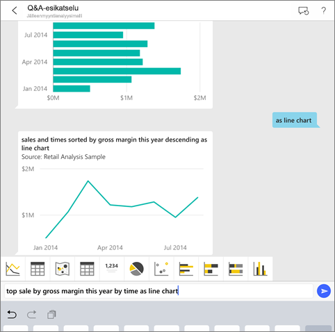
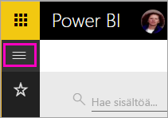
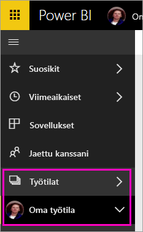
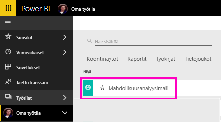

# Opetusohjelma: Tietoja koskevien kysymysten esittäminen Q&A:n virtuaalisen analyytikon avulla iOS-sovelluksissa – Power BI

Helpoin tapa saada lisätietoja omista tiedoista on esittää kysymyksiä omin sanoin. Tässä opetusohjelmassa esitetään kysymyksiä ja tarkastellaan mallitietojen merkityksellisiä tietoja käyttämällä Q&A:n virtuaalista analyytikkoa iPadin, iPhonen ja iPod Touchin Microsoft Power BI -mobiilisovelluksessa. 

Koskee seuraavia:

|  |  |
|:--- |:--- |
| iPhonet |iPadit |

Q&A:n virtuaalinen analyytikko on keskustelumainen BI-käyttökokemus, joka käyttää taustalla olevia Q&A-tietoja Power BI -palvelussa [(https://powerbi.com)](https://powerbi.com). Se ehdottaa merkityksellisiä tietoja, ja voit esittää sille kysymyksiä joko kirjoittamalla tai puhumalla ääneen.

Tässä opetusohjelmassa tehdään seuraavat asiat:

> [!div class="checklist"]
> * Power BI -mobiilisovelluksen asentaminen iOS-laitteelle
> * Power BI -mallikoontinäytön ja -raportin lataaminen
> * Mobiilisovelluksen ehdottamien merkityksellisten tietojen tarkastelu

Jos et ole rekisteröitynyt Power BI:hin, [rekisteröidy ilmaiseen kokeiluversioon](https://app.powerbi.com/signupredirect?pbi_source=web) ennen aloittamista.

## Edellytykset

### Power BI:n iOS-sovelluksen asentaminen
[Lataa iOS-sovellus](http://go.microsoft.com/fwlink/?LinkId=522062 "Lataa iPhone-sovellus") iPadille, iPhonelle tai iPod Touchille Applen App Storesta.

Seuraavat versiot tukevat Power BI:n iOS-sovellusta:
- iPad, jossa on iOS 10 tai uudempi.
- iPhone 5 tai uudempi, jossa on iOS 10 tai uudempi. 
- iPod Touch, jossa on iOS 10 tai uudempi.

### Mahdollisuusanalyysimallin lataaminen
Opetusohjelman ensimmäisessä vaiheessa ladataan mahdollisuusanalyysimalli Power BI -palvelussa.

1. Avaa Power BI -palvelu (app.powerbi.com) selaimessasi ja kirjaudu sisään.

1. Avaa vasen siirtymisruutu napsauttamalla yleistä siirtymiskuvaketta.

    

2. Valitse vasemmassa siirtymisruudussa **Työtilat** > **Oma työtila**.

    

3. Valitse vasemmassa alakulmassa **Nouda tiedot**.
   
    

3. Valitse Nouda tiedot -sivulla **Mallit**-kuvake.
   
   

4. Valitse **Mahdollisuusanalyysimalli**.
 
    
 
8. Valitse **Muodosta yhteys**.  
  
   
   
5. Power BI tuo mallin sekä lisää uuden koontinäytön, raportin ja tietojoukon omaan työtilaasi.
   
   

Nyt voit siirtyä tarkastelemaan mallia iOS-laitteessa.

## Kokeile esiteltyjä merkityksellisiä tietoja
1. Avaa Power BI -sovellus iPhonessa tai iPadissa ja kirjaudu sisään Power BI -tilisi tunnistetiedoilla, samoilla joita käytit selaimen Power BI-palvelussa.

1.  Napauta yleistä siirtymispainiketta  > **Työtilat** > **Oma työtila** ja avaa Mahdollisuusanalyysimalli-koontinäyttö.

2. Napauta Q&A:n virtuaalinen analyytikko -kuvaketta  sivun alaosan (iPadissa sivun yläosassa) toimintovalikossa.

     

     Power BI Q&A:n virtuaalinen analyytikko antaa joitain ehdotuksia, joilla pääset alkuun.

     
3. Napauta **esitellyt merkitykselliset tiedot**.

     Q&A:n virtuaalinen analyytikko ehdottaa joitakin merkityksellisiä tietoja.
4. Vieritä oikealle ja napauta **Merkityksellinen tieto 2**.

    

     Q&A:n virtuaalinen analyytikko näyttää merkityksellisen tiedon 2.

    
5. Avaa kaavio kohdistustilassa napauttamalla sitä.

    
6. Siirry takaisin Q&A:n virtuaaliseen analyytikkoon napauttamalla vasemmassa yläkulmassa olevaa nuolta.

## Resurssien tyhjentäminen

Kun olet suorittanut opetusohjelman, voit poistaa Mahdollisuusanalyysimalli-koontinäytön, -raportin ja -tietojoukon.

1. Avaa Power BI -palvelu (app.powerbi.com) ja kirjaudu sisään.

2. Valitse vasemmassa siirtymisruudussa **Työtilat** > **Oma työtila**.

3. Valitse **Koontinäytöt**-välilehdessä Mahdollisuusanalyysi-koontinäytön vieressä oleva **Poista**-roskakorikuvake.

    

4. Siirry **Raportit**-välilehdelle ja toimi samoin Mahdollisuusanalyysi-raportin kohdalla.

5. Siirry **Tietojoukot**-välilehdelle ja toimi samoin Mahdollisuusanalyysi-tietojoukon kohdalla.

## Seuraavat vaiheet

Olet kokeillut Q&A:n virtuaaliavustajaa iOS-laitteiden Power BI -mobiilisovelluksissa. Lue lisää Q&A:sta Power BI -palvelussa.
> [!div class="nextstepaction"]
> [Q&A Power BI -palvelussa](power-bi-q-and-a.md)

