# Matriisivisualisoinnin luominen Power BI:ssä

[!INCLUDE [power-bi-visuals-desktop-banner](../includes/power-bi-visuals-desktop-banner.md)]

Matriisivisualisointi muistuttaa taulukkoa.  Taulukko tukee kahta dimensiota ja tiedot ovat pelkistettyjä eli näet arvojen kaksoiskappaleet koostettujen arvojen sijasta. Matriisin ansiosta tiedot on helpompi näyttää mielekkäästi eri dimensioissa – se tukee porrastettua asettelua. Matriisi koostaa tiedot automaattisesti ja mahdollistaa porautumisen alaspäin. 

Voit luoda matriisivisualisointeja **Power BI Desktop** -raporteissa sekä korostaa matriisin sisältämiä elementtejä ristiin tämän raporttisivun muiden visualisointien kanssa. Voit esimerkiksi valita rivejä, sarakkeita ja jopa yksittäisiä soluja sekä ristiinkorostuksen. Voit myös kopioida yksittäisiä ja useita soluosioita sekä liittää niitä muihin sovelluksiin. 

Matriiseilla on monia ominaisuuksia, jotka käydään läpi tämän artikkelin seuraavissa osioissa.

## Miten Power BI laskee kokonaissummat

Ennen kuin siirrymme matriisivisualisoinnin käytön ohjeisiin, on tärkeää ymmärtää, miten Power BI laskee kokonais- ja välisumma-arvot taulukoissa ja matriiseissa. Power Bi arvioi kokonais- ja välisummariveille mittaria pohjana olevien tietojen kaikista riveistä. Se ei koostu ainoastaan näkyvien tai näytettyjen rivien arvoista. Kokonaissummarivin arvo saattaa siis poiketa odotuksistasi.

Katso seuraavia matriisivisualisointeja. 

Tässä esimerkissä oikeanpuoleisimman matriisivisualisoinnin jokainen rivi näyttää kunkin myyjä-/päivämääräyhdistelmän *summan*. Koska myyjä kuitenkin näkyy usean päivän kohdalla, samat numerot saattavat toistua. Tämän vuoksi pohjalla olevista tiedoista muodostettu tarkka kokonaissumma ei vastaa näkyvien tietojen yksinkertaista yhteenlaskua. Tämä on yleistä tapauksissa, joissa arvo lasketaan yhteen useiden muiden arvojen kanssa.

Kun tarkastelet kokonais- ja välisummia, muista, että nämä arvot perustuvat pohjana oleviin tietoihin. Ne eivät perustu pelkästään näkyvissä oleviin arvoihin.

## Riviotsikoiden laajentaminen ja kutistaminen
Voit laajentaa riviotsikoita kahdella tavalla. Ensimmäinen tapa on käyttää hiiren kakkospainikkeen valikkoa. Näet vaihtoehdot, joilla voit laajentaa valitsemasi riviotsikon, koko tason tai kaiken muun aina hierarkian viimeiseen tasoon asti. Tarjolla ovat vastaavat vaihtoehdot myös riviotsikoiden kutistamiseen.

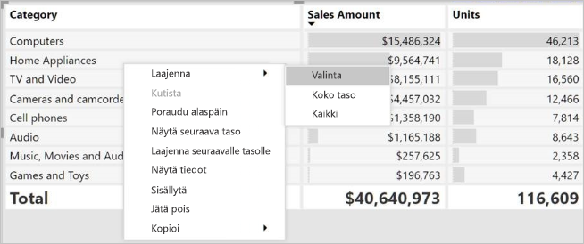

Voit myös lisätä riviotsikoihin +/--painikkeita **Riviotsikot**-kortin muotoiluruudun kautta. Oletusarvoisesti kuvakkeet vastaavat riviotsikon muotoilua, mutta voit halutessasi mukauttaa kuvakkeiden värit ja koot erikseen.

Kun kuvakkeet ovat käytössä, ne toimivat samalla tavalla kuin Excelin pivot-taulukon kuvakkeet.

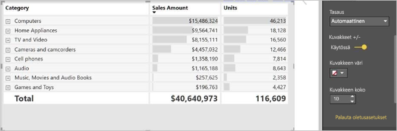

Matriisin laajennustila tallennetaan raporttisi kanssa. Matriisi voidaan kiinnittää koontinäyttöön laajennettuna tai kutistettuna. Kun kyseinen koontinäytön ruutu on valittu ja raportti avautuu, laajennustilaa voi yhä muuttaa raportissa. 

## Alaspäin porautumisen käyttö matriisivisualisoinnin kanssa
Matriisivisualisoinnilla voit tehdä erilaisia alaspäin porautumisen toimintoja, jotka eivät ennen olleet käytettävissä. Voit porata rivejä, sarakkeita ja jopa yksittäisiä osioita ja soluja. Niiden toiminta on kuvattu alla.

### Rivien otsikoiden poraaminen

Kun lisäät useita kenttiä Visualisoinnit-ruudun **Kentät**-säilössä olevaan **Rivit**-osioon, otat käyttöön matriisivisualisoinnin rivien porauksen alaspäin. Tämä muistuttaa hierarkian luomista, jonka avulla voit porata (ja varmuuskopioida) tiedot kyseisen hierarkian mukaisessa järjestyksessä ja analysoida ne jokaisella tasolla.

Seuraavassa kuvassa **Rivit**-osio sisältää *Myyntivaiheen* ja *Mahdollisuuden koon*, mikä luo ryhmittelyn (tai hierarkian) porattaville riveille, joita voimme porata.

Kun visualisointiin luodaan ryhmittely **Rivit**-osioon, itse visualisoinnissa näytetään *porautuminen*- ja *laajenna*-kuvakkeet vasemmassa yläkulmassa.

Kuten muidenkin visualisointien poraus- ja laajennustoiminnoissa, näiden painikkeiden valitseminen mahdollistaa poraamisen hierarkian mukaisesti ylös- tai alaspäin. Tässä tapauksessa voit porata *Myyntivaiheesta* *Mahdollisuuden kokoon* seuraavan kuvan mukaisesti. Siinä on valittu Poraus alaspäin yksi taso -kuvake (talikko).

Näiden kuvakkeiden käyttämisen lisäksi voit valita minkä tahansa näistä rivin otsikoista ja porata alaspäin valitsemalla toiminnon näyttöön tulevasta valikosta.

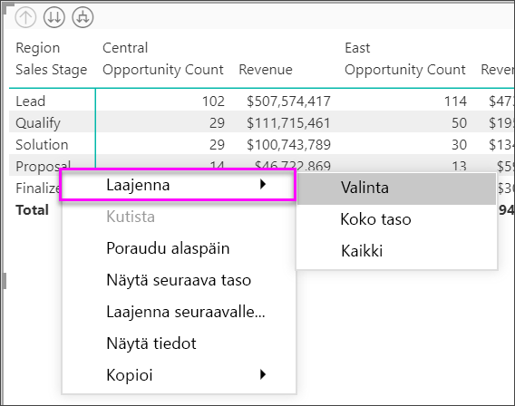

Huomaa, että valikossa on muutamia vaihtoehtoja, jotka tuottavat erilaisia tuloksia:

Jos valitset **Poraudu alaspäin**, matriisi laajennetaan *kyseisen* rivin tasolla, *lukuun ottamatta* kaikkia muita riviotsikoita paitsi valittua riviotsikkoa. Seuraavassa kuvassa on valittu **Ehdotus** > **Poraudu alaspäin**. Huomaa, että muita ylimmän tason rivejä ei enää näytetä matriisissa. Tämä porautumistapa on hyödyllinen toiminto ja erityisen kätevä, kun käsittelemme ristiinkorostusta.

Voit palata edelliseen ylimmän tason näkymään valitsemalla **Poraudu ylöspäin** -kuvakkeen. Jos valitset sitten **Ehdotus** > **Näytä seuraava taso**, saat laskeutuvan luettelon kaikista seuraavan tason kohteista (tässä tapauksessa *Mahdollisuuden koko* -kentästä) ilman ylemmän tason hierarkian luokittelua.

Valitse **Poraa ylöspäin** -kuvake vasemmasta yläkulmasta, jotta matriisi näyttää kaikki ylimmän tason luokat. Valitse sitten **Ehdotus** > **Laajenna seuraavalle tasolle**, jotta näet kaikki arvot hierarkian kummallakin tasolla - *Myyntivaihe* ja *Mahdollisuuden koko*.

Voit myös käyttää **Laajenna**-valikkokohdetta hallitsemaan näyttöä tarkemmin.  Valitse esimerkiksi **Ehdotus** > **Laajenna** > **Valinta**. Power BI näyttää yhden kokonaissummarivin kullekin *myyntivaiheelle* ja *Mahdollisuuden koko*-asetukset *ehdotukselle*.

### Sarakkeiden otsikoiden poraaminen
Voit porata sarakkeita alaspäin samoin kuin rivejä. Seuraavassa kuvassa näet, että **Sarakkeet**-kentän säilössä on kaksi kenttää, jotka luovat hierarkian samalla tavalla kuin rivien kanssa aiemmin tässä artikkelissa. **Sarakkeet**-kentässä on *Alue* ja *Segmentti*. Heti, kun toinen kenttä on lisätty **Sarakkeet**-kenttään, visualisoinnissa näytetään uusi avattava valikko, jossa on nyt **Rivit**.

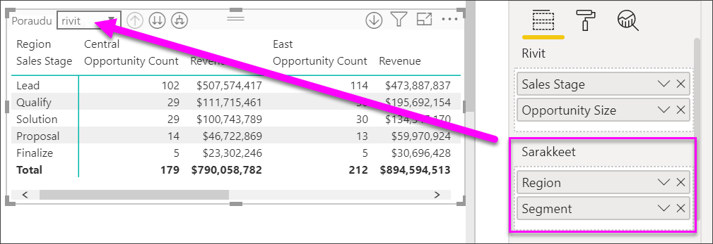

Jos haluat porautua alaspäin sarakkeisiin, valitse **Sarakkeet** kohta *Poraudu*-valikosta, joka on matriisin vasemmassa yläkulmassa. Valitse *Itä*-alue ja valitse **Poraudu alaspäin**.

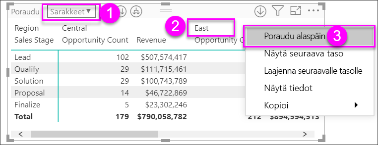

Kun valitset **Poraudu alaspäin**, näkyviin tulee sarakehierarkian seuraava taso *Alue > Itä* -kohdalle, joka on tässä tapauksessa *Mahdollisuuden lukumäärä*. Toinen alue on piilotettu.

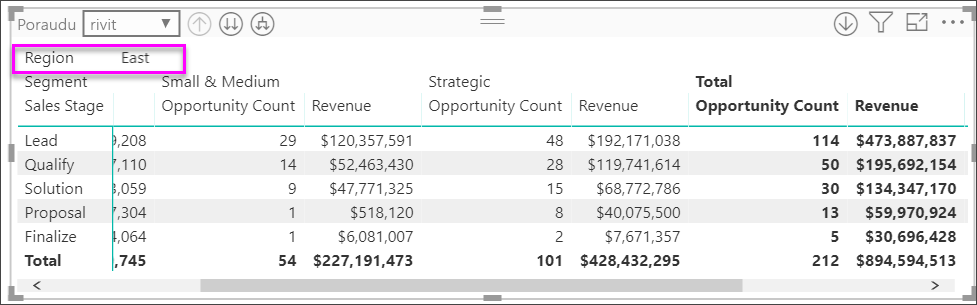

Valikon muut kohteet toimivat sarakkeilla samoin kuin riveillä (katso edellinen osio, **Riviotsikoiden poraus alaspäin**). Voit **Näyttää seuraavan tason**, **Laajentaa seuraavalle tasolle** sarakkeita samoin kuin rivejä.

> [!NOTE]
> Matriisivisualisoinnin vasemmassa yläkulmassa olevat ylös ja alas poraamisen kuvakkeet koskevat vain rivejä. Sarakkeiden alaspäin poraaminen edellyttää hiiren kakkospainikkeen valikon käyttöä.

## Porrastettu asettelu matriisivisualisoinneissa

Matriisivisualisointi sisentää hierarkian alaluokat automaattisesti kunkin ylätason alle. Tätä kutsutaan porrastetuksi asetteluksi.

Alkuperäisessä matriisivisualisoinnin versiossa aliluokat näytettiin täysin eri sarakkeella, mikä vei visualisoinnista paljon tilaa. Seuraavassa kuvassa taulukko näytetään alkuperäisessä matriisivisualisoinnissa. Huomaa, että aliluokat ovat erillisessä sarakkeessa.

Seuraavassa kuvassa näytetään matriisivisualisointi porrastetulla asettelulla. Huomaa, että *Tietokoneet*-luokan aliluokat (tietokoneiden oheislaitteet, pöytätietokoneet, kannettavat tietokoneet, näytöt ja niin edelleen) on hieman sisennetty, mikä tekee visualisoinnista siistin ja tiiviin.

Voit helposti säätää porrastetun asettelun asetuksia. Kun matriisivisualisointi on valittu, siirry **Muotoilu**-osioon (telakuvake) **Visualisoinnit**-ruudulla ja laajenna rivien otsikko-osio. Asetuksia on kaksi: porrastetun asettelun kytkin (käytössä / pois käytöstä) ja Porrastetun asettelun sisennys (määrittää sisennyksen kuvapisteinä).

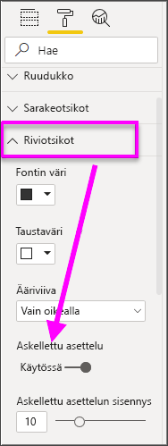

Jos poistat porrastetun asettelun käytöstä, Power BI näyttää aliluokat toisessa sarakkeessa sen sijaan, että ne sisennettäisiin ylätason luokan alle.

## Väli- ja kokonaissummat matriisivisualisoinneissa

Voit ottaa sekä rivien että sarakkeiden välisummat käyttöön ja poistaa ne käytöstä matriisivisualisoinneissa. Seuraavassa kuvassa näet, että rivin välisumma-asetus on **käytössä** ja määritetty näkymään alareunassa.

Kun otat **Välisummat** käyttöön ja lisäät otsikon, Power BI lisää myös rivin ja saman otsikon kokonaissumman arvolle. Jos haluat muotoilla kokonaissummaa, valitse **kokonaissumman** muotoiluvaihtoehto. 

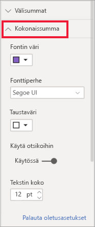

Jos haluat poistaa väli- ja kokonaissummat käytöstä, laajenna **Välisummat**-korttia Visualisoinnit-ruudun Muotoilu-osiossa. Poista rivin välisummien liukusäädin **käytöstä**. Kun teet näin, välisummat eivät näy.

Voit tehdä saman sarakkeiden välisummille.

## Lisää ehdollisia kuvakkeita
Lisää visuaalisia vihjeitä taulukkoon tai matriisiin *ehdollisten kuvakkeiden avulla*. 

Laajenna **Ehdollinen muotoilu** -korttia Visualisoinnit-ruudun Muotoilu-osiossa. Ota **Kuvakkeet**-liukusäädin **käyttöön** ja valitse **Lisäohjausobjektit**.

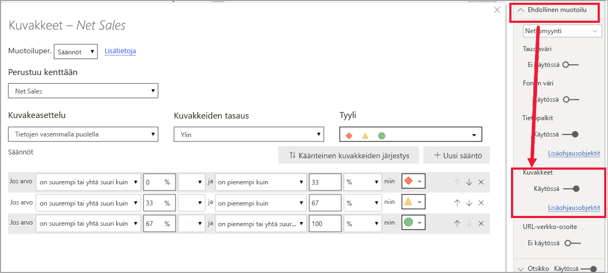

Säädä matriisin ehtoja, kuvakkeita ja värejä, ja valitse **OK**. Tässä esimerkissä käytimme punaista merkintää pienille arvoille, purppuranväristä ympyrää korkeille arvoille ja keltaista kolmiota kaikkeen niiden välillä. 

## Ristiinkorostus matriisivisualisoinneissa

Matriisivisualisoinneissa matriisin elementtejä voidaan valita ristiinkorostuksen perustaksi. Valitse matriisin sarake, ja Power BI korostaa sarakkeen, kuten muutkin raporttisivun visualisoinnit. Tämä ristiinkorostuksen tyyppi on muiden visualisointien ja arvopisteen valinnan yleinen ominaisuus, joka on nyt laajennettu matriisivisualisointeihin.

Myös Ctrl + napsautus -valinta toimii ristiinkorostuksessa. Esimerkiksi seuraavassa kuvassa matriisivisualisoinnista valittiin kokoelma aliluokkia. Huomaa, miten visualisoinnin valitsemattomat nimikkeet näkyvät harmaina ja miten sivun muut visualisoinnit kuvastavat matriisivisualisoinnissa tehtyjä valintoja.

## Arvojen kopiointi Power BI:stä muissa sovelluksissa käytettäviksi

Matriisissa tai taulukossa saattaa olla sisältöä, jota haluat käyttää muissa sovelluksissa: Dynamics CRM:ssä, Excelissä ja muissa Power BI -raporteissa. Power BI:n avulla voit hiiren kakkospainikkeella kopioida solun tai valikoiman soluja leikepöydälle ja liittää ne sitten toiseen sovellukseen.

* Kopioi yksittäisen solun arvo valitsemalla solu, napsauttamalla hiiren kakkospainiketta ja valitsemalla **Kopioi arvo**. Solun muotoilematon arvo on nyt leikepöydällä, josta voit liittää sen toiseen sovellukseen.

    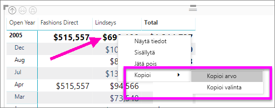

* Jos haluat kopioida useita soluja, valitse solualue tai useita soluja yhdessä Ctrl-näppäimen kanssa. 

    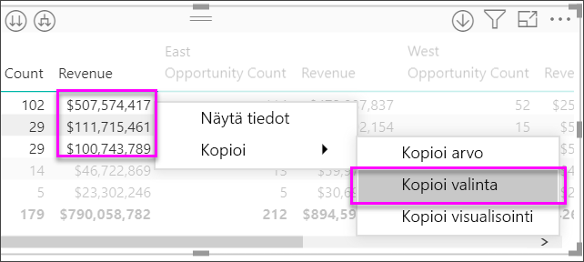

* Kopio sisältää sarakkeiden ja rivien otsikot.

    

* Jos haluat tehdä kopion itse visualisoinnista ja sisällyttää vain valitsemasi solut, valitse vähintään yksi solu CTRL-näppäimen avulla, napsauta hiiren kakkospainiketta ja valitse **Kopioi visualisointi**

    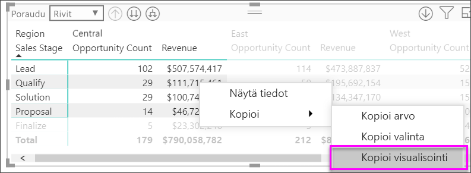

* Kopio on toinen matriisivisualisointi, mutta se sisältää vain kopioidut tiedot.

    

## Matriisiarvon määrittäminen mukautettuna URL-osoitteena

Jos sinulla on sarake tai mittari, joka sisältää WWW-URL-osoitteita, voit käyttää ehdollista muotoilua käyttääksesi kyseisiä URL-osoitteita kentissä aktiivisina linkkeinä. Tämä vaihtoehto on käytettävissä **Ehdollinen muotoilu** -kortin muotoiluruudussa.

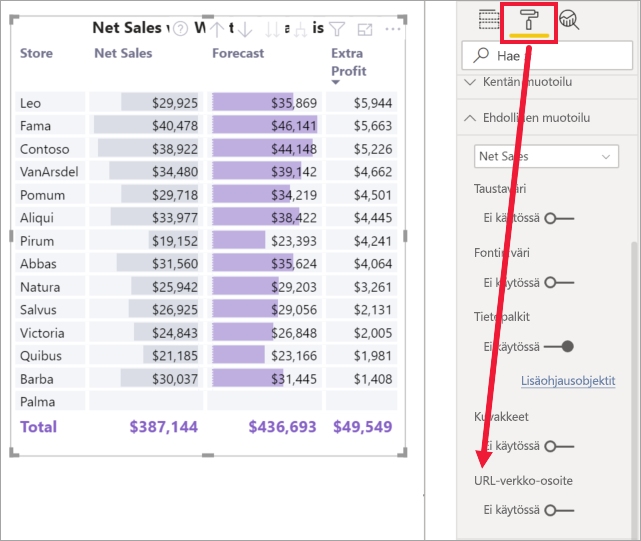

Ota **WWW-URL-osoite**-asetus käyttöön ja valitse kenttä, jota käytetään sarakkeen URL-osoitteena. Kun se on otettu käyttöön, kentän (sarakkeen) arvoista tulee aktiivisia linkkejä. Siirry linkin kohdalle ja siirry kyseiseen sivuun valitsemalla linkki. 

Lisätietoja on artikkelissa [Taulukon ehdollinen muotoilu](../desktop-conditional-table-formatting.md).

## Sävytys ja fontin väri matriisivisualisoinneissa
Matriisivisualisoinnin avulla voit käyttää ehdollista muotoilua (värit, sävytys ja tietopalkit) matriisin solujen taustavärinä, ja voit käyttää ehdollista muotoilua myös itse tekstiin ja arvoihin.

Voit käyttää ehdollista muotoilua valitsemalla matriisivisualisoinnin ja avaamalla **Muotoile**-ruudun. Voit vaihtoehtoisesti siirtyä **Ehdollinen muotoilu** -korttiin ja määrittää **taustavärin** **fontin värin** tai **tietopalkit** asettamalla liukusäätimen **Käytössä**-asentoon. Ottamalla käyttöön jonkin näistä vaihtoehdoista näet *Lisäasetukset*-linkin, jonka avulla voit mukauttaa värejä ja värin muotoilun arvoja.
  
  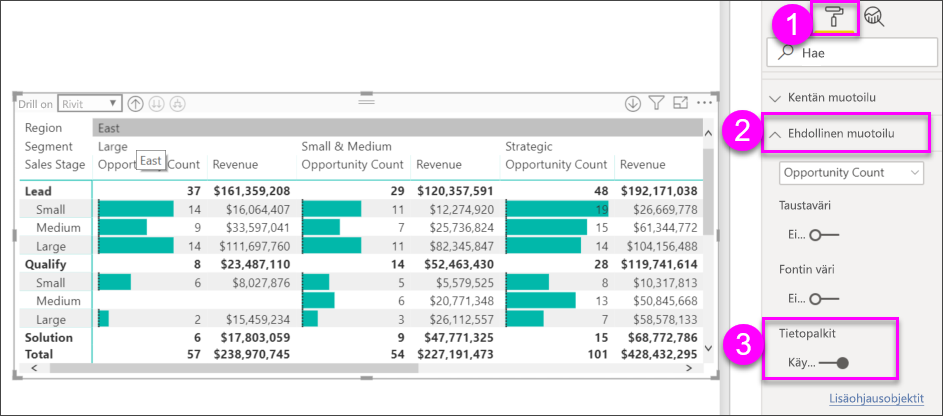

Valitsemalla *Lisäasetukset* näet valintaikkunan, jonka avulla voit tehdä mukautuksia. Tässä esimerkissä näytetään valintaikkuna **Tietopalkit**-kohteelle.

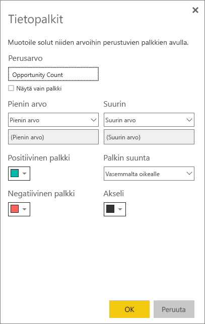

## Huomioon otettavat seikat ja vianmääritys

* Jos matriisin solujen tai otsikoiden tekstitiedoissa on uusi rivi -merkkejä, nämä merkit ohitetaan, ellet vaihda tekstin rivitysasetusta elementin liittyvässä muotoiluruudun kortissa. 

## Seuraavat vaiheet

[Power BI:n Power Apps -visualisointi](power-bi-visualization-powerapp.md)

[Visualisointityypit Power BI:ssä](power-bi-visualization-types-for-reports-and-q-and-a.md)
