# Matriisivisualisoinnin käyttö Power BI Desktopissa
**Matriisi**-visualisointiominaisuuden avulla voit luoda myös *matriisitaulukoiksi* kutsuttuja visualisointeja **Power BI Desktop** -raporteissa ja korostaa matriisin sisältämiä elementtejä ristiin muiden visualisointien kanssa. Lisäksi voit valita rivejä, sarakkeita ja jopa yksittäisiä soluja ristiinkorostettavaksi. Matriisivisualisointi tukee porrastettua asettelua, jonka avulla voit hyödyntää asettelun tilan entistä paremmin.

Matriiseilla on monia ominaisuuksia, jotka käydään läpi tämän artikkelin seuraavissa osioissa.

> [!NOTE]
> **Power BI Desktopin** heinäkuun 2017 julkaisusta lähtien matriisi- ja taulukkovisualisoinnit kuvastavat käytössä olevan **raportin teeman** muotoilua (mukaan lukien värejä). Jos haluat käyttää matriisivisualisoinnissa muita värejä, voit valita ne **raportin teema** -määrityksestä. Katso teemojen lisätiedot ohjeartikkelista [**Raportin teemojen käyttö Power BI Desktopissa**](../desktop-report-themes.md) .
> 
> 

## Miten Power BI laskee kokonaissummat

Ennen kuin siirryt **matriisivisualisoinnin** käytön ohjeisiin, on tärkeää ymmärtää, miten Power BI laskee kokonais- ja välisumma-arvot taulukoissa ja matriiseissa. Kokonais- ja välisummarivien arvo muodostetaan pohjana olevien tietojen kaikista riveistä. Se *ei* koostu ainoastaan näkyvien tai näytettyjen rivien arvoista. Kokonaissummarivin arvo saattaa siis poiketa odotuksistasi. 

Katso havainnollistava esimerkki seuraavista **matriisivisualisoinneista**. 

Tässä esimerkissä oikeanpuoleisimman **matriisivisualisoinnin** jokainen rivi näyttää kunkin myyjä-/päivämääräyhdistelmän *summan* . Koska myyjä kuitenkin näkyy usean päivän kohdalla, samat numerot saattavat toistua. Tämän vuoksi pohjalla olevista tiedoista muodostettu tarkka kokonaissumma ei vastaa näkyvien tietojen yksinkertaista yhteenlaskua. Tämä on yleistä tapauksissa, joissa arvo lasketaan yhteen useiden muiden arvojen kanssa.

Muista, että kokonais- ja välisummien arvo perustuu pohjalla oleviin tietoihin eikä ainoastaan näkyviin arvoihin. 

## Poraamisen käyttö matriisivisualisoinnin kanssa
**Matriisivisualisoinnilla** voit tehdä erilaisia poraamistoimintoja, jotka eivät ennen olleet käytettävissä. Voit porata rivejä, sarakkeita ja jopa yksittäisiä osioita ja soluja. Niiden toiminta on kuvattu alla.

### Rivien otsikoiden poraaminen
Kun lisäät useita kenttiä **Visualisoinnit**-ruudun **Kentät**-kohdassa olevaan **Rivit**-osioon, matriisirivien poraaminen otetaan käyttöön. Tämä muistuttaa hierarkian luomista, jonka avulla voit porata (ja varmuuskopioida) tiedot kyseisen hierarkian mukaisessa järjestyksessä ja analysoida ne jokaisella tasolla.

Seuraavassa kuvassa **Rivit**-osio sisältää *Luokan* ja *Aliluokan*, mikä luo ryhmittelyn (tai hierarkian) porattaville riveille.

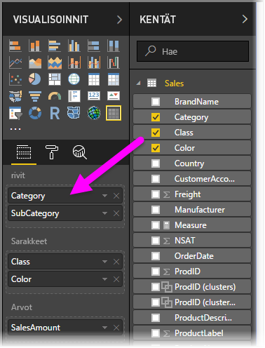

Kun visualisointiin luodaan ryhmittely **Rivit**-osioon, itse visualisoinnissa näytetään *porautuminen*- ja *laajenna*-kuvakkeet vasemmassa yläkulmassa.

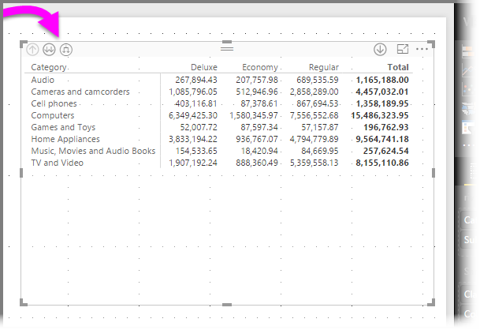

Kuten muidenkin visualisointien poraus- ja laajennustoiminnoissa, näiden painikkeiden valitseminen mahdollistaa poraamisen hierarkian mukaisesti ylös- tai alaspäin. Tässä tapauksessa voit porata *Luokasta* *Aliluokkaan*. Seuraavassa kuvassa yhden tason alas poraamisen kuvake (talikko) on valittu.

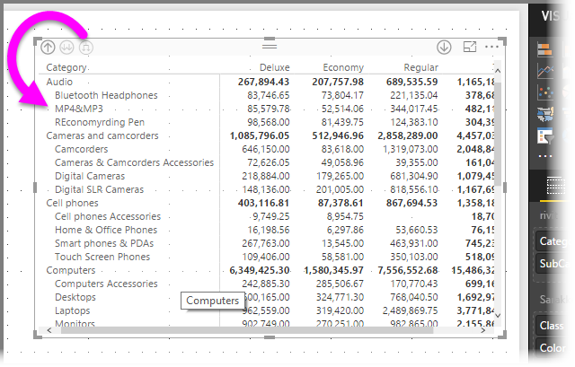

Kyseisten kuvakkeiden lisäksi voit napsauttaa rivien otsikoita hiiren kakkospainikkeella ja porata alaspäin valitsemalla toiminnon näyttöön tulevasta valikosta.

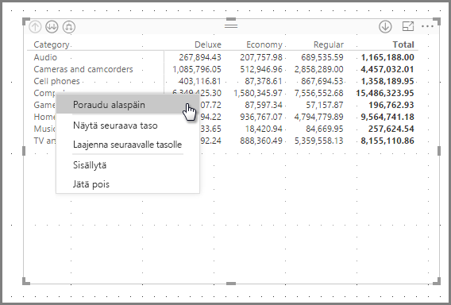

Huomaa, että valikossa on muutamia vaihtoehtoja, jotka tuottavat erilaisia tuloksia:

Jos valitset **Poraudu alaspäin**, matriisi laajennetaan *kyseisen* rivin tasolla, *lukuun ottamatta* kaikkia muita riviotsikoita paitsi sitä, jota napsautettiin hiiren kakkospainikkeella. Seuraavassa kuvassa *Tietokoneet*-otsikkoa napsautettiin hiiren kakkospainikkeella, minkä jälkeen valittiin **Poraudu alaspäin**. Huomaa, että muita ylimmän tason rivejä ei enää näytetä matriisissa. Tämä poraamistapa on hyödyllinen toiminto ja erityisen kätevä, kun käsittelemme **ristiinkorostusta**.

Voit palata edelliseen ylimmän tason näkymään napsauttamalla **Poraudu ylöspäin**. Jos valitset sitten **Näytä seuraava taso** hiiren kakkospainikkeen valikosta, näet aakkosjärjestykseen asetetun luettelon seuraavan tason kohteista (tässä tapauksessa *Aliluokka*-kentästä) ilman ylemmän tason hierarkian luokittelua.

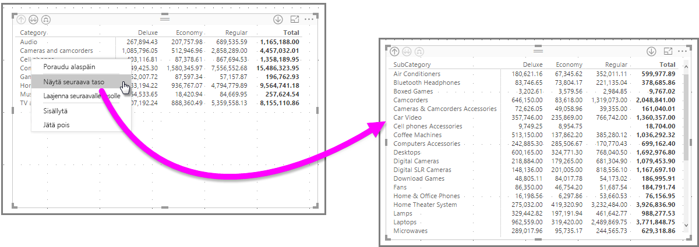

Kun napsautat **Poraudu ylöspäin** -kuvaketta vasemmasta yläkulmasta, matriisi näyttää kaikki ylimmän tason luokat. Napsauta uudelleen hiiren kakkospainikkeella ja valitse **Laajenna seuraavalle tasolle**, niin näet seuraavan visualisoinnin.

Voit käyttää myös **Sisällytä**- ja **Sulje pois** -valikkovaihtoehtoja, jos haluat pitää (tai poistaa) kakkospainikkeella napsautetun rivin (ja kaikki aliluokat) matriisissa.

### Sarakkeiden otsikoiden poraaminen
Voit porata **Sarakkeita** samoin kuin rivejä. Seuraavassa kuvassa näet, että **Sarakkeet**-kentässä on kaksi kenttää, jotka luovat hierarkian samalla tavalla kuin rivejä käsitelleessä, artikkelissa aiemmin esiintyneessä esimerkissä. **Sarakkeet**-kenttä sisältää *Luokan* ja *Värin*.

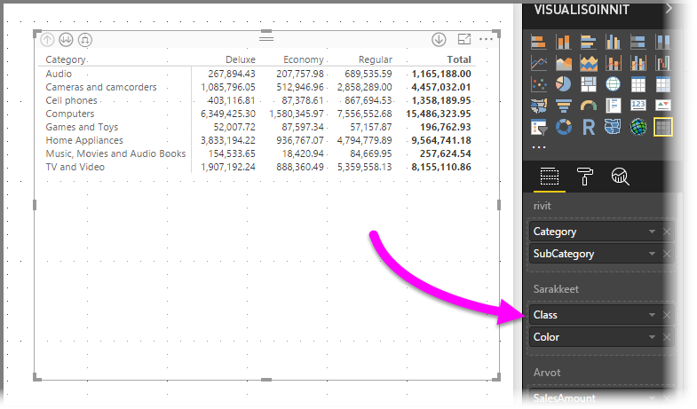

Porausvaihtoehto tulee näkyviin napsauttamalla **Matriisivisualisoinnissa** saraketta hiiren kakkospainikkeella. Seuraavassa kuvassa napsautetaan hiiren kakkospainikkeella *Deluxe* ja valitaan sitten **Poraudu alaspäin**.

Kun **Poraudu alaspäin** valitaan, *Deluxe*-otsikon sarakehierarkian seuraava taso (tässä tapauksessa *Väri*) näytetään.

Hiiren kakkospainikkeen valikon muut kohteet toimivat sarakkeilla samoin kuin riveillä (katso edellinen osio, **Rivien otsikoiden poraaminen**). Voit myös **Näyttää seuraavan tason**, **Laajentaa seuraavalle tasolle** ja **Sisällyttää** tai **Sulkea pois** sarakkeita samoin kuin rivejä.

> [!NOTE]
> Matriisivisualisoinnin vasemmassa yläkulmassa olevat ylös ja alas poraamisen kuvakkeet koskevat vain rivejä. Sarakkeiden alaspäin poraaminen edellyttää hiiren kakkospainikkeen valikon käyttöä.
> 
> 

## Porrastettu asettelu matriisivisualisoinneissa
**Matriisivisualisointi** sisentää hierarkian alaluokat automaattisesti kunkin ylätason alle. Tätä kutsutaan **porrastetuksi asetteluksi**.

*Alkuperäisessä* matriisivisualisoinnin versiossa aliluokat näytettiin täysin eri sarakkeella, mikä vei visualisoinnista paljon tilaa. Seuraavassa kuvassa taulukko näytetään alkuperäisessä **matriisivisualisoinnissa**. Huomaa, että aliluokat ovat erillisessä sarakkeessa.

Seuraavassa kuvassa näytetään **matriisivisualisointi** **porrastetulla asettelulla**. Huomaa, että *Tietokoneet*-luokan aliluokat (tietokoneiden oheislaitteet, pöytätietokoneet, kannettavat tietokoneet, näytöt ja niin edelleen) on hieman sisennetty, mikä tekee visualisoinnista siistin ja tiiviin.

Voit helposti säätää porrastetun asettelun asetuksia. Kun **matriisivisualisointi** on valittu, siirry **Muotoilu**-osioon (telakuvake) **Visualisoinnit**-ruudulla ja laajenna **Rivien otsikot**-osio. Asetuksia on kaksi: **porrastetun asettelun** kytkin (käytössä / pois käytöstä) ja **Porrastetun asettelun sisennys** (määrittää sisennyksen kuvapisteinä).

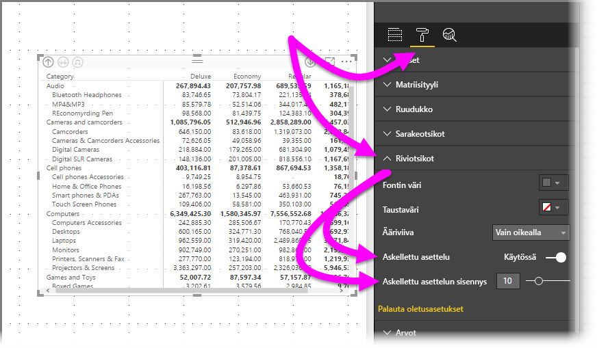

Jos poistat **Porrastetun asettelun** käytöstä, aliluokat näytetään toisessa sarakkeessa sen sijaan, että ne sisennettäisiin ylätason luokan alle.

## Välisummat matriisivisualisoinneissa
Voit ottaa sekä rivien että sarakkeiden välisummat käyttöön ja poistaa ne käytöstä matriisivisualisoinneissa. Seuraavassa kuvassa rivien välisumma-asetus on **käytössä**.

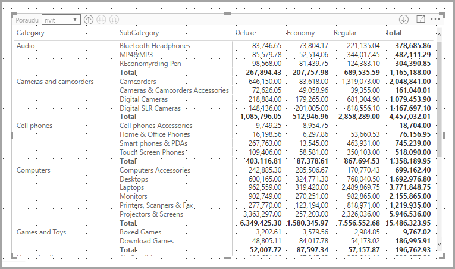

Siirry **Muotoilu**-osioon **Visualisoinnit**-ruudulla, laajenna **Välisummat**-kortti ja aseta **Rivien välisummat** -liukusäädin**Pois käytöstä** -asentoon. Välisummat eivät tämän jälkeen näy.

Voit tehdä saman sarakkeiden välisummille.

## Ristiinkorostus matriisivisualisoinneissa
**Matriisivisualisoinneissa** matriisin elementtejä voidaan valita ristiinkorostuksen perustaksi. Valitse **Matriisin** sarake, niin kyseinen sarake korostetaan, kuten muutkin raporttisivun visualisoinnit. Tämä ristiinkorostuksen tyyppi on muiden visualisointien ja arvopisteen valinnan yleinen ominaisuus, joka on nyt laajennettu **matriisivisualisointeihin**.

Myös Ctrl + napsautus -valinta toimii ristiinkorostuksessa. Esimerkiksi seuraavassa kuvassa **matriisivisualisoinnista** valittiin kokoelma aliluokkia. Huomaa, miten visualisoinnin valitsemattomat nimikkeet näkyvät harmaina ja miten sivun muut visualisoinnit kuvastavat **matriisivisualisoinnissa** tehtyjä valintoja.

## Sävytys ja fontin väri matriisivisualisoinneissa
**Matriisivisualisoinnin** avulla voit käyttää **ehdollista muotoilua** (värit ja sävytys) matriisin solujen taustavärinä, ja voit käyttää ehdollista muotoilua myös tekstiin ja arvoihin.

Voit käyttää ehdollista muotoilua, jommallakummalla seuraavista keinoista matriisivisualisoinnin ollessa valittuna:

* Napsauta **Kentät**-ruutua hiiren kakkospainikkeella ja valitse valikosta **Ehdollinen muotoilu**.
  
  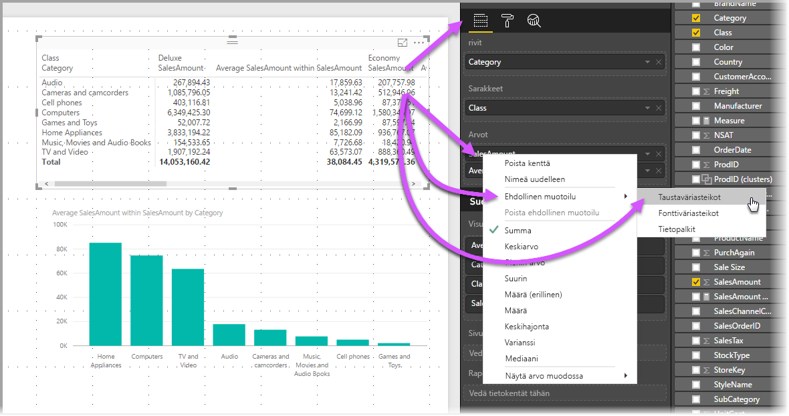
* Voit vaihtoehtoisesti siirtyä **Muotoilu**-ruutuun, laajentaa **ehdollinen muotoilu** -kortin ja asettaa **Taustan väriasteikot**- tai **Fontin väriasteikot** -kytkimen **Käytössä**-asentoon. Jos otat käyttöön kumman tahansa vaihtoehdon, näet *Lisäasetukset*-linkin, jonka avulla voit mukauttaa värejä ja värin muotoilun arvoja.
  
  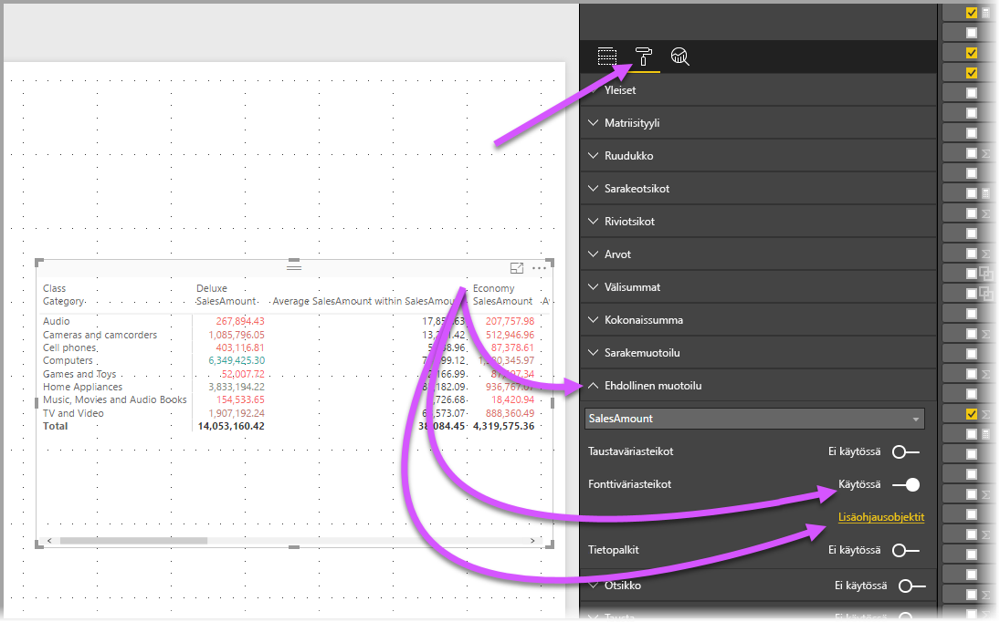

Kumpikin menettelytapa johtaa samaan tulokseen. Valitsemalla *Lisäasetukset* näet seuraavan valintaikkunan, jonka avulla voit tehdä muutoksia:

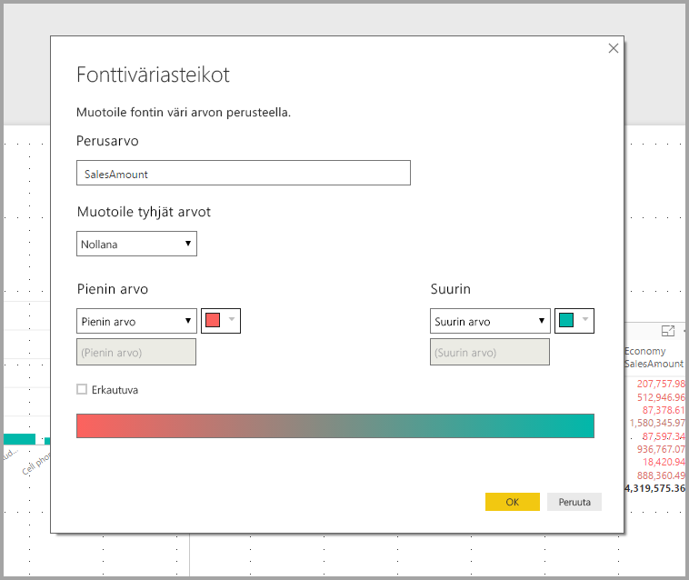

## Seuraavat vaiheet

Voit olla kiinnostunut myös seuraavista artikkeleista:

* [Ruudukon ja kohdista ruudukkoon -toiminnon käyttö Power BI Desktop -raporteissa](../desktop-gridlines-snap-to-grid.md)
* [Power BI Desktopin tietolähteet](../desktop-data-sources.md)
* [Tietotyypit Power BI Desktopissa](../desktop-data-types.md)

 