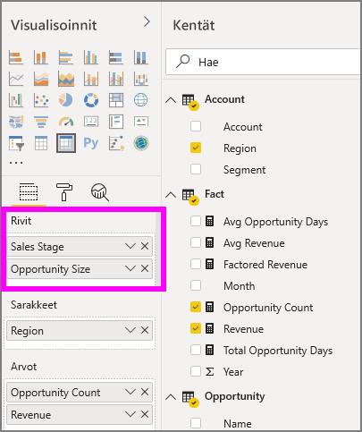

# Matriisivisualisoinnin käyttö Power BI:ssä
**Matriisin** visual muistuttaa **taulukon**.  Taulukon tukee 2 dimensiot ja tiedot on järjestettävä, merkitys arvojen kaksoiskappaleita näytetään ja koostamisen. Matriisin helpottaa näytettävien tietojen asennusaikoja useiden – tukee porrastettua asettelua. Matriisin koostaa tiedot automaattisesti ja mahdollistaa Poraudu alaspäin. 

Voit luoda matriisin visualisoinnit **Power BI Desktop** ja **Power BI-palvelun** raportteja ja ristiinkorostaa muita visualisointeja raportin sivulla matriisin sisältämiä elementtejä. Esimerkiksi voit valita rivejä, sarakkeita ja jopa yksittäisiä soluja ja ristiinkorostus. Yksittäisiä soluja ja solun useita valintoja voit myös kopioida ja liittää muita sovelluksia. 

Matriiseilla on monia ominaisuuksia, jotka käydään läpi tämän artikkelin seuraavissa osioissa.

## Miten Power BI laskee kokonaissummat

Ennen kuin siirryt **matriisivisualisoinnin** käytön ohjeisiin, on tärkeää ymmärtää, miten Power BI laskee kokonais- ja välisumma-arvot taulukoissa ja matriiseissa. Kokonais- ja välisummarivien mittari muodostetaan pohjana olevien tietojen kaikista riveistä. Se *ei* koostu ainoastaan näkyvien tai näytettyjen rivien arvoista. Kokonaissummarivin arvo saattaa siis poiketa odotuksistasi. 

Tutustu seuraavat matriisivisualisoinneissa. 

Tässä esimerkissä oikeanpuoleisimman matriisivisualisoinnin kullekin riville on näkyvissä *summa* kunkin myyjä-/ päivämääräyhdistelmän. Koska myyjä kuitenkin näkyy usean päivän kohdalla, samat numerot saattavat toistua. Tämän vuoksi pohjalla olevista tiedoista muodostettu tarkka kokonaissumma ei vastaa näkyvien tietojen yksinkertaista yhteenlaskua. Tämä on yleistä tapauksissa, joissa arvo lasketaan yhteen useiden muiden arvojen kanssa.

Muista, että kokonais- ja välisummien arvo perustuu pohjalla oleviin tietoihin eikä ainoastaan näkyviin arvoihin. 

<!-- use Nov blog post video

## Expanding and collapsing row headers
There are two ways you can expand row headers. The first is through the right-click menu. You’ll see options to expand the specific row header you clicked on, the entire level or everything down to the very last level of the hierarchy. You have similar options for collapsing row headers as well.

You can also add +/- buttons to the row headers through the formatting pane under the row headers card. By default, the icons will match the formatting of the row header, but you can customize the icons’ color and size separately if you want. 
Once the icons are turned on, they work similarly to the icons from PivotTables in Excel.

The expansion state of the matrix will save with your report. It can be pinned to dashboards as well, but consumers will need to open up the report to change the state. Conditional formatting will only apply to the inner most visible level of the hierarchy. Note that this expand/collapse experience is not currently supported when connecting to AS servers older than 2016 or MD servers.

Watch the following video to learn more about expand/collapse in the matrix:

-->
## Käytetään Poraudu alaspäin matriisivisualisoinnin kanssa
Matriisivisualisoinnin kanssa voit tehdä erilaisia kiinnostavia Poraudu alaspäin-toimintoja, jotka ennen olleet käytettävissä. Voit porata rivejä, sarakkeita ja jopa yksittäisiä osioita ja soluja. Niiden toiminta on kuvattu alla.

### Rivien otsikoiden poraaminen
Kun lisäät useita kenttiä **Visualisoinnit**-ruudun **Kentät**-kohdassa olevaan **Rivit**-osioon, matriisirivien poraaminen otetaan käyttöön. Tämä muistuttaa hierarkian luomista, jonka avulla voit porata (ja varmuuskopioida) tiedot kyseisen hierarkian mukaisessa järjestyksessä ja analysoida ne jokaisella tasolla.

Seuraavassa kuvassa **rivit** osa sisältää *Myyntivaihe* ja *mahdollisuuden koko*, Luo ryhmittelyn (tai hierarkian), emme voi porautua riveille.

Kun visualisointiin luodaan ryhmittely **Rivit**-osioon, itse visualisoinnissa näytetään *porautuminen*- ja *laajenna*-kuvakkeet vasemmassa yläkulmassa.

Kuten muidenkin visualisointien poraus- ja laajennustoiminnoissa, näiden painikkeiden valitseminen mahdollistaa poraamisen hierarkian mukaisesti ylös- tai alaspäin. Tässä tapauksessa voimme voit porata *Myyntivaihe* - *mahdollisuuden koko*, jossa Poraudu alaspäin yhden tason kuvake (talikko) on valittu seuraavassa kuvassa esitetyllä tavalla.

Kyseisten kuvakkeiden lisäksi voit valita rivin otsikoita ja valitsemalla avautuvasta valikosta porautua.

Huomaa, että valikossa on muutamia vaihtoehtoja, jotka tuottavat erilaisia tuloksia:

Valitsemalla **Poraudu alaspäin** , matriisi laajennetaan *,* rivin tasolla, *lukuun ottamatta* kaikkia muita riviotsikoita paitsi sitä, joka valittiin. Seuraavassa kuvassa **ehdotus** > **Poraudu alaspäin** valittiin. Huomaa, että muita ylimmän tason rivejä ei enää näytetä matriisissa. Tämä poraamistapa on hyödyllinen toiminto ja erityisen kätevä, kun käsittelemme **ristiinkorostusta**.

Valitse **ylöspäin** kuvaketta voit palata edelliseen ylimmän tason näkymään. Jos valitset sitten **ehdotus** > **näyttää seuraavan tason**, saat nousevassa asetetun luettelon seuraavan tason kohteista (Tässä tapauksessa *mahdollisuuden koko* kenttä), ilman ylemmän tason hierarkian luokittelua.

Valitse **ylöspäin** kuvaketta vasemmasta yläkulmasta, matriisi näyttää kaikki ylimmän tason luokat, sitten Valitse **ehdotus** > **Laajenna seuraavalle tasolle**, Katso kaikki arvot - hierarkian tasojen *Myyntivaihe* ja *mahdollisuuden koko*.

Voit myös käyttää **Laajenna** valikkokohteen hallitsemiseen tarkemmin.  Valitse esimerkiksi **ehdotus** > **Laajenna** > **valinta**. Power BI näyttää yhden summarivi kullekin *Myyntivaihe* ja kaikki *mahdollisuuden koko* asetukset *ehdotus*.

### Sarakkeiden otsikoiden poraaminen
Samoin kuin mahdollisuus porautua alaspäin riveillä, voit porautua alaspäin käyttöön **sarakkeet**. Seuraavassa kuvassa on kaksi kenttää **sarakkeet** kenttävalitsimeen, luovat hierarkian samalla tavalla kuin mitä määritimme aiemmin tässä artikkelissa rivit. - **Sarakkeet** kentän, meillä on *alueen* ja *segmentin*. Heti, kun toinen kenttä on lisätty **sarakkeet**, uusi avattavasta valikosta näytetään visualisoinnissa, se tällä hetkellä näyttää **rivit**.

Jos haluat porautua alaspäin sarakkeille, valitse **sarakkeet** - *porautua* valikko, joka löytyy matriisin vasemmassa yläkulmassa. Valitse *Itä* alue ja valitse **Poraudu alaspäin**.

Kun valitset **Poraudu alaspäin**, sarakehierarkian seuraava taso *alue > Itä* näkyviin, joka on tässä tapauksessa *mahdollisuuksien lukumäärä*. Muu alue näyttää, mutta se näkyy harmaana.

Valikon muut kohteet toimivat sarakkeilla samoin kuin riveillä (ks. Edellinen osio **riviotsikot porautua**). Voit myös **näyttää seuraavan tason** ja **Laajenna seuraavalle tasolle** sarakkeet samalla tavalla kuin rivejä.

> [!NOTE]
> Matriisivisualisoinnin vasemmassa yläkulmassa olevat ylös ja alas poraamisen kuvakkeet koskevat vain rivejä. Sarakkeiden alaspäin poraaminen edellyttää hiiren kakkospainikkeen valikon käyttöä.
> 
> 

## Porrastettu asettelu matriisivisualisoinneissa
**Matriisivisualisointi** sisentää hierarkian alaluokat automaattisesti kunkin ylätason alle. Tätä kutsutaan **porrastetuksi asetteluksi**.

*Alkuperäisessä* matriisivisualisoinnin versiossa aliluokat näytettiin täysin eri sarakkeella, mikä vei visualisoinnista paljon tilaa. Seuraavassa kuvassa taulukko näytetään alkuperäisessä **matriisivisualisoinnissa**. Huomaa, että aliluokat ovat erillisessä sarakkeessa.

Seuraavassa kuvassa näytetään **matriisivisualisointi** **porrastetulla asettelulla**. Huomaa, että *Tietokoneet*-luokan aliluokat (tietokoneiden oheislaitteet, pöytätietokoneet, kannettavat tietokoneet, näytöt ja niin edelleen) on hieman sisennetty, mikä tekee visualisoinnista siistin ja tiiviin.

Voit helposti säätää porrastetun asettelun asetuksia. Kun **matriisivisualisointi** on valittu, siirry **Muotoilu**-osioon (telakuvake) **Visualisoinnit**-ruudulla ja laajenna **Rivien otsikot**-osio. Asetuksia on kaksi: **porrastetun asettelun** kytkin (käytössä / pois käytöstä) ja **Porrastetun asettelun sisennys** (määrittää sisennyksen kuvapisteinä).

Jos poistat **Porrastetun asettelun** käytöstä, aliluokat näytetään toisessa sarakkeessa sen sijaan, että ne sisennettäisiin ylätason luokan alle.

## Välisummat matriisivisualisoinneissa
Voit ottaa sekä rivien että sarakkeiden välisummat käyttöön ja poistaa ne käytöstä matriisivisualisoinneissa. Seuraavassa kuvassa rivien välisumma-asetus on **käytössä**.

Siirry **Muotoilu**-osioon **Visualisoinnit**-ruudulla, laajenna **Välisummat**-kortti ja aseta **Rivien välisummat** -liukusäädin**Pois käytöstä** -asentoon. Välisummat eivät tämän jälkeen näy.

Voit tehdä saman sarakkeiden välisummille.

## Ristiinkorostus matriisivisualisoinneissa
**Matriisivisualisoinneissa** matriisin elementtejä voidaan valita ristiinkorostuksen perustaksi. Valitse **Matriisin** sarake, niin kyseinen sarake korostetaan, kuten muutkin raporttisivun visualisoinnit. Tämä ristiinkorostuksen tyyppi on muiden visualisointien ja arvopisteen valinnan yleinen ominaisuus, joka on nyt laajennettu **matriisivisualisointeihin**.

Myös Ctrl + napsautus -valinta toimii ristiinkorostuksessa. Esimerkiksi seuraavassa kuvassa **matriisivisualisoinnista** valittiin kokoelma aliluokkia. Huomaa, miten visualisoinnin valitsemattomat nimikkeet näkyvät harmaina ja miten sivun muut visualisoinnit kuvastavat **matriisivisualisoinnissa** tehtyjä valintoja.

## Arvojen kopiointi Power BI:stä muissa sovelluksissa käytettäviksi

Matriisissa tai taulukossa voi olla sisältöä, jota haluat käyttää muissa sovelluksissa, kuten Dynamics CRM:ssä, Excelissä tai jopa muissa Power BI -raporteissa. Power BI:ssä voit hiiren kakkospainikkeella kopioida solun tai valikoiman soluja leikepöydälle ja liittää toiseen sovellukseen.

* Kopioi yksittäisen solun arvo valitsemalla solu, napsauttamalla hiiren kakkospainiketta ja valitsemalla **Kopioi arvo**. Solun muotoilematon arvo on nyt leikepöydällä, josta voit liittää sen toiseen sovellukseen.

    

* Jos haluat kopioida useita soluja, valitse solualue tai useita soluja yhdessä Ctrl-näppäimen kanssa. Kopio sisältää sarakkeiden ja rivien otsikot.

    

## Sävytys ja fontin väri matriisivisualisoinneissa
Matriisivisualisoinnin kanssa, voit käyttää **ehdollisen muotoilun** (värit ja sävytys ja tietojen palkit) matriisin solujen taustavärinä, ja voit käyttää ehdollista muotoilua myös tekstiin ja arvoihin.

Voit käyttää ehdollista muotoilua, valitse visualisointi ja Avaa matriisi **muodossa** ruudussa. Laajenna **ehdollisen muotoilun** kortin ja **taustaväri**, **fonttiväri**, tai **Tietopalkit**, ota liukusäädin **-** . Jokin näistä asetuksista ottaminen näyttää linkin *lisäasetukset*, jonka avulla voit mukauttaa värejä ja värin muotoilun arvoja.
  
  

Valitse *lisäasetukset* näyttämään valintaikkunan, jonka avulla voit tehdä muutoksia. Tässä esimerkissä näytetään valintaikkuna **Tietopalkit**.

## Seuraavat vaiheet

[Piste- ja kuplakaaviot Power BI:ssä](power-bi-visualization-scatter.md)

[Visualisointityypit Power BI:ssä](power-bi-visualization-types-for-reports-and-q-and-a.md)