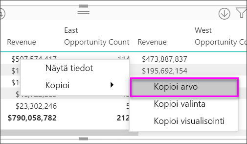

# Matriisivisualisoinnin luominen Power BI:ssä

[!INCLUDE [power-bi-visuals-desktop-banner](../includes/power-bi-visuals-desktop-banner.md)]

Matriisivisualisointi muistuttaa taulukkoa.  Taulukko tukee kahta dimensiota ja tiedot ovat pelkistettyjä eli näet arvojen kaksoiskappaleet koostettujen arvojen sijasta. Matriisin ansiosta tiedot on helpompi näyttää mielekkäästi eri dimensioissa – se tukee porrastettua asettelua. Matriisi koostaa tiedot automaattisesti ja mahdollistaa porautumisen alaspäin. 

Voit luoda matriisivisualisointeja **Power BI Desktop** -raporteissa sekä korostaa matriisin sisältämiä elementtejä ristiin tämän raporttisivun muiden visualisointien kanssa. Voit esimerkiksi valita rivejä, sarakkeita ja jopa yksittäisiä soluja sekä ristiinkorostuksen. Voit myös kopioida yksittäisiä ja useita soluosioita sekä liittää niitä muihin sovelluksiin. 

Matriiseilla on monia ominaisuuksia, jotka käydään läpi tämän artikkelin seuraavissa osioissa.

## Miten Power BI laskee kokonaissummat

Ennen kuin siirrymme matriisivisualisoinnin käytön ohjeisiin, on tärkeää ymmärtää, miten Power BI laskee kokonais- ja välisumma-arvot taulukoissa ja matriiseissa. Power Bi arvioi kokonais- ja välisummariveille mittaria pohjana olevien tietojen kaikista riveistä. Se ei koostu ainoastaan näkyvien tai näytettyjen rivien arvoista. Kokonaissummarivin arvo saattaa siis poiketa odotuksistasi.

Katso seuraavia matriisivisualisointeja. 

Tässä esimerkissä oikeanpuoleisimman matriisivisualisoinnin jokainen rivi näyttää kunkin myyjä-/päivämääräyhdistelmän *summan*. Koska myyjä kuitenkin näkyy usean päivän kohdalla, samat numerot saattavat toistua. Tämän vuoksi pohjalla olevista tiedoista muodostettu tarkka kokonaissumma ei vastaa näkyvien tietojen yksinkertaista yhteenlaskua. Tämä on yleistä tapauksissa, joissa arvo lasketaan yhteen useiden muiden arvojen kanssa.

Kun tarkastelet kokonais- ja välisummia, muista, että nämä arvot perustuvat pohjana oleviin tietoihin. Ne eivät perustu pelkästään näkyvissä oleviin arvoihin.

<!-- use Nov blog post video

## Expanding and collapsing row headers
There are two ways you can expand row headers. The first is through the right-click menu. You’ll see options to expand the specific row header you clicked on, the entire level or everything down to the very last level of the hierarchy. You have similar options for collapsing row headers as well.

You can also add +/- buttons to the row headers through the formatting pane under the row headers card. By default, the icons will match the formatting of the row header, but you can customize the icons’ color and size separately if you want. 
Once the icons are turned on, they work similarly to the icons from PivotTables in Excel.

The expansion state of the matrix will save with your report. It can be pinned to dashboards as well, but consumers will need to open up the report to change the state. Conditional formatting will only apply to the inner most visible level of the hierarchy. Note that this expand/collapse experience is not currently supported when connecting to AS servers older than 2016 or MD servers.

Watch the following video to learn more about expand/collapse in the matrix:

-->
## Alaspäin porautumisen käyttö matriisivisualisoinnin kanssa
Matriisivisualisoinnilla voit tehdä erilaisia alaspäin porautumisen toimintoja, jotka eivät ennen olleet käytettävissä. Voit porata rivejä, sarakkeita ja jopa yksittäisiä osioita ja soluja. Niiden toiminta on kuvattu alla.

### Rivien otsikoiden poraaminen

Kun lisäät useita kenttiä Visualisoinnit-ruudun **Kentät**-säilössä olevaan **Rivit**-osioon, otat käyttöön matriisivisualisoinnin rivien porauksen alaspäin. Tämä muistuttaa hierarkian luomista, jonka avulla voit porata (ja varmuuskopioida) tiedot kyseisen hierarkian mukaisessa järjestyksessä ja analysoida ne jokaisella tasolla.

Seuraavassa kuvassa **Rivit**-osio sisältää *Myyntivaiheen* ja *Mahdollisuuden koon*, mikä luo ryhmittelyn (tai hierarkian) porattaville riveille, joita voimme porata.

Kun visualisointiin luodaan ryhmittely **Rivit**-osioon, itse visualisoinnissa näytetään *porautuminen*- ja *laajenna*-kuvakkeet vasemmassa yläkulmassa.

Kuten muidenkin visualisointien poraus- ja laajennustoiminnoissa, näiden painikkeiden valitseminen mahdollistaa poraamisen hierarkian mukaisesti ylös- tai alaspäin. Tässä tapauksessa voit porata *Myyntivaiheesta* *Mahdollisuuden kokoon* seuraavan kuvan mukaisesti. Siinä on valittu Poraus alaspäin yksi taso -kuvake (talikko).

Näiden kuvakkeiden käyttämisen lisäksi voit valita minkä tahansa näistä rivin otsikoista ja porata alaspäin valitsemalla toiminnon näyttöön tulevasta valikosta.

Huomaa, että valikossa on muutamia vaihtoehtoja, jotka tuottavat erilaisia tuloksia:

Jos valitset **Poraudu alaspäin**, matriisi laajennetaan *kyseisen* rivin tasolla, *lukuun ottamatta* kaikkia muita riviotsikoita paitsi valittua riviotsikkoa. Seuraavassa kuvassa on valittu **Ehdotus** > **Poraudu alaspäin**. Huomaa, että muita ylimmän tason rivejä ei enää näytetä matriisissa. Tämä porautumistapa on hyödyllinen toiminto ja erityisen kätevä, kun käsittelemme ristiinkorostusta.

Voit palata edelliseen ylimmän tason näkymään valitsemalla **Poraudu ylöspäin** -kuvakkeen. Jos valitset sitten **Ehdotus** > **Näytä seuraava taso**, saat laskeutuvan luettelon kaikista seuraavan tason kohteista (tässä tapauksessa *Mahdollisuuden koko* -kentästä) ilman ylemmän tason hierarkian luokittelua.

Valitse **Poraa ylöspäin** -kuvake vasemmasta yläkulmasta, jotta matriisi näyttää kaikki ylimmän tason luokat. Valitse sitten **Ehdotus** > **Laajenna seuraavalle tasolle**, jotta näet kaikki arvot hierarkian kummallakin tasolla - *Myyntivaihe* ja *Mahdollisuuden koko*.

Voit myös käyttää **Laajenna**-valikkokohdetta hallitsemaan näyttöä tarkemmin.  Valitse esimerkiksi **Ehdotus** > **Laajenna** > **Valinta**. Power BI näyttää yhden kokonaissummarivin kullekin *myyntivaiheelle* ja *Mahdollisuuden koko*-asetukset *ehdotukselle*.

### Sarakkeiden otsikoiden poraaminen
Voit porata sarakkeita alaspäin samoin kuin rivejä. Seuraavassa kuvassa näet, että **Sarakkeet**-kentän säilössä on kaksi kenttää, jotka luovat hierarkian samalla tavalla kuin rivien kanssa aiemmin tässä artikkelissa. **Sarakkeet**-kentässä on *Alue* ja *Segmentti*. Heti, kun toinen kenttä on lisätty **Sarakkeet**-kenttään, visualisoinnissa näytetään uusi avattava valikko, jossa on nyt **Rivit**.

Jos haluat porautua alaspäin sarakkeisiin, valitse **Sarakkeet** kohta *Poraudu*-valikosta, joka on matriisin vasemmassa yläkulmassa. Valitse *Itä*-alue ja valitse **Poraudu alaspäin**.

Kun valitset **Poraudu alaspäin**, näkyviin tulee sarakehierarkian seuraava taso *Alue > Itä* -kohdalle, joka on tässä tapauksessa *Mahdollisuuden lukumäärä*. Toinen alue on piilotettu.

Valikon muut kohteet toimivat sarakkeilla samoin kuin riveillä (katso edellinen osio, **Riviotsikoiden poraus alaspäin**). Voit **Näyttää seuraavan tason**, **Laajentaa seuraavalle tasolle** sarakkeita samoin kuin rivejä.

> [!NOTE]
> Matriisivisualisoinnin vasemmassa yläkulmassa olevat ylös ja alas poraamisen kuvakkeet koskevat vain rivejä. Sarakkeiden alaspäin poraaminen edellyttää hiiren kakkospainikkeen valikon käyttöä.

## Porrastettu asettelu matriisivisualisoinneissa

Matriisivisualisointi sisentää hierarkian alaluokat automaattisesti kunkin ylätason alle. Tätä kutsutaan porrastetuksi asetteluksi.

Alkuperäisessä matriisivisualisoinnin versiossa aliluokat näytettiin täysin eri sarakkeella, mikä vei visualisoinnista paljon tilaa. Seuraavassa kuvassa taulukko näytetään alkuperäisessä matriisivisualisoinnissa. Huomaa, että aliluokat ovat erillisessä sarakkeessa.

Seuraavassa kuvassa näytetään matriisivisualisointi porrastetulla asettelulla. Huomaa, että *Tietokoneet*-luokan aliluokat (tietokoneiden oheislaitteet, pöytätietokoneet, kannettavat tietokoneet, näytöt ja niin edelleen) on hieman sisennetty, mikä tekee visualisoinnista siistin ja tiiviin.

Voit helposti säätää porrastetun asettelun asetuksia. Kun matriisivisualisointi on valittu, siirry **Muotoilu**-osioon (telakuvake) **Visualisoinnit**-ruudulla ja laajenna rivien otsikko-osio. Asetuksia on kaksi: porrastetun asettelun kytkin (käytössä / pois käytöstä) ja Porrastetun asettelun sisennys (määrittää sisennyksen kuvapisteinä).

Jos poistat porrastetun asettelun käytöstä, Power BI näyttää aliluokat toisessa sarakkeessa sen sijaan, että ne sisennettäisiin ylätason luokan alle.

## Välisummat matriisivisualisoinneissa

Voit ottaa sekä rivien että sarakkeiden välisummat käyttöön ja poistaa ne käytöstä matriisivisualisoinneissa. Seuraavassa kuvassa näet, että rivien välisumma-asetus on **käytössä**.

Siirry Muotoilu-osioon Visualisoinnit-ruudulla, laajenna **Välisummat**-kortti ja aseta Rivien välisummat -liukusäädin **Pois käytöstä** -asentoon. Kun teet näin, välisummat eivät näy.

Voit tehdä saman sarakkeiden välisummille.

## Ristiinkorostus matriisivisualisoinneissa

Matriisivisualisoinneissa matriisin elementtejä voidaan valita ristiinkorostuksen perustaksi. Valitse matriisin sarake, ja Power BI korostaa sarakkeen, kuten muutkin raporttisivun visualisoinnit. Tämä ristiinkorostuksen tyyppi on muiden visualisointien ja arvopisteen valinnan yleinen ominaisuus, joka on nyt laajennettu matriisivisualisointeihin.

Myös Ctrl + napsautus -valinta toimii ristiinkorostuksessa. Esimerkiksi seuraavassa kuvassa matriisivisualisoinnista valittiin kokoelma aliluokkia. Huomaa, miten visualisoinnin valitsemattomat nimikkeet näkyvät harmaina ja miten sivun muut visualisoinnit kuvastavat matriisivisualisoinnissa tehtyjä valintoja.

## Arvojen kopiointi Power BI:stä muissa sovelluksissa käytettäviksi

Matriisissa tai taulukossa saattaa olla sisältöä, jota haluat käyttää muissa sovelluksissa: Dynamics CRM:ssä, Excelissä ja muissa Power BI -raporteissa. Power BI:n avulla voit hiiren kakkospainikkeella kopioida solun tai valikoiman soluja leikepöydälle ja liittää ne sitten toiseen sovellukseen.

* Kopioi yksittäisen solun arvo valitsemalla solu, napsauttamalla hiiren kakkospainiketta ja valitsemalla **Kopioi arvo**. Solun muotoilematon arvo on nyt leikepöydällä, josta voit liittää sen toiseen sovellukseen.

    

* Jos haluat kopioida useita soluja, valitse solualue tai useita soluja yhdessä Ctrl-näppäimen kanssa. 

    

* Kopio sisältää sarakkeiden ja rivien otsikot.

    

* Jos haluat tehdä kopion itse visualisoinnista ja sisällyttää vain valitsemasi solut, valitse vähintään yksi solu CTRL-näppäimen avulla, napsauta hiiren kakkospainiketta ja valitse **Kopioi visualisointi**

    

* Kopio on toinen matriisivisualisointi, mutta se sisältää vain kopioidut tiedot.

    

## Sävytys ja fontin väri matriisivisualisoinneissa
Matriisivisualisoinnin avulla voit käyttää ehdollista muotoilua (värit, sävytys ja tietopalkit) matriisin solujen taustavärinä, ja voit käyttää ehdollista muotoilua myös itse tekstiin ja arvoihin.

Voit käyttää ehdollista muotoilua valitsemalla matriisivisualisoinnin ja avaamalla **Muotoile**-ruudun. Voit vaihtoehtoisesti siirtyä **Ehdollinen muotoilu** -korttiin ja määrittää **taustavärin** **fontin värin** tai **tietopalkit** asettamalla liukusäätimen **Käytössä**-asentoon. Ottamalla käyttöön jonkin näistä vaihtoehdoista näet *Lisäasetukset*-linkin, jonka avulla voit mukauttaa värejä ja värin muotoilun arvoja.
  
  

Valitsemalla *Lisäasetukset* näet valintaikkunan, jonka avulla voit tehdä mukautuksia. Tässä esimerkissä näytetään valintaikkuna **Tietopalkit**-kohteelle.

## Seuraavat vaiheet

[Piste- ja kuplakaaviot Power BI:ssä](power-bi-visualization-scatter.md)

[Visualisointityypit Power BI:ssä](power-bi-visualization-types-for-reports-and-q-and-a.md)