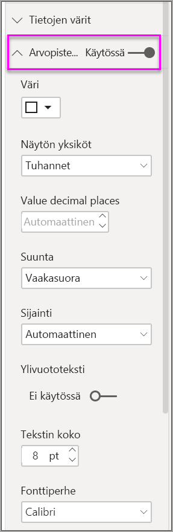

# Nauhakaavioiden käyttäminen Power BI:ssä
Voit käyttää nauhakaavioita tietojen visualisointiin ja selvittääksesi nopeasti, millä tietoluokalla on korkein sija (suurin arvo). Nauhakaaviot esittävät luokkamuutoksen tehokkaasti, koska korkein sija (suurin arvo) näkyy aina ylimpänä kullakin ajanjaksolla. 

## Nauhakaavion luominen
Avaa seuraamista varten [Jälleenmyyntianalyysin malliraportti](../sample-retail-analysis.md). 

1. Luo nauhakaavio valitsemalla **Nauhakaavio** **Visualisoinnit**-ruudusta.

    

    Nauhakaavioissa tietoluokat yhdistetään visualisoidun aikajatkumon ajan nauhoilla, joten näet helposti, miten tietty luokka sijoittuu kaavion koko x-akselille (yleensä aikajana).

2. Valitse kentät **Akseli**, **Selite** ja **Arvo**.  Tässä esimerkissä valitsemme seuraavat kentät: **Päivämäärä**, **Myynti** ja **Tämän vuoden myynti**.  

    

    Koska tietojoukko sisältää vain yhden vuoden tiedot, poistimme myös **Vuosi**-kentän **akselista**. 

3. Valintanauhan kaaviossa näytetään sijoitus joka toiselle kuukaudelle. Näet, miten sijoitus muuttuu ajan myötä.  Esimerkiksi Koti-luokka siirtyy kolmannesta neljänneksi ja takaisin kolmanneksi. Junioreiden luokka siirtyy kolmannesta viidenneksi heinäkuussa. 

    

## Nauhakaavion muotoileminen
Kun luot nauhakaavion, voit käyttää **Muotoilu**-osan muotoiluasetuksia **Visualisoinnit**-ruudussa. Nauhakaavioiden muotoiluasetukset ovat samankaltaisia kuin pinotussa pylväskaaviossa, mutta ne sisältävät lisäksi nauhoihin liittyviä muotoiluasetuksia.

Voit säätää asetuksia näillä nauhakaavioiden muotoiluasetuksilla.

* **Välistys**-asetuksella voit asettaa, kuinka paljon tilaa nauhojen väliin jätetään. Luku on prosenttiosuus sarakkeen enimmäiskorkeudesta.
* **Täsmäytä sarjan väri** -asetuksella voit sovittaa nauhojen värin sarjan väriin. Kun asetus on **pois käytöstä**, nauhat näkyvät harmaina.
* **Läpinäkyvyys** määrittää, miten läpinäkyviä nauhat ovat. Oletusasetus on 30.
* **Reuna**-asetuksella voit sijoittaa tumman reunaviivan nauhojen ylä- ja alareunoihin. Reunat ovat oletusarvoisesti pois käytöstä.

Koska valintanauhan kaaviossa ei ole y-akselin selitteitä, sinun kannattaa ehkä lisätä arvopisteiden otsikot. Valitse Muotoilu-ruudussa **Arvopisteiden otsikot**. 

Määritä arvopisteiden otsikoiden muotoiluasetukset.  Tässä esimerkissä määritämme tekstin väriksi valkoisen, desimaalien määräksi nollan ja näyttöyksiköiksi tuhannet. 

## Seuraavat vaiheet

[Pistekaaviot ja kuplakaaviot Power BI:ssä](power-bi-visualization-scatter.md)

[Visualisointityypit Power BI:ssä](power-bi-visualization-types-for-reports-and-q-and-a.md)