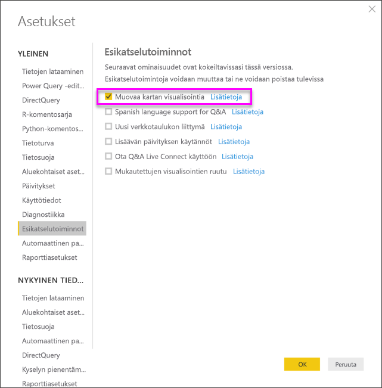

# Muotokartat Power BI Desktopissa (esikatselu)
Luo **Muotokartta**-visualisointi alueiden vertailemiseksi kartalla värejä käyttämällä. Toisin kuin **Kartta**-visualisoinnissa **Muotokartta** ei voi näyttää arvopisteiden tarkkoja maantieteellisiä sijainteja kartalla. Sen sijaan sen päätarkoituksena on näyttää alueiden suhteellisia vertailuja kartalla eri värejä käyttämällä.

**Muotokartta**-visualisoinnit perustuvat ESRI/TopoJSON-karttoihin, jotka tarjoavat mielenkiintoisen mahdollisuuden käyttää mukautettuja karttoja eli omia karttoja, joita voit luoda. Tällaisia karttoja voivat olla esimerkiksi maantieteelliset kartat, istumapaikkakartat, pohjapiirrokset ja muut. **Muotokarttojen** tämä esikatseluversio ei kuitenkaan tarjoa mahdollisuutta mukautettujen karttojen käyttöön.

## Muotokarttojen luominen
Voit testata **Muotokartta**-ohjausobjektia kartoilla, jotka sisältyvät tähän esikatseluversioon, tai voit käyttää omaa mukautettua karttaa, kunhan se täyttää vaatimukset, jotka on määritetty seuraavassa **Mukautettujen karttojen käyttäminen** -osiossa.

**Muotokartta**-visualisointi on esikatseluvaiheessa. Sen täytyy olla käytössä Power BI Desktopissa. Jos haluat ottaa **Muotokartta**-toiminnon käyttöön, valitse **Tiedosto > Asetukset ja vaihtoehdot > Asetukset > Esiversio-ominaisuudet** ja valitse sitten **Muotokartta-visualisointi**-valintaruutu. Sinun täytyy käynnistää Power BI Desktop uudelleen tämän jälkeen.

Kun **Muotokartta** on käytössä, valitse **Muotokartta**-kuvaketta **Visualisoinnit**-ruudussa.

Power BI Desktop luo tyhjän **Muotokartta**-visualisoinnin suunnittelualustan.

Voit luoda **muotokartan** seuraavasti:

1. Vedä **Kentät**-ruudussa tietokenttä, joka sisältää alueiden nimet (tai lyhenteet), **Sijainti**-säilöön ja tietomittarikenttä **Värikylläisyys**-säilöön (et näe vielä karttaa).

   > [!NOTE]
   > Alla olevasta **Karttatietojen hakeminen** -osiosta saat ohjeet siihen, miten voit hakea karttatiedot nopeasti **muotokartan** testaamiseksi.
   > 
   > 

   
2. Laajenna **Muotoile**-asetusruudun **Muoto**-kohta ja valitse avattavasta **Vakiokartat**-valikosta näyttääksesi tiedot. Tässä vaiheessa et näe vielä mitään, kuten seuraava kuva osoittaa.

   

   > [!NOTE]
   > Tämän artikkelin lopussa oleva **Aluetunnukset**-osio sisältää kokoelman taulukoista, jotka sisältävät kartta-aluetunnuksia, joilla voit testata **Muotokartta**-visualisointia.
   > 
   > 
3. Sen jälkeen voit muokata karttaa muotoiluvaihtoehdoilla, kuten **Oletusväri**, **Zoomaus** ja paljon muuta. Voit myös lisätä luokkatietojen sarakkeen **Selite**-säilöön ja luokitella kartta-alueet luokkien perusteella.

## Mukautettujen karttojen käyttäminen
Voit käyttää **Muotokartta**-visualisoinnin kanssa mukautettuja karttoja, kunhan ne ovat **TopoJSON**-muodossa. Jos karttasi on muussa muodossa, voit muuntaa *shapefile*- tai *GeoJSON*-karttasi **TopoJSON**-muotoon verkkotyökaluilla, esimerkiksi [**MapShaper**](http://mapshaper.org/)-työkalulla.

Jos haluat käyttää **TopoJSON**-karttatiedostoasi, lisää Muotokartta-visualisointi raporttiisi ja lisää joitain tietoja *Sijainti*- sekä *Värikylläisyys*-säilöihin. Avaa sitten **Visualisoinnit**-ruudun **Muotoile**-osio (kuten kohdassa (1) seuraavassa kuvassa), laajenna **Muoto**-osio ja valitse **+ Lisää kartta**.

## Esimerkki mukautetusta kartasta
*Offices of the United States Attorneys* julkaisee joka vuosi vuosikertomuksen, joka sisältää tiedot sen oikeusprosesseista ja oikeusjutuista.  Kaikki sen julkaisemat raportit löytyvät alla annetun linkin avulla.

https://www.justice.gov/usao/resources/annual-statistical-reports

Koska Yhdysvalloissa osavaltiot voidaan jakaa useisiin tuomiopiireihin, meidän täytyy käyttää mukautettua muotokarttaa.  Kun tuomme **TopoJSON**-kartan Yhdysvaltain oikeuslaitoksen tuomiopiireistä **Power BI Desktopiin**, voimme visualisoida kunkin tuomiopiirin piirisyyttäjän toimiston vuosittaiset tiedot.  Alla olevassa kuvassa näkyy esimerkki tästä kartasta.

Voit tehdä mielenkiintoisia asioita myös yksittäisten osavaltioiden kartoilla. Lisäksi voit näyttää enemmän tietoja sen perusteella, montako tuomiopiiriä osavaltioon kuuluu. 

Jos haluat kokeilla tätä tietojoukkoa ja visualisointia, voit ladata alkuperäisen PBIX-tiedoston, jolla tämä raportti on luotu. Voit ladata sen seuraavan linkin avulla.

* [Mukautetun muotokartan esittelyn .PBIX-tiedosto](http://download.microsoft.com/download/1/2/8/128943FB-9231-42BD-8A5D-5E2362C9D589/DistrictAttorneyFiscalReport.pbix)

## Karttatietojen hakeminen
Voit hakea nopeasti tietoja malliin, jotta voit testata **muotokarttaa**. Voit tehdä tämän kopioimalla jonkin tämän artikkelin lopussa olevista taulukoista ja valitsemalla sitten **Aloitus**-valintanauhasta **Anna tiedot**.

Jos tiedoissa on useita sarakkeita, sinun täytyy liittää tiedot editorilla (esimerkiksi Excelillä) ja kopioida sitten kukin tietosarake yksitellen. Tämän jälkeen voit liittää tiedot Power BI Desktopiin. Ylin rivi tunnistetaan automaattisesti otsikkoriviksi.

Voit lisätä uuden sarakkeen kirjoittamalla uuden sarakkeen nimen (tyhjään sarakkeeseen oikealla) ja lisäämällä arvot kuhunkin soluun – aivan kuten Excelissä. Kun olet valmis, valitse **Lataa**. Tämä lisää tiedot Power BI Desktopin tietomalliin.

> [!NOTE]
> Kun käsittelet maita tai alueita, käytä kolmikirjaimisia lyhenteitä, jotta sijaintitietojen lisääminen toimii varmasti oikein karttavisualisoinneissa. *Älä* käytä kaksikirjaimisia lyhenteitä, koska silloin joitakin maita tai alueita ei välttämättä tunnisteta oikein.
> 
> Jos käytettävissäsi on vain kaksikirjaimisia lyhenteitä, lue [tämä ulkoinen blogikirjoitus](https://blog.ailon.org/how-to-display-2-letter-country-data-on-a-power-bi-map-85fc738497d6#.yudauacxp), jossa kerrotaan, miten voit yhdistää kaksikirjaimiset maa- tai aluelyhenteet kolmikirjaimisiin.
> 
> 

## Esikatseluversion toiminta ja vaatimukset
Sinun täytyy ottaa huomioon muutamia seikkoja ja vaatimuksia, kun käytät tätä **Muotokartta**-toiminnon esikatseluversiota:

* **Muotokartta**-visualisointi on esikatseluvaiheessa. Sen täytyy olla käytössä Power BI Desktopissa. Jos haluat ottaa **Muotokartta**-toiminnon käyttöön, valitse **Tiedosto > Asetukset ja vaihtoehdot > Asetukset > Esiversio-ominaisuudet** ja valitse sitten **Muotokartta-visualisointi**-valintaruutu.
* Tällä hetkellä myös **Värikylläisyys**-säilön täytyy olla määritettynä, jotta **Selite**-luokittelu toimii oikein.
* **Muotokartta**-toiminnon lopullisessa julkaisuversiossa on käyttöliittymä, josta näet tällä hetkellä valitun kartan karttatunnukset. (Lopullista julkaisupäivämäärää ei ole vielä päätetty. **Muotokartta**-toiminto on tällä hetkellä edelleen esikatseluvaiheessa.) Tässä esikatseluversiossa voit käyttää kartta-alueiden tunnisteita, jotka löytyvät tämän artikkelin **Aluetunnukset**-osion taulukoista.
* **Muotokartta**-visualisointi voi näyttää enintään 1 000 arvopistettä.

## Aluetunnukset
Kun testaat **muotokarttaa** tässä esikatseluversiossa, käytä **seuraavia aluetunnuksia**.

### Australia: Osavaltiot

| `id` | `abbr` | `iso` | `name` | `postal` |
| --- | --- | --- | --- | --- |
| au-wa |WA |AU-WA |Western Australia |WA |
| au-vic |Vic |AU-VIC |Victoria |VIC |
| au-tas |Tas |AU-TAS |Tasmania |TAS |
| au-sa |SA |AU-SA |South Australia |SA |
| au-qld |Qld |AU-QLD |Queensland |QLD |
| au-nt |NT |AU-NT |Northern Territory |NT |
| au-nsw |NSW |AU-NSW |New South Wales |NSW |
| au-act |ACT |AU-ACT |Australian Capital Territory |ACT |

### Itävalta: Osavaltiot

| `id` | `iso` | `name` | `name-en` | `postal` |
| --- | --- | --- | --- | --- |
| at-wi |AT-9 |Wien |Vienna |WI |
| at-vo |AT-8 |Vorarlberg |Vorarlberg |VO |
| at-tr |AT-7 |Tirol |Tyrol |TR |
| at-st |AT-6 |Steiermark |Styria |ST |
| at-sz |AT-5 |Salzburg |Salzburg |SZ |
| at-oo |AT-4 |Oberösterreich |Upper Austria |OO |
| at-no |AT-3 |Niederösterreich |Lower Austria |NO |
| at-ka |AT-2 |Kärnten |Carinthia |KA |
| at-bu |AT-1 |Burgenland |Burgenland |BU |

### Brasilia: Osavaltiot

| `id` |
| --- |
| Tocantins |
| Pernambuco |
| Goias |
| Sergipe |
| Sao Paulo |
| Santa Catarina |
| Roraima |
| Rondonia |
| Rio Grande do Sul |
| Rio Grande do Norte |
| Rio de Janeiro |
| Piaui |
| Parana |
| Paraiba |
| Para |
| Minas Gerais |
| Mato Grosso |
| Maranhao |
| Mato Grosso do Sul |
| Distrito Federal |
| Ceara |
| Espirito Santo |
| Bahia |
| Amazonas |
| Amapa |
| Alagoas |
| Acre |
| Litigated Zone 1 |
| Litigated Zone 2 |
| Litigated Zone 3 |
| Litigated Zone 4 |

### Kanada: Provinssit

| `id` | `iso` | `name` | `postal` |
| --- | --- | --- | --- |
| ca-nu |CA-NU |Nunavut |NU |
| ca-nt |CA-NT |Northwest Territories |NT |
| ca-yt |CA-YT |Yukon |YT |
| ca-sk |CA-SK |Saskatchewan |SK |
| ca-qc |CA-QC |Quebec |QC |
| ca-pe |CA-PE |Prince Edward Island |PE |
| ca-on |CA-ON |Ontario |ON |
| ca-ns |CA-NS |Nova Scotia |NS |
| ca-nl |CA-NL |Newfoundland and Labrador |NL |
| ca-nb |CA-NB |New Brunswick |NB |
| ca-mb |CA-MB |Manitoba |MB |
| ca-bc |CA-BC |British Columbia |BC |
| ca-ab |CA-AB |Alberta |AB |

### Ranska: Alueet

| `id` | `name` | `name-en` |
| --- | --- | --- |
| Alsace |Alsace |Alsace |
| Rhone-Alpes |Rhône-Alpes |Rhone-Alpes |
| Provence-Alpes-Cote d'Azur |Provence-Alpes-Côte d'Azur |Provence-Alpes-Cote d'Azur |
| Poitou-Charentes |Poitou-Charentes |Poitou-Charentes |
| Picardie |Picardie |Picardy |
| Pays de la Loire |Pays de la Loire |Pays de la Loire |
| Nord-Pas-de-Calais |Nord-Pas-de-Calais |Nord-Pas-de-Calais |
| Midi-Pyrenees |Midi-Pyrénées |Midi-Pyrenees |
| Lorraine |Lorraine |Lorraine |
| Limousin |Limousin |Limousin |
| Languedoc-Roussillon |Languedoc-Roussillon |Languedoc-Roussillon |
| Ile-del-France |Île-de-France |Ile-de-France |
| Haute-Normandie |Haute-Normandie |Upper Normandy |
| Franche-Comte |Franche-Comté |Franche-Comte |
| Corse |Corse |Corsica |
| Champagne-Ardenne |Champagne-Ardenne |Champagne-Ardenne |
| Centre-Val de Loire |Centre-Val de Loire |Centre-Val de Loire |
| Bretagne |Bretagne |Brittany |
| Bourgogne |Bourgogne |Burgundy |
| Basse-Normandie |Basse-Normandie |Lower Normandy |
| Auvergne |Auvergne |Auvergne |
| Aquitaine |Aquitaine |Aquitaine |

### Saksa: Osavaltiot

| `id` | `iso` | `name` | `name-en` | `postal` |
| --- | --- | --- | --- | --- |
| de-be |DE-BE |Berlin |Berlin |BE |
| de-th |DE-TH |Thüringen |Thuringia |TH |
| de-st |DE-ST |Sachsen-Anhalt |Saxony-Anhalt |ST |
| de-sn |DE-SN |Sachsen |Saxony |SN |
| de-mv |DE-MV |Mecklenburg-Vorpommern |Mecklenburg-Vorpommern |MV |
| de-bb |DE-BB |Brandenburg |Brandenburg |BB |
| de-sh |DE-SH |Schleswig-Holstein |Schleswig-Holstein |SH |
| de-sl |DE-SL |Saarland |Saarland |SL |
| de-rp |DE-RP |Rheinland-Pfalz |Rhineland-Palatinate |RP |
| de-nw |DE-NW |Nordrhein-Westfalen |North Rhine-Westphalia |NW |
| de-ni |DE-NI |Niedersachsen |Lower Saxony |NI |
| de-he |DE-HE |Hessen |Hesse |HE |
| de-hh |DE-HH |Hamburg |Hamburg |HH |
| de-hb |DE-HB |Bremen |Bremen |HB |
| de-by |DE-BY |Bayern |Bavaria |BY |
| de-bw |DE-BW |Baden-Württemberg |Baden-Wurttemberg |BW |

### Irlanti: Läänit

| `id` |
| --- |
| Wicklow |
| Wexford |
| Westmeath |
| Waterford |
| Sligo |
| Tipperary |
| Roscommon |
| Offaly |
| Monaghan |
| Meath |
| Mayo |
| Louth |
| Longford |
| Limerick |
| Leitrim |
| Laoighis |
| Kilkenny |
| Kildare |
| Kerry |
| Galway |
| Dublin |
| Donegal |
| Cork |
| Clare |
| Cavan |
| Carlow |

### Italia: Alueet

| `id` | `iso` | `name` | `name-en` | `postal` |
| --- | --- | --- | --- | --- |
| it-vn |IT-34 |Veneto |Veneto |VN |
| it-vd |IT-23 |Valle d'Aosta |Aosta Valley |VD |
| it-um |IT-55 |Umbria |Umbria |UM |
| it-tt |IT-32 |Trentino-Alto Adige |Trentino-South Tyrol |TT |
| it-tc |IT-52 |Toscana |Tuscany |TC |
| it-sc |IT-82 |Sicilia |Sicily |SC |
| it-sd |IT-88 |Sardegna |Sardinia |SD |
| it-pm |IT-21 |Piemonte |Piedmont |PM |
| it-ml |IT-67 |Molise |Molise |ML |
| it-mh |IT-57 |Marche |Marche |MH |
| it-lm |IT-25 |Lombardia |Lombardy |LM |
| it-lg |IT-42 |Liguria |Liguria |LG |
| it-lz |IT-62 |Lazio |Lazio |LZ |
| it-fv |IT-36 |Friuli-Venezia Giulia |Friuli-Venezia Giulia |FV |
| it-er |IT-45 |Emilia-Romagna |Emilia-Romagna |ER |
| it-cm |IT-72 |Campania |Campania |CM |
| it-lb |IT-78 |Calabria |Calabria |LB |
| it-bc |IT-77 |Basilicata |Basilicata |BC |
| it-pu |IT-75 |Apulia |Puglia |PU |
| it-ab |IT-65 |Abruzzo |Abruzzo |AB |

### Meksiko: Osavaltiot

| `id` | `abreviatura` | `iso` | `name` | `name-en` | `postal` |
| --- | --- | --- | --- | --- | --- |
| mx-zac |Zac. |MX-ZAC |Zacatecas |Zacatecas |ZA |
| mx-yuc |Yuc. |MX-YUC |Yucatán |Yucatan |YU |
| mx-ver |Ver. |MX-VER |Veracruz |Veracruz |VE |
| mx-tla |Tlax. |MX-TLA |Tlaxcala |Tlaxcala |TL |
| mx-tam |Tamps. |MX-TAM |Tamaulipas |Tamaulipas |TM |
| mx-tab |Tab. |MX-TAB |Tabasco |Tabasco |TB |
| mx-son |Son. |MX-SON |Sonora |Sonora |SO |
| mx-sin |Sin. |MX-SIN |Sinaloa |Sinaloa |SI |
| mx-slp |S.L.P. |MX-SLP |San Luis Potosí |San Luis Potosi |SL |
| mx-roo |Q.R. |MX-ROO |Quintana Roo |Quintana Roo |QR |
| mx-que |Qro. |MX-QUE |Querétaro |Queretaro |QE |
| mx-pue |Pue. |MX-PUE |Puebla |Puebla |PU |
| mx-oax |Oax. |MX-OAX |Oaxaca |Oaxaca |OA |
| mx-nle |N.L. |MX-NLE |Nuevo León |Nuevo Leon |NL |
| mx-nay |Nay. |MX-NAY |Nayarit |Nayarit |NA |
| mx-mor |Mor. |MX-MOR |Morelos |Morelos |MR |
| mx-mic |Mich. |MX-MIC |Michoacán |Michoacan |MC |
| mx-mex |Méx. |MX-MEX |Estado de México |Mexico State |MX |
| mx-jal |Jal. |MX-JAL |Jalisco |Jalisco |JA |
| mx-hid |Hgo. |MX-HID |Hidalgo |Hidalgo |HI |
| mx-gro |Gro. |MX-GRO |Guerrero |Guerrero |GR |
| mx-gua |Gto. |MX-GUA |Guanajuato |Guanajuato |GT |
| mx-dur |Dgo. |MX-DUR |Durango |Durango |DU |
| mx-dif |Col. |MX-DIF |Ciudad de México |Mexico City |DF |
| mx-col |Coah. |MX-COL |Colima |Colima |CL |
| mx-coa |Chis. |MX-COA |Coahuila |Coahuila |CA |
| mx-chh |Chih. |MX-CHH |Chihuahua |Chihuahua |CH |
| mx-chp |CDMX. |MX-CHP |Chiapas |Chiapas |CP |
| mx-cam |Camp. |MX-CAM |Campeche |Campeche |CM |
| mx-bcs |B.C.S. |MX-BCS |Baja California Sur |Baja California Sur |BS |
| mx-bcn |B.C. |MX-BCN |Baja California |Baja California |BN |
| mx-agu |Ags. |MX-AGU |Aguascalientes |Aguascalientes |AG |

### Alankomaat: Provinssit

| `id` | `iso` | `name` | `name-en` |
| --- | --- | --- | --- |
| nl-zh |NL-ZH |Zuid-Holland |South Holland |
| nl-ze |NL-ZE |Zeeland |Zeeland |
| nl-ut |NL-UT |Utrecht |Utrecht |
| nl-ov |NL-OV |Overijssel |Overijssel |
| nl-nh |NL-NH |Noord-Holland |North Holland |
| nl-nb |NL-NB |Noord-Brabant |North Brabant |
| nl-li |NL-LI |Limburg |Limburg |
| nl-gr |NL-GR |Groningen |Groningen |
| nl-ge |NL-GE |Gelderland |Gelderland |
| nl-fr |NL-FR |Fryslân |Friesland |
| nl-fl |NL-FL |Flevoland |Flevoland |
| nl-dr |NL-DR |Drenthe |Drenthe |

### Yhdistynyt kuningaskunta: Maat

| `id` | `iso` | `name` |
| --- | --- | --- |
| gb-wls |GB-WLS |Wales |
| gb-sct |GB-SCT |Scotland |
| gb-nir |GB-NIR |Northern Ireland |
| gb-eng |GB-ENG |England |

### Yhdysvallat: Osavaltiot

| `id` | `name` | `postal` |
| --- | --- | --- |
| us-mi |Michigan |MI |
| us-ak |Alaska |AK |
| us-hi |Hawaii |HI |
| us-fl |Florida |FL |
| us-la |Louisiana |LA |
| us-ar |Arkansas |AR |
| us-sc |South Carolina |SC |
| us-ga |Georgia |GA |
| us-ms |Mississippi |MS |
| us-al |Alabama |AL |
| us-nm |New Mexico |NM |
| us-tx |Texas |TX |
| us-tn |Tennessee |TN |
| us-nc |North Carolina |NC |
| us-ok |Oklahoma |OK |
| us-az |Arizona |AZ |
| us-mo |Missouri |MO |
| us-va |Virginia |VA |
| us-ks |Kansas |KS |
| us-ky |Kentucky |KY |
| us-co |Colorado |CO |
| us-md |Maryland |MD |
| us-wv |West Virginia |WV |
| us-de |Delaware |DE |
| us-dc |District of Columbia |DC |
| us-il |Illinois |IL |
| us-oh |Ohio |OH |
| us-ca |California |CA |
| us-ut |Utah |UT |
| us-nv |Nevada |NV |
| us-in |Indiana |IN |
| us-nj |New Jersey |NJ |
| us-ri |Rhode Island |RI |
| us-ct |Connecticut |CT |
| us-pa |Pennsylvania |PA |
| us-ny |New York |NY |
| us-ne |Nebraska |NE |
| us-ma |Massachusetts |MA |
| us-ia |Iowa |IA |
| us-nh |New Hampshire |NH |
| us-or |Oregon |OR |
| us-mn |Minnesota |MN |
| us-vt |Vermont |VT |
| us-id |Idaho |ID |
| us-wi |Wisconsin |WI |
| us-wy |Wyoming |WY |
| us-sd |South Dakota |SD |
| us-nd |North Dakota |ND |
| us-me |Maine |ME |
| us-mt |Montana |MT |
| us-wa |Washington |WA |

## Seuraavat vaiheet
[Matriisivisualisointi Power BI:ssä](desktop-matrix-visual.md)

[Visualisointityypit Power BI:ssä](power-bi-visualization-types-for-reports-and-q-and-a.md)