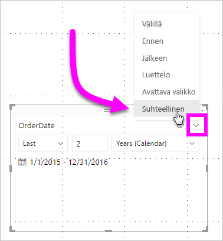
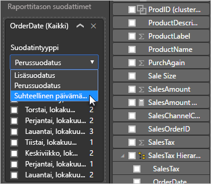

# Suhteellisen päivämääräosittajan ja -suodattimen käyttö Power BI:ssä

[!INCLUDE [applies-to](../includes/applies-to.md)] [!INCLUDE [yes-desktop](../includes/yes-desktop.md)] [!INCLUDE [yes-service](../includes/yes-service.md)]

**Suhteellisen päivämääräosittajan** tai **suhteellisen päivämääräsuodattimen** avulla voit käyttää aikasidonnaisia suodattimia missä tahansa tietomallisi päivämääräsarakkeessa. Voit esimerkiksi käyttää **suhteellisen päivämäärän osittajaa** näyttääksesi vain viimeisten 30 päivän (tai kuukauden tai kalenterikuukausien jne.) aikana tapahtuneen myynnin tiedot. Kun päivität tiedot, suhteellinen ajanjakso käyttää automaattisesti soveltuvaa suhteellisen päivämäärän rajoitusta.

## Suhteellisen päivämääräalueen osittajan käyttäminen

Voit käyttää suhteellisen päivämäärän osittajaa kuten mitä muuta tahansa osittajaa. Luo **osittaja** raportillesi ja valitse sitten päivämääräarvo **Kenttä**-arvoksi. Seuraavassa kuvassa valitsimme *OrderDate*-kentän.

Valitse osittaja pohjalta ja valitse sitten osittajavisualisoinnin oikeassa yläkulmassa oleva merkki. Jos visualisoinnissa on päivämäärätietoja, valikossa näkyy **Suhteellinen**-vaihtoehto.

Valitse *Suhteellinen* suhteellisen päivämäärän osittajaa varten.

Voit sitten valita haluamasi asetukset.

*Suhteellisen päivämäärän osittajan* ensimmäisellä asetuksella on seuraavat vaihtoehdot:

* Viimeinen

* Seuraava

* Tämä

*Suhteellisen päivämäärän osittajan* toisella (keskimmäinen) asetuksella voit antaa numeron suhteellisen päivämääräalueen määrittelemiseksi.

Kolmannen asetuksen avulla voit valita päivämäärämittarin. Sinulla on seuraavat vaihtoehdot:

* Päivät

* Viikot

* Viikot (kalenteri)

* Kuukautta

* Kuukaudet (kalenteri)

* Vuodet

* Vuodet (kalenteri)

Jos valitset luettelosta **Kuukaudet** ja annat keskimmäiseksi asetukseksi *2*, tapahtuu seuraavaa:

* Jos tänään on 20. heinäkuuta,

* osittajan rajoittamiin visualisointeihin sisältyvät tiedot näyttävät tiedot kahdelta edelliseltä kuukaudelta:

* 21. toukokuuta – 20. heinäkuuta (tämä päivä)

Jos taas valitsit *Kuukaudet (Kalenteri)* , rajoitettu näyttö esittäisi tiedot ajalta 1.5.–30.6. (viimeiset kaksi täyttä kalenterikuukautta).

## Suhteellisen päivämääräalueen suodattimen käyttäminen

Voit myös luoda raporttisivullesi tai koko raportillesi suhteellisen päivämääräalueen suodattimen. Tee niin vetämällä päivämääräkenttä **sivutason suodattimien** tai **raporttitason alueen suodattimien** kohtiin **Kenttä**-ruudussa:

Siellä voit vaihtaa suhteellinen päivämääräaluetta. Tämä toimii samalla tavalla kuin **suhteellisen päivämääräosittajan** muokkaaminen. Valitse **Suodatintyypin** pudotusvalikosta **Suhteellisen päivämäärän suodatus**.

Kun valitset **suhteellisen päivämääräsuodatuksen**, näet kolme muokattavaa kohtaa, mukaan lukien numerolaatikon keskellä, aivan kuten osittajankin kohdalla.

## Rajoitukset ja huomioitavat asiat

**Suhteellisen päivämäärän osittajaa** ja suodatinta koskevat seuraavat rajoitukset ja huomioon otettavat seikat.

* **Power BI:n** tietomallit eivät sisällä aikavyöhyketietoja. Mallit voivat tallentaa aikoja, mutta niistä ei selviä mistä aikavyöhykkeestä on kyse.

* Osittaja ja suodatin perustuvat aina UTC-aikaan. Jos siis muokkaat suodatinta raportissa ja lähetät sen toisella aikavyöhykkeellä olevalle kollegalle, näette molemmat saman ajan. Jos ette ole UTC-aikavyöhykkeellä, sekä sinun että kollegasi täytyy huomioida aikaero.

* Voit muuntaa paikallisen aikavyöhykkeen ajan mukaisesti talletetut tiedot UTC-ajaksi **kyselyeditorilla**.

## Seuraavat vaiheet

Opettele [käyttämään ryhmittely ja lokerointia Power BI Desktopissa](../desktop-grouping-and-binning.md).
